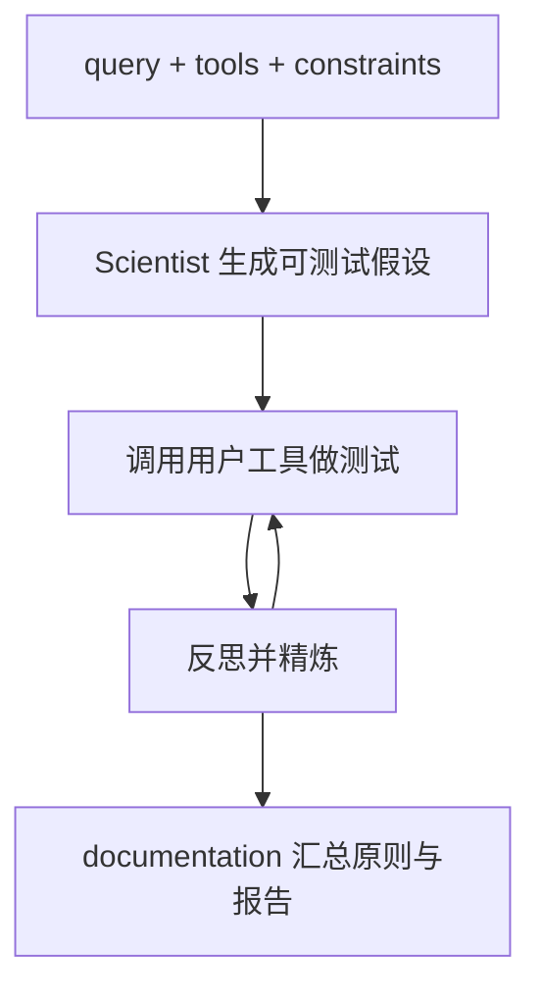

# Sparks：假设—测试—精炼—成文的多模态科学发现循环

| 项目 | 固定快照 |
|---|---|
| 候选编号 | 77 |
| 仓库 | [lamm-mit/Sparks](https://github.com/lamm-mit/Sparks) |
| 分类 / 层次 | 多模态自主实验；方法、实验、写作 |
| 分析提交 | `1736f8d4e2e3b542983ce33dbd4fcc73c4e20ab9` |
| 元数据快照 | 2026-09-17；Stars 24，非近似值；最近推送 2025-06-25 |
| 默认分支 / 状态 | main；非 fork、未归档；候选 pending，分析 draft |
| 许可 | Apache-2.0；固定提交的根目录 `LICENSE` 已查阅 |
| 阅读方式 | 公开 README、四模块 Python 文件、functions.py 与启动 notebook；静态分析 |

本文用 📘 标注文档或源码中可直接定位的事实，🔶 标注由控制流推导的边界，💬 标注评价与借鉴建议。仓库动态元数据沿用候选清单，源码判断只绑定上面的固定提交。

## 1. 它到底是什么

📘 [根 README](https://github.com/lamm-mit/Sparks/blob/1736f8d4e2e3b542983ce33dbd4fcc73c4e20ab9/README.md) 将 Sparks 定义为多模态多智能体模型，覆盖假设生成、实验设计、迭代精炼与报告，宣称无需人工干预。蛋白质案例中提到长度依赖的力学交叉与稳定性图。仓库用 notebook 启动，用户提供 `query`、`tools` 和 `constraints`。

🔶 README 的“发现未知科学原理”是论文主张。本页只确认模块文件与工具接口存在，不验证那两项蛋白质发现。

## 2. 运行时堆叠

📘 模块文件为 `idea_generation.py`、`idea_testing.py`、`refinement.py`、`documentation.py`。[`functions.py`](https://github.com/lamm-mit/Sparks/blob/1736f8d4e2e3b542983ce33dbd4fcc73c4e20ab9/Sparks/functions.py) 连接 NAMD、VMD/catdcd、Chroma 蛋白质生成、MDAnalysis、ForceGPT 与 OpenAI。工具必须由用户写成 Python 函数并在 notebook 中描述名称、用途、输入和输出。

| 层 | 固定快照中的承载方式 | 边界 |
|---|---|---|
| 入口 | `launch_Sparks.ipynb` | 交互 notebook |
| 假设 | `idea_generation.py` 提示词 | 要求可用所列工具测试 |
| 执行 | 用户函数 + NAMD/Chroma 等 | 需 CUDA、许可证、二进制 |
| 成文 | `documentation.py` | 生成研究报告文本 |

## 3. 阶段机或 DAG

📘 Figure 1 的四模块：hypothesis generation → testing → refinement → documentation。生成提示要求输出 idea/hypothesis/mechanism/expected_outcome/approach/plots 及 0–10 的 novelty、feasibility、interestingness 分数。

🔶 循环次数与停止条件在 notebook/refinement 中，静态阅读不能当成已测量的收敛保证。工具失败（如 NAMD 超时）会进入 subprocess 异常路径。

## 4. Tool / Skill / Agent 怎么切

📘 工具是 `functions.py` 里的 Python 函数；Agent 是各模块中的科学家/反思角色提示。没有 Skill 目录。🔶 “多 Agent”主要是分文件的提示角色，外加对用户工具的函数调用，而不是独立进程团队。

## 5. 文献怎么来、是否入库、引用约束

📘 输入是用户 query，不是文献库检索主链。🔶 未见 DOI 入库或引用闸。论文式发现叙述不能从本仓库自动回溯到具体文献 span。

## 6. 实验 / 代码执行

📘 `functions.py` 硬编码 NAMD 与 catdcd 路径，检测 CUDA，并 `chroma = Chroma()`。蛋白质力学案例依赖这些外部二进制。🔶 本次未安装 NAMD/VMD/Chroma，未设置 `CHROMA_KEY`，未跑 notebook。因此不能复核 README 中的力学交叉现象。

## 7. 写稿怎么做

📘 `documentation.py` 把目标、方法、结果、未来方向和“共享原则”写成终稿。🔶 这是研究报告生成，不是带会议模板与 bib 核验的投稿包。

## 8. 图怎么做

📘 假设格式含 `plots` 字段；`functions.py` 导入 matplotlib。NAMD 侧有 `plot_for_3.py` / `plot_for_6.py` 与 VMD 电影脚本。🔶 图来自用户工具输出，仓库不提供论文 figure contract。

## 9. 和 RH 的相似点

1. 都要求假设可被已注册工具测试。
2. 都把精炼循环与最终文档分开。
3. 都把约束（constraints）写成输入，而不是事后过滤。

## 10. 和 RH 的不同点

RH 需要文献证据与实验统计闸。Sparks 把工具可行性放在提示 MUSTS 里，由模型自评分。领域绑定蛋白质/MD 栈，不是通用科研生产。

## 11. 优点 / 缺点

**优点**

- 四模块文件与用户工具合同清楚。
- 假设必须声明可调用工具和约束。
- 物理工具路径暴露，便于核对依赖。

**缺点**

- 重依赖 NAMD/Chroma/GPU 与密钥。
- 新颖性分数是模型自报。
- 论文发现未被本次复现。

💬 可学的是“假设必须带着工具与约束上场”，不是 README 里的蛋白质发现叙事。

## 12. RH 可学的 1–3 条

1. **假设格式强制包含 approach 与 plots。** 没有测试计划的想法不能进入执行。
2. **工具描述与函数实现分开维护。** notebook 说明是给模型看的接口文档。
3. **约束作为一等输入。** 比在失败后再加安全规则更早拦截。

## 13. 名字速查表

| 名字 | 先决概念 | 含义 |
|---|---|---|
| query / tools / constraints | 启动输入 | notebook 三元组 |
| idea_generation | 模块 | 生成可测试假设 |
| refinement | 模块 | 基于结果改假设 |
| Chroma / NAMD | 外部工具 | 结构生成与分子动力学 |
| shared principle | 成文目标 | 跨现象的设计原则 |

> 📌事实边界：本页依据 `1736f8d4e2e3b542983ce33dbd4fcc73c4e20ab9` 固定公开源码快照、2026-09-17 `data/candidates-staging.jsonl` 元数据和下列实际查看文件静态撰写（`README.md`、`LICENSE`、`config.json`、`requirements.txt`、`launch_Sparks.ipynb`、`Sparks/functions.py`、`Sparks/idea_generation.py`、`Sparks/idea_testing.py`、`Sparks/refinement.py`、`Sparks/documentation.py`、`Sparks/Sparks_functions.py`、`Sparks/MD_protein.py`）。没有把 README 的两项蛋白质发现或“无需人工干预”当作本次实测；未调用未配置的模型/API，未运行 NAMD 或 notebook，未据此声称运行效果。
