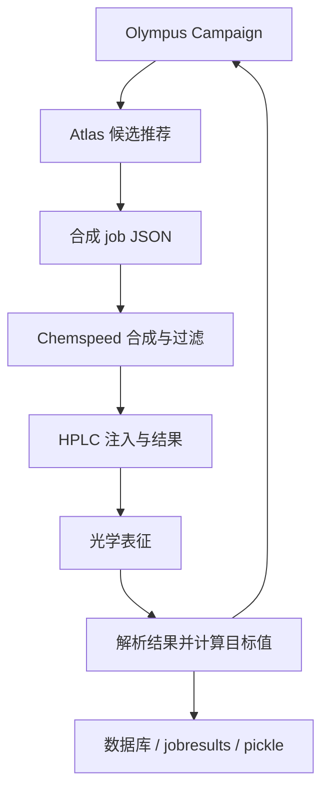

# ChemOS 2.0：以 SiLA2 连接优化器、合成设备和表征任务

| 字段 | 值 |
|---|---|
| GitHub | https://github.com/malcolmsimgithub/ChemOS2.0 |
| License | NOASSERTION（README 声明 MIT，未见根目录许可正文） |
| Stars | 20（2026-09-17 冻结快照） |
| 最后 push | 2024-04-29 |
| 分析提交 | `3223db1e4c8e6cc639bdc1a9a338cbcb9ea25463` |
| 快照日期 | 2026-09-17 |
| 产品类型 | 化学自驱实验室编排与模拟示例 |
| 分析证据 | `README.md`、`ChemOS2.0-simulation/laserworkflow.py`、`ChemOS2.0-simulation/sila-atlas/ChemOScampaign.py`、`ChemOS2.0-simulation/sila-hplc/hplcsimulator.py`、`ChemOS2.0-deploy/aiida-workchain/laser_workchain.py` |

本文用 📘 标注文档或源码中可直接定位的事实，🔶 标注由控制流推导的边界，💬 标注评价与借鉴建议。仓库动态元数据沿用候选清单，源码判断只绑定页面中的固定提交。

## 1. 它到底是什么

ChemOS 2.0 是化学实验室自动化的编排框架，公开仓库同时收集开发代码、实验数据目录、真实部署相关脚本和演示用模拟器。README 明确指出具体实验需要定制体系结构，仓库不是能够立即部署的完整软件包。这条边界非常重要：它确实提供从推荐候选、合成、色谱到光学表征的闭环代码，却不能因为目录名包含 deploy 就推定任意实验室能够原样运行。项目属于科学执行基础设施，闭环的“智能”主要来自优化器与预设的实验逻辑，不以 LLM 对话作为必需条件。

## 2. 运行时堆叠

演示环境依赖 SiLA2、PostgreSQL、Nix 环境、Python 和 Streamlit 界面；设备代理之间通过 SiLA2 接收命令和流式返回输出。laserworkflow.py 使用 Olympus Campaign 记录参数及观测，RDKit Morgan fingerprint 表示分子构件，通过 run_atlas_calculation 请求候选，再调用 Chemspeed、HPLC 和 optics 的辅助函数。Campaign 同时以 pickle 文件保存至 runs，以便下一轮读取。部署侧的 laser_workchain.py 使用 AiiDA WorkChain、aiida-shell 和远端计算配置，明显是另一条计算执行路径。

## 3. 阶段机或 DAG

laserworkflow.py 是带十轮上限的闭环脚本。它读取候选 molecules 和优化配置，保存初始 campaign；每轮取得推荐后生成合成 job JSON，等待合成、过滤与 HPLC 注入，再从 HPLC 返回的文件构造光学测量任务，解析 AbsPL/TE 的字段计算目标值，添加 observation 并写下一轮 pickle。

此图表示演示脚本的控制依赖。simulation 路径返回相同的样例测量，不应解释成该脚本重新测得真实的分子性能。

## 4. Tool / Skill / Agent 怎么切

核心工具是设备服务、优化器和计算工作流，而不是聊天 agent。SiLA2 将仪器能力包装成服务；Streamlit 提供提交和查看任务的入口；Olympus/Atlas 管理候选空间及推荐；AiiDA 负责量化计算链。SilaLaserWorkChain 的 outline 明确写出三维结构生成、xTB/CREST、ORCA frequency、单点/耦合、优化、组合计算和 final_step。不同阶段产生结构、梯度、偶极矩和激发能文件，再调用谱学后处理。这是具备领域语义的工具链，但不是统一、可自动发现的 MCP 或 Skills 目录。

## 5. 文献怎么来、是否入库、引用约束

README 链接 ChemOS 项目论文并说明数据目录，所审查的 workflow 不含论文检索、引用展开或 claim-level 文献证据存储。数据库存储的是任务/仪器结果，不是文献 pool；AiiDA 的 provenance 也主要描述计算依赖。对科研使用者而言，实验方法与仪器校准的来源仍需要在论文或其他研究管理系统中单独记录。

## 6. 实验 / 代码执行

必须区分三种证据。第一，simulation 是接口与流程演示：README 明说所有参数的 dummy data 相同，HPLCSimulator._data_analysis 直接设置 concentration=1.0 并复制 dummy archive。第二，simulation-errors 与 simulation-parallel 是 README 宣称的错误/并行示例，本报告未实际启动它们。第三，deploy/aiida-workchain 含真实外部 executable 调用与计算机、资源配置，但使用特定站点脚本路径和预装软件，不能原样迁移。已读的 ChemOScampaign.py 还以固定向量添加 observation，更说明示例计算和实测必须分开。

## 7. 写稿怎么做

该项目的 report 含义主要是结果存储、GUI 展示和文件后处理，并未发现论文写作 agent、章节生成、引用校验或同行评审流程。laserworkflow.py 读取仪器输出数值并将目标值写入 campaign；AiiDA 最后调用 make_output_file。它们都是研究写作可能消费的上游数据，而不是文章。

## 8. 图怎么做

README 的 Web UI 截图展示 HPLC-MS job results 的可视化；AiiDA 工作流最后调用 spectrum_vg，表明存在光谱后处理入口。不能仅据函数名断言产生何种可发表图形、误差范围或统一 figure suite。真实与模拟分支的图像也必须标明输入性质：模拟器反复复制样例文件，即使界面有曲线，也不构成一轮新的物理测量。

## 9. 和 RH 的相似点

它与科研编排系统共有“选参数—执行—收集数据—更新策略”的闭环，并重视异构工具之间的接口和产物交接。特别是把仪器结果转换成优化器 observation，展示了如何让下一步决策直接依赖前一步输出，而不是仅在聊天记录中描述结果。

## 10. 和 RH 的不同点

ChemOS 的中心是设备与算法优化器；通用科研平台的文献、假设、写作、审稿层在此不是核心范围。服务、数据库、文件目录、pickle 和 AiiDA 同时承担状态，公开示例没有统一的跨分支 artifact registry。它的透明之处是 README 明确划出模拟器边界；短板则是实验定制代码与演示代码混在同一个大仓库，使用者须先辨明执行模式和依赖。

## 11. 优点 / 缺点

优点：真实物理实验环节划分具体；SiLA2 提供厂商/设备之外的通信层；优化器和仪器之间的反馈关系可读；同时展示实验与计算工作流；README 主动说明模拟器和定制部署条件。

不足：不是开箱即用 package；硬编码站点/目录较多；等待循环大量依赖 sleep 和 done 状态；pickle 需要可信来源；样例目标值不能代表真实优化效果。许可方面，README 声明 MIT，但冻结树未见它所指的根 LICENSE；嵌入式驱动目录各自存在许可证，不能用那些文件反推全仓授权。

## 12. RH 可学的 1–3 条

1. 将实验设备接口与候选推荐算法分开，通过明确的任务/结果合同连接。2. 在每一份 observation 上标记 simulator、历史回放或 live measurement，避免相同样例被误认成新增证据。3. 借鉴 AiiDA 的显式阶段依赖，但把站点配置外置，并统一保存输入、软件版本、实际运行状态和失败原因。

## 13. 名字速查表

| 名字 | 先决概念 | 含义 |
|---|---|---|
| `SiLA2` | lab interoperability | 设备命令与结果的服务协议 |
| `Olympus Campaign` | sequential optimization | 保存参数空间与观测的优化记录 |
| `Atlas` | optimizer | 根据已有 observation 推荐下一候选 |
| `HPLCSimulator` | simulation | 用固定样例模拟色谱设备响应 |
| `SilaLaserWorkChain` | AiiDA | 量化计算与谱学后处理的阶段链 |
| `jobresults` | execution output | workflow 读取仪器输出的目录 |

---

> 📌事实边界
> 本报告依据固定提交中的公开文档与实际查看的代码作静态分析。没有安装或执行被分析仓库，没有连接仪器、GPU 集群或收费模型 API。README/论文的能力和结果声明不等于本次复现；外部数据、模型权重、设备校准、部署稳定性以及科学结论的有效性均需另行验证。
