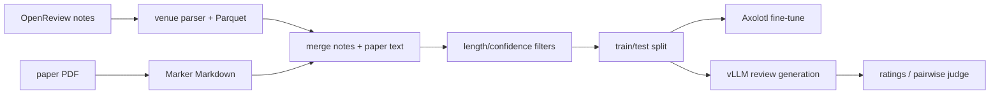

# maxidl/openreviewer：OpenReviewer——论文评审生成与评测流水线

| 字段 | 值 |
|---|---|
| GitHub | https://github.com/maxidl/openreviewer |
| License | GitHub API 未识别 |
| Stars | 17（2026-09-17 快照） |
| GitHub 仓库 pushed_at | 2025-06-21（仓库级动态元数据，不等于分析 commit 新增内容） |
| 分析 commit | `31798b43b5fc7a20b28e38821a6684fa0e8ca3f8` |
| 产品类型 | **论文评审生成与评测流水线** |
| 分析证据 | README.md, llm_training/README.md, openreview_dataset_creation/README.md, llm_training/prepare_data.py, llm_training/generate.py, llm_training/compare_reviews.py, llm_training/fft-llama31-8B-liger-ds.yaml |

本文用 📘 标注文档或源码中可直接定位的事实，🔶 标注由控制流推导的边界，💬 标注评价与借鉴建议。仓库动态元数据沿用候选清单，源码判断只绑定页面中的固定提交。

## 1. 它到底是什么

OpenReviewer 面向机器学习和人工智能会议论文生成结构化、批评性的同行评审。README 把 Llama-OpenReviewer-8B 描述为从 Llama-3.1-8B-Instruct 出发、用会议评审数据微调的模型；仓库同时提供 OpenReview 数据抓取/归一化、PDF 转 Markdown、训练、批量生成和比较评估脚本。因此它更准确的产品类别是“评审反馈系统”，而不是通用论文生产或科研实验 Agent。

## 2. 运行时堆叠

运行时由文件型数据流水线和模型推理组成。OpenReview notes 先按会议/年份下载，再用 venue-specific parser 归一字段并写 Parquet；PDF 通过 Marker 转为 Markdown；prepare_data.py 用 Polars 切分正文与附录、按论文和评审长度过滤、按 reviewer confidence 过滤并拆 train/test。训练由 Axolotl 配置和 DeepSpeed 负责，生成脚本用 vLLM 读取测试 Parquet，比较脚本另用 OpenRouter 的 OpenAI-compatible 客户端做 judge。

## 3. 阶段机或 DAG

该 DAG 由脚本和文件产物连接，并非一个在线长期 agent 状态机。

## 4. Tool / Skill / Agent 怎么切

工具层是下载脚本、按 venue 的 note parser、PDF 转 Markdown、Axolotl/DeepSpeed 训练、vLLM 生成和评测脚本。仓库没有独立 MCP 或 Skill 注册协议；Agent 行为主要体现在模型和 prompt。generate.py 要求 # Review 及字段化 Markdown；compare_reviews.py 将专家评审与两个候选评审交给 LLM judge。Contract 是 Parquet 字段、评审模板、CLI 参数和输出列，而不是 RH 的 artifact 信封。

## 5. 文献怎么来、是否入库、引用约束

材料来自 OpenReview API notes 与投稿 PDF，不是开放网页的任意搜索。README 要求 OpenReview 账号访问 API，并列出 ICLR 2021–2025、NeurIPS 2022–2024 的解析器；随后下载 PDF、转换并合并。prepare_data.py 固定抽取 ICLR 2025 与 NeurIPS 2024 的测试 ID，并以评审 confidence 做筛选。这里的“引用”仍属于评审中的论文引用，没有发现独立 claim-evidence 链或 RH ingest gate。

## 6. 实验 / 代码执行

该仓库训练和生成评审，不执行被评审论文的科研实验。冻结配置写明 131072 sequence length、3 epochs、bf16/Flash Attention 和 ZeRO-3；generate.py 默认 vLLM 四路张量并设置温度 0、最大新 token 4096。compare_ratings.py 可对照人工评分，compare_reviews.py 可产生 pairwise judge 结果；这些是源码提供的评估路径，本报告没有重跑 GPU 或宣称指标复现。

## 7. 写稿怎么做

写作能力集中在“写评审”。system prompt 要求总结贡献、列强弱点、给 accept/reject 建议、提出问题和改进反馈，并按会议模板输出。它不提供 LaTeX 章节、参考文献管理、venue profile 或最终稿编译。

## 8. 图怎么做

prepare_data.py 绘制正文/评审长度分布，另有 win-rate 绘图脚本，README 展示结果图。它们服务数据诊断和评测，不是独立论文示意图生成器；图数值要以实际运行产物为准。

## 9. 和 RH 的相似点

与 RH 相似之处是把来源材料、预处理、生成和评估分成可检查阶段，并把输入集合和输出模板显式化。venue 归一化、confidence 过滤、固定测试 ID 体现了“数据边界先于模型输出”的思路。

## 10. 和 RH 的不同点

OpenReviewer 的核心目标是评审文本质量，RH 覆盖选题、文献、主张、实验、图、稿件和版本提交。其 Parquet 不是 RH 的 paper/claim/evidence/artifact 图，LLM judge 也不是正式质量闸。训练还依赖专门 GPU 环境。

## 11. 优点 / 缺点

优点：数据来源和 venue parser 的职责清楚，模板与 train/test 分割可读，confidence 被显式使用。缺点：根目录没有被 GitHub API 识别的通用 LICENSE，许可不能据 metadata 猜测；prepare_data.py 含硬编码路径和交互式绘图；compare_reviews.py 采用响应末尾字符解析 A/B/Tie，且源码中出现 `pl.read_parquet(infile)` 与前面 `args.infile` 不一致，按冻结版本存在运行风险。README 的“高质量/优于通用模型”是项目声明，不是本次复现。

## 12. RH 可学的 1–3 条

1. 将 venue、字段、confidence 阈值和测试抽样保存为可审计数据 provenance。
2. 将评审建议定义成只读 artifact，不能未经证据复核写回正式稿。
3. 对 LLM judge 增加确定性的字段覆盖、一致性和引用支持检查。

## 13. 名字速查表

| 名字 | 先决概念 | 含义 |
|---|---|---|
| `note` | OpenReview | 论文、评审、决定等 API 数据容器 |
| venue parser | note schema | 针对年份字段差异的归一化解析器 |
| `prepare_data.py` | Parquet | 正文/附录、长度、confidence 和切分 |
| `generate.py` | chat template | 批量生成评审 |
| `compare_reviews.py` | expert reviews | LLM judge 的 pairwise 比较 |

---

> 📌事实边界
> 分析绑定上方完整 commit，只读取公开 GitHub 文档、配置和源码；未运行模型、训练、工具或评测，未访问外部 demo、论文全文、权重和数据集。源码行为、作者宣称和本报告建议分别表述。商业许可兼容、当前供应商可用性及性能指标均未独立验证。
