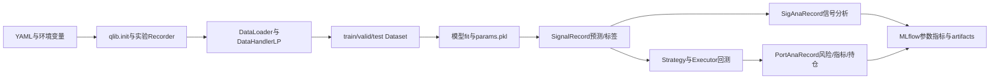

# microsoft/qlib：贯穿数据、模型、回测与记录的量化研究平台

| 字段 | 值 |
|---|---|
| GitHub | https://github.com/microsoft/qlib |
| License | MIT（staging API 值；许可证正文见 `LICENSE`） |
| 分析 commit | `be725493eb1a6bbb42bf11b37aa7669f59610ff1` |
| 产品类型 | 量化科研基础设施、数据处理、模型训练和回测编排 |
| 直接证据 | `README.md`, `LICENSE`, `pyproject.toml`, `qlib/cli/run.py`, `qlib/model/trainer.py`, `qlib/workflow/record_temp.py`, `qlib/workflow/recorder.py`, `qlib/data/dataset/handler.py`, `qlib/contrib/data/handler.py`, `qlib/contrib/model/gbdt.py`, `qlib/backtest/backtest.py`, `qlib/contrib/strategy/signal_strategy.py`, `examples/benchmarks/LightGBM/workflow_config_lightgbm_Alpha158.yaml`, `qlib/contrib/report/analysis_position/report.py`, `qlib/workflow/task/manage.py` |

本文用 📘 标注文档或源码中可直接定位的事实，🔶 标注由控制流推导的边界，💬 标注评价与借鉴建议。仓库动态元数据沿用候选清单，源码判断只绑定页面中的固定提交。

## 1. 它到底是什么

Qlib 是微软维护的 AI-oriented quantitative investment platform。固定版本的公开源码把量化研究组织为一条可组合链路：数据加载与特征处理、数据集分段、模型训练、预测信号、交易策略、执行器回测、风险/指标分析和实验记录。README 明确覆盖 alpha seeking、risk modeling、portfolio optimization 与 order execution，并提供监督学习、市场动态建模和强化学习相关组件。

它的核心价值不在某一个模型，而在各组件之间的接口合同。`qrun` 读取 YAML，初始化 Qlib 数据与实验管理器，调用 `task_train`；训练器创建模型和数据集，保存模型与数据集，随后按配置生成 Signal、SigAna 和 PortAna 等记录。由此，研究者可以把同一个数据处理与回测底座用于多个模型或自定义工作流。

## 2. 运行时堆叠

配置和 CLI 层位于 `qlib/cli/run.py`。它先用 Jinja 从环境变量渲染 YAML，再加载可选 `BASE_CONFIG_PATH`，处理 `sys.path`，调用 `qlib.init`，最后进入 `task_train`。`pyproject.toml` 将命令暴露为 `qrun`，依赖包含 numpy、pandas、MLflow、LightGBM、Redis、MongoDB、matplotlib 等，说明运行时既可以是本地离线研究，也可以接入服务和实验后端。

数据层由 DataLoader、`DataHandler`/`DataHandlerLP`、Dataset 和 processors 组成。模型层通过配置实例化 `LGBModel` 等 `Model`；workflow 层用 `Recorder`/MLflowRecorder 保存参数、指标和对象；record templates 将模型预测接到信号分析和组合回测。策略层把 signal 转成 trade decision，executor 推进交易日历，report 模块将回测表转换为累积收益、回撤、超额收益和换手率等图表数据。

## 3. 阶段机或 DAG

标准 YAML 工作流先初始化数据与实验管理器，再实例化 model 和 dataset；训练器从 dataset 的 train/valid 段准备 LightGBM 数据，拟合模型并保存 `params.pkl` 与 dataset；随后用 `<MODEL>`、`<DATASET>` 占位符替换 record 配置。`SignalRecord` 保存预测和标签，`SigAnaRecord` 读取它们计算 IC 等统计量，`PortAnaRecord` 读取预测，运行 strategy/executor backtest，保存 report、positions、indicators 与风险分析。

该 DAG 也允许按代码组合，而不是只能使用单一 YAML。数据处理的 `infer` 与 `learn` 是底层处理路径，`train/valid/test` 是 Dataset 的时间段，两者语义不同；这一区分对于避免把处理管线误当作实验切分很重要。

## 4. Tool / Skill / Agent 怎么切

Qlib 本身不是一个以 Tool、Skill、Agent 注册表为中心的系统。`qrun` 是工作流入口，模型、数据集、record、strategy 和 executor 都以配置对象或 Python 类的方式插拔。`TaskManager` 是另一条面向并发任务生命周期的工具：它将任务定义和结果 pickle 后存入 MongoDB，状态包括 waiting、running、part_done 和 done，并用原子 fetch-and-update 方式领取任务。

因此可以把它看成“量化研究组件编排器”，而不是自主科研 Agent。README 提到 RD-Agent 与 Qlib 的生态关系，但固定源码所记录的主体是 Qlib 的数据、模型、回测和实验接口；Agent 的规划、工具授权、论文检索和审稿决策需要由上层系统提供。Qlib 的 config-driven factory 负责对象实例化，不自动赋予这些对象研究判断能力。

## 5. 文献怎么来、是否入库、引用约束

README 链接 Qlib 论文、R&D-Agent-Quant 论文、模型论文和数据来源，benchmark 目录也按模型列出相关论文。但是固定代码的 workflow record 主要保存 task config、参数、模型、dataset、预测、标签、回测报告和分析指标；没有通用 paper entity、claim、source span 或 citation key 的入库接口。MLflow 能记录命令行、参数和环境变量，但不等于文献证据管理。

因此 Qlib 可以让一个模型实验可追踪，却不会自动判断某个 alpha 因子是否已有先例、数据源是否应引用、结果数字是否与论文正文一致。使用者若从 Qlib 产出研究稿件，需要在外层补充文献检索、数据许可与引用定位。README 中展示的 annualized return、information ratio、max drawdown 和数据服务器 benchmark 数字是文档示例或项目方报告，不是本次对固定版本运行得到的结果。

## 6. 实验 / 代码执行

`LGBModel._prepare_data` 要求存在 train 段，并从 dataset 取 feature/label 的 learn 数据，构造 LightGBM Dataset；`fit` 可使用 valid 段、early stopping、日志和 MLflow metrics，`predict` 从 inference 数据生成带索引的 pandas Series。示例配置将 2008–2014 设为 train、2015–2016 为 valid、2017–2020 为 test，使用 Alpha158 handler 和 `TopkDropoutStrategy`。

回测由 `PortAnaRecord` 根据 signal 建立 strategy/executor，`backtest_loop` 重置交易日历和策略，逐步生成 trade decision、交给 executor，再收集 portfolio metrics 与 trade indicators。分析阶段计算不含成本和含成本的超额收益风险表，并将 report、positions、indicator 和分析对象保存为 recorder artifacts。`analysis_position/report.py` 还把收益、成本、基准、累计曲线、回撤和换手率组织为多行图表。

本次没有安装 Qlib、LightGBM、MLflow 或数据依赖，没有下载市场数据，没有运行 `qrun`，没有训练模型、回测组合或生成图表。因此源码中的训练和回测能力是静态事实，README 表格和示例输出不是本次复现结果；本记录不声称任何收益、IC、IR 或 drawdown 数字已被验证。

## 7. 写稿怎么做

Qlib 的写入对象是实验记录，不是论文正文。`Recorder` 抽象出 save/load object、log params、log metrics、tags、artifact 和 run 生命周期；MLflowRecorder 将对象序列化后上传到 artifact URI，并在开始运行时记录命令行、特定环境变量以及未提交代码的 diff/status 文本。`task_train` 还保存原始 task 配置、模型和处理后可用于在线推理的数据集。

这种设计适合形成“配置—模型—预测—分析”的可复查实验包。Signal、SigAna 和 PortAna 的依赖关系由 `depend_cls` 和 `check` 表达，缺少前置 artifact 时分析记录会跳过或报错。它没有论文章节、审稿意见、引用配额、主张强度和发布闸门；将 recorder artifact 变成论文表格时，仍需手工或外部流程对齐数据范围、成本假设、随机性和文字叙述。

## 8. 图怎么做

Qlib 的 report 模块从回测 DataFrame 计算累计基准收益、含/不含成本收益、超额收益、最大回撤和换手率，再用多子图布局生成图形。`PortAnaRecord` 保存可供后续绘图和分析的 pickle 对象；README 还展示预测分组累计收益、收益分布、IC、自动相关和组合 report 等图表入口。

这是一套面向量化报告的图形数据路径，但源码没有统一的论文 figure plan、图注证据清单、颜色验证或跨图一致性审计。图形的数值解释依赖 backtest config、交易日历、手续费、成交价、可交易限制和 benchmark 定义。任何对外报告都应同时保留原始 report/positions/analysis artifact 与图表的参数说明，不能把一张图单独当成完整实验协议。

## 9. 和 RH 的相似点

Qlib 与 RH 都把科研活动拆成有依赖关系的中间产物，并把配置、运行状态、指标和文件保存下来。Qlib 的 recorder artifact、task config、model、dataset、prediction、backtest report 对应 RH 中实验与 provenance 的不同节点；`depend_cls` 检查前置记录是否存在，也体现了“先满足依赖再生成派生结果”的思想。

两者还都重视可复查的运行环境：Qlib 记录命令和部分环境变量，RH 需要把数据、代码、参数和结论绑定。Qlib 对信号、交易和成本的显式分层，为 RH 的实验契约提供了一个具体范例：把输入、处理、模型输出、执行假设和统计摘要分别落盘，而不是只留下一个最终数字。

## 10. 和 RH 的不同点

Qlib 的主对象是金融时间序列和组合执行，评价量通常来自 IC、风险分析、收益、成本、换手率和交易指标；RH 面向更广的研究任务，还需覆盖文献证据、方法主张、统计设计、稿件生成和出版材料。Qlib 的 recorder 证明“某段程序写下了某个 artifact”，并不自动证明数据无泄漏、主张具有因果效度或引用已经完整。

Qlib 的 task manager 使用 MongoDB 与 pickle 管理分布式任务，重点是任务领取和结果提交；RH 的 lineage 和 gate 更强调跨阶段证据约束及可审计发布。Qlib 允许用户自定义策略、executor 和数据处理，灵活性很高，但研究者仍需在上层规定数据版本、时间边界、基准选择、统计不确定性和人类复核。

## 11. 优点 / 缺点

优点是组件覆盖完整，数据处理、监督/强化学习模型、信号、策略、executor、回测、风险分析和实验记录可以组合；配置与代码两种工作流都可用；`DataHandlerLP` 明确区分 raw、infer、learn，并支持共享、推理和学习 processors；record templates 用依赖关系串起预测、分析和回测；MLflow 后端提供参数、指标与 artifacts 的持久化；策略和交易执行接口能表达持仓、成本和可交易性。

缺点是安装依赖较重，数据获取和外部服务配置是运行前提；金融结果高度依赖数据质量、时间切分、交易规则和成本设置；记录系统不等于证据或文献系统；pickle 与分布式 MongoDB 需要严格的安全和版本管理；README 的示例数字不能直接外推到任意市场、时间段或环境；完整 workflow 的可复现性仍要求固定数据快照、依赖版本、随机种子和硬件条件。

## 12. RH 可学的 1–3 条

1. 用显式 artifact 依赖表达研究 DAG：预测先于信号分析，预测也先于回测，派生报告不能在前置产物缺失时悄然生成。
2. 将 raw、infer、learn 与实验切分分开建模，明确哪些处理器只在训练拟合，哪些只用于推理，减少数据泄漏和语义混淆。
3. 把配置、模型、数据集、命令、环境、原始输出和派生指标一起记录；发布表格时保留成本、基准、时间范围和分析对象的可追溯链接。

## 13. 名字速查表

`qrun`：按 YAML 运行量化研究工作流；`DataHandlerLP`：带 learn/infer processor 路径的数据处理器；`DatasetH`：按时间段组织数据集；`LGBModel`：LightGBM 模型适配；`SignalRecord`：保存预测与标签；`SigAnaRecord`：计算 IC、Rank IC 和多空分析；`PortAnaRecord`：运行组合回测并保存报告；`TopkDropoutStrategy`：按 signal 排名和 dropout 交易；`Recorder`：实验生命周期与 artifact 接口；`MLflowRecorder`：MLflow 后端实现；`TaskManager`：MongoDB 任务领取与状态管理；`backtest_loop`：逐交易步推进策略和执行器；`Alpha158`：公开数据 handler 配置；`R`：Qlib workflow 全局实验入口。

> 📌事实边界：本页依据 `be725493eb1a6bbb42bf11b37aa7669f59610ff1` 固定公开源码快照、2026-09-17 `data/candidates-staging.jsonl` 元数据和 `evidence.json` 所列实际查看文件静态撰写。README 中的收益、风险、数据服务性能和模型列表是项目文档或报告数字，不是本次复现实验结果；本次未安装依赖、未下载数据、未运行 qrun、未训练 LightGBM、未执行回测、未生成图表，也未验证收益或性能。
