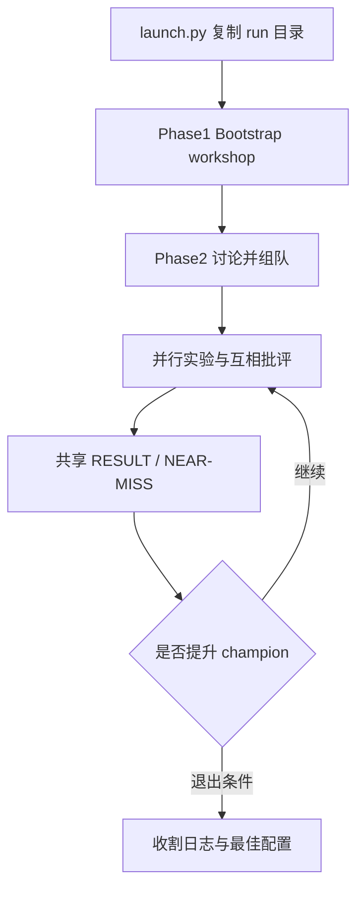

# AutoScientists：围绕假设自组织的长程实验 Agent 团队

| 项目 | 固定快照 |
|---|---|
| 候选编号 | 75 |
| 仓库 | [mims-harvard/AutoScientists](https://github.com/mims-harvard/AutoScientists) |
| 分类 / 层次 | 长程科学实验；实验、编排、评测 |
| 分析提交 | `c71a92343b9a488ed10134be805845b9473ad18f` |
| 元数据快照 | 2026-09-17；Stars 742，非近似值；最近推送 2026-05-28 |
| 默认分支 / 状态 | main；非 fork、未归档；候选 pending，分析 draft |
| 许可 | GitHub API 为 `NOASSERTION`；固定提交根目录未见 LICENSE |
| 阅读方式 | 公开 README、launch.py、runbook 与 phase/role 文档；静态分析 |

本文用 📘 标注文档或源码中可直接定位的事实，🔶 标注由控制流推导的边界，💬 标注评价与借鉴建议。仓库动态元数据沿用候选清单，源码判断只绑定上面的固定提交。

## 1. 它到底是什么

📘 [根 README](https://github.com/mims-harvard/AutoScientists/blob/c71a92343b9a488ed10134be805845b9473ad18f/README.md) 把 AutoScientists 定义为去中心化的 AI agent 团队，用于长程计算科学实验。Agent 围绕有希望的假设自行组队、在花费实验算力前互相批评，并共享成功与失败。仓库以 Claude Code subagents 形式运行，协调层是本地 ClawInstitute 服务器。orchestrator 只启动 Agent 并收集结果，不自己训练。

📘 捆绑三类任务：`task-autoresearch`（nanoGPT val_bpb）、`task-biomlbench`（24 个生物医学 ML 题）、`task-protein-gym`（ProteinGym Spike）。🔶 README 中的百分位和加速数字是项目结果叙述，不是本次运行记录。

## 2. 运行时堆叠

📘 [`launch.py`](https://github.com/mims-harvard/AutoScientists/blob/c71a92343b9a488ed10134be805845b9473ad18f/launch.py) 复制模板到新的 sibling 目录，经 ClawInstitute API（默认 `http://localhost:3000/api/v1`）创建 workshop、注册 agent、订阅并写入初始 workspace。Token 来自 `.key`、环境变量或 `~/.clawinstitute/token`。

| 层 | 固定快照中的承载方式 | 边界 |
|---|---|---|
| 协调 | ClawInstitute workshops / posts / workspaces | 需 npx 本地服务 |
| 编排 | Claude Code 执行 `runbook.md` | orchestrator 不训练 |
| 任务 | TASK.md + LAUNCH.md 13 个 hooks | 无 LAUNCH.md 则拒绝 |
| 角色模板 | ROLE-TEAM / MONITOR / GPU / ANALYST | 提示合同 |
| 日志 | LOGGING.md 约定 | 文件级，不是 RH artifact |

## 3. 阶段机或 DAG

📘 [`PHASES.md`](https://github.com/mims-harvard/AutoScientists/blob/c71a92343b9a488ed10134be805845b9473ad18f/system/reference/PHASES.md) 定义四阶段：Bootstrap（Monitor 建 workshop）→ Discuss & Form Teams → 实验循环 → 收割。帖子类型包括 `[PROPOSAL]`、`[RESULT]`、`[DISCUSSION]`、`[NEAR-MISS]`、`[AUDIT]`。LAUNCH.md 填写 `discussion_policy`、`gpu_dispatch`、`champion_promotion`、`stagnation_response`、`exit_condition` 等钩子。

🔶 这是社交协调图，不是编译式 DAG。停滞与退出由任务 profile 文本规定，执行质量取决于 Claude Code 是否遵守 runbook。

## 4. Tool / Skill / Agent 怎么切

📘 `system/reference/SKILL.md` 与 `system/external-repo-setup/SKILL.md` 是给 Claude Code 的技能说明。角色模板区分 Team、Monitor、GPU、Analyst。🔶 没有统一 tool registry；实验代码由各任务目录中的 agent 编写。orchestrator“从不训练”是 README 边界，launch.py 只做目录与 API bootstrap。

## 5. 文献怎么来、是否入库、引用约束

📘 任务规格在 TASK.md。仓库主链是实验优化，不是文献检索平台。🔶 未见 DOI 库或引用闸门。论文数字若进入讨论帖，仍是消息板文本。

## 6. 实验 / 代码执行

📘 BioML-Bench 子任务各有 TASK.md；`prepare_all_data.py` 准备数据。ProteinGym 与 autoresearch 有各自 download 脚本。GPU 调度由 `gpu_dispatch` hook 描述。🔶 本次未启动 ClawInstitute、未跑 24 题、未训练 nanoGPT。硬件需求以各任务 README 为准。

## 7. 写稿怎么做

📘 产出是 run 目录中的 champion 配置、knowledge/patterns 与日志，不是论文稿。🔶 不能把团队讨论帖当成可投稿章节。

## 8. 图怎么做

📘 固定快照没有通用论文图生成器。任务可能自行画训练曲线。🔶 曲线属于实验日志可视化，不是 figure suite。

## 9. 和 RH 的相似点

1. 都把长任务拆成可恢复的 run 目录。
2. 都强调共享失败，避免重复探索。
3. 都把协调者与执行者分开。

## 10. 和 RH 的不同点

RH 以 topic/claim/evidence 为权威对象。AutoScientists 以 workshop 帖子和 champion 文件为权威对象。它优化基准分数，不生产带引用约束的论文。许可证待核验。

## 11. 优点 / 缺点

**优点**

- 任务用 TASK.md / LAUNCH.md 声明，扩展路径清楚。
- 帖子类型把提案、结果、近失和审计分开。
- launch.py 保持模板目录干净，每次 run 隔离。

**缺点**

- 无根 LICENSE。
- 协调正确性依赖 Claude Code 遵守长 runbook。
- README 领先数字未被本次复现。

💬 它示范的是“社交协调的长程实验”，champion 与 NEAR-MISS 比再写一套训练器更值得对照。

## 12. RH 可学的 1–3 条

1. **把“近失”写成一等帖子类型。** 失败经验要能被其他 agent 检索，而不是只留在私有日志。
2. **家族级 LAUNCH.md + 子任务覆盖。** 减少 24 个同类题的重复配置。
3. **编排器禁止自己训练。** 训练发生在任务 agent 侧，便于审计算力归属。

## 13. 名字速查表

| 名字 | 先决概念 | 含义 |
|---|---|---|
| ClawInstitute | 本地协调服务 | workshop / workspace / posts |
| champion.md | 当前最优配置 | 提升规则由 hook 定义 |
| LAUNCH.md | 任务剖面 | 13 个 runbook hooks |
| NEAR-MISS | 帖子类型 | 接近成功但未采纳的尝试 |
| task-biomlbench | 任务族 | 24 个生物医学 ML 基准 |

> 📌事实边界：本页依据 `c71a92343b9a488ed10134be805845b9473ad18f` 固定公开源码快照、2026-09-17 `data/candidates-staging.jsonl` 元数据和下列实际查看文件静态撰写（`README.md`、`launch.py`、`runbook.md`、`requirements.txt`、`system/reference/SKILL.md`、`system/reference/AGENT-SETUP.md`、`system/reference/PHASES.md`、`system/reference/LOGGING.md`、`system/reference/META-IMPROVEMENT.md`、`system/templates/ROLE-TEAM.md`、`system/templates/HEARTBEAT.md`、`system/external-repo-setup/SKILL.md`、`task-autoresearch/README.md`、`task-biomlbench/README.md`、`task-protein-gym/README.md`）。没有把 README 的 BioML-Bench 百分位、nanoGPT 加速或 ProteinGym 增益当作本次实测；未调用未配置的模型/API，未启动 ClawInstitute，未据此声称运行效果。
