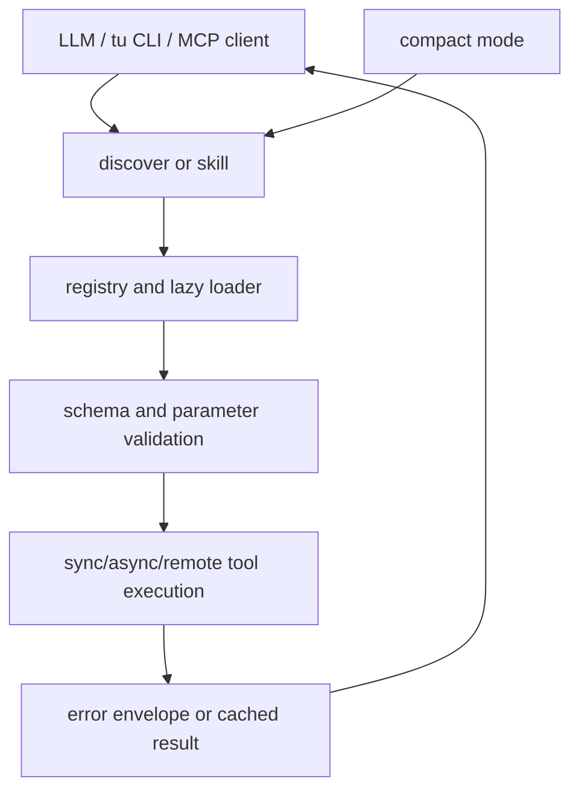

# mims-harvard/ToolUniverse：ToolUniverse——科学工具注册、发现与调用底座

| 字段 | 值 |
|---|---|
| GitHub | https://github.com/mims-harvard/ToolUniverse |
| License | Apache-2.0 |
| Stars | 1,686（2026-09-17 快照） |
| GitHub 仓库 pushed_at | 2026-09-16（仓库级动态元数据，不等于分析 commit 新增内容） |
| 分析 commit | `e8313460c03ef8c0b23a3b4b58f07474b2f9a460` |
| 产品类型 | **科学工具注册、发现与调用底座** |
| 分析证据 | README.md, src/tooluniverse/tool_registry.py, src/tooluniverse/base_tool.py, src/tooluniverse/execute_function.py, src/tooluniverse/smcp.py, src/tooluniverse/cache/result_cache_manager.py, skills/tooluniverse-literature-deep-research/SKILL.md |

本文用 📘 标注文档或源码中可直接定位的事实，🔶 标注由控制流推导的边界，💬 标注评价与借鉴建议。仓库动态元数据沿用候选清单，源码判断只绑定页面中的固定提交。

## 1. 它到底是什么

ToolUniverse 是把科学数据库、模型、数据集和软件包装为可发现、可调用工具的底座。README 提供 Python SDK、`tu` CLI、MCP server、agent skills、工具组合、异步任务和 compact mode 等入口；它不等于一个特定领域的研究结论生成器。它的产品价值在工具接口和发现机制，具体答案仍取决于工具数据、网络和调用参数。

## 2. 运行时堆叠

运行时的中心是 ToolUniverse/execute_function 与注册表。工具可由装饰器、JSON 配置、内置模块、用户文件、远程/MCP source 加载；注册表支持 lazy mapping，缺失依赖写入错误记录。统一执行层做参数 schema 处理、operation 默认值、错误 envelope、同步/异步和并行 batch；ResultCacheManager 组合 LRU、可选 SQLite、single-flight 和异步持久化。README 的工具/skill 数量是声明，本次没有为每个工具逐一加载。

## 3. 阶段机或 DAG

compact mode 只暴露发现工具与 execute_tool 等核心入口，同时仍可在后台加载实际工具；这把“大工具目录”与“模型上下文中暴露多少”分开。

## 4. Tool / Skill / Agent 怎么切

Tool 是 BaseTool 子类或配置驱动调用，registry 负责名称到类/模块和配置映射，execute_function 负责统一调度。Skill 是 skills/ 中的操作说明和检查清单，MCP/SMCP 是外部协议边界；CLI 面向人或脚本。compact mode 的 find/list/info/execute 入口降低上下文占用，但不自动完成证据审计。错误类型、工具 unavailable 记录、None result error 和 cache namespace/version 是局部 contract。

## 5. 文献怎么来、是否入库、引用约束

工具覆盖 PubMed、Europe PMC、OpenAlex、arXiv、数据库、模型和化学/生物服务。literature-deep-research skill 要求先消歧、执行多源检索、扩展引用并给 T1–T4 evidence grade；其 report template 和 bibliography 是 skill 级交付约定。工具缓存可复用返回值，但缓存不是 paper pool 或 claim-evidence 图；外部源的更新、撤稿、全文和 license 仍需写入项目自己的证据状态。

## 6. 实验 / 代码执行

执行层支持本地 Python 类、HTTP/REST、远程 runtime、MCP 和异步长任务，具体工具决定是否修改文件、请求外网或消耗模型。BaseTool 对 None 返回统一为 error，而不是空成功结果；execute_function 还提供校验、批量及缓存路径。源码存在 API key 检查和工具依赖错误记录，但权限/网络副作用仍需按工具单独审查。

## 7. 写稿怎么做

写作相关能力主要由 skills 文档驱动：literature deep research 规定 factoid/mini-review/full report 模式、证据等级、章节和 bibliography 文件。它是研究报告生成指导，不是通用投稿终稿器；没有从该 skill 自动得到 RH 的 paper commit、全文一致性、反抄袭或 PDF gate。

## 8. 图怎么做

ToolUniverse 能调用绘图、执行 notebook、图像和分析工具，skill 可要求输出报告；系统本身不是单一 figure renderer。cache 和远程结果记录有助于回放，但没有证据显示每幅图都绑定数据快照、代码、图注和正文 claim。

## 9. 和 RH 的相似点

与 RH 相似处是把工具、参数、来源、缓存、错误和研究报告步骤显式化；多源检索 skill 强调先消歧、引用扩展和证据分级，与 evidence-gating 的思想接近。compact mode 也体现了将“可用能力”与“当前上下文”分离。

## 10. 和 RH 的不同点

RH 维护 topic/paper/claim/evidence/artifact 的生命周期和阶段闸；ToolUniverse 主要提供可调用基础设施，调用者负责把结果变成合规研究状态。工具返回成功不代表论断被支持，缓存命中不代表来源仍新鲜，MCP 暴露也不等于权限最小化。

## 11. 优点 / 缺点

**优点**：注册、lazy load、错误状态、schema 校验、异步/批量和多层缓存形成相对完整工具底座；skills 将复杂检索方法写成可执行说明。

**局限**：目录广度带来依赖、key、许可和数据新鲜度管理成本；不同工具的错误和证据粒度仍可能不同；README 宣称数量、速度和生态规模没有在本次全量复现。

## 12. RH 可学的 1–3 条

1. 借鉴工具 namespace/version、resolved URL、错误 envelope 和 cache provenance，接入 RH evidence。
2. 把 skills 的证据等级和消歧步骤变成写作前 gate，而不只作为 prompt。
3. 将“工具返回”与“可发表主张”保持两层对象，强制 source span、时间和许可信息。

## 13. 名字速查表

| 名字 | 先决概念 | 含义 |
|---|---|---|
| registry | tool name | 名称到类、配置和懒加载模块 |
| BaseTool | schema | 工具默认值、参数和缓存版本基类 |
| compact mode | context budget | 只暴露发现/执行核心入口 |
| SMCP | protocol | 面向模型客户端的工具服务器接口 |
| ResultCacheManager | replay | 内存和 SQLite 结果缓存协调器 |
| T1–T4 | evidence grade | 文献深度/证据等级标签 |

---

> 📌事实边界
> 本页只使用冻结 commit 的公开 GitHub 文档和源码；未运行模型、训练、工具、远程 API 或领域实验。README 数字和论文结果仅作为作者声明，未升级为独立复现。性能、临床/化学/物理有效性、商业许可、数据新鲜度和完整部署状态均需额外核验。
