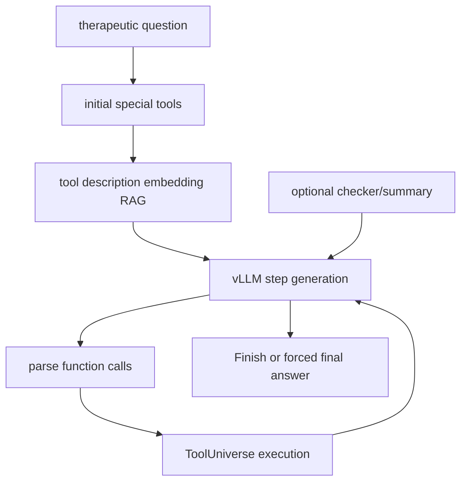

# mims-harvard/TxAgent：TxAgent——治疗推理 Agent 与 ToolUniverse 工具 RAG

| 字段 | 值 |
|---|---|
| GitHub | https://github.com/mims-harvard/TxAgent |
| License | MIT |
| Stars | 653（2026-09-17 快照） |
| GitHub 仓库 pushed_at | 2025-07-30（仓库级动态元数据，不等于分析 commit 新增内容） |
| 分析 commit | `8c24ad9ee2aeb6ca541f63c797d57d7e68502aa4` |
| 产品类型 | **治疗推理 Agent 与 ToolUniverse 工具 RAG** |
| 分析证据 | README.md, src/txagent/txagent.py, src/txagent/toolrag.py, src/txagent/utils.py, run_example.py |

本文用 📘 标注文档或源码中可直接定位的事实，🔶 标注由控制流推导的边界，💬 标注评价与借鉴建议。仓库动态元数据沿用候选清单，源码判断只绑定页面中的固定提交。

## 1. 它到底是什么

TxAgent 将个性化治疗问题转成多步工具调用。其 README 叙述的任务包括药物相互作用、禁忌证和患者特征；源码主类运行本地 vLLM 模型，用 ToolRAG 从 ToolUniverse 的工具描述中选择工具，并通过 Finish、Tool_RAG、CallAgent 等特殊动作控制轨迹。它是决策支持研究原型，不是临床处方或已验证的医疗器械。

## 2. 运行时堆叠

`init_model` 依次加载 vLLM 模型、ToolUniverse 和工具描述 embedding。ToolRAGModel 用 SentenceTransformer 对序列化工具 prompt 编码，并把 embedding 按工具目录 MD5 保存；若首次生成 embedding，源码保存后退出，要求重新运行以避免 OOM。每一轮把已选工具 prompt 和 conversation 给本地模型，解析函数 JSON，再将工具结果格式化回上下文；summary、avoid_repeat、checker 和 max_round 是可选控制。

## 3. 阶段机或 DAG

`CallAgent` 有层数上限；Finish 会立即结束并返回 `[FinalAnswer]` 后内容，达到 max_round、token overflow 或异常时可 force_finish。

## 4. Tool / Skill / Agent 怎么切

TxAgent 是 agent 编排层，ToolRAGModel 是工具发现层，ToolUniverse 是执行层，特殊工具提供控制流。默认 initial prompt 会加入 Finish，并可加入 CallAgent 或 Tool_RAG；每轮最多将 RAG 选出的工具按设定数量暴露。源码中的 `run_one_function` 承担实际工具调用，不能把 tool prompt 选择本身当作治疗证据。

## 5. 文献怎么来、是否入库、引用约束

文献和药品知识主要通过 ToolUniverse 工具获得，README 指向包含药物及生物医学来源的工具箱。TxAgent 本地代码没有自己的持久 paper pool 或 citation ledger；工具返回会进入模型上下文，最终自然语言答案不自动变成可追溯临床证据。ToolUniverse 的具体数据源、更新时间和许可要单独检查。

## 6. 实验 / 代码执行

README 推荐 H100 级资源，源码使用本地模型权重和 embedding，工具还需网络。`run_multistep_agent` 负责多轮推理；`ReasoningTraceChecker` 检查重复 thought/action，不是医学正确性检查器；force_finish 会在没有正常 Finish 时要求模型基于当前信息给出最终答案。README 的 92.1% accuracy、五个 benchmark 和“超过 GPT-4o”等数字是项目/论文声明，未在本任务重跑，也不能转译为患者安全或临床疗效。

## 7. 写稿怎么做

项目提供 Gradio app 和对话/最终答案，不是论文起草器。推理轨迹可以用于审查或研究报告，但源码未见章节、引用键、临床 guideline citation gate 或终稿编译。

## 8. 图怎么做

README 展示 GIF demo，代码主路径产生工具结果和文本，不负责出版级图表。工具返回可能含结构化数据或模型输出；没有所读证据表明图像、患者字段、结论和来源自动进行医学图 fidelity 审核。

## 9. 和 RH 的相似点

与 RH 的相似处是工具发现与执行分层、模型调用轨迹、多步 observation、错误/强制结束状态和可配置模型。RAG embedding 的 MD5 绑定工具目录是一个可借鉴的环境一致性线索。

## 10. 和 RH 的不同点

RH 需要医学证据、患者数据、临床风险和写作状态进入受控 gate；TxAgent 的本地生成器主要优化工具调用和最终答复。Finish 不是临床批准，工具存在不是工具结果正确，模型在 max_round 后被迫作答也不能标成完整推理。

## 11. 优点 / 缺点

**优点**：工具目录与模型 prompt 分开；embedding 缓存减少重复计算；Finish、CallAgent 深度、summary、checker、token overflow 等控制点清晰。

**局限**：首次 embedding 可能 OOM/退出；模型和工具均需重资源；强制最终答案可能在轨迹未完成时输出；README benchmark 未独立复现，不能用于临床性能承诺。

## 12. RH 可学的 1–3 条

1. 将 tool description hash、模型权重 hash、工具返回和时间戳作为 evidence lineage。
2. 对治疗答案强制药品/患者属性/来源和不确定性字段，缺证据时 fail closed。
3. 把 forced finish、checker failure、tool error 与正常完成分成不同结果状态。

## 13. 名字速查表

| 名字 | 先决概念 | 含义 |
|---|---|---|
| `TxAgent` | orchestration | 多步治疗推理类 |
| `ToolRAGModel` | retrieval | 工具描述 embedding 与 top-k 选择 |
| `Tool_RAG` | dynamic tools | 在轨迹中追加相关工具 |
| `Finish` | terminal control | 停止并返回最终答案 |
| `CallAgent` | delegated plan | 有层数上限的子代理调用 |
| `force_finish` | recovery | 超轮数/异常时生成兜底答案 |

---

> 📌事实边界
> 本页只使用冻结 commit 的公开 GitHub 文档和源码；未运行模型、训练、工具、远程 API 或领域实验。README 数字和论文结果仅作为作者声明，未升级为独立复现。性能、临床/化学/物理有效性、商业许可、数据新鲜度和完整部署状态均需额外核验。
