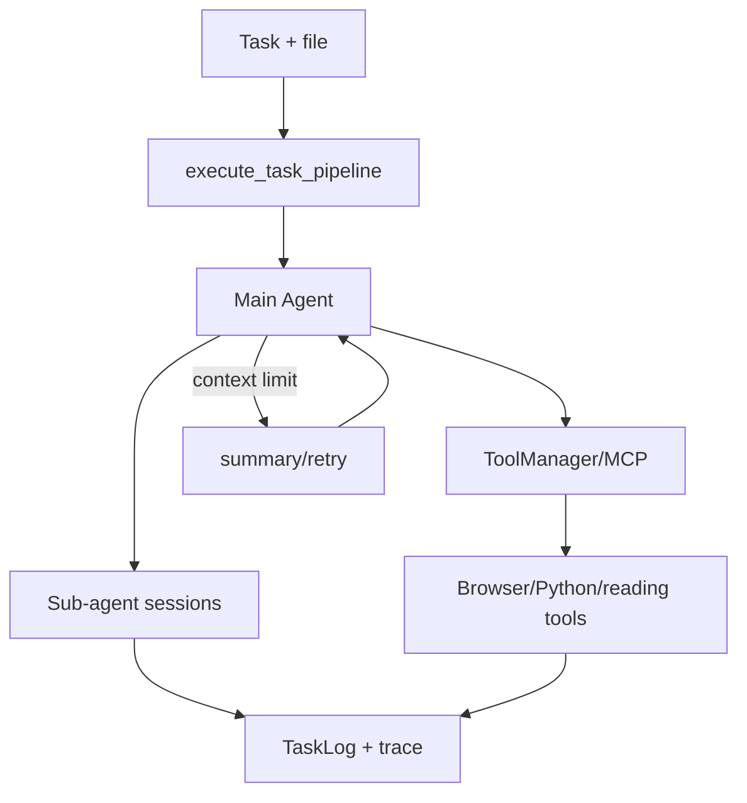

# MiroMindAI/MiroThinker：面向长链工具交互的深度研究 Agent

| 字段 | 值 |
|---|---|
| GitHub | https://github.com/MiroMindAI/MiroThinker |
| License | Apache-2.0 |
| Stars | 8404（2026-09-17 快照） |
| GitHub 最后 push | 2026-07-06 |
| 分析 commit | `1c4253f6774bf40314271a827304b842100e054c` |
| 生命周期 | GitHub 候选冻结记录为未归档；固定提交用于本页源码分析 |
| 产品类型 | 深度研究模型与运行时 |
| 分析证据 | 固定提交中的 README、许可证、配置与核心实现 |

本文用 📘 标注文档或源码中可直接定位的事实，🔶 标注由控制流推导的边界，💬 标注评价与借鉴建议。仓库动态元数据沿用候选清单，源码判断只绑定页面中的固定提交。

## 1. 它到底是什么

MiroThinker仓库同时包含模型/benchmark说明与MiroFlow运行时。运行时以主 Agent、可选子 Agent、ToolManager、MCP server 和结构化任务日志组织长链任务；模型能力与仓库声称的 benchmark 数字必须分开。 本文把仓库作为一个公开源码快照来分析：README 的产品定位、命令和 benchmark 数字属于项目文档；代码路径用于确认控制流、数据结构和边界。没有把 stars、README 宣称的准确率、SOTA 或部署体验转换成独立结论。

源码中最值得关注的是：execute_task_pipeline 先建立 TaskLog，再创建 LLM client 与 Orchestrator。主 Agent 获取工具定义并在 max_turns 内循环：解析结构化 tool calls，检测重复查询/回滚，执行工具或转派 sub-agent，检查上下文长度，最后生成摘要。子 Agent 有独立会话、工具集合和回合上限；上下文超限可触发总结。 这决定了它应在 RH 产品地图中被看作“深度研究模型与运行时”，而不是泛化地称为自动科研系统。

## 2. 运行时堆叠

运行时可拆成以下层：

- **入口与配置**：由仓库提供的 CLI、脚本、Next.js/API 或配置文件接收任务和参数。
- **Agent/编排**：Hydra/OmegaConf 配置任务；pipeline 创建主/子 Agent ToolManager 和 OutputFormatter；Orchestrator 驱动 LLM 回合；ClientFactory 提供模型客户端；工具通过 MCP stdio/SSE 动态发现与执行；TaskLog 保存步骤、环境、结果和失败经历；工具库含浏览器、阅读、搜索、推理、Python/E2B 等服务。
- **工具与环境**：工具调用连接搜索、文件、浏览器、向量库、解释器或沙箱；工具是否真的隔离取决于配置和外部服务。
- **状态与产物**：本项目保存的状态形式包括缓存、队列、日志、数据库、PaperNode、retrieval result、文件或 grade；它们不自动等同于 RH artifact。

这种分层让替换模型和工具变得容易，但也将“接口存在”和“证据可信”分开。源码可以证明一个函数会生成/保存某种对象，不能单凭存在证明对象内容正确。

## 3. 阶段机或 DAG

核心控制流如下。

execute_task_pipeline 先建立 TaskLog，再创建 LLM client 与 Orchestrator。主 Agent 获取工具定义并在 max_turns 内循环：解析结构化 tool calls，检测重复查询/回滚，执行工具或转派 sub-agent，检查上下文长度，最后生成摘要。子 Agent 有独立会话、工具集合和回合上限；上下文超限可触发总结。 阶段之间通常由消息、列表、队列、结构化对象或日志连接；是否能跨进程恢复，取决于具体实现，而不是 Mermaid 图本身。需要特别区分循环的两种含义：一种是有限的 max_depth/max_rounds/max_iter/max_steps 或 expand_layers；另一种是模型自主决定继续。源码中的上限能限制预算，但不能保证每次运行都走完所有阶段，也不能保证模型输出符合提示。

## 4. Tool / Skill / Agent 怎么切

该仓库的 Agent 边界是：主 Agent 接收任务并决定下一步；子 Agent/worker（若有）承担局部任务；tool 是可调用的搜索、抓取、文件、浏览器、代码或数据接口；skill（若有）主要是提示/能力包，不等于可审计的执行 artifact。具体来说，Hydra/OmegaConf 配置任务；pipeline 创建主/子 Agent ToolManager 和 OutputFormatter；Orchestrator 驱动 LLM 回合；ClientFactory 提供模型客户端；工具通过 MCP stdio/SSE 动态发现与执行；TaskLog 保存步骤、环境、结果和失败经历；工具库含浏览器、阅读、搜索、推理、Python/E2B 等服务。

工具调用的返回通常被转成文本、结构化响应或日志，再回到模型上下文。优点是扩展快，缺点是不同工具的来源、版本、错误和副作用可能没有统一合同。对于 RH，接入时不应只映射函数名，还要记录输入、输出、外部资源、权限、失败原因和可复核句柄。

## 5. 文献怎么来、是否入库、引用约束

文献/来源链是：运行时不是固定学术论文数据库；MCP server 可接搜索、抓取、浏览器和阅读服务。README列出 BrowseComp、GAIA、HLE 等 benchmark 与数据/模型链接，但本报告没有运行它们。

这条链路能支持“找到或读取来源”，但通常不能直接支持 claim-level evidence。源码未显示统一的 DOI/版本/页码/span/主张/支持强度对象，也没有在最终文字生成前做逐句 entailment gate。若项目有 URL、reference、arxiv_id、PaperNode 或 RetrievalResult，它们仍主要是检索和展示元数据。

因此，报告中的来源约束应写成：系统会按提示或数据结构保留来源；不能写成“每条结论都已验证”。在 RH 中，建议将这些中间来源摄取为 paper/source，再显式链接 claim 和 evidence span。

## 6. 实验 / 代码执行

工程上，源码提供 trace collection、benchmark 配置和 E2B Python server。python server 创建有 600 秒默认上限、20,000 字符结果上限的 sandbox 工具；这是执行接口设计，不等于已验证的科学实验复现。

**事实边界**：本次只读了公开仓库固定提交，没有安装依赖、配置 API key、下载模型/数据、启动外部服务或运行 benchmark。因而不能确认运行时性能、成本、并发稳定性、沙箱隔离、模型质量、检索召回或 README 中的结果。源码里的测试/评估函数可以说明“如何评”，不能说明“本次已评”。

若将它用于科研执行，还需要补齐数据版本、代码提交、环境镜像、资源上限、随机种子、指标定义、原始输出和失败记录，并把每次执行绑定到不可变 artifact。

## 7. 写稿怎么做

写作输出取决于项目类型：深度研究模型与运行时 的最终产物通常是 Markdown、报告字符串、聊天消息、结构化 Report、检索回答或 grade JSON。execute_task_pipeline 先建立 TaskLog，再创建 LLM client 与 Orchestrator。主 Agent 获取工具定义并在 max_turns 内循环：解析结构化 tool calls，检测重复查询/回滚，执行工具或转派 sub-agent，检查上下文长度，最后生成摘要。子 Agent 有独立会话、工具集合和回合上限；上下文超限可触发总结。

若有报告器，它往往把多个阶段的摘要合并为可读文本；引用可能是 URL、reference id、source 字段或 rubric 记录。这里没有看到 RH 意义上的章节草稿、参考文献数据库、claim/evidence 互证、LaTeX/PDF 编译和提交版本闸门。因此“能生成报告”不应被扩写成“能生成可投稿论文”。

## 8. 图怎么做

固定提交中的图能力应按数据来源区分。项目可能包含 README 架构图、UI 进度事件、流程 Mermaid、benchmark 绘图脚本或报告 Markdown，但这与从实验记录生成可发表定量图不同。MiroThinker仓库同时包含模型/benchmark说明与MiroFlow运行时。运行时以主 Agent、可选子 Agent、ToolManager、MCP server 和结构化任务日志组织长链任务；模型能力与仓库声称的 benchmark 数字必须分开。

本报告不把仓库 README 的截图、曲线或分数表重绘成独立实验结果。若下游要出图，必须先声明数据源、统计单位、误差定义、样本量、面板与图注主张；对于架构图，则需把实际节点、权限边界和失败路径与源码对齐。

## 9. 和 RH 的相似点

1. 都用主 Agent + 子会话处理长链任务，并给子会话独立工具集和回合上限。
2. 都把轨迹写入 TaskLog，而不是只把最终摘要留给用户。
3. 都对上下文超限做总结后再继续，而不是静默截断。

## 10. 和 RH 的不同点

RH 绑定 claim 与文献 span。MiroThinker 绑定 MCP 工具回合与 TaskLog。BrowseComp / GAIA / HLE 是模型评测叙事，不是论文入库。Python/E2B sandbox 有字符与时间上限，仍不是科学实验 registry。仓库同时含模型说明与 MiroFlow 运行时，二者不能合成一次已测成绩。

## 11. 优点 / 缺点

**优点**

- Orchestrator 解析结构化 tool calls，并检测重复查询/回滚。
- 子 Agent 会话隔离，避免工具集合互相污染。
- MCP stdio/SSE 动态发现工具，扩展面清楚。

**缺点**

- 无 DOI 级文献对象。
- sandbox 上限是工程保护，不是实验审计。
- README 基准数字未被本次复现。

💬 可学的是长链工具循环的日志与回滚，不是把 GAIA 分数搬进图谱。

## 12. RH 可学的 1–3 条

1. **给子 Agent 独立会话和工具白名单。** 主循环转派时不要共享全部 MCP。
2. **把重复查询/回滚写成运行时检测，而不只写在提示里。**
3. **上下文超限触发总结，并留下 TaskLog 步骤。** 方便事后看停在哪一轮。

## 13. 名字速查表

| 名字 | 先决概念 | 含义 |
|---|---|---|
| execute_task_pipeline | 入口 | 建 TaskLog 与 Orchestrator |
| ToolManager | 工具层 | MCP 发现与执行 |
| TaskLog | 轨迹 | 步骤、环境、失败 |
| max_turns | 预算 | 主循环上限 |
| E2B Python server | 沙箱 | 默认 600s / 2 万字符 |

> 📌事实边界：本页绑定固定提交 `1c4253f6774bf40314271a827304b842100e054c`，快照日期 2026-09-17。未运行 BrowseComp/GAIA/HLE，未启动 MCP 或 E2B，未把模型 benchmark 数字当作本次实测。
