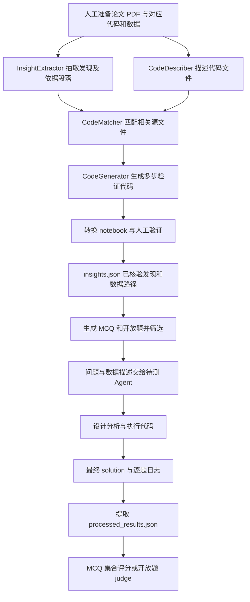

# HeurekaBench：把已发表发现转成数据分析题，再评估科研 Agent

| 项目 | 固定快照 |
|---|---|
| 候选编号 | 72 |
| 仓库 | [mlbio-epfl/HeurekaBench](https://github.com/mlbio-epfl/HeurekaBench) |
| 分类 / 层次 | 单细胞科学发现基准；文献、方法、实验、评测 |
| 分析提交 | `c2a2b2fcdc5244220ff60f65483bc084c72a8cf1` |
| 元数据快照 | 2026-09-17；Stars 21，非近似值；最近推送 2026-09-14 |
| 默认分支 / 状态 | main；非 fork、未归档；候选 pending，分析 draft |
| 许可 | MIT；固定提交的根目录 `LICENSE` 已查阅 |
| 阅读方式 | 公开 README、构造与评分脚本、Agent 包装器，以及内置 Biomni 的执行图关键段；静态分析 |

本文用 📘 标注文档或源码中可直接定位的事实，🔶 标注由控制流推导的边界，💬 标注评价与借鉴建议。仓库动态元数据沿用候选清单，源码判断只绑定上面的固定提交。

## 1. 它到底是什么

📘 [根 README](https://github.com/mlbio-epfl/HeurekaBench/blob/c2a2b2fcdc5244220ff60f65483bc084c72a8cf1/README.md) 将 HeurekaBench 定位为 AI Co-scientist 的基准构造框架：从科学论文及其代码仓库中抽取发现，生成围绕实验数据的研究问题，让待测 Agent 自主设计多步分析，再将回答与已发表发现对照。`scheurekabench` 是它在单细胞领域的具体实例 sc-HeurekaBench。

这里有两个不同角色：**出题流水线**负责把论文发现变成经过人工核验的问题；**答题与评分流水线**负责运行 Biomni、CellVoyager 或无工具的语言模型基线。HeurekaBench 自身的核心价值是建立测试材料和评判合同，底层分析能力主要由接入的 Agent 提供。

📘 README 列出选择题、开放题，以及 full、lite、要求工具使用的版本。🔶 不过，它衡量的主要是相对于已有研究结论的恢复能力：某个 Agent 答对既有问题，并不自动证明其能发现未发表机制、设计可靠湿实验或完成论文生产。

## 2. 运行时堆叠

📘 构造侧是 Python 命令行脚本：PyMuPDF 抽取 PDF 文本，`nbformat` 读取 notebook，OpenAI/Anthropic SDK 发起模型请求，`python-dotenv` 读取配置。README 建议 Python 3.12；构造脚本中可见 `gpt-4o` 与 `claude-sonnet-4-20250514` 等默认模型字符串，这些是快照中的配置，不是对当前服务可用性的验证。

| 层 | 固定快照中的承载方式 | 边界 |
|---|---|---|
| 论文和原始代码 | `paperX/paper.pdf`、`paperX/code/`、`paperX/data/` | 由使用者预先组织 |
| 发现与问题构造 | `benchmark_creation` 下的独立脚本和提示词 | 文件交接，包含人工验证环节 |
| 数据分析 Agent | Biomni A1、CellVoyager AnalysisAgent | 各自承担工具、环境和分析循环 |
| 模型基线 | 无 Agent 环境的模型调用；README 另给出 vLLM 服务示例 | 不应与有工具执行的能力混在一起解释 |
| 答案评价 | 正则解析、NumPy、pandas、OpenAI judge | MCQ 集合比较；开放题模型评分 |
| 记录介质 | TXT、JSON、CSV、notebook | 便于检查，但主要不是数据库化服务 |

📘 [Biomni 包装器](https://github.com/mlbio-epfl/HeurekaBench/blob/c2a2b2fcdc5244220ff60f65483bc084c72a8cf1/scheurekabench/run_biomni/run_biomni.py) 每题实例化 A1，传入模型、温度、执行超时、self-critic、plan-critic 和工具检索开关。内置 [A1 源码](https://github.com/mlbio-epfl/HeurekaBench/blob/c2a2b2fcdc5244220ff60f65483bc084c72a8cf1/Biomni/biomni/agent/a1.py) 的执行图采用 LangGraph。应区分这一内部循环与 HeurekaBench 顶层逐脚本运行的构造流程。

## 3. 阶段机或 DAG

📘 [构造指南](https://github.com/mlbio-epfl/HeurekaBench/blob/c2a2b2fcdc5244220ff60f65483bc084c72a8cf1/scheurekabench/README.md) 明确要求在代码验证阶段人工制作 `insights.json`，随后才生成问题；还建议移除幻觉题、重复题、来自未验证发现的题，以及无需工具就能轻易回答的题。下面的图是依据指南和脚本整理的逻辑依赖，不表示仓库实现了自动推进这些节点的统一调度器。

🔶 顶层恢复主要靠输出文件是否存在，并非显式的阶段状态与验收记录。例如 Biomni 包装器看见某题的 `_output.txt` 已存在就跳过；文件可能来自成功运行，也可能来自中途失败。因此“有文件”不等于“该题已经完成”，README 要求失败题人工清理输出后重跑，正好反映了这一边界。

## 4. Tool / Skill / Agent 怎么切

📘 InsightExtractor、CodeDescriber、CodeMatcher 和 CodeGenerator 是构造阶段的职责名称，对应不同提示词与调用函数。它们没有各自独立的长期记忆或常驻任务队列，不能仅凭名称就理解为四个自主科研 Agent。

`code_insights.py` 读取 Python、R、Perl、R Markdown 以及 notebook 中的代码单元，分批交给模型获得文件说明。`match_insights.py` 根据发现与文件说明选择相关代码，再把实际代码内容送给生成器。生成器要求每个代码块带 `code`、`reasoning`、`derived_from`，把“为什么这样分析”和“参考哪些文件”留在输出中。

📘 真正的交互式 Agent 出现在答题侧：Biomni 的 A1 接受任务后可做工具检索，进入生成—执行—观察循环；CellVoyager 包装器调用 `AnalysisAgent.run(seeded_hypotheses=[curr_prompt])`，并开启其自我批评、视觉模型和文档相关选项。🔶 包装器打开选项，只能证明调用配置存在，不能证明这些模块在每次运行中成功工作。仓库这一基准主链也不是可安装的通用 Skill 目录。

## 5. 文献怎么来、是否入库、引用约束

📘 论文来源是使用者提前整理的 PDF 与对应代码仓库，构造指南没有把在线检索作为必经步骤。[`insights.py`](https://github.com/mlbio-epfl/HeurekaBench/blob/c2a2b2fcdc5244220ff60f65483bc084c72a8cf1/scheurekabench/benchmark_creation/insights.py) 用 PyMuPDF 抽取文本，并在达到 20 页或遇到某些方法、参考文献等标记时停止；它还跳过页面首块和部分带出版信息的文本块。🔶 这属于启发式清洗，不是对所有期刊版式都可靠的全文解析，可能漏掉发现所需的方法或补充依据。

[发现抽取提示词](https://github.com/mlbio-epfl/HeurekaBench/blob/c2a2b2fcdc5244220ff60f65483bc084c72a8cf1/scheurekabench/benchmark_creation/prompts/insight_extractor.py) 要求输出 summary、推导过程及接近原文的相关段落，并禁止编造论文没有的发现。抽样查看的 `oeq_lite.json` 条目保留 `summary`、`how`、`relevant`、`data` 与问答文本，说明论文依据和数据路径确实进入了基准记录。

🔶 这些记录提供的是段落和文件级线索，而不是经过独立校验的页码、字符跨度、DOI 与每条主张的完整绑定。模型被要求保留原文，也不等于输出已经逐字校验。对后续复核而言，人工验证和原始论文仍然重要。

📘 答题包装器解析题目时剥离标准答案，只把问题、选项或数据路径与描述放进 prompt。🔶 这是输入层面的答案分离；读取到的包装器没有展示将标准答案文件与 Agent 执行环境进行系统级访问隔离，不能据此声称完全防止了答案泄漏或训练记忆影响。

## 6. 实验 / 代码执行

📘 数据来自 README 链接的 [Hugging Face 数据集](https://huggingface.co/datasets/sibasmarakp/sc-HeurekaBench/tree/main)，提供分卷重组、SHA-256 校验和解压步骤。README 称解压后约 44 GB；这是上游文档数字，本次没有下载核对。其 `chmod -R a+r` 命令只增加读取权限，并不会移除已有写权限，因此不能把该命令当成只读保护。

📘 A1 的 `execute` 节点解析 `&lt;execute&gt;`，按标记调用 Python REPL、R 或 Bash 执行函数，把结果包装为 observation 送回生成节点。包装器传入的 `timeout_seconds=1800` 用于代码执行；`go()` 的图配置另设递归上限 500。🔶 因而 1800 秒不应被解释为整个问题、所有模型调用和全部迭代的总墙钟预算；也不能用“有超时”替代操作系统隔离或权限控制。

评分合同尤其值得拆开阅读：

- 📘 [答案提取器](https://github.com/mlbio-epfl/HeurekaBench/blob/c2a2b2fcdc5244220ff60f65483bc084c72a8cf1/scheurekabench/extract_agent_answer.py) 搜索日志中的 AI message 与 `&lt;solution&gt;` 块，取末次匹配结果，按 paper、insight、question 组成 `processed_results.json`。
- 📘 [评分器](https://github.com/mlbio-epfl/HeurekaBench/blob/c2a2b2fcdc5244220ff60f65483bc084c72a8cf1/scheurekabench/evaluate_agent_answer.py) 对 MCQ 比较逗号分隔选项的集合，并统计准确率及宏/微 precision、recall、F1。准确率分母包括全部成功解析的题目；precision、recall、F1 则主要由有预测的题目累积。
- 📘 开放题默认交给 GPT judge，可走普通或 batch 请求，按标准答案事实覆盖评分；默认还利用 rating token 的 top-logprobs 得到加权分数。
- 🔶 缺失开放题预测会被跳过，最终均分只覆盖已评分回答。缺失率不同的运行即使均分相同，完成能力也可能差很多，必须同时报告覆盖率和失败题数。

📘 [judge 提示词](https://github.com/mlbio-epfl/HeurekaBench/blob/c2a2b2fcdc5244220ff60f65483bc084c72a8cf1/scheurekabench/geval_prompts/eval_prompts.py) 把标准答案拆成原子事实，要求数据级数值、统计证据或群集标识才能算 PRESENT，区分 PARTIAL、MISSING、INCORRECT，并使用 1–5 档评分。🔶 然而实际发送给 judge 的是回答与标准答案文本，并没有随之传入完整计算日志、数据或产物供其执行核对。措辞中含有数据证据，不等于该证据已被评分器验证。

## 7. 写稿怎么做

📘 这里主要生成发现摘要、问题、答案及评价文件。[开放题输出提示词](https://github.com/mlbio-epfl/HeurekaBench/blob/c2a2b2fcdc5244220ff60f65483bc084c72a8cf1/scheurekabench/run_biomni/biomni_prompts/oe_initial_prompt.py) 要求基于数据结果写事实摘要，用 `&lt;solution&gt;` 包裹，不用章节标题或额外格式。最终评价输出包括开放题 CSV、选择题成绩 TXT 和逐题结果 JSON。

🔶 对科研写作的支持主要在上游材料形成：把论文发现、推导过程和验证代码整理成可复核单元。这些材料可服务于研究记录或报告，但本次读到的主链没有章节组稿、文献引用一致性检查或投稿文件装配流程。评价输出也不应被当成自动生成的完整科研论文。

## 8. 图怎么做

📘 根 README 引用 `figs/framework.png` 展示整体流程；本次只确认引用，没有将该图片作为已视觉审查的证据文件。[代码生成提示词](https://github.com/mlbio-epfl/HeurekaBench/blob/c2a2b2fcdc5244220ff60f65483bc084c72a8cf1/scheurekabench/benchmark_creation/prompts/code_generator.py) 要求沿用原始分析代码中的绘图顺序、样式、标签及参数，并把原先多图组合拆成单图，辅助逐步验证。

🔶 绘图是复核生物学发现与数据分析的组成部分，不是独立的通用论文出图产品。提示词对样式保真的要求也不是确定性检查；在已读评分路径中，开放题 judge 读取文本而非图像，没有自动核对图中数值与实际分析产物的环节。💬 可借鉴的是把图的来源放进验证代码链，而非直接推断其达到出版质量。

## 9. 和 RH 的相似点

💬 若把 RH 理解为围绕文献、证据、实验规划、写作与质量门禁组织科研工作的系统，HeurekaBench 与其相近的地方是**把结论变成可以追问来源的工作单元**：先有论文依据和代码线索，再形成任务，最后留下回答与评价。

它也强调阶段职责分离。论文发现抽取不直接等于验证成功，代码生成之后仍需要人工确认；答题执行与结果评分各有入口。这与在科研工作流中分别审视材料、计划、执行和结论的思路相通。以上比较是工作流层面的相似性，不是两者实现、效果或科学可靠性相同的证明。

## 10. 和 RH 的不同点

💬 HeurekaBench 的终点是**基于既有答案评价 Agent**，RH 所面向的科研工作流还包括开放研究问题的证据积累、实验规划与稿件质量管理。前者的明确标准答案让部分任务可比较，后者则常要处理答案尚未确定时的证据不足与结论强度。

🔶 这种差异带来三点限制：第一，已发表发现是本基准的参照，不是对科学真理的终局裁决；第二，答案文本的事实覆盖分不能替代对代码、统计方法和数据来历的检查；第三，构造指南的人工核验与筛题承担了真实质量控制责任，不能被简写成一个全自动、端到端的科研闭环。

💬 对 RH 而言，它更适合作为评估某类数据分析能力的题库和流程参照；是否满足论文写作或质量门禁要求，还需另外定义证据合同，不宜直接拿一个 benchmark 均分代替科研交付判断。

## 11. 优点 / 缺点

**优点。** 📘 问题来自真实论文、代码与数据的对应关系，比纯常识问答更接近研究人员的分析任务；MCQ 与开放题提供不同粒度的评价；多种基线包装器便于区分工具环境与模型本身的影响；`derived_from`、依据段落和逐题日志为定位错误提供了线索；人工验证被明确写入构造指南。

**局限与静态风险。** 🔶 除了 judge 无法直接核对运行证据、缺失预测统计口径不同，还有几处会影响照文档重建流程：

1. 构造指南 Step 1a 的“论文发现抽取”示例调用了 `code_insights.py`，而实际 PDF 抽取逻辑在 `insights.py`；两者处理的输入与产物不同。
2. `match_insights.py` 固定读取 `insights_paragraphs_gpt.txt`，即使模型选项选择了另一提供方，也不会相应切换发现文件名。
3. 同一脚本在首次写结果前就打开输出 JSON；若目标文件不存在，会在该处失败。它读取旧结果后又从空字典累积新结果，跳过已有条目再写回时还存在丢失旧条目的风险。这是静态控制流判断，未执行触发。
4. 答案提取用 `lstrip("&lt;solution&gt;")` / `rstrip("&lt;/solution&gt;")` 去标签；Python 在这里剥离的是字符集合，并非精确前后缀，某些回答边缘字符可能被误删。

💬 这些问题不否定基准设计，但说明“公开脚本齐全”和“在全新环境可直接稳定重跑”是两种判断。环境准备、失败管理、解析器及评分覆盖率都需要真实运行后进一步核实。

## 12. RH 可学的 1–3 条

1. 💬 **把可验证发现作为连接文献与实验的中间产物。** 同时保存结论摘要、依据段落、推导方法、数据位置和来源代码；自动生成后先验证，再把它转成任务或写作材料。
2. 💬 **把答案质量与运行完整性分开报告。** 同时报总题数、有效输出数、失败类型与质量分；缺答案、格式错误和计算失败应有各自状态，不能被文件存在或跳过逻辑掩盖。
3. 💬 **让评价读取真正的执行证据。** 原子事实覆盖是有用的评价起点，但数值、表格与图形的支持关系最好能继续指向具体日志或分析产物；数据隔离、总预算和人工验收应有独立机制，而非只写进提示词。

## 13. 名字速查表

| 名字 | 在该固定快照中的含义 |
|---|---|
| HeurekaBench | 从已发表研究构造 AI Co-scientist 基准的框架 |
| sc-HeurekaBench | 单细胞领域实例，主要位于 `scheurekabench` |
| InsightExtractor / `insights.py` | 从 PDF 文本提取发现、推导过程与依据段落 |
| CodeDescriber / `code_insights.py` | 为原始代码文件生成自然语言说明 |
| CodeMatcher / CodeGenerator | 匹配相关代码，再生成带来源的多步分析代码 |
| `insights_to_questions.py` | 将已核验发现转换为 MCQ 或开放题 |
| `insights.json` | 人工验证时整理的发现及数据路径交接文件 |
| MCQ / OE | 多选题 / 开放题，使用不同评分合同 |
| Biomni A1 / CellVoyager | 接入基准的问题求解 Agent，并非基准本身 |
| `processed_results.json` | 从逐题日志提取后的分层答案记录 |
| G-Eval 风格 judge | 对回答与标准答案的原子事实覆盖进行模型评分 |

> 📌事实边界：本报告仅依据候选清单冻结的 2026-09-17 元数据，以及 `c2a2b2fcdc5244220ff60f65483bc084c72a8cf1` 固定提交下实际查阅的公开 README、源码和抽样基准记录进行静态分析；具体文件见同目录 `evidence.json`，其中 A1 为关键控制流节选、`oeq_lite.json` 为条目抽样。本次未安装运行环境、未下载单细胞数据、未调用模型 API、未生成或验证问题、未运行 Agent、代码分析或评分实验，未独立核实论文中的生物学结论。README 的数据体积、模型配置及其他数字属于上游陈述，不是本次独立复现结果；源码中可见的调用能力也不等于运行成功、科研有效性或安全隔离已获验证。