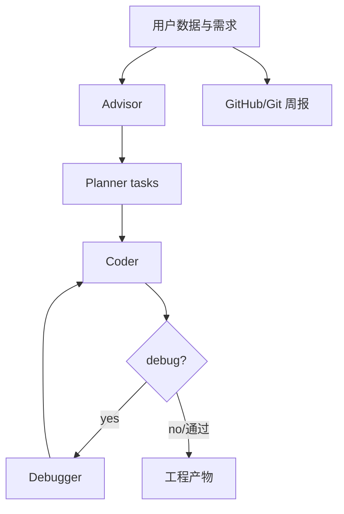

# MLSysOps/MLE-agent：面向机器学习工程的多 Agent 工作台

| 字段 | 值 |
|---|---|
| GitHub | https://github.com/MLSysOps/MLE-agent |
| License | MIT |
| Stars | 1572（2026-09-17 快照） |
| GitHub 最后 push | 2026-07-10 |
| 分析 commit | `a29287e8152456b8d6a09121934522fd2b4e0aa8` |
| 生命周期 | GitHub 候选冻结记录为未归档；固定提交用于本页源码分析 |
| 产品类型 | 机器学习工程 Agent |
| 分析证据 | 固定提交中的 README、许可证、配置与核心实现 |

本文用 📘 标注文档或源码中可直接定位的事实，🔶 标注由控制流推导的边界，💬 标注评价与借鉴建议。仓库动态元数据沿用候选清单，源码判断只绑定页面中的固定提交。

## 1. 它到底是什么

MLE-agent 将数据集/需求澄清、方案建议、任务规划、代码编写、调试、Kaggle 流程和工作周报放进一个可恢复的 CLI/Web 工作台。它更接近工程 companion，而不是论文知识库或科学实验管理系统。 本文把仓库作为一个公开源码快照来分析：README 的产品定位、命令和 benchmark 数字属于项目文档；代码路径用于确认控制流、数据结构和边界。没有把 stars、README 宣称的准确率、SOTA 或部署体验转换成独立结论。

源码中最值得关注的是：用户给出数据与需求后，advisor 澄清并产出高层报告，planner 生成 tasks，coder 按 task 写代码；若用户选择自动调试，debugger 检查 code_report 并让 coder 迭代。report 模式则汇总 GitHub 或本地 Git，再由 reporter 生成工作报告。 这决定了它应在 RH 产品地图中被看作“机器学习工程 Agent”，而不是泛化地称为自动科研系统。

## 2. 运行时堆叠

运行时可拆成以下层：

- **入口与配置**：由仓库提供的 CLI、脚本、Next.js/API 或配置文件接收任务和参数。
- **Agent/编排**：Python CLI 与 Rich/questionary 交互；mle.agents 提供 advisor、planner、coder、debugger、reporter 等角色；mle.workflow 组织 baseline、Kaggle 和 report；mle.function 负责命令执行、文件、搜索；mle.model 抽象多家模型；WorkflowCache 将阶段结果写进工作目录。
- **工具与环境**：工具调用连接搜索、文件、浏览器、向量库、解释器或沙箱；工具是否真的隔离取决于配置和外部服务。
- **状态与产物**：本项目保存的状态形式包括缓存、队列、日志、数据库、PaperNode、retrieval result、文件或 grade；它们不自动等同于 RH artifact。

这种分层让替换模型和工具变得容易，但也将“接口存在”和“证据可信”分开。源码可以证明一个函数会生成/保存某种对象，不能单凭存在证明对象内容正确。

## 3. 阶段机或 DAG

核心控制流如下。

用户给出数据与需求后，advisor 澄清并产出高层报告，planner 生成 tasks，coder 按 task 写代码；若用户选择自动调试，debugger 检查 code_report 并让 coder 迭代。report 模式则汇总 GitHub 或本地 Git，再由 reporter 生成工作报告。 阶段之间通常由消息、列表、队列、结构化对象或日志连接；是否能跨进程恢复，取决于具体实现，而不是 Mermaid 图本身。需要特别区分循环的两种含义：一种是有限的 max_depth/max_rounds/max_iter/max_steps 或 expand_layers；另一种是模型自主决定继续。源码中的上限能限制预算，但不能保证每次运行都走完所有阶段，也不能保证模型输出符合提示。

## 4. Tool / Skill / Agent 怎么切

该仓库的 Agent 边界是：主 Agent 接收任务并决定下一步；子 Agent/worker（若有）承担局部任务；tool 是可调用的搜索、抓取、文件、浏览器、代码或数据接口；skill（若有）主要是提示/能力包，不等于可审计的执行 artifact。具体来说，Python CLI 与 Rich/questionary 交互；mle.agents 提供 advisor、planner、coder、debugger、reporter 等角色；mle.workflow 组织 baseline、Kaggle 和 report；mle.function 负责命令执行、文件、搜索；mle.model 抽象多家模型；WorkflowCache 将阶段结果写进工作目录。

工具调用的返回通常被转成文本、结构化响应或日志，再回到模型上下文。优点是扩展快，缺点是不同工具的来源、版本、错误和副作用可能没有统一合同。对于 RH，接入时不应只映射函数名，还要记录输入、输出、外部资源、权限、失败原因和可复核句柄。

## 5. 文献怎么来、是否入库、引用约束

文献/来源链是：Arxiv、Papers with Code、GitHub 搜索和 Tavily web search；函数返回格式化文本或搜索结果，而不是论文对象。

这条链路能支持“找到或读取来源”，但通常不能直接支持 claim-level evidence。源码未显示统一的 DOI/版本/页码/span/主张/支持强度对象，也没有在最终文字生成前做逐句 entailment gate。若项目有 URL、reference、arxiv_id、PaperNode 或 RetrievalResult，它们仍主要是检索和展示元数据。

因此，报告中的来源约束应写成：系统会按提示或数据结构保留来源；不能写成“每条结论都已验证”。在 RH 中，建议将这些中间来源摄取为 paper/source，再显式链接 claim 和 evidence span。

## 6. 实验 / 代码执行

工程上，baseline/Kaggle 工作流可以调用本地命令执行器，但源码未定义实验 registry、随机种子、指标 schema 或 artifact lineage。README 的“自动完成 Kaggle”等是项目文档表述，不能当成本次实测。

**事实边界**：本次只读了公开仓库固定提交，没有安装依赖、配置 API key、下载模型/数据、启动外部服务或运行 benchmark。因而不能确认运行时性能、成本、并发稳定性、沙箱隔离、模型质量、检索召回或 README 中的结果。源码里的测试/评估函数可以说明“如何评”，不能说明“本次已评”。

若将它用于科研执行，还需要补齐数据版本、代码提交、环境镜像、资源上限、随机种子、指标定义、原始输出和失败记录，并把每次执行绑定到不可变 artifact。

## 7. 写稿怎么做

写作输出取决于项目类型：机器学习工程 Agent 的最终产物通常是 Markdown、报告字符串、聊天消息、结构化 Report、检索回答或 grade JSON。用户给出数据与需求后，advisor 澄清并产出高层报告，planner 生成 tasks，coder 按 task 写代码；若用户选择自动调试，debugger 检查 code_report 并让 coder 迭代。report 模式则汇总 GitHub 或本地 Git，再由 reporter 生成工作报告。

若有报告器，它往往把多个阶段的摘要合并为可读文本；引用可能是 URL、reference id、source 字段或 rubric 记录。这里没有看到 RH 意义上的章节草稿、参考文献数据库、claim/evidence 互证、LaTeX/PDF 编译和提交版本闸门。因此“能生成报告”不应被扩写成“能生成可投稿论文”。

## 8. 图怎么做

固定提交中的图能力应按数据来源区分。项目可能包含 README 架构图、UI 进度事件、流程 Mermaid、benchmark 绘图脚本或报告 Markdown，但这与从实验记录生成可发表定量图不同。MLE-agent 将数据集/需求澄清、方案建议、任务规划、代码编写、调试、Kaggle 流程和工作周报放进一个可恢复的 CLI/Web 工作台。它更接近工程 companion，而不是论文知识库或科学实验管理系统。

本报告不把仓库 README 的截图、曲线或分数表重绘成独立实验结果。若下游要出图，必须先声明数据源、统计单位、误差定义、样本量、面板与图注主张；对于架构图，则需把实际节点、权限边界和失败路径与源码对齐。

## 9. 和 RH 的相似点

1. 都把长任务拆成可恢复阶段：advisor → planner → coder → debugger。
2. 都把工作目录缓存（WorkflowCache）当成跨轮次状态，而不是只靠聊天上下文。
3. 都把模型提供方抽象出去，命令执行与文件操作走独立 function 层。

## 10. 和 RH 的不同点

RH 的权威对象是 topic/claim/evidence。MLE-agent 的权威对象是工程 tasks、code_report 和 Git 周报。Arxiv / Papers with Code / Tavily 返回的是格式化文本，不是论文对象；Kaggle 工作流没有实验 registry、随机种子或指标 lineage。reporter 产出工作报告，不是带引用闸的稿件。

## 11. 优点 / 缺点

**优点**

- advisor/planner/coder/debugger 角色文件分开，调试循环有显式开关。
- WorkflowCache 把阶段结果写进工作目录，便于人工接着改。
- baseline 与 Kaggle 两条 workflow 让工程任务和竞赛任务分开。

**缺点**

- 搜索结果停留在文本，没有 DOI/span。
- 本地命令执行器不等于受控实验环境。
- README 的“自动完成 Kaggle”未被本次复现。

💬 对照价值在“工程 companion 怎么缓存阶段”，不在科研生产全链。

## 12. RH 可学的 1–3 条

1. **把 debugger 做成可选闭环，而不是默认无限改代码。** 用户选择自动调试才进入 code_report 迭代。
2. **报告模式与编码模式分入口。** Git 周报不应混进训练循环。
3. **阶段结果落盘再交给下一角色。** 比只在对话里传摘要更可恢复。

## 13. 名字速查表

| 名字 | 先决概念 | 含义 |
|---|---|---|
| advisor / planner / coder / debugger | mle.agents | 工程角色 |
| WorkflowCache | 工作目录 | 阶段结果缓存 |
| mle.workflow | 编排 | baseline / Kaggle / report |
| code_report | 调试输入 | debugger 检查对象 |
| reporter | 报告角色 | GitHub/本地 Git 周报 |

> 📌事实边界：本页绑定固定提交 `a29287e8152456b8d6a09121934522fd2b4e0aa8`，候选元数据与 GitHub 快照日期为 2026-09-17。架构描述来自该提交中实际查看的 README、许可证与核心实现；README 的 Kaggle/SOTA 表述未被本次独立复现。未调用模型、搜索服务或运行竞赛。
