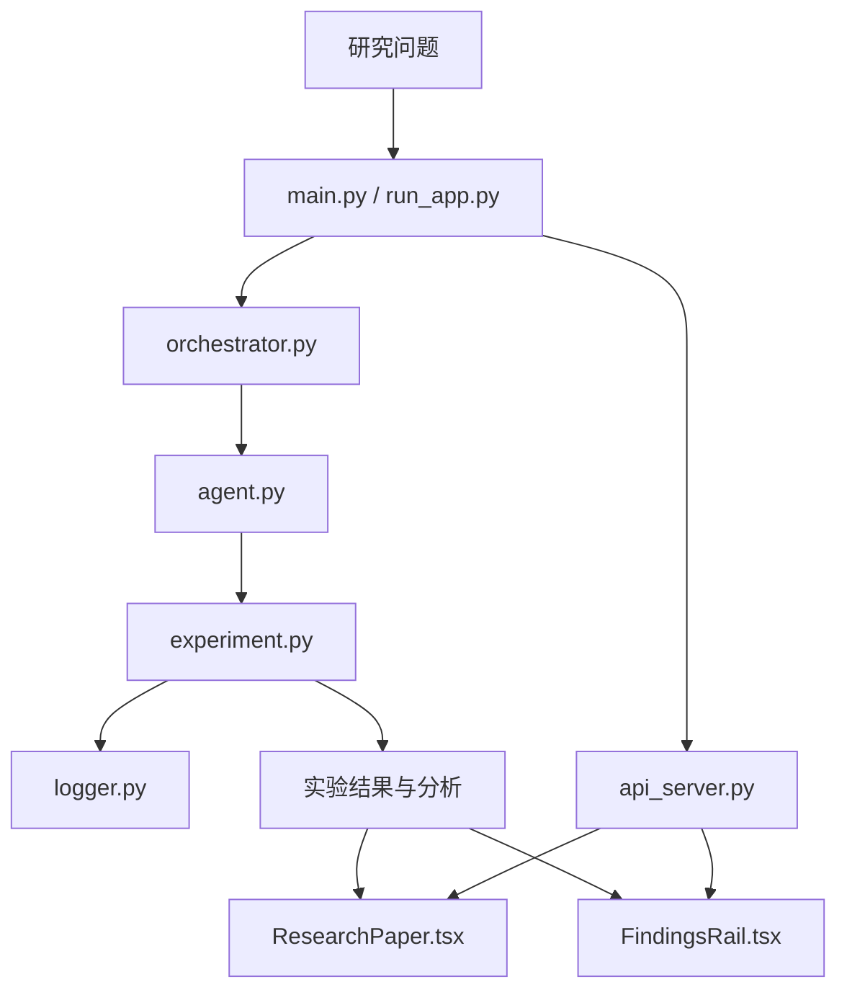

本文用 📘 标注文档或源码中可直接定位的事实，🔶 标注由控制流推导的边界，💬 标注评价与借鉴建议。仓库动态元数据沿用候选清单，源码判断只绑定页面中的固定提交。

## 1. 它到底是什么

`mshumer/autonomous-researcher` 是一个面向“自主机器学习研究”的研究代理项目。固定快照中的候选说明把它概括为：将研究目标拆成可执行实验，由 Agent 执行、分析并形成论文式研究报告。这个定位很重要：它不是只回答一个问题的聊天界面，也不是单独的训练脚本，而是试图把“提出问题—做实验—解释结果—写成研究报告”串成一条可重复调用的应用流程。

本次固定源对应的仓库是 `mshumer/autonomous-researcher`，默认分支为 `main`，分析提交为 `6006b2cb5ceda8d5c066e4136c99269addf21f22`，快照日期为 2026-09-17，记录许可证为 MIT。候选元数据记录该快照约有 820 个 stars，最近推送日期为 2025-11-24；这些是快照属性，不应被理解成当前实时状态。证据清单包含 README、许可证、依赖声明、Python 入口与编排代码，以及用于展示研究报告和发现的前端组件。因此，对它最准确的称呼是“带有实验编排和研究结果呈现界面的自主研究原型”，而不是已经通过大规模基准验证的通用科学家。

它的核心价值主张是把研究工作拆成机器可以继续推进的中间产物。研究目标先变成实验计划，再由执行角色产生结果，分析角色把结果组织成发现，最后以论文式结构呈现。这种闭环让输出不止是一段自然语言答案，也让代码执行和结果解释在概念上相互连接。

## 2. 运行时堆叠

从固定源文件名可以确认的运行时层次大致如下。`requirements.txt` 是 Python 依赖入口；`main.py` 是核心启动或主流程入口；`run_app.py` 提供应用运行层；`orchestrator.py` 负责把研究阶段串联起来；`agent.py` 承担研究代理角色；`experiment.py` 对应实验执行或实验记录；`logger.py` 负责日志；`api_server.py` 暴露服务边界。前端证据中的 `frontend/src/components/Notebook/ResearchPaper.tsx` 和 `frontend/src/components/FindingsRail.tsx` 则分别对应论文式研究笔记视图和发现侧栏。

因此可以把堆叠分成四层：第一层是 Python 进程与依赖，第二层是 Agent、编排器、实验和日志这些业务模块，第三层是 API 服务，第四层是前端展示。API 与前端不是研究逻辑本身，而是把状态、发现和论文式产物交给人查看。文件命名还表明，项目把“执行”和“呈现”分开：实验代码不等于研究报告组件，日志也不等于发现列表。

图中的连线是根据固定源的模块职责作出的结构化阅读，不是一次实际启动后的调用追踪。固定源没有给出可据此确认的部署拓扑、持久化数据库或云服务清单；所以“API 服务”只能表示仓库存在 `api_server.py` 这一服务入口，不能延伸为某个特定托管平台或生产级服务承诺。

## 3. 阶段机或 DAG

它更像一个由编排器驱动的有向流程，而不是单一函数调用。最小可读阶段可以写成：研究目标进入编排器，编排器交给 Agent 形成可执行任务，实验模块运行任务并产生观测，分析把观测转成发现，最后把发现写入论文式视图。某些任务可能需要回到实验阶段重跑或补充对照，因此逻辑上存在循环；前端则是读取结果的旁路，不应被当成科学推理阶段。

如果用阶段机表达，`planned` 表示目标已经被拆解，`running` 表示 Agent 或实验正在处理，`observed` 表示有了实验输出，`interpreted` 表示输出被整理为发现，`reported` 表示已经进入论文式呈现。`logger.py` 的存在说明状态变化和执行过程至少有日志记录的设计位置。固定证据没有证明这些状态一定以同名枚举、数据库行或事件表实现，所以这里使用的是工作流语义，而不是声称源码中存在某个未见的状态类型。

DAG 视角下，实验可以有多个分支：不同数据、方法、参数或假设分别产生结果，然后汇聚到分析与写作；若分析发现结果不足，编排器可以再次调度实验。这种结构比“Agent 一次生成一篇文章”更适合研究，因为每个发现都应能回指实验输出。它的上限取决于编排器是否保存任务输入、代码版本、日志和结果之间的关系；仅凭文件清单无法确认该关系是否已经做到可审计。

## 4. Tool / Skill / Agent 怎么切

在这个项目里，Agent 是承担研究角色的执行单元，`agent.py` 是这个角色的代码边界；Orchestrator 是控制流，`orchestrator.py` 决定何时调用哪个阶段；Experiment 是可以产生观测的工具性单元，`experiment.py` 负责把研究想法落到可执行任务；Logger 则保存过程线索。也就是说，Agent 不应独占所有能力，编排器也不应代替实验模块保存科学结果。

“Tool”和“Skill”需要区分。Tool 是一次具体动作，例如运行一个实验、读取一个结果或调用一个 API；Skill 是一组可复用的研究动作和约束，例如把问题转成实验、比较结果、生成论文式摘要。固定源清单能够确认 Agent、编排器和实验这些代码边界，但没有列出一个独立的 Skill 注册表或可枚举的工具协议。因此更稳妥的读法是：Skill 主要体现为 Agent 可执行的研究流程，Tool 主要体现为实验、日志和服务接口，而不是把不存在的插件市场或标准 MCP 工具表写进项目。

这种切分的优点是职责清晰：Agent 负责决策，Tool 负责动作，Orchestrator 负责顺序和重试，前端负责可见性。缺点是若所有决策仍由一个 Agent 以长提示完成，阶段边界就只是文件边界，无法自动形成可靠的证据链。真正成熟的切分应让每个工具返回结构化输入、输出、错误和来源，让编排器能够判断“重试实验”还是“停止并报告不足”。

## 5. 文献怎么来、是否入库、引用约束

固定证据文件清单包含 README、代码、依赖和前端组件，但没有单独列出的文献索引、论文数据库模型、引用校验脚本或文献入库迁移文件。因此可以确认它把研究报告作为产品输出的一部分，但不能仅凭这些文件确认某个具体文献供应商、检索 API、全文下载策略或 DOI 去重规则。报告中的“文献”应与“实验发现”分开：一个 Agent 可能会在研究过程中检索资料，但检索到的文本是否持久化、是否带来源、是否能在下次运行复用，需要源码或运行记录进一步证明。

从研究工作流角度，可靠的文献路径应至少包括：问题关键词、检索动作、候选来源、筛选理由、抽取的主张、原文定位和最终引用。若只把文献内容塞进提示词而不入库，下一次运行无法复核；若入库却没有来源和版本，也不能说明引用约束已经满足。这个项目的固定表面没有提供足够证据证明已经有上述完整链路，所以不能把“自动研究报告”直接等同于“经过文献证据闸门的综述”。

引用约束至少应回答三个问题：每个外部主张是否有可追溯来源；实验结论是否引用自己的观测而不是只引用背景论文；报告中的参考文献是否与正文主张一一对应。固定源清单没有显示独立的 citation-trace 或 evidence-link 层，因而使用者应把引用完整性视为需要人工检查的边界，而不是默认能力。若将它用于严肃研究，最小增强是给每条文献和每个主张分配稳定 ID，并把检索时间、版本、页码或段落位置和最终句子绑定起来。

## 6. 实验 / 代码执行

`experiment.py` 是固定证据中最直接的实验边界，说明项目不是只生成研究计划，而是预留了执行实验和收集结果的模块；`logger.py` 则为记录执行过程提供了对应位置。结合候选说明“由 Agent 执行、分析并形成论文式研究报告”，其预期闭环是：Agent 选择或生成实验任务，实验模块运行代码，日志记录过程，分析模块从结果中提炼发现，报告组件展示发现。

这里必须区分“代码中有实验入口”和“本次确实得到实验结果”。固定源只记录了文件名、提交和元数据，没有本轮执行日志、数据集结果、随机种子、运行时长、硬件信息或基准表。因此本报告不把任何数字、准确率、速度、胜负或可复现性结论归给该项目。实验代码如果要成为研究证据，还需要保存输入数据版本、环境锁定文件、命令、标准输出、错误输出、产物哈希以及失败重试记录；否则 Agent 的自然语言解释可能超过实际观测支持的范围。

从工程上看，实验模块与编排器分离是合理的：编排器可以管理任务，实验模块可以集中处理执行，日志可以记录跨阶段上下文。真正的风险是执行权限和资源边界。如果没有超时、资源上限、文件隔离和失败状态，自动研究流程可能把一个错误实验误判为“没有发现”，或者无限重试。因此使用它时应先把实验当作不可信任务处理，再让 Agent 读取结构化结果，而不是让 Agent 直接凭屏幕文本判断成败。

## 7. 写稿怎么做

前端路径 `frontend/src/components/Notebook/ResearchPaper.tsx` 是最明确的写作证据：项目提供了论文式的研究报告展示组件，而不是只显示一串聊天消息。`FindingsRail.tsx` 则暗示发现可以被单独列出、浏览或作为报告写作的侧边信息。结合 Agent、编排器和实验模块，写稿流程可理解为先把实验结果变成结构化发现，再将发现组织成研究问题、方法、结果和解释等论文式段落。

这种写法的关键不是让模型一次生成完整长文，而是先保留中间层。每个发现应包含它来自哪个实验、支持或不支持什么主张、证据是什么、有没有不确定性；写作组件再负责把这些发现编排成读者可读的叙述。这样可以把“写得像论文”和“确实有证据”分开检查。

固定源没有列出独立的 LaTeX 导出器、期刊模板、引文编译器或终稿质量门，因此不能声称它已经解决投稿格式、参考文献编译、图表编号、补充材料和版本冻结。更准确的说法是，它有论文式的产品界面和报告生成方向。若用于正式稿件，应在该界面之外增加来源审计、主张—证据映射、数字一致性检查和版本化导出。

## 8. 图怎么做

固定证据清单没有单独的 figure generator、图表规划器、绘图脚本或图像资产目录；因此目前能够确认的是实验结果和发现可以被报告界面呈现，不能确认项目已经提供一套独立、可复现、带数据来源的科研制图管线。`ResearchPaper.tsx` 可能承载论文内容，`FindingsRail.tsx` 可能承载发现摘要，但这两个路径本身不足以证明存在某种特定图表库或自动生成图片服务。

如果要从该架构自然地补出制图流程，应该让实验输出先形成结构化表格，再由图表步骤读取表格并写入图注、数据来源、统计口径和版本信息。图不应由 Agent 直接凭文字“想象”出结果；定量图的每个点、误差条、颜色和排序都应能回指实验记录。概念架构图则应明确标注为示意图，不能和观测结果混在一起。

因此，项目的图能力应评价为“报告展示层已有位置，独立科研图证据尚待确认”。在没有真实实验记录和图表资产的情况下，本报告只使用 Mermaid 表达模块关系，不把它当作该仓库生成的论文图，也不从它推导任何性能结论。

## 9. 和 RH 的相似点

第一，两者都把研究拆成一条有阶段边界的流水线，而不是把研究等价为一次聊天回答。目标、实验、分析和写作之间存在职责分工，这为失败定位和重跑提供了基础。

第二，两者都强调 Agent 不是唯一层。Agent 需要调用实验或其他工具，编排器需要管理顺序，日志需要保留过程，最终产物需要让人检查。这种“决策—动作—记录—呈现”的结构与 RH 的研究执行、证据和写作链条具有明显同构性。

第三，两者都把研究报告视为过程产物，而不只是最终字符串。该项目用论文式组件和发现侧栏呈现中间结果；RH 则进一步把主题、论文、主张、证据、实验和版本组织成可追踪产物。共同点在于：研究质量取决于中间状态是否可见、可复核、可继续，而不是只看最后一页文字。

## 10. 和 RH 的不同点

最主要的不同是持久化和治理深度。固定源展示的是一个以 Python 应用、API 和前端为中心的自主研究项目；RH 的重点是有明确主题状态、文献池、知识快照、证据链接、阶段闸门和最终版本的研究治理系统。前者更像把自主研究循环跑起来，后者更强调每一步能否作为可审计的研究资产被恢复和提交。

第二，证据边界不同。该项目的固定清单没有显示独立的文献入库、主张抽取、证据链接、引用配额或版本提交机制；RH 把这些约束显式化，并能把失败原因归到检索、证据、实验、写作或发布阶段。两者不是“一个有 Agent、一个没有 Agent”的差异，而是“Agent 的输出有没有进入受约束的研究资产链”的差异。

第三，交付目标不同。该项目突出自主实验和论文式界面，适合快速探索；RH 还覆盖审查、质量门、图表契约、稿件打包和版本谱系，目标更接近可复核交付。该项目的简洁性带来较低上手成本，但也意味着使用者需要自行补足来源、审计和发布约束。

## 11. 优点 / 缺点

优点包括：一是问题定义直接，围绕“拆目标、跑实验、做分析、写报告”形成端到端叙事；二是模块命名清楚，Agent、编排器、实验、日志、API 和前端各有明显入口，便于理解和扩展；三是研究发现有独立的 UI 位置，不必把所有过程压缩成一段最终答案；四是 MIT 许可证和公开仓库形态降低了阅读和二次开发门槛；五是把实验执行放进研究流程，理论上比只做文献问答更接近经验性研究。

缺点包括：一是固定证据没有证明文献检索和引用可审计，报告可能有研究腔调却缺少主张—来源绑定；二是没有从固定清单确认持久化实验谱系、数据版本、随机种子和环境锁定，复现程度不能预设；三是没有确认独立的图表和终稿质量管线，论文式 UI 不等于出版级稿件；四是 Agent、编排器和实验之间若只有松散约定，错误结果可能被解释成有效发现；五是自动执行会带来权限、资源、超时和失败重试问题；六是本次没有实际启动项目，所以不能用“能运行”替代源码证据。

## 12. RH 可学的 1–3 条

1. **把发现做成一等界面对象。** `FindingsRail.tsx` 所代表的侧栏思路值得吸收：发现不应埋在长日志或最终稿里，而应单独显示来源实验、支持程度、待核查项和与正文的关系。这样人可以先审发现，再审文章。

2. **保持研究循环的短路径。** Agent、Orchestrator、Experiment、Logger 这些边界足够直观，说明自主研究原型可以用少量核心模块先跑通闭环。RH 在保留证据闸门的同时，可以继续提供轻量的探索路径，避免每个小问题都必须经过同样厚重的发布流程。

3. **让论文式呈现尽早介入。** `ResearchPaper.tsx` 体现了结果结构从早期就面向读者，而不是最后才把原始记录拼成文章。RH 可以在实验和证据阶段同步维护可读的章节骨架，并让每个段落显示其证据缺口；这样写作不是脱离研究资产的末端加工。

## 13. 名字速查表

| 名称 | 在固定源中的可确认角色 | 读者应如何理解 |
|---|---|---|
| `mshumer/autonomous-researcher` | GitHub 仓库与项目标识 | 自主机器学习研究原型 |
| `main.py` | Python 主入口文件 | 研究应用的核心启动边界 |
| `run_app.py` | 应用运行入口文件 | 把项目作为应用启动的包装边界 |
| `agent.py` | Agent 代码文件 | 承担研究决策或任务执行角色 |
| `orchestrator.py` | 编排代码文件 | 连接阶段、任务和执行顺序 |
| `experiment.py` | 实验代码文件 | 承担实验执行或结果产生边界 |
| `logger.py` | 日志代码文件 | 记录运行过程与调试信息 |
| `api_server.py` | API 服务文件 | 对外提供应用状态或功能入口 |
| `ResearchPaper.tsx` | 前端论文式展示组件 | 将研究结果组织成可读报告 |
| `FindingsRail.tsx` | 前端发现侧栏组件 | 集中查看研究发现与线索 |
| `requirements.txt` | Python 依赖声明 | 记录运行所需的软件依赖入口 |
| `README.md` | 项目说明证据 | 解释项目用途与使用表面 |
| `MIT` | 固定元数据中的许可证 | 公开使用和修改的许可边界 |
| analyzed commit | `6006b2cb5ceda8d5c066e4136c99269addf21f22` | 本报告对应的代码快照锚点 |
| snapshot date | `2026-09-17` | 本次固定事实的时间边界 |

> 📌事实边界：本报告只依据固定快照元数据、候选说明以及列出的公开证据文件路径进行分析；未据此推断未被证实的供应商、数据库、部署平台或性能数字。本次没有运行依赖、服务、模型、GPU 或基准测试；dependencies/services/models/GPU/benchmarks were not run。
