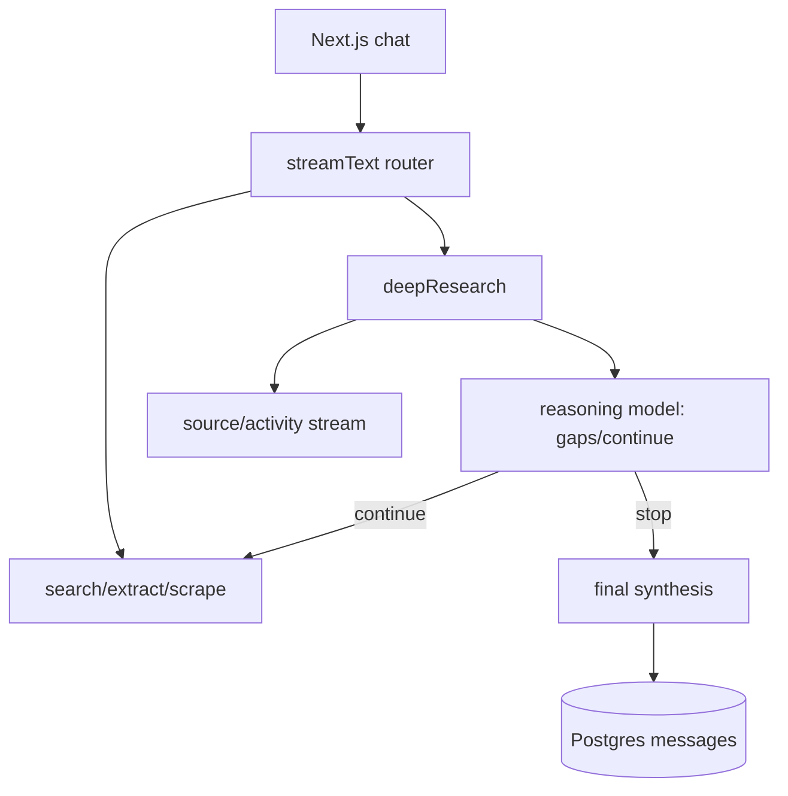

# nickscamara/open-deep-research：服务化 Web UI 深度研究应用

| 字段 | 值 |
|---|---|
| GitHub | https://github.com/nickscamara/open-deep-research |
| License | 根 `LICENSE` 为 Apache-2.0；GitHub API 仍为 NOASSERTION |
| Stars | 6282（2026-09-17 快照） |
| GitHub 最后 push | 2025-05-07 |
| 分析 commit | `eea0962c8be343230d9571cbdeb82df12504ad72` |
| 生命周期 | GitHub 候选冻结记录为未归档；固定提交用于本页源码分析 |
| 产品类型 | Next.js 深度研究应用 |
| 分析证据 | 固定提交中的 README、许可证、配置与核心实现 |

本文用 📘 标注文档或源码中可直接定位的事实，🔶 标注由控制流推导的边界，💬 标注评价与借鉴建议。仓库动态元数据沿用候选清单，源码判断只绑定页面中的固定提交。

## 1. 它到底是什么

该仓库是基于 Vercel AI Chatbot 的 Next.js 应用，将 Firecrawl search/extract/scrape 封装成工具，并在 experimental_deepResearch 开关下运行多轮搜索—抽取—分析—综合循环。它还提供认证、Postgres 聊天持久化、Blob 文件和文档 blocks。 本文把仓库作为一个公开源码快照来分析：README 的产品定位、命令和 benchmark 数字属于项目文档；代码路径用于确认控制流、数据结构和边界。没有把 stars、README 宣称的准确率、SOTA 或部署体验转换成独立结论。

源码中最值得关注的是：POST 先认证或创建匿名 session，再校验用户、限流、选择 model/reasoning model、保存用户消息；streamText 启用 search/extract/scrape，实验开关还启用 deepResearch。deepResearch 在最多 maxDepth 的时间窗内搜索，抽取 top URLs，调用 reasoning model 判断 gaps/shouldContinue，失败三次停止，最终生成长分析并把 assistant 消息写回数据库。 这决定了它应在 RH 产品地图中被看作“Next.js 深度研究应用”，而不是泛化地称为自动科研系统。

## 2. 运行时堆叠

运行时可拆成以下层：

- **入口与配置**：由仓库提供的 CLI、脚本、Next.js/API 或配置文件接收任务和参数。
- **Agent/编排**：Next.js App Router、AI SDK streamText/createDataStreamResponse、FirecrawlApp、Zod tool schema；Drizzle/Postgres 表保存 User/Chat/Message/Vote/Document/Suggestion；NextAuth 负责会话；Upstash rate limiter 限流；前端通过 data stream 接收 source/activity/depth/finish 事件。
- **工具与环境**：工具调用连接搜索、文件、浏览器、向量库、解释器或沙箱；工具是否真的隔离取决于配置和外部服务。
- **状态与产物**：本项目保存的状态形式包括缓存、队列、日志、数据库、PaperNode、retrieval result、文件或 grade；它们不自动等同于 RH artifact。

这种分层让替换模型和工具变得容易，但也将“接口存在”和“证据可信”分开。源码可以证明一个函数会生成/保存某种对象，不能单凭存在证明对象内容正确。

## 3. 阶段机或 DAG

核心控制流如下。

POST 先认证或创建匿名 session，再校验用户、限流、选择 model/reasoning model、保存用户消息；streamText 启用 search/extract/scrape，实验开关还启用 deepResearch。deepResearch 在最多 maxDepth 的时间窗内搜索，抽取 top URLs，调用 reasoning model 判断 gaps/shouldContinue，失败三次停止，最终生成长分析并把 assistant 消息写回数据库。 阶段之间通常由消息、列表、队列、结构化对象或日志连接；是否能跨进程恢复，取决于具体实现，而不是 Mermaid 图本身。需要特别区分循环的两种含义：一种是有限的 max_depth/max_rounds/max_iter/max_steps 或 expand_layers；另一种是模型自主决定继续。源码中的上限能限制预算，但不能保证每次运行都走完所有阶段，也不能保证模型输出符合提示。

## 4. Tool / Skill / Agent 怎么切

该仓库的 Agent 边界是：主 Agent 接收任务并决定下一步；子 Agent/worker（若有）承担局部任务；tool 是可调用的搜索、抓取、文件、浏览器、代码或数据接口；skill（若有）主要是提示/能力包，不等于可审计的执行 artifact。具体来说，Next.js App Router、AI SDK streamText/createDataStreamResponse、FirecrawlApp、Zod tool schema；Drizzle/Postgres 表保存 User/Chat/Message/Vote/Document/Suggestion；NextAuth 负责会话；Upstash rate limiter 限流；前端通过 data stream 接收 source/activity/depth/finish 事件。

工具调用的返回通常被转成文本、结构化响应或日志，再回到模型上下文。优点是扩展快，缺点是不同工具的来源、版本、错误和副作用可能没有统一合同。对于 RH，接入时不应只映射函数名，还要记录输入、输出、外部资源、权限、失败原因和可复核句柄。

## 5. 文献怎么来、是否入库、引用约束

文献/来源链是：Firecrawl 返回网页搜索、结构化抽取和 markdown scrape；结果以 findings(text,source)、summaries 和 data-stream source 事件存在。没有学术论文 schema、claim/span 证据图或引用 entailment gate。

这条链路能支持“找到或读取来源”，但通常不能直接支持 claim-level evidence。源码未显示统一的 DOI/版本/页码/span/主张/支持强度对象，也没有在最终文字生成前做逐句 entailment gate。若项目有 URL、reference、arxiv_id、PaperNode 或 RetrievalResult，它们仍主要是检索和展示元数据。

因此，报告中的来源约束应写成：系统会按提示或数据结构保留来源；不能写成“每条结论都已验证”。在 RH 中，建议将这些中间来源摄取为 paper/source，再显式链接 claim 和 evidence span。

## 6. 实验 / 代码执行

工程上，应用可调用网络与模型，且 README 提供 Vercel/数据库配置；这只是产品运行路径，不是科学实验环境。源码设置默认五分钟函数时长和 4.5 分钟研究时间预算，但本次未部署、未调用模型或 Firecrawl。

**事实边界**：本次只读了公开仓库固定提交，没有安装依赖、配置 API key、下载模型/数据、启动外部服务或运行 benchmark。因而不能确认运行时性能、成本、并发稳定性、沙箱隔离、模型质量、检索召回或 README 中的结果。源码里的测试/评估函数可以说明“如何评”，不能说明“本次已评”。

若将它用于科研执行，还需要补齐数据版本、代码提交、环境镜像、资源上限、随机种子、指标定义、原始输出和失败记录，并把每次执行绑定到不可变 artifact。

## 7. 写稿怎么做

写作输出取决于项目类型：Next.js 深度研究应用 的最终产物通常是 Markdown、报告字符串、聊天消息、结构化 Report、检索回答或 grade JSON。POST 先认证或创建匿名 session，再校验用户、限流、选择 model/reasoning model、保存用户消息；streamText 启用 search/extract/scrape，实验开关还启用 deepResearch。deepResearch 在最多 maxDepth 的时间窗内搜索，抽取 top URLs，调用 reasoning model 判断 gaps/shouldContinue，失败三次停止，最终生成长分析并把 assistant 消息写回数据库。

若有报告器，它往往把多个阶段的摘要合并为可读文本；引用可能是 URL、reference id、source 字段或 rubric 记录。这里没有看到 RH 意义上的章节草稿、参考文献数据库、claim/evidence 互证、LaTeX/PDF 编译和提交版本闸门。因此“能生成报告”不应被扩写成“能生成可投稿论文”。

## 8. 图怎么做

固定提交中的图能力应按数据来源区分。项目可能包含 README 架构图、UI 进度事件、流程 Mermaid、benchmark 绘图脚本或报告 Markdown，但这与从实验记录生成可发表定量图不同。该仓库是基于 Vercel AI Chatbot 的 Next.js 应用，将 Firecrawl search/extract/scrape 封装成工具，并在 experimental_deepResearch 开关下运行多轮搜索—抽取—分析—综合循环。它还提供认证、Postgres 聊天持久化、Blob 文件和文档 blocks。

本报告不把仓库 README 的截图、曲线或分数表重绘成独立实验结果。若下游要出图，必须先声明数据源、统计单位、误差定义、样本量、面板与图注主张；对于架构图，则需把实际节点、权限边界和失败路径与源码对齐。

## 9. 和 RH 的相似点

1. 都把多轮研究做成有上限的循环：maxDepth + 失败三次停止。
2. 都把来源事件流式传给前端（source/activity/depth），而不是只在结束时丢一篇长文。
3. 都把会话写入数据库（Postgres messages），便于回看。

## 10. 和 RH 的不同点

RH 存的是 claim/evidence。这里存的是 Chat/Message/Vote/Document。Firecrawl 的 search/extract/scrape 产出 findings(text,source)；reasoning model 判断 gaps/shouldContinue。没有学术论文 schema，没有实验环境。默认约五分钟函数时长、4.5 分钟研究预算，是产品超时，不是科学预算。

## 11. 优点 / 缺点

**优点**

- Next.js + AI SDK 把认证、限流、流式事件一次接好。
- experimental_deepResearch 开关让深研路径可关。
- gaps/shouldContinue 把“要不要再搜”做成结构化判断。

**缺点**

- 网页 findings 不是 DOI/span。
- 聊天持久化不是证据库。
- 未部署，Vercel/Firecrawl 路径未测。

💬 对照价值在产品化深研循环，不在投稿生产。

## 12. RH 可学的 1–3 条

1. **把 shouldContinue 和 gaps 做成模型结构化输出，并用失败计数硬停。**
2. **深研作为实验开关，默认聊天路径保持轻。**
3. **source/activity 事件与最终长分析分开推送。** 用户能看见正在搜什么。

## 13. 名字速查表

| 名字 | 先决概念 | 含义 |
|---|---|---|
| streamText | AI SDK | 路由 search/extract/scrape |
| deepResearch | 实验路径 | maxDepth 循环 |
| gaps / shouldContinue | 反思 | 是否再搜 |
| findings(text,source) | 网页证据 | Firecrawl 抽取 |
| Postgres Message | 持久化 | 聊天记录 |

> 📌事实边界：本页绑定固定提交 `eea0962c8be343230d9571cbdeb82df12504ad72`，快照日期 2026-09-17。未部署 Next.js，未调用 Firecrawl 或模型，未验证限流与认证。
