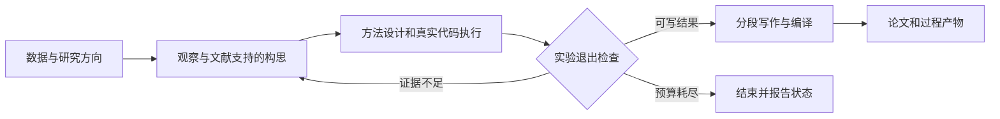

# OmniScientist：多模态数据、执行记录与论文装配

> 固定快照：[Omni-Scientist/OmniScientist](https://github.com/Omni-Scientist/OmniScientist/tree/fb0164a1c4ff739b57f230cbc0b9a68796a45e1f)；commit `fb0164a1c4ff739b57f230cbc0b9a68796a45e1f`；snapshot `2026-09-17`；候选许可证元数据 `MIT`；审阅状态 `draft`。

## 1. 它到底是什么

📘 `Omni-Scientist/OmniScientist` 是一个从本地研究数据出发的多模态科学分析与写作项目。固定 README 描述输入图像、信号、音频、视频、点云、轨迹和表格，经过观察、假设、分析代码、结果与参考文献，交付论文 PDF。产品入口有桌面应用和宿主技能；README 明确独立终端发行版在 0.2.1 停止分发，`cli/` 仍作为桌面内嵌代理引擎存在。不能因为候选分类提到终端助手，就把该快照描述成仍主推独立 CLI。

需要与另一仓库 `tsinghua-fib-lab/OmniScientist` 分开识别：名称相同并不意味着代码、论文或能力可以互相归属。本仓库实际有 Python 参考引擎、桌面与技能实现；本文讨论的是这些文件中的机制。README 的跨模态示例与论文数字属于作者提供的演示证据，既不是本次产生的研究结果，也不能直接表示跨领域科学可靠性。

## 2. 运行时堆叠

桌面和 CLI 侧的构建说明使用 Bun 与 TypeScript；分析工具与参考引擎使用 Python，论文编译调用 tectonic。运行结构是“推理主模型＋感知侧车＋本地工具”：主模型提出问题、规划分析、写文；需要像素理解时，感知模型接收图像并返回观察；Python 负责数据读取、数学计算、图形渲染和执行记录。模型名称、供应商与价格表都是快照配置，不能当成当前服务可用性承诺。

`engine/omniscientist/evidence.py` 将材料分成感知、结构化、符号和过程证据四类。表格可直接读列和统计量，信号可调用原生数值分析，也可渲染后交给视觉模型；分子和公式分别提供 RDKit、SymPy 方向的专用工具。这比“所有数据先转成一张图”更细致。不过具体解码支持仍有限，例如音频函数实际使用 WAV 读取器；列出一种扩展名不等于所有该格式变体已经跑通。

## 3. 阶段机或 DAG

关键控制流在 `agentic.py`，不是把 README 的叙事机械翻译成六个代码状态。该文件公开三段主阶段：`stage1_ideation`、`stage2_experiment`、`stage3_writeup`。`run_pipeline` 读取阶段产物，由 `_route` 决定推进、回退、终止；实验出现 null、infeasible 或 insufficient 时回到构思，失败题目写入避免重复的记录，超过回退预算结束。

这是一张静态源码概括图，不是本次实际执行轨迹。还要注意 `done` 并不严格等价于 PDF 已成功编译：运行器会返回正文产物，同时单独打印 PDF 是否得到确认。消费端需要继续检查产物字段，而不是只看状态名称。

## 4. Tool / Skill / Agent 怎么切

Agent 承担开放判断，工具承担具体动作。参考引擎工具包括 inspect_data、run_python、finalize_results，以及 evidence 模块按材料开放的 look_at、analyze、read、check_math 等函数；工具模式和执行分派明确分离。Skill 则把宿主如何调用这些动作、保留什么记录、何时可以交付写成操作合同。

`cli/skills/omnisci/SKILL.md` 要求录制分析、生成书目、编译分别经过专门工具协议，以便获得和当前文件绑定的会话收据；同名 Python 命令经普通 shell 运行不自动满足交付要求。该规则很有价值，但它属于宿主技能路径。参考引擎的 `_exp_done` 使用自己的检查逻辑，不能把一条路径的严格保证无条件推广到另一条路径。

## 5. 文献怎么来、是否入库、引用约束

`paper.py` 中 `gather_citations` 先请模型给出多个查询，再访问 OpenAlex，失败时尝试 Crossref；以领域锚词筛掉明显离题候选，去除标题重复，再生成引用键与 BibTeX。这是围绕单个研究任务的文献目录与写作材料，不是已确认的跨项目永久论文数据库。

宿主技能要求候选具备 DOI，并在生成书目时重新解析和保存绑定哈希的来源记录；参考引擎已读的 `_openalex`、`_crossref` 则主要取标题、作者、年份和期刊字段，`_bib_entry` 并未在该实现中写 DOI 字段。因此 README 所称每条引用解析至 DOI，不能直接当成所有入口共享的代码不变量。`_filter_cites` 还会去掉不在目录中的键，这是避免坏引用键的保护，却不能证明剩余引用支持所在句子的科学含义。

## 6. 实验 / 代码执行

参考引擎 `_run_python` 用当前解释器启动子进程，在任务目录执行生成代码并收集 stdout、stderr，默认超时 150 秒；它不是仅凭模型口述结果。实验工具累计成功运行输出、是否出现读取数据的代码模式、关键数字与分析条目，再检查方法、独立性说明、统计测试和 lead analysis。

🔶 实际数值门槛比“每个数均有来源”的口号弱。`_exp_done` 要求关键数中至少约六成能在累积 stdout 字符串中出现，结果陈述还有另一覆盖阈值；数据加载检查也是代码文本启发式。数字出现不验证变量、单位、数据切分和因果含义，也不能排除脚本打印常量。执行子进程有时间限制，不等于经过系统级隔离；本次没有运行任何生成代码、下载数据或接入模型。

## 7. 写稿怎么做

参考引擎提供分段写作、领域结构、引用集合、图表插入和编译处理。宿主技能以 `sections.json` 和写作合同约束章节顺序、段落职责、引用范围及字数；`paper.py` 同时包含 ICLR、RNAAS、AASTeX 模板方向和文本清洗函数。论文、执行记录和图像在产品界面并列，便于人回查。

值得警惕的是参考引擎的结果筛选政策：`finalize_results` 和 `_exp_done` 明确让若干弱分析进入 demoted，并排除出正文、留在过程轨迹。对于预注册或需要完整报告负结果的研究，这可能造成选择性报告风险。论文外的日志保留与论文内的科学披露是两个义务。这个观察来自控制流与提示字段，而不是对作者示例论文的逐篇审稿结论。

## 8. 图怎么做

evidence 层通过 matplotlib 把真实波形、频谱、体素切片、点云投影或数据表样例变成可查看图像；这部分是观察原始材料。分析阶段另保存结果图，源码中的图契约检查寻找矢量副本与可重跑绘图脚本；宿主技能要求查看输出是否空白、裁切、误标或标签碰撞。

“能够生成图”和“图已通过视觉验收”需要分开。技能中 compile 的红项被描述为验收报告，部分只是提示，不阻止 PDF 留在磁盘；文件存在和向量格式也不证明图表统计口径正确。本文 Mermaid 只说明软件阶段，没有复用示例论文图，也未调用图像生成服务。

## 9. 和 RH 的相似点

两者都强调把研究拆成有中间产物的过程，区分文献、实验、写作与质量检查；数值、引用、分析代码和成稿不应该彼此失联。宿主技能加确定性工具的切分，也接近 RH 的工作流指导与工具原语分离。比较在接口职责层面进行，不构成两套系统的性能排行。

另一个共同点是阶段失败需要可见输出：构思失败、证据不足与完成稿件是不同状态，不能统称成功。把观察和运行记录交给写作者，比只把一个题目交给模型更有利于约束叙述。

## 10. 和 RH 的不同点

本项目强调本地多模态数据到论文的直接闭环，主轴是任务目录和专用桌面体验；RH 的公开接口更强调主题、论文池、声明链接、阶段闸门和稿件版本谱系。这里的感知侧车与每种材料的分析工具是明显特色，不应仅按“有没有全文检索”来评价。

不同入口的质量合同也是主要差异：参考引擎、宿主技能和桌面收据分别有职责，需要逐一验证。来源命中、统计充分性、可编译和可交付之间存在多个边界；RH 若吸收这类设计，也应维持明确的门控结果类型，而不是把某次工具成功等同于科学结论成立。

## 11. 优点 / 缺点

优点是数据类型切分具体，感知与原生计算可选择；执行输出有检查位置；写作和引用带任务级约束；界面让代码、数据表和成稿同时可见；MIT 许可便于阅读与复用。对手里已有原始数据的研究者，这条路径比泛网页问答更贴近实际需求。

局限是早期版本接口仍变化，模型、解码库和编译器构成多重依赖；数字匹配并非语义溯源；参考引擎对子研究结果的筛选需要人工审查；从本地目录执行代码不自动具备安全沙箱；README 的示例成绩不能替代独立数据上的复现和盲审。

## 12. RH 可学的 1–3 条

1. 💬 **证据类型决定工具入口。** 原生表格、符号验证和像素感知应分别保留最适合的通道，不把所有材料压成文字摘要。
2. **交付收据绑定当前字节。** 将执行、书目解析、编译与实际文件哈希联系起来，能发现编辑后沿用旧运行结果的问题；同时需要补足变量与单位层面的来源关系。
3. **负结果保留为研究输出。** 可以借鉴有界回退和失败记忆，但是否重构题目、何时必须披露失败分析，应由研究协议而非写作偏好决定。

## 13. 名字速查表

| 名称 | 本报告中的含义 |
|---|---|
| OmniScientist | 本地多模态分析与论文生成项目 |
| evidence.py | 材料分类、原生分析与感知工具分派 |
| agentic.py | 构思、实验、写作三阶段和路由 |
| paper.py | 文献目录、BibTeX、模板与装配辅助 |
| series.json | 任务目录中的材料与研究方向入口 |
| perception sidecar | 实际读取像素的感知模型通道 |
| finalize_results | 提交实验结果供退出检查的工具 |
| demoted | 参考引擎标记的弱或失败分析集合 |
| omnisci_record | 宿主路径的分析执行及收据入口 |
| tectonic | LaTeX 编译依赖，不是科学验收器 |

**固定提交证据入口**

- [README.md](https://github.com/Omni-Scientist/OmniScientist/blob/fb0164a1c4ff739b57f230cbc0b9a68796a45e1f/README.md)
- [LICENSE](https://github.com/Omni-Scientist/OmniScientist/blob/fb0164a1c4ff739b57f230cbc0b9a68796a45e1f/LICENSE)
- [engine/omniscientist/agentic.py](https://github.com/Omni-Scientist/OmniScientist/blob/fb0164a1c4ff739b57f230cbc0b9a68796a45e1f/engine/omniscientist/agentic.py)
- [engine/omniscientist/evidence.py](https://github.com/Omni-Scientist/OmniScientist/blob/fb0164a1c4ff739b57f230cbc0b9a68796a45e1f/engine/omniscientist/evidence.py)
- [engine/omniscientist/paper.py](https://github.com/Omni-Scientist/OmniScientist/blob/fb0164a1c4ff739b57f230cbc0b9a68796a45e1f/engine/omniscientist/paper.py)
- [engine/omniscientist/pipeline.py](https://github.com/Omni-Scientist/OmniScientist/blob/fb0164a1c4ff739b57f230cbc0b9a68796a45e1f/engine/omniscientist/pipeline.py)
- [cli/skills/omnisci/SKILL.md](https://github.com/Omni-Scientist/OmniScientist/blob/fb0164a1c4ff739b57f230cbc0b9a68796a45e1f/cli/skills/omnisci/SKILL.md)

📌事实边界：本报告基于上述固定提交的公开材料静态阅读，缓存文件已与该提交 Git blob 哈希核对，README 已与公开固定 URL 字节对照。源码为关键路径抽样，宿主技能约定与参考引擎实现分别陈述。未安装或运行项目依赖、服务、模型、实验、GPU 任务、基准或论文编译；README 与论文中的数字均为作者报告，未做独立复现。RH 对比仅限公开接口职责，不代表运行效果或科学质量排名。
