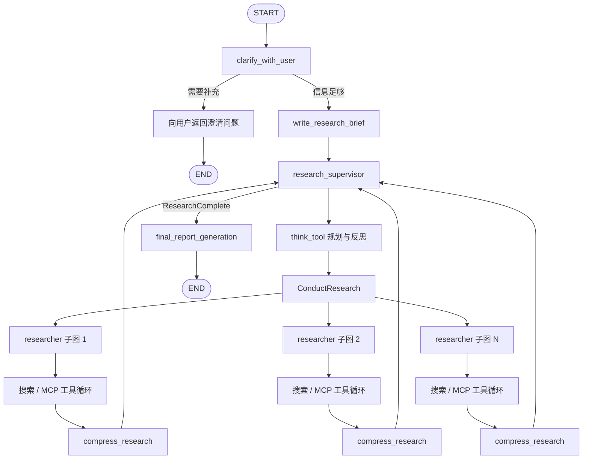

# langchain-ai/open_deep_research：基于 LangGraph 的监督者—研究者深度调研图

| 字段 | 值 |
|---|---|
| GitHub | https://github.com/langchain-ai/open_deep_research |
| License | MIT |
| Stars | 12,681（2026-09-17 快照） |
| GitHub 最后 push | 2026-08-10 |
| 分析 commit | `1b7d2e80db9faa586165c60e09096dbbfd483a64` |
| 生命周期 | GitHub 当前将仓库标记为 archived；固定提交仍可用于源码分析 |
| 产品类型 | 基于 LangGraph 的可配置深度研究与报告生成样例 |
| 分析证据 | README、许可证与包元数据、主图、配置、状态、工具、提示、认证及评测源码 |

## 1. 它到底是什么

Open Deep Research 是 LangChain 团队公开的深度研究 Agent 实现。它用 LangGraph 把用户澄清、研究 brief、监督者分派、研究者搜索、资料压缩和最终报告写作串成一张有状态图。项目重点不在某个专有搜索引擎，而在于展示一套可配置的 research graph：模型可以按阶段分别选择，搜索可在 Tavily、OpenAI 原生 Web 搜索、Anthropic 原生 Web 搜索和 MCP 工具之间切换，监督者还能并发委派多个研究单元。

主图输入是消息历史。`clarify_with_user` 先以结构化输出判断是否需要追问；信息足够后，`write_research_brief` 把对话转换成一份具体研究问题。`research_supervisor` 不是直接写最终答案，而是通过 `ConductResearch` 将子任务交给 researcher 子图，并用 `ResearchComplete` 表示资料取得结束。每个 researcher 在工具循环后调用 `compress_research` 清理资料，最终由 `final_report_generation` 综合所有 notes 写成报告。

GitHub 当前将该仓库标记为 archived。这是仓库的生命周期状态，表示其公开仓库处于归档模式；它本身不能推出固定提交失效、此前结果无效或所有相关技术停止发展。报告因此把 `1b7d2e8` 视为可复核的源码快照，而不从 archived 标签延伸判断项目质量或作者后续安排。

README 给出 Deep Research Bench 的排名、分数和成本，并描述 LangGraph Studio、部署方式和可选模型。这些是项目文档中报告的结果。本次没有运行 benchmark、模型或搜索服务，不能把它们写成本次独立测量。

## 2. 运行时堆叠

- **图运行时**：`deep_researcher.py` 使用 LangGraph `StateGraph` 定义节点、条件路由、子图和结束状态；`langgraph.json` 注册 “Deep Researcher” 图及认证入口。
- **状态层**：`AgentState` 扩展 `MessagesState`，保存 `supervisor_messages`、`research_brief`、`raw_notes`、`notes` 和 `final_report`。`override_reducer` 允许节点显式覆盖列表，否则沿用追加 reducer。
- **结构化控制层**：Pydantic 模型 `ClarifyWithUser`、`ResearchQuestion`、`ConductResearch`、`ResearchComplete` 和 `Summary` 让澄清判断、brief、研究委派、停机信号和网页摘要具有结构。
- **模型层**：`Configuration` 分别配置 summarization、research、compression 和 final report 模型及 token 上限，不要求四个阶段使用同一提供方。
- **搜索层**：`SearchAPI` 包含 `anthropic`、`openai`、`tavily` 和 `none`。工具组还可以装入 MCP server 暴露的工具。
- **并发层**：监督者把同一轮 `ConductResearch` 调用裁剪到 `max_concurrent_research_units`，再用 `asyncio.gather` 执行；researcher 的多个工具调用也可并发。
- **压缩与限长层**：网页可先摘要，研究过程结束后再压缩；发生 token-limit 错误时，压缩节点会逐步删除较早消息，最终报告节点会根据模型上限估算长度并截断 findings 后重试。
- **服务认证层**：`src/security/auth.py` 使用 Supabase 验证 Bearer JWT，并为 thread、assistant 和 store 操作生成 owner metadata 或过滤条件。
- **评测层**：`tests/run_evaluate.py` 通过 LangSmith 数据集运行图，`tests/evaluators.py` 用模型评估总体质量、相关性、结构、正确性、groundedness 和完整性。这是独立评测入口，不是主图每次写稿前的强制 gate。

## 3. 阶段机或 DAG

主图的确定顺序是 `START → clarify_with_user → write_research_brief → research_supervisor → final_report_generation → END`，其中澄清节点可提前返回用户。真正的循环位于 supervisor 和 researcher 子图：supervisor 通过 `ConductResearch` 建立研究单元，researcher 则反复调用搜索、MCP 或 `think_tool`，直到达到完成条件或工具调用限制，再压缩本单元资料。

提示词要求 supervisor 在委派前以及收到研究结果后使用 `think_tool`，并设置研究迭代和并发预算。researcher 提示也要求搜索后反思，并针对简单与复杂问题给出工具调用上限。这些限制由提示与配置共同表达；模型是否始终按理想策略分解任务仍属于运行行为，本次未做实测。

## 4. Tool / Skill / Agent 怎么切

- **主 Agent 图**：`deep_researcher` 负责用户对话到最终报告的全流程。
- **Supervisor Agent**：读取 research brief，调用 `think_tool` 规划，使用一个或多个 `ConductResearch` 工具调用委派独立子题，并以 `ResearchComplete` 结束检索。
- **Researcher Agent**：接收完整、独立的子题描述，动态加载搜索工具、MCP 工具和 `think_tool`，执行工具循环，最后输出压缩资料。
- **Tool**：Tavily 被包装为查询工具；OpenAI 和 Anthropic 的原生 Web 搜索根据所选模型接入；MCP 工具由远端服务描述动态加载；`think_tool` 则把反思文字返回图中，供模型形成下一步。
- **结构化控制 Tool**：`ConductResearch` 和 `ResearchComplete` 是 Pydantic schema 驱动的控制信号。前者不是搜索本身，而是 supervisor 启动 researcher 子图的委派合同。
- **网页摘要动作**：`summarize_webpage()` 使用 summarization model 把较长正文转换成 `Summary(summary, key_excerpts)`。
- **Skill**：仓库没有 RH 式独立安装、发现和版本化的 Skill 包；可复用能力主要表现为 LangGraph 节点、Python 函数和动态工具。

`get_all_tools()` 把完成信号、反思、搜索和 MCP 工具组装给 researcher。MCP 配置可指定 server URL、允许的工具名和是否需要认证；加载时会过滤工具列表，并为认证错误包裹处理逻辑。这种设计让工具面灵活，但工具产物最终仍归并为消息和 notes，没有统一转换成持久化研究 artifact。

## 5. 文献怎么来、是否入库、引用约束

Open Deep Research 的默认资料单位是搜索结果和网页内容，不是已摄取的学术论文对象。来源主要有四条：

1. Tavily 搜索，可针对多个 query 并发请求；
2. OpenAI 模型提供的原生 Web 搜索；
3. Anthropic 模型提供的原生 Web 搜索；
4. MCP server 提供的自定义工具。

`tavily_search_async()` 并发运行查询，结果按 URL 去重。对于带 `raw_content` 的页面，流程可控制最大字符量并调用 `summarize_webpage()`；摘要使用结构化 `Summary`，保留概述和关键摘录。摘要调用有超时和失败退路，失败时可以返回原始网页内容。这样可以控制上下文规模，但摘要本身也是模型转换层，不能视作原文逐字证据。

提示词对学术问题要求优先链接原始论文或期刊页面，而不是只依赖综述和二手摘要。压缩提示要求保留所有相关信息、行内引用和来源列表；最终报告提示要求使用 `[Title](URL)` 并在末尾列出 Sources。引用序号、来源保留和同语言写作因此有明确提示规范。

这些约束仍以运行时消息为中心。`raw_notes` 和 `notes` 保存在图状态中，但源码没有将论文标识、版本、段落位置、主张、支持强度和矛盾状态写入持久化 evidence graph。最终报告中的 URL 也没有在主图内经过逐句 entailment 检查。测试目录确实包含 groundedness evaluator：它从最终报告抽取主张，并判断是否由 `raw_notes` 支持；然而该 evaluator 由 LangSmith 评测脚本调用，不是 `final_report_generation` 的默认阻塞节点，不能把它描述成线上强制引用闸。

## 6. 实验 / 代码执行

这里的“research”指检索与资料综合。主图没有科学代码执行器、容器沙箱、数据集版本管理、实验矩阵、指标 registry、随机种子记录或算力资源合同。MCP 可以暴露任意外部工具，但核心实现没有为代码执行结果定义专门 schema，也没有规定如何把运行日志转换为论文可引用的实验记录。

`tests/run_evaluate.py` 会编译图并针对 “Deep Research Bench” 数据集运行，配置搜索 API、模型、并发量和工具调用上限，再交给多个 evaluator 打分。这是一条评估 deep-research 报告质量的脚本，不等同于系统能够自主执行论文中的科学实验。README 中的 benchmark 分数与成本也应理解为项目方报告的特定配置结果。

因此，该仓库适合作为信息型 deep research 的编排参考。若研究任务包含统计分析、模型训练或可复现实验，需要另接受控执行环境，并将代码、数据、配置、资源、输出和失败记录固化为正式 artifact，之后才能让写作阶段消费。

## 7. 写稿怎么做

写作分为三个层次：

- `write_research_brief` 把消息历史转成具体、第一人称研究问题，并要求保留用户全部约束、避免无依据假设；
- `compress_research` 将 researcher 的工具调用和搜索资料清理成综合 findings，同时要求尽量保留信息和全部来源；
- `final_report_generation` 根据 research brief、消息历史和所有 notes 生成最终 Markdown 报告。

最终提示要求报告使用与用户消息相同的语言，按照问题性质灵活设置标题和章节，提供具体事实、平衡分析、正文链接和 Sources。它不强迫所有问题套用相同 IMRaD 模板：比较题、列表题和概述题可以采用不同结构。

上下文过长时有两层退让机制。压缩阶段检测 token-limit 错误后，会逐步删除较早消息再重试；最终报告阶段会读取对应模型的 token 上限，根据字符量裁剪 findings。这样能提高长任务完成率，但裁剪也可能丢失较早证据。源码没有看到裁剪后逐项核对“哪些主张失去来源”的二次门。

输出核心是 Markdown 文本。仓库主图没有 LaTeX 模板、参考文献数据库、PDF 编译、目标期刊格式检查、稿件版本提交或审稿回复工作流。README 所述 LangGraph Studio 和平台部署改善的是运行与交互方式，不会自动增加这些论文生产约束。

## 8. 图怎么做

固定提交的主流程没有科学绘图节点、图像生成器或结果图渲染器。搜索结果可能包含网页信息，但最终报告合同关注文本、链接和 Sources，没有规定如何下载、授权、选择或嵌入来源图片。

同样，系统没有从结构化实验记录生成折线图、箱线图、消融图和统计注释的接口，也没有方法架构图的规划—生成—批评闭环。用户若要求图，通常需要通过额外 MCP 工具或下游流程完成，而这不属于当前主图已经证明的能力。

对科研生产而言，这个边界很重要：文本中总结了某个数值，不代表可以直接生成可发表结果图。结果图还需要数据源、筛选规则、误差定义、单位、样本量、面板映射和图注主张之间的可复核合同。

## 9. 和 RH 的相似点

- 都把研究过程表示为有阶段和路由的编排，而不是单次提示。
- 都支持在正式写作前形成结构化研究问题或 brief。
- 都能连接多种检索与工具提供方，MCP 是共同的扩展边界。
- 都关注并发预算、工具调用上限和长上下文处理。
- LangGraph state 与 RH checkpoint 都让研究过程具备恢复和检查的可能。
- supervisor 与 researcher 分工接近“规划者—执行者”的多 Agent 模式。
- 来源保留、正文引用和最终 Sources 与 RH 的证据约束目标相近。
- 评测脚本将 groundedness、正确性、完整性和写作质量分开评分，这种多维诊断思想可用于稿件质量检查。

## 10. 和 RH 的不同点

Open Deep Research 把消息、notes 和 graph state 作为运行核心；RH 把 topic、paper、claim、evidence、artifact 和 provenance 作为跨会话权威记录。LangGraph 可以保存 checkpoint，但当前状态模型没有定义科研对象之间的长期关系。

主要差异包括：

- ODR 的 research brief 是一次运行的文本；RH 的 topic 还关联论文池、主张、证据和后续阶段。
- ODR 的 `ConductResearch` 返回压缩 notes；RH 的工具应返回可持久化、可追溯的 artifact receipt。
- ODR 的 citation discipline 主要在 prompt；RH 还可显式记录 claim/source/span/support status。
- ODR 的 groundedness evaluator 位于测试评测路径；RH 的一致性与证据检查可以成为阶段推进或版本提交的 gate。
- ODR 支持 token-limit 下截断；RH 需要同时标记截断造成的证据覆盖缺口。
- ODR 不负责实验、图、LaTeX/PDF 和正式发布；RH 覆盖这些环节并维护依赖谱系。
- ODR 的模型与搜索提供方配置十分灵活；RH 更强调更换 Agent runtime 或模型后，Tool 合同与权威状态仍保持稳定。
- ODR 的认证代码围绕 LangGraph 部署对象做 owner filtering；RH 的多租户还需要覆盖研究数据、文件、服务凭证与角色权限的完整边界。

## 11. 优点 / 缺点

**优点**

- 主图短而清晰：澄清、brief、监督研究、最终报告的职责容易理解。
- supervisor 与 researcher 子图分离，既可单研究单元运行，也能按问题自然并行。
- 四类模型可分别配置，便于把成本较低的模型用于摘要，把更强模型用于研究或终稿。
- Tavily、两类原生搜索和 MCP 共存，工具面不绑定单一提供方。
- Pydantic 结构化输出用于澄清、委派、完成和摘要，减少纯文本控制信号的歧义。
- URL 去重、网页摘要、并发上限、token-limit 检测和重试体现了长程调研的工程细节。
- 最终报告明确跟随用户语言，并要求正文链接和 Sources。
- MIT 许可证清晰，固定提交仍提供完整、可阅读的参考实现。

**缺点**

- GitHub 当前处于 archived 生命周期状态，使用者应将固定版本和依赖自行锁定，并独立评估维护安排。
- 来源主要保存在消息和 notes 中，没有正式论文摄取、claim-level evidence 或跨任务知识库。
- 引用规范以 prompt 为主，评测 groundedness 不是主运行图的阻塞条件。
- 压缩和 token-limit 裁剪虽提高完成率，却可能静默减少证据；状态没有保存逐来源保留清单和损失说明。
- MCP 工具具有动态性，但核心没有统一记录每次工具产物的证据类型、版本和可信边界。
- 没有科学实验、定量图表、LaTeX/PDF 与发布流程，不是完整论文生产系统。
- Supabase owner filtering 展示了服务安全设计，但本次没有部署验证，不能由源码存在推断完整租户隔离已经成立。
- README benchmark 依赖指定模型、搜索服务和评测方法，本次没有独立复现。

## 12. RH 可学的 1–3 条

1. **将监督者的并发委派做成显式、可预算的研究单元。** `ConductResearch` 的 schema 与 `max_concurrent_research_units` 让 supervisor 能在一轮中提出多个不重叠子题。RH 可把这种委派映射为带父 brief、预算和预期证据类型的 artifact，但所有结果仍摄取到同一 topic 状态。
2. **给每个长上下文退让动作留下证据覆盖回执。** ODR 已能识别 token-limit 并裁剪重试。RH 可进一步记录删除了哪些消息或来源、哪些 claim 因此需要重检，让“成功生成”不掩盖上下文损失。
3. **复用阶段专用模型配置，但保持输出合同统一。** 摘要、研究、压缩和终稿可按成本与能力选择不同模型；RH 可以借鉴这种分层，同时要求每层返回统一 provenance、来源 ID 和 artifact schema，使替换模型不改变证据链。

## 13. 名字速查表

| 名字 | 先决概念 | 含义 |
|---|---|---|
| `deep_researcher` | LangGraph | 从用户消息到最终报告的主图 |
| `clarify_with_user` | structured output | 判断信息是否足够，并决定是否向用户追问 |
| `write_research_brief` | scope | 把对话转成具体研究问题 |
| `research_supervisor` | orchestration | 规划、委派并判断研究是否完成的子图 |
| `ConductResearch` | delegation | 描述一个独立 researcher 子任务的结构化工具调用 |
| `ResearchComplete` | stop signal | supervisor 表示资料取得已经结束的结构化信号 |
| `think_tool` | reflection | 保存规划或检索后反思的轻量工具 |
| `researcher_subgraph` | worker | 执行搜索和 MCP 工具循环的研究者子图 |
| `compress_research` | context reduction | 清理 researcher 消息并保留 findings 与来源 |
| `raw_notes` | evidence context | 研究工具产生、尚未完全压缩的资料集合 |
| `notes` | synthesis input | 各研究单元压缩后供终稿模型使用的内容 |
| `SearchAPI` | provider selection | Anthropic、OpenAI、Tavily 或关闭搜索的配置枚举 |
| `MCPConfig` | external tools | 描述 MCP 地址、允许工具和认证要求 |
| `override_reducer` | graph state | 允许状态字段显式覆盖而非总是追加 |
| `final_report_generation` | writing | 汇总 brief、消息和 notes 生成最终 Markdown 报告 |
| groundedness evaluator | offline evaluation | 在评测脚本中比较报告主张与 raw notes 的模型评估器 |

---

> 📌事实边界
> 本页绑定固定提交 `1b7d2e80db9faa586165c60e09096dbbfd483a64`，项目数据与 GitHub 生命周期状态快照为 2026-09-17。GitHub 的 archived 标记仅作为仓库状态记录。架构描述来自源码；benchmark、成本、排名和部署体验中由 README 给出的部分属于项目自述。本次没有调用模型、Tavily、原生 Web 搜索、MCP、Supabase 或 LangSmith，也没有运行 benchmark，因此不对检索质量、groundedness 得分、费用、认证效果或线上稳定性作独立验证。

`
