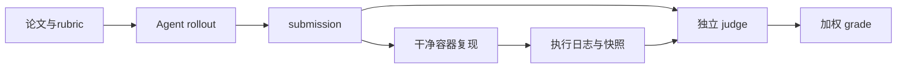

# openai/frontier-evals：以 PaperBench 为核心的论文复现评测基础设施

| 字段 | 值 |
|---|---|
| GitHub | https://github.com/openai/frontier-evals |
| License | MIT |
| Stars | 1300（2026-09-17 快照） |
| GitHub 最后 push | 2026-04-21 |
| 分析 commit | `51052cede8cc608f95bb00346635e03759013e5a` |
| 生命周期 | GitHub 候选冻结记录为未归档；固定提交用于本页源码分析 |
| 产品类型 | 论文复现与执行评测 |
| 分析证据 | 固定提交中的 README、许可证、配置与核心实现 |

本文用 📘 标注文档或源码中可直接定位的事实，🔶 标注由控制流推导的边界，💬 标注评价与借鉴建议。仓库动态元数据沿用候选清单，源码判断只绑定页面中的固定提交。

## 1. 它到底是什么

frontier-evals是多个 frontier capability eval 的代码仓库。本候选重点是 PaperBench：给 Agent 一篇论文和 rubric，在容器中生成 submission，在新的容器复现，再用第三个环境按 rubric 判分，形成从 Agent rollout 到执行证据和评分的闭环。 本文把仓库作为一个公开源码快照来分析：README 的产品定位、命令和 benchmark 数字属于项目文档；代码路径用于确认控制流、数据结构和边界。没有把 stars、README 宣称的准确率、SOTA 或部署体验转换成独立结论。

源码中最值得关注的是：每个 paper×seed 生成任务。Agent 在 Ubuntu 容器内写代码；reproduction 在干净第二容器执行 reproduce.sh，记录超时、日志、前后文件和 Git 状态；judge 在第三环境读取论文 rubric、相关文件和执行输出，给每个叶子任务 0–1 分并按权重汇总。code_only 可将非代码类别权重归零。 这决定了它应在 RH 产品地图中被看作“论文复现与执行评测”，而不是泛化地称为自动科研系统。

## 2. 运行时堆叠

运行时可拆成以下层：

- **入口与配置**：由仓库提供的 CLI、脚本、Next.js/API 或配置文件接收任务和参数。
- **Agent/编排**：PaperBench 基于 nanoeval/Alcatraz ComputerRuntime 与 Docker/可选 GPU；PBTask/PaperBench 组织 paper split、tries、run group 和 runtime；solver 负责 rollout；reproduce.py 执行 submission/reproduce.sh 并收集日志、文件和 git 状态；grade.py 与 judge/simple.py 将 rubric TaskNode 的叶子分数聚合；metrics.py 汇总 mean/std error 和按论文结果。
- **工具与环境**：工具调用连接搜索、文件、浏览器、向量库、解释器或沙箱；工具是否真的隔离取决于配置和外部服务。
- **状态与产物**：本项目保存的状态形式包括缓存、队列、日志、数据库、PaperNode、retrieval result、文件或 grade；它们不自动等同于 RH artifact。

这种分层让替换模型和工具变得容易，但也将“接口存在”和“证据可信”分开。源码可以证明一个函数会生成/保存某种对象，不能单凭存在证明对象内容正确。

## 3. 阶段机或 DAG

核心控制流如下。

每个 paper×seed 生成任务。Agent 在 Ubuntu 容器内写代码；reproduction 在干净第二容器执行 reproduce.sh，记录超时、日志、前后文件和 Git 状态；judge 在第三环境读取论文 rubric、相关文件和执行输出，给每个叶子任务 0–1 分并按权重汇总。code_only 可将非代码类别权重归零。 阶段之间通常由消息、列表、队列、结构化对象或日志连接；是否能跨进程恢复，取决于具体实现，而不是 Mermaid 图本身。需要特别区分循环的两种含义：一种是有限的 max_depth/max_rounds/max_iter/max_steps 或 expand_layers；另一种是模型自主决定继续。源码中的上限能限制预算，但不能保证每次运行都走完所有阶段，也不能保证模型输出符合提示。

## 4. Tool / Skill / Agent 怎么切

该仓库的 Agent 边界是：主 Agent 接收任务并决定下一步；子 Agent/worker（若有）承担局部任务；tool 是可调用的搜索、抓取、文件、浏览器、代码或数据接口；skill（若有）主要是提示/能力包，不等于可审计的执行 artifact。具体来说，PaperBench 基于 nanoeval/Alcatraz ComputerRuntime 与 Docker/可选 GPU；PBTask/PaperBench 组织 paper split、tries、run group 和 runtime；solver 负责 rollout；reproduce.py 执行 submission/reproduce.sh 并收集日志、文件和 git 状态；grade.py 与 judge/simple.py 将 rubric TaskNode 的叶子分数聚合；metrics.py 汇总 mean/std error 和按论文结果。

工具调用的返回通常被转成文本、结构化响应或日志，再回到模型上下文。优点是扩展快，缺点是不同工具的来源、版本、错误和副作用可能没有统一合同。对于 RH，接入时不应只映射函数名，还要记录输入、输出、外部资源、权限、失败原因和可复核句柄。

## 5. 文献怎么来、是否入库、引用约束

文献/来源链是：数据由 Git-LFS 的 PaperBench papers/rubrics 提供；任务产物是 submissions、reproduce.log、executed submission、grade.json、metadata 和 run status。它不是论文文献库，来源用于定义复现任务而不是生成学术引用。

这条链路能支持“找到或读取来源”，但通常不能直接支持 claim-level evidence。源码未显示统一的 DOI/版本/页码/span/主张/支持强度对象，也没有在最终文字生成前做逐句 entailment gate。若项目有 URL、reference、arxiv_id、PaperNode 或 RetrievalResult，它们仍主要是检索和展示元数据。

因此，报告中的来源约束应写成：系统会按提示或数据结构保留来源；不能写成“每条结论都已验证”。在 RH 中，建议将这些中间来源摄取为 paper/source，再显式链接 claim 和 evidence span。

## 6. 实验 / 代码执行

工程上，README 的 leaderboard 报告 2025-04-02 的若干 Agent 分数，属于仓库记录；源码确实有 timeout、runner concurrency、reproduction 和 judge 统计，但本次没有构建 Docker、下载 LFS 数据或运行评测，不能宣称这些分数已复现。

**事实边界**：本次只读了公开仓库固定提交，没有安装依赖、配置 API key、下载模型/数据、启动外部服务或运行 benchmark。因而不能确认运行时性能、成本、并发稳定性、沙箱隔离、模型质量、检索召回或 README 中的结果。源码里的测试/评估函数可以说明“如何评”，不能说明“本次已评”。

若将它用于科研执行，还需要补齐数据版本、代码提交、环境镜像、资源上限、随机种子、指标定义、原始输出和失败记录，并把每次执行绑定到不可变 artifact。

## 7. 写稿怎么做

写作输出取决于项目类型：论文复现与执行评测 的最终产物通常是 Markdown、报告字符串、聊天消息、结构化 Report、检索回答或 grade JSON。每个 paper×seed 生成任务。Agent 在 Ubuntu 容器内写代码；reproduction 在干净第二容器执行 reproduce.sh，记录超时、日志、前后文件和 Git 状态；judge 在第三环境读取论文 rubric、相关文件和执行输出，给每个叶子任务 0–1 分并按权重汇总。code_only 可将非代码类别权重归零。

若有报告器，它往往把多个阶段的摘要合并为可读文本；引用可能是 URL、reference id、source 字段或 rubric 记录。这里没有看到 RH 意义上的章节草稿、参考文献数据库、claim/evidence 互证、LaTeX/PDF 编译和提交版本闸门。因此“能生成报告”不应被扩写成“能生成可投稿论文”。

## 8. 图怎么做

固定提交中的图能力应按数据来源区分。项目可能包含 README 架构图、UI 进度事件、流程 Mermaid、benchmark 绘图脚本或报告 Markdown，但这与从实验记录生成可发表定量图不同。frontier-evals是多个 frontier capability eval 的代码仓库。本候选重点是 PaperBench：给 Agent 一篇论文和 rubric，在容器中生成 submission，在新的容器复现，再用第三个环境按 rubric 判分，形成从 Agent rollout 到执行证据和评分的闭环。

本报告不把仓库 README 的截图、曲线或分数表重绘成独立实验结果。若下游要出图，必须先声明数据源、统计单位、误差定义、样本量、面板与图注主张；对于架构图，则需把实际节点、权限边界和失败路径与源码对齐。

## 9. 和 RH 的相似点

1. 都把“做题”和“判题”拆开：rollout 容器写代码，第二容器跑 reproduce.sh，第三环境用 rubric judge。
2. 都允许把非代码权重归零（code_only），避免用写作分掩盖实现分。
3. 都把评分标准写成 rubric，而不是模型口头说“看起来对”。

## 10. 和 RH 的不同点

RH 生产自己的课题与稿件。PaperBench 评的是 Agent 复现已发表论文的能力。权威对象是任务包、容器产物和 rubric 分数，不是 RH 的 claim 库。三容器隔离的是评测公平性，不是科学家的长期证据链。仓库还含其他 frontier evals，不能把整个 monorepo 当成单一科研系统。

## 11. 优点 / 缺点

**优点**

- 三环境把生成、复现、评判的污染面切开。
- rubric 可按代码权重调节。
- 任务来自真实论文复现，比玩具编程题更接近科研执行。

**缺点**

- 评测集不是开放科研生产。
- judge 仍依赖模型，rubric 存在不等于分数已核验。
- 本次未跑容器或 reproduce.sh。

💬 对照价值在“复现与评判分容器”，不是 PaperBench 排行榜。

## 12. RH 可学的 1–3 条

1. **生成代码的容器不要同时跑官方 reproduce.sh。** 避免 Agent 改评分脚本。
2. **提供 code_only 开关，把非代码维度显式归零。**
3. **rubric 条目与权重一起版本化。** 否则跨次分数不可比。

## 13. 名字速查表

| 名字 | 先决概念 | 含义 |
|---|---|---|
| rollout 容器 | 生成环境 | Agent 写实现 |
| reproduce.sh | 复现环境 | 第二容器执行 |
| rubric judge | 评判环境 | 第三环境打分 |
| code_only | 权重开关 | 非代码项归零 |
| PaperBench | 任务集 | 论文复现评测 |

> 📌事实边界：本页绑定固定提交（`51052cede8cc608f95bb00346635e03759013e5a`），快照日期 2026-09-17。未启动三类容器，未运行 reproduce.sh 或 judge，未把公开榜单当作本次实测。
