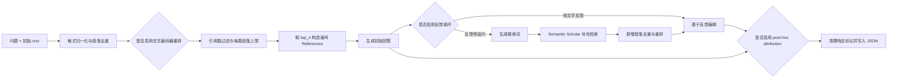

# AkariAsai/OpenScholar：面向科学文献的检索增强问答流水线

| 字段 | 值 |
|---|---|
| GitHub | https://github.com/AkariAsai/OpenScholar |
| License | Apache-2.0 |
| 固定分析 commit | `0e9b8fb912273d3dae39e593da86e4f6d3bf8de1` |
| 元数据快照 | 2026-09-17 |
| 产品类型 | 文献检索、段落重排与带引用生成 |
| 事实来源 | README、运行入口、生成器、检索 API、索引实现、依赖与许可证 |

## 1. 它到底是什么

OpenScholar 是一个以科学文献为输入的 retrieval-augmented language model（RAG）推理系统。它的核心任务是把用户问题、候选论文段落和外部文献搜索组合起来，生成带方括号编号引用的回答。README 将其定义为“先搜索相关论文，再根据这些来源生成回答”的系统；固定 commit 中的主入口也符合这一边界：`run.py` 读取 JSON、JSONL 或 Hugging Face dataset，规范化每条记录里的 `ctxs`，构造 `OpenScholar`，然后逐条执行重排、生成、反馈修订和引用补全。

它更接近“科学文献问答的模型与检索组合层”，而不是从选题、实验到投稿的完整科研编排器。输入上下文和输出结果主要是字典及 JSON 文件：问题放在 `input`，候选段落放在 `ctxs`，回答放在 `output`，重排分数、反馈、成本和耗时继续附在同一个 item 上。代码中没有 topic、claim、artifact、review gate 等跨任务研究实体。

README 还提供模型、数据、ScholarQABench 和专家评测入口，并说明生成模型、reranker 与 datastore 的训练方法。这些属于项目发布说明；固定 commit 能直接确认的是相应目录、命令参数和控制流，不能仅凭 README 将模型效果或专家评价视为本页已独立复现的结果。

## 2. 运行时堆叠

运行时由 Python 命令行、生成模型、重排模型和检索组件组成。`requirements.txt` 直接列出 vLLM、Transformers、PyTorch、FlagEmbedding、OpenAI SDK、datasets、requests、spaCy、NLTK、pandas 和 BeautifulSoup 等依赖。

`run.py` 支持两条生成路径：

- 提供 `--api` 时，创建 OpenAI 兼容客户端；Together 和 Anyscale 通过不同 base URL 接入，其余 provider 使用默认地址。
- 不提供 `--api` 时，创建本地 `vllm.LLM`，按可见 CUDA 数量设置 tensor parallel，并用 Transformers tokenizer 处理 padding 和聊天模板。
- 如果提供 `--reranker`，则加载 `FlagReranker`，在生成前对问题—段落对进行打分。
- 输入结果文件已经存在时，入口按现有结果条数裁掉已处理项，实现按条目数量继续运行的粗粒度恢复。

`process_input_data` 把不同检索来源的结构统一为段落字典：嵌套列表被展开，`retrieval text` 被转成 `text`，非字符串上下文被连接，原文中的 `<cit.>` 和已有数字引用被清理。去重键由正文前 100 个字符和标题拼成，属于便于批处理的启发式，不是稳定文献标识。

远端模型路径给每条记录写入 `total_cost`，但成本按空格切分后的词数和源码中的价格表估计，不是 provider 返回的实际 token 账单；本地 vLLM 路径成本记为零。`elapsed` 则记录整条 item 的执行时长。

## 3. 阶段机或 DAG

`OpenScholar.run` 是单条记录的阶段控制点。它先根据 `ranking_ce` 决定是否调用交叉编码器，再根据 `max_per_paper` 限制同一标题下的段落数量；随后 `generate_response` 把最多 `top_n` 个上下文编号后放进提示词。

如果启用 `feedback`，模型先根据问题、所见段落和当前回答生成反馈，代码最多处理前三条。反馈没有附加问题时，系统直接重写回答；反馈带有新问题时，系统抽取搜索关键词，并在开启 `ss_retriever` 后调用 Semantic Scholar。新增候选会再次去重、重排，然后和原回答一起进入编辑提示。

最后，`posthoc_at` 会把回答按段落处理，对每个句子重新请求引用归因并拼回答案。整个实现是带条件分支的顺序流水线，不是具备独立节点状态和依赖查询能力的 DAG 调度器。

固定 commit 还有两个值得注意的入口契约。第一，CLI 接受 `--use_abstract`，但 `OpenScholar.run` 的首次 reranker 调用把 `use_abstract` 固定传成 `False`，因此该参数不会在这条初始重排路径生效。第二，入口调用 `process_input_data(data)` 时使用默认的 `use_contexts=True`，使无检索模式仍隐含要求输入结构能提供 `ctxs`，接口边界较脆弱。

## 4. Tool / Skill / Agent 怎么切

OpenScholar 没有独立 Skill 包、MCP 工具注册表或多 Agent 生命周期。它的切分单位主要是 Python 类、函数和外部服务：

- **入口与编排器**：`run.py` 负责参数解析、输入恢复、模型加载和结果落盘；`OpenScholar.run` 负责编排单条记录。
- **检索工具**：`src/use_search_apis.py` 包含 Semantic Scholar 查询、标题匹配、批量元数据读取、引用数读取、arXiv HTML 段落解析、PubMed XML 摘要获取和外部搜索结果转换。
- **离线检索器**：`retriever/src/search.py` 编码查询、载入索引、执行 top-k 搜索并把 passage、相邻 passage、分数和来源写回 `ctxs`。
- **索引工具**：`retriever/src/index.py` 用 FAISS 保存向量和外部 id 映射，支持 FlatIP、PQ 与 IVF-PQ 路径。
- **重排工具**：`rerank_paragraphs_bge` 把问题与标题、摘要、正文组成 pair，调用 FlagReranker 打分。
- **生成与修订函数**：`generate_response`、`get_feedback`、`edit_with_feedback` 和 post-hoc attribution 分别承担初稿、反馈、编辑和引用补全。

模型确实会生成搜索词和反馈，但这些行为都在一个 `OpenScholar` 对象中顺序发生。与角色化多 Agent 系统相比，这种结构更接近可配置 RAG pipeline：组件边界清楚，自治角色边界较弱。

## 5. 文献怎么来、是否入库、引用约束

文献来源可分三层。

第一层是预先写入输入记录的离线 `ctxs`。检索器可以在 peS2o datastore 上建立向量索引，把 top-k passage 及检索分数写进结果文件；生成入口直接消费这些结果。README 说明项目发布了 peS2o v2/v3 datastore，并指出完整索引规模较大。

第二层是 Semantic Scholar。`search_paper_via_query` 请求标题、年份、摘要、作者、引用数、URL 和外部 ID；返回结果按 `paperId` 去重，并转成带 `citation_counts` 的上下文。若论文有 arXiv ID，代码还可请求 ar5iv HTML，抽取正文段落。`search_semantic_scholar` 先由模型生成查询词，再组合论文摘要和可取得的全文段落。

第三层是搜索引擎和 PubMed。代码能从结果 URL 识别 arXiv 或 PubMed ID，通过 Semantic Scholar 批量接口补元数据，或通过 NCBI E-utilities 读取标题和摘要，再转换成统一的 `ctx` 结构。

这些文献并不会自动进入跨任务持久化论文库。它们保存在某次输入/输出记录及离线 datastore 中；代码没有 paper ingestion 状态、claim-to-source 边或主题级文献池。

引用约束主要来自 prompt 与后处理。候选段落被格式化为 `[0] Title: ... Text: ...`，回答被要求使用编号引用。`remove_citations` 先清除来源段落原有引用，避免编号冲突。post-hoc attribution 再处理回答中缺少引用的句子。重排还可用 `min_citation` 排除低引用来源，或用 `norm_cite` 把归一化引用数加到相关性分数上；这些只是候选选择启发式，不能证明来源适合当前断言。

## 6. 实验 / 代码执行

主入口不执行模型生成的科研代码，也没有 shell、Notebook 或容器实验环境。实际执行内容是模型推理、HTTP 检索、HTML/XML 解析、段落重排和 JSON 文件写入。

仓库另有训练和检索实验基础设施。README 描述了三类训练：

1. 使用 peS2o 数据延续训练 Contriever 类 embedding 模型；
2. 以 FlagEmbedding 流程训练 BGE reranker；
3. 使用修改版 torchtune 和指令数据训练 8B generator。

`retriever/src/index.py` 能构建和序列化 FAISS 索引；`retriever/src/search.py` 能编码问题、执行近邻搜索，并计算 R@5、R@10、R@20、R@100 等检索指标。这些属于模型和检索器实验，不是自动提出假设、修改研究代码和统计验证的科学实验系统。

README 说明完整 datastore 基于大量论文和两亿级 embedding，需要较大内存；生成模型训练也描述了多 GPU 配置。因此轻量源码审阅不能替代对这些训练、索引和评测结果的实际复现。

## 7. 写稿怎么做

OpenScholar 主要写“带来源的回答”，不是完整论文。`src/instructions.py` 集中保存任务 prompt；`task_name` 可以切换多论文问答、summarization、single-paper QA，以及面向 SciFact、PubMedQA、QAS 等格式的指令。

初稿的基本方法是把 `top_n` 个段落拼成 References，再要求模型围绕问题回答。输出写入 `item["output"]`，初次结果还保存在 `initial_result`。反馈阶段把问题、段落、现有回答和反馈一起交给模型重写。代码用“新文本长度至少约为原文本的 90%”作为是否接受编辑的一个条件，这能避免极短结果覆盖原文，但不是事实正确性判定。

反馈中出现新问题时，系统可以追加文献后再编辑，因此具有“发现证据缺口—补检索—重写”的雏形。它没有章节树、venue 模板、相关工作分类、方法与实验承诺、BibTeX 管理、LaTeX 编译或全文一致性检查，适合作为综述片段和问答组件，而不是最终论文生产器。

## 8. 图怎么做

固定 commit 的主输出是文本和 JSON，没有 figure plan、图表 renderer、图像生成模型接口或数据—面板绑定。README 中的系统概览图属于项目说明素材，不是由运行时根据结果自动产生的科研图。

检索上下文可能包含论文图表附近的文字，但主代码只处理标题、摘要和文本 passage；它没有解析图像证据、读取坐标轴、复绘定量结果或验证图注与数据一致性的流程。因此 OpenScholar 可为图注或结果解释提供文献证据，却不能替代论文插图与定量 figure suite 的生成和审计。

## 9. 和 RH 的相似点

- 都把检索和证据上下文置于生成之前，减少完全依赖模型参数记忆的回答。
- 都重视来源元数据。OpenScholar 的标题、URL、摘要、引用数和来源类型，可与 RH 的论文及 evidence 对象对应。
- 都允许证据不足时再次检索，而不是把第一轮候选当成最终集合。
- 都有成本和执行状态意识；OpenScholar 保存估计成本与耗时，RH 进一步保存工具调用、artifact 和 provenance。
- 都能把模型分工到查询改写、候选排序、正文生成和修订等不同任务。

## 10. 和 RH 的不同点

OpenScholar 的权威状态是输入/输出 JSON 和模型所见段落；RH 的权威状态是 topic、paper、claim、evidence、artifact、provenance 和阶段 gate。OpenScholar 用文本前缀加标题去重，RH 需要稳定标识、版本关系和可审计来源。

OpenScholar 的编号引用是一次生成上下文中的局部索引，post-hoc attribution 也主要由模型选择；RH 需要把具体 claim 与支持、部分支持或反驳证据显式连接，并在写作和最终 bundle 中持续检查。

OpenScholar 不维护研究计划、实验记录、图表证据、投稿 venue 或稿件版本。其 feedback 和文本长度阈值是提示词与启发式控制，不能像 RH gate 那样阻止缺失关键 artifact 的阶段推进。OpenScholar 因而更窄、更适合科学问答；RH 覆盖从文献到研究交付的完整状态链。

## 11. 优点 / 缺点

**优点**

- 本地 vLLM 与远端 OpenAI 兼容接口共享同一生成流程，模型替换成本较低。
- 段落结构包含标题、URL、摘要、来源类型与引用数，便于回看模型实际获得的材料。
- reranker、引用数过滤、每篇段落限制和 `top_n` 都是清楚的可调参数。
- 初稿、反馈、追加检索、重写和引用补全形成了一个紧凑的 revision loop。
- 离线索引、在线论文搜索和生成器分层，能在预取结果与实时补充之间切换。

**缺点**

- 状态仍是松散 JSON，没有论文入库状态、claim 级证据边、版本 lineage 或统一失败协议。
- citation count 被用作过滤或打分信号，可能偏向老论文和热门论文，也不能替代相关性与真实性判断。
- post-hoc 引用由模型完成，没有硬性的 entailment 或引用覆盖验证。
- 反馈与编辑通常使用同一模型，独立性有限；文本长度比只能防止过度缩短，不能判断修改是否更正确。
- 大规模 datastore、本地模型和完整训练都需要显著资源，在线检索还依赖外部服务。
- 固定 commit 中部分参数与调用没有完全接通，例如首次重排没有使用 CLI 传入的 `use_abstract`。

## 12. RH 可学的 1–3 条

1. **保存“生成器实际看到的证据包”。** 对每次回答记录段落正文、来源、检索分数、重排分数、最终排名和是否被引用，使 claim 审核不仅能看到论文，还能看到当次模型上下文。
2. **把补检索建模为显式 revision 事件。** 保存原问题、识别出的证据缺口、追加查询、追加来源和修改后的断言，让证据扩展可以重放和比较。
3. **按任务拆分模型预算。** 查询改写、重排、初稿和修订可使用不同质量与成本档位，但继续通过 RH 既有 Tool、artifact 和 gate 承接，不另建一套平行状态系统。

## 13. 名字速查表

| 名字 | 含义 |
|---|---|
| `OpenScholar` | 单条科学文献问答的主对象，持有生成模型、重排器和检索选项 |
| `OpenScholar.run` | 重排、生成、反馈修订和引用补全的条件流水线 |
| `ctxs` | 候选段落列表，通常含文本、标题、URL、摘要和引用数 |
| `top_n` | 一次生成实际送入模型的最大段落数 |
| `ranking_ce` | 是否使用交叉编码器式 reranker |
| `FlagReranker` | 为问题—段落 pair 计算相关性分数的组件 |
| `min_citation` | 按来源引用数过滤候选的可选阈值 |
| `norm_cite` | 把归一化引用数加进重排得分的选项 |
| `feedback` | 生成反馈并触发编辑或追加检索的选项 |
| `posthoc_at` | 对回答句子重新执行引用归因的选项 |
| `search_semantic_scholar` | 生成检索词并取得论文摘要、元数据及可用正文段落 |
| `Indexer` | 保存 FAISS 索引与外部 passage id 映射的组件 |
| peS2o datastore | README 所述的大规模科学论文段落与索引数据源 |

---

> 📌事实边界：本页依据固定 commit `0e9b8fb912273d3dae39e593da86e4f6d3bf8de1` 中的源码、README 与许可证分析机制；没有启动需要外部凭据、远端服务、大规模索引、GPU 推理或训练资源的能力，也没有独立复现模型训练、评测指标、引用忠实度或生成质量。README 中的模型、数据和效果说明均作为项目声明理解。
