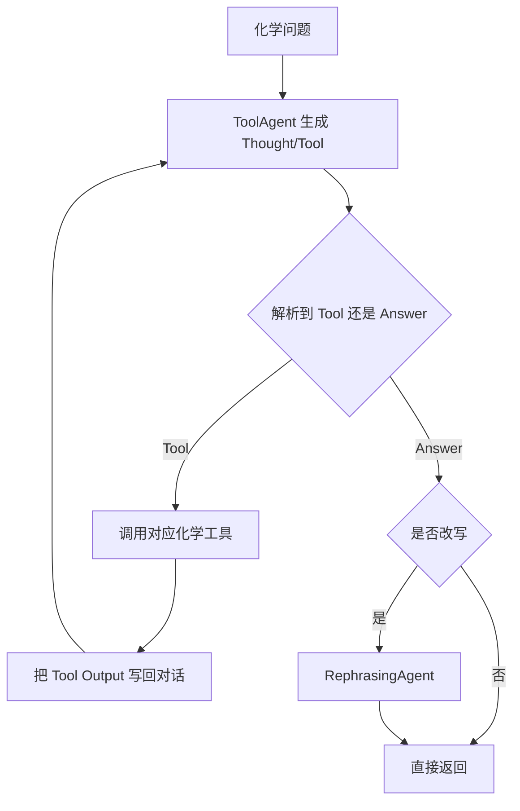

# ChemToolAgent：化学问题求解中的工具调用 Agent

| 项目 | 固定快照 |
|---|---|
| 候选编号 | 71 |
| 仓库 | [OSU-NLP-Group/ChemToolAgent](https://github.com/OSU-NLP-Group/ChemToolAgent) |
| 分类 / 层次 | 化学工具调用；方法、实验、评测 |
| 分析提交 | `172f6b82d20f8ca0d325d5c5b1f1f32a7cb42077` |
| 元数据快照 | 2026-09-17；Stars 20，非近似值；最近推送 2025-06-07 |
| 默认分支 / 状态 | main；非 fork、未归档；候选 pending，分析 draft |
| 许可 | MIT；固定提交的根目录 `LICENSE` 已查阅 |
| 阅读方式 | 公开 README、Agent 循环、工具注册与 Jupyter 执行器；静态分析 |

本文用 📘 标注文档或源码中可直接定位的事实，🔶 标注由控制流推导的边界，💬 标注评价与借鉴建议。仓库动态元数据沿用候选清单，源码判断只绑定上面的固定提交。

## 1. 它到底是什么

📘 [根 README](https://github.com/OSU-NLP-Group/ChemToolAgent/blob/172f6b82d20f8ca0d325d5c5b1f1f32a7cb42077/README.md) 将本仓库定位为论文 *ChemToolAgent: The Impact of Tools on Language Agents for Chemistry Problem Solving* 的官方代码。用户给出化学问题后，`ChemAgent` 通过 Thought / Tool / Tool Input / Answer 的文本协议调用领域工具，再可选地由 `RephrasingAgent` 改写最终回答。

📘 README 同时说明多数工具已迁到独立的 ChemMCP 工具包，并兼容 MCP。🔶 因此本仓库是论文实验与早期 Agent 实现，不是持续维护的通用化学平台；后续工具演进应以 ChemMCP 为准，而不是把本快照当成最新工具目录。

💬 它应被看成“化学问答 + 工具影响评测”的对照，而不是端到端科研生产系统。

## 2. 运行时堆叠

📘 [`chemagent/agent/agent.py`](https://github.com/OSU-NLP-Group/ChemToolAgent/blob/172f6b82d20f8ca0d325d5c5b1f1f32a7cb42077/chemagent/agent/agent.py) 把运行时拆成 `ToolAgent` 与 `RephrasingAgent`。默认模型字符串是 `gpt-4o-2024-08-06`；工具侧、规划侧和改写侧可以分别指定模型。`api_keys.py` 集中放置骨干模型与部分工具所需密钥。

| 层 | 固定快照中的承载方式 | 边界 |
|---|---|---|
| 入口 | Python API：`ChemAgent(...).run(query)`；`playground.ipynb` | 不是独立服务 |
| 规划 | `ToolAgent` 解析 Thought/Tool/Tool Input | 文本协议，不是函数调用 schema |
| 工具 | `chemagent/tools`：RDKit、PubChem、ChemSpace、反应预测、性质预测、Wikipedia/WebSearch 等 | 需要外部 API 或本地检查点 |
| 代码执行 | `PythonShell` 依赖预先启动的 Jupyter 服务 | `python_server/start_jupyter_server.sh` |
| 改写 | `RephrasingAgent` 可选 | 不改变工具链 |

🔶 `init_tools=False` 时工具可以延迟初始化；`include_tools` / `exclude_tools` 只证明过滤接口存在，不证明某次运行加载了全部工具。

## 3. 阶段机或 DAG

📘 `ToolAgent.run` 在 `max_iterations=40` 的循环里反复请求模型：解析出工具名就调用，解析出 Answer 就停止。超过迭代上限会抛 `RuntimeError`。解析失败会重试，达到 `max_error_iterations` 后抛 `ChemAgentOutputError`。

🔶 这是单问题工具循环，不是文献—实验—写稿阶段机。循环上限限制预算，不能保证每次都走到 Answer，也不能保证工具输出被正确使用。

## 4. Tool / Skill / Agent 怎么切

📘 [`chemagent/tools/__init__.py`](https://github.com/OSU-NLP-Group/ChemToolAgent/blob/172f6b82d20f8ca0d325d5c5b1f1f32a7cb42077/chemagent/tools/__init__.py) 注册分子命名转换、RDKit 计算、正向/逆向合成、PubChem 检索、分子描述生成、性质预测和 `AiExpert` 等工具。`ToolAgent` 提示词要求一次只调用一个工具，并以 `<END_INPUT>` 结束输入。

📘 `AiExpert` 被当作“没有更合适工具时再问模型”的后备。🔶 它不是独立科研 Agent，也不构成可审计的 Skill 目录；工具返回值进入对话文本后，正确性依赖调用方核对。

## 5. 文献怎么来、是否入库、引用约束

📘 检索类工具包括 Wikipedia、WebSearch 和 PatentCheck。它们返回格式化文本，供下一步 Thought 使用。🔶 仓库没有论文对象、DOI 绑定、claim/evidence span 或引用闸门。WebSearch 能找到来源，不等于来源已核验或被写入参考文献库。

## 6. 实验 / 代码执行

📘 性质预测工具需要从 Zenodo 下载检查点到 `chemagent/tools/property_prediction/checkpoints`。`PythonShell` 通过 Jupyter 服务器执行代码。README 提到 SciBench 实验结果，但那是论文文档，不是本仓库的自动评测入口。

🔶 本次没有安装 Uni-Core、没有配置 API key、没有启动 Jupyter，也没有复现 SciBench。因此不能把论文数字当成独立运行结果。

## 7. 写稿怎么做

📘 `ChemAgent.run` 返回 `final_answer`、`tool_use_chain` 和对话记录。🔶 没有章节草稿、LaTeX、参考文献数据库或投稿闸门。“能回答化学问题”不应扩写成“能写化学论文”。

## 8. 图怎么做

📘 固定快照没有从实验记录生成论文图的模块。playground 和 README 用于演示调用。🔶 若下游要出图，需要另接数据源与统计合同。

## 9. 和 RH 的相似点

1. 都把外部能力做成可替换工具，而不是把领域知识只写进提示词。
2. 都保存中间轨迹：这里是 `tool_use_chain`，RH 是 artifact / provenance。
3. 都需要密钥、外部服务和执行环境，源码存在不等于服务可用。

## 10. 和 RH 的不同点

RH 的权威对象是 topic、paper、claim、evidence。ChemToolAgent 的权威对象是单次问答的工具链。它没有文献入库、实验指标 registry、稿件版本或发布闸门。模型输出直接决定下一步工具。

## 11. 优点 / 缺点

**优点**

- 工具边界清楚，覆盖命名、性质、反应和检索。
- 文本协议和 `tool_use_chain` 便于复核每一步调用。
- 迭代上限和解析错误重试给出了最低预算控制。

**缺点**

- 依赖多个外部 API 与本地检查点，固定源码不能证明可运行。
- 文献与引用没有升级成证据对象。
- 论文宣称的工具影响结果未被本次复现。

## 12. RH 可学的 1–3 条

1. **把工具调用写成可复核链。** 保留 tool 名、输入、输出和 success 标记，而不是只留最终答案。
2. **给解析失败单独计数。** 格式错误与工具失败应分开，避免混成一次“Agent 失败”。
3. **领域工具与后备 LLM 工具分名。** `AiExpert` 这种兜底调用必须显式标记，不能和 RDKit 计算结果并列当硬证据。

## 13. 名字速查表

| 名字 | 先决概念 | 含义 |
|---|---|---|
| `ChemAgent` | 顶层封装 | 组合 ToolAgent 与可选改写 |
| `ToolAgent` | 工具循环 | Thought/Tool/Answer 协议 |
| `RephrasingAgent` | 后处理 | 按 format 改写最终答案 |
| `AiExpert` | 后备工具 | 无合适工具时再问模型 |
| `tool_use_chain` | 轨迹 | 逐步工具调用记录 |

> 📌事实边界：本页依据 `172f6b82d20f8ca0d325d5c5b1f1f32a7cb42077` 固定公开源码快照、2026-09-17 `data/candidates-staging.jsonl` 元数据和下列实际查看文件静态撰写（`README.md`、`LICENSE`、`requirements.txt`、`api_keys.py`、`chemagent/agent/agent.py`、`chemagent/agent/tool_agent.py`、`chemagent/agent/rephrasing_agent.py`、`chemagent/agent/tools.py`、`chemagent/tools/__init__.py`、`chemagent/tools/base.py`、`chemagent/tools/search.py`、`chemagent/tools/python_jupyter.py`、`chemagent/llms/requester.py`）。没有把 README 的论文结果或 ChemMCP 后续演进当作本次实测；未调用未配置的模型/API，未运行 Jupyter 或性质预测检查点，未据此声称运行效果。
