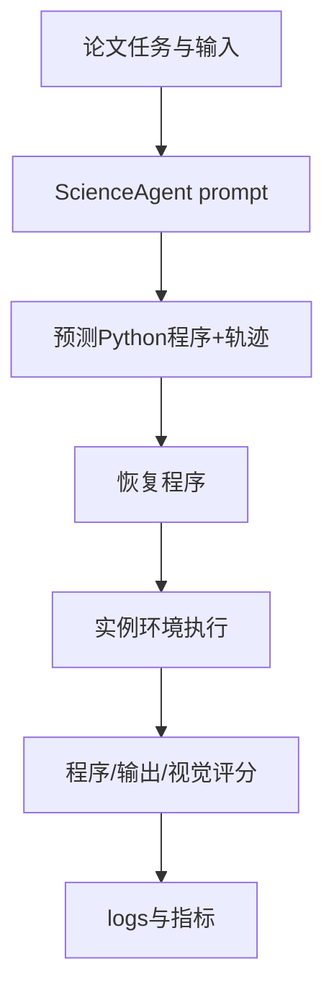

# OSU-NLP-Group/ScienceAgentBench：ScienceAgentBench 的公开源码合同

| 字段 | 值 |
|---|---|
| GitHub | https://github.com/OSU-NLP-Group/ScienceAgentBench |
| License | MIT（根 `LICENSE` 已查阅，与 GitHub API 一致） |
| 分析 commit | `c26e151ed601ba109dc4d35e057ff8e73fec469d` |
| 产品类型 | 科研/机器学习 Agent benchmark 与执行评测 |
| 直接证据 | `README.md`, `LICENSE`, `requirements.txt`, `agent.py`, `run_infer.py`, `run_eval.py` |

本文用 📘 标注文档或源码中可直接定位的事实，🔶 标注由控制流推导的边界，💬 标注评价与借鉴建议。仓库动态元数据沿用候选清单，源码判断只绑定页面中的固定提交。

## 1. 它到底是什么

ScienceAgentBench 面向数据驱动科学发现的语言 Agent 任务级评测。README 说明它从 44 篇同行评审论文抽取 102 个任务，覆盖四个学科，并由领域专家多轮验证；每项任务统一要求一个自包含 Python 程序，再评估程序、执行结果和成本。它强调先严谨评估单个科学工作步骤，不把任务级通过率夸大为端到端科研能力。

## 2. 运行时堆叠

ScienceAgent 将任务说明、数据目录树、预览和可选专家知识拼入 prompt；engine/base_engine.py 抽象 OpenAI/Bedrock；模型输出的 Python fenced block 被写到预测目录。self-debug 会用 pipreqs、pip-compile、pip-sync 建依赖环境并重跑。evaluation/harness 负责 Docker 镜像、实例、日志解析、并行 workers 和缓存；calculate_metrics 汇总多次 run。

## 3. 阶段机或 DAG

流程是任务输入→直接 prompting/self-debug→JSONL trajectory→recover_pred_from_log→依赖环境执行→输出文件/视觉/程序评分→run/eval logs→成功率、有效程序率和成本。

## 4. Tool / Skill / Agent 怎么切

Agent 负责程序生成和修复；engine 负责模型提供商；评测 harness 负责隔离执行；recover 工具从日志恢复代码；scorer/metrics 汇总结果。use_knowledge 只控制 prompt 是否附加专家信息，没有独立 Skill 或长期证据库。

## 5. 文献怎么来、是否入库、引用约束

任务来自论文、原始代码和数据，README 链接 benchmark 论文及任务来源。gold program 和背景知识是评测输入，但运行时没有通用 paper、claim、page span 或 citation graph；复用任务时还需遵守 rasterio、matminer 等原始许可。

## 6. 实验 / 代码执行

生成程序会真实运行。self-debug 的单次执行 timeout 为 900 秒，动态安装依赖；Docker harness 支持缓存和并发。日志包含 trajectory、cost、valid program、success rate 等；calculate_metrics 会按 success rate、valid program、CodeBERT score、cost 选择最佳重复。未下载受控 zip、未调用模型或启动 Docker。

## 7. 写稿怎么做

核心产物是程序和 JSONL 评测日志，不是论文稿。程序可输出图，评测器可用视觉 judge，但没有章节、引文、稿件一致性或发布质量门。

## 8. 图怎么做

README 的结构图、Docker 文档和程序输出示例用于说明 benchmark；gpt4_visual_judge.py 体现图像可被评分，但不是图表生成器。

## 9. 和 RH 的相似点

它与 RH 都重视真实执行、失败轨迹、成本和可恢复中间状态；把生成程序与运行结果分开记录的做法适合 RH 的 experiment artifact 设计。

## 10. 和 RH 的不同点

ScienceAgentBench 的主单位是科学编程任务及其执行成功，RH 还要求文献、主张、统计、稿件和发布。专家知识是输入 prompt 而非可审计证据；视觉 judge 和返回码不能替代科学审查。

## 11. 优点 / 缺点

优点是任务来自真实论文并经专家验证，输出格式统一，Docker 评估可并行且有日志，self-debug 反馈明确。缺点是受控数据不可随意再分发，动态依赖造成环境漂移，LLM judge 有耦合风险，挑选最佳重复会产生选择偏差，缺少 citation 和 manuscript QA。

## 12. RH 可学的 1–3 条

1. 分开记录生成程序、执行日志和科学结论。
2. 保存错误、依赖解析、修复次数和最终状态。
3. 对专家任务背景保存来源和版本，不只保留 prompt。

## 13. 名字速查表

`ScienceAgent`：程序生成器；`use_self_debug`：执行反馈修复；`recover_pred_from_log.py`：恢复预测程序；`evaluation.harness`：容器评测；`grading.py`：测试状态报告；`calculate_metrics.py`：多 run 汇总。

补充核验：README 同时说明受控 benchmark 压缩包不可在线再分发、verified split 后续修订以及 Docker 评估入口。报告因此将任务数量、并发时间和模型成绩视为项目声明，而只把静态可见的 prompt、依赖安装、日志和评分代码视为本次确认内容。

> 📌事实边界：本页依据 `c26e151ed601ba109dc4d35e057ff8e73fec469d` 固定公开源码快照、2026-09-17 `data/candidates-staging.jsonl` 元数据和下列实际查看文件静态撰写（`README.md`、`LICENSE`、`requirements.txt`、`agent.py`、`run_infer.py`、`run_eval.py`、`calculate_metrics.py`、`evaluation/harness/run_evaluation.py`、`evaluation/harness/grading.py`、`benchmark/README.md`）。没有把 README 的榜单、论文结果或运行说明当作本次实测；未调用未配置的模型/API，未运行完整 benchmark（除非明确另有说明），未据此声称运行效果。
