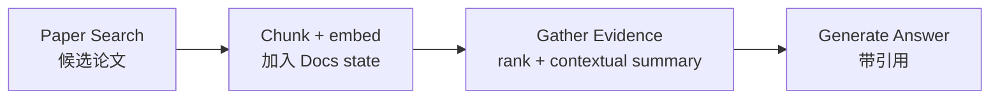

# Future-House/paper-qa：将论文变成有引用、有重排的可问答证据库

| 字段 | 值 |
|---|---|
| GitHub | https://github.com/Future-House/paper-qa |
| License | Apache-2.0 |
| Stars | 9,203（2026-09-16 快照） |
| GitHub 最后 push | 2026-09-15 |
| 本地 HEAD | `57e89f7` · 2026-08-12；落后于远端 pushed_at |
| 产品类型 | **论文检索 / RAG / 有证据问答**；不是论文生产链 |
| 分析证据 | README、`src/paperqa/agents/main.py`、`tools.py`、`pyproject.toml`、LICENSE |

## 1. 它到底是什么

PaperQA2 将 PDF、文本、Office 文档甚至源码解析为索引，再由 Agent 通过检索和 evidence summary 回答问题，并附带文内引用。它的价值不是“搜到多少网页”，而是将“回答”建立在**可定位的文档 chunk**上。

对 RH 来说，它是检索/证据局部的强对照：不是替换 `paper_search`，而是帮助定义“ingest 完一批论文后，怎样可靠地从已知材料作答”。

> 📘术语
> **chunk**：把长 PDF 切成可嵌入、排序和引用的小段文本/表格/图像单元；答案中的 evidence 通常来自若干 chunk，而不是“整篇论文”。

## 2. 运行时堆叠

- Python 包 + CLI `pqa`；模型通过 LiteLLM 配置。
- `Docs` 保存文档/索引；底层可用 Tantivy 全文检索和向量索引。
- `PQASession` 承载一次问答的状态和成本/证据。
- `PaperQAEnvironment` / `agent_query` 为 Agent 提供工具环境。
- 支持复用 index、嵌入缓存和外部 vector DB；不是 topic/claim workflow DB。

## 3. 阶段机或 DAG

README 的默认算法分为 Paper Search、Gather Evidence、Generate Answer；语言模型可多次、以不同表述调用这些工具，而不是被强制一条死序列。

## 4. Tool / Skill / Agent 怎么切

- **Tools**：`paper_search`、`gather_evidence`、`generate_answer`、`reset`、`complete`，由 `DEFAULT_TOOL_NAMES` 定义。
- **Agent**：`PaperQAEnvironment` 可决定工具调用顺序。
- **Skill**：不是主接口；它是可嵌入上层 Skill 的检索库。
- **Contract**：工具参数和 evidence/cost 状态是程序对象，不是 RH 跨服务统一信封。

## 5. 文献怎么来、是否入库、引用约束

- 可以从用户文件夹、本地 PDF 或搜索获得材料。
- 文档会被 chunk、embed 并写入 `Docs` state；这与 RH “search 候选不等于 ingest 后的可信集合”同方向。
- Gather Evidence 先向量召回，再以 query context 形成已评分摘要，随后 LLM re-score。
- 可接 Semantic Scholar、Crossref、Unpaywall 元数据；README 还强调 citation count 与 retraction check。

## 6. 实验 / 代码执行

不跑科研实验。它执行解析、索引和语言模型问答流程。

## 7. 写稿怎么做

适合回答带引用的小问题、生成证据段落或帮助综述；没有论文结构、venue profile、exemplar 或全文终稿检查。

## 8. 图怎么做

能解析多模态 document chunk（包括文内图/表内容），但不生成论文图。

## 9. 和 RH 的相似点

- 坚持先将材料纳入可检索状态，再从证据回答。
- 强调 evidence、metadata 与 citation，而非仅靠模型记忆。
- 适合为 RH 的 `paperindex` / `paper_search` 后续问答提供行为对照。

## 10. 和 RH 的不同点

- PaperQA 是“文献问答局部”；RH 还要做 topic 选择、claim/gap、实验、写稿、图和版本提交。
- PaperQA 的 session/index 不是 RH 的可追溯 artifact/provenance 图。
- RH 学术检索有 provider fan-out 和 ingest gate；PaperQA 侧重进入库后的 evidence selection。

## 11. 优点 / 缺点

**优点**

- 默认算法、工具名和输入状态写得十分清楚。
- evidence summary、重排、citation/retraction metadata 是可实现、可评估的质量部件。
- Apache-2.0，2026-09 仍活跃。

**缺点**

- 不能代替研究工作流，更不会跑实验或把答案变成合规论文。
- 证据质量仍受投入文档、解析与检索覆盖限制；有引用不自动等于论断正确。
- 本地 clone 略落后远端，详情须以当前 API/发布版本再核。

## 12. RH 可学的 1–3 条

1. **把“已 ingest 文献的问答”单独定义为 read-only Tool 行为**，输出 evidence chunk、score、coverage 和 cost，不直接写 claim。
2. **引入 contextual summary + 二次重排的实验评价**，先放在 paperindex/RH 内部，不平行新建论文库。
3. **将 retraction/metadata 状态附到证据对象**，让 write gate 可识别来源风险。

## 13. 名字速查表

| 名字 | 先决概念 | 含义 |
|---|---|---|
| `Docs` | index | 保存文档、chunk 和检索状态的对象 |
| `PQASession` | evidence | 单次 QA 的证据、成本和中间状态 |
| `PaperQAEnvironment` | Tool | 给 LLM 暴露检索工具的运行环境 |
| `paper_search` | candidate paper | 通过关键词得到候选文献的工具 |
| `gather_evidence` | chunk ranking | 排序并总结支撑问题的 chunk |
| RCS | reranking | ranking + contextual summarization 的证据筛选思想 |
| `generate_answer` | evidence | 用已选摘要生成带引用答案的工具 |

---

> 📌事实边界
> 该页比较的是机制与产品边界；未对任何问答准确率、引用忠实度或“超人”宣传做独立复现实验。