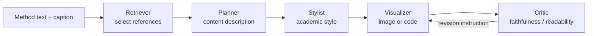

# dwzhu-pku/PaperBanana：参考驱动的学术示意图生成与批评闭环

| 字段 | 值 |
|---|---|
| GitHub | https://github.com/dwzhu-pku/PaperBanana |
| License | Apache-2.0 |
| Stars | 7,088（2026-09-16 快照） |
| GitHub 最后 push / 分析 commit | 2026-06-25 · `8364555` |
| 分析快照 | 2026-09-16；固定 commit 可由公开 GitHub 复核 |
| 产品类型 | **科研绘图**：方法/架构示意图及部分统计图，不是全链路论文系统 |
| 分析证据 | README、`agents/`、`prompts/`、`main.py`、`app.py`、LICENSE、PaperBananaBench 项目材料 |

## 1. 它到底是什么

PaperBanana 是将“方法文本 + 图注 + 沟通意图”转换为学术插图的参考驱动多 Agent 系统。它先取相似参考图，再规划内容与视觉风格，调用图像模型或代码生成，再用 Critic 对照源文本反复修正。

这与 RH 的**示意/架构图轨**高度重叠；正确关系是 RH `figure_generate` 调用/兼容这一类能力，而不是为它再写一套并行绘图平台。

## 2. 运行时堆叠

- 入口：CLI/`main.py`、Gradio `app.py`、Streamlit `demo.py`。
- 配置：`configs/model_config.yaml`（由 template 复制、被 gitignore），可选 Google / OpenRouter 等模型线路。
- 中间状态：reference、plan、style description、candidate image、critic feedback 和 refinement timeline。
- 数据：可下载 `PaperBananaBench`；没有基准时跳过 Retriever 的 few-shot 部分。
- gate：Critic loop 评审**内容/审美一致性**，没有论文 claim/evidence gate。

> 📘术语
> **参考驱动**：不是让图像模型只看一条 prompt 作图，而是先找与目标表达相似的高质量图例，把“构图/风格怎样才合适”作为后续角色的上下文。

## 3. 阶段机或 DAG

README 将 Retriever、Planner、Stylist、Visualizer、Critic 定义为五个专职 agent。对定量图，项目也承认 code 较容易保真数值，image model 较易产生视觉幻觉。

## 4. Tool / Skill / Agent 怎么切

- **Agent**：五个图生产角色。
- **Skill**：提供 ClawHub 包装；宿主可装载。
- **Tool**：项目内部调用 VLM/image provider，不是 RH 风格 MCP Tool server。
- **UI**：Gradio/Streamlit 让用户调候选数、批评轮数、比例和尺寸。

## 5. 文献怎么来、是否入库、引用约束

它不检索学术文献来撰写论文。Retriever 查的是**视觉参考集合**，目的是选图例；它既不会构建 paper pool，也不会验证正文 citation。

## 6. 实验 / 代码执行

不运行科研实验。它运行的是图像生成模型/VLM，且某些统计图可经可执行代码生成。生成图片不应被作为实验结果证据。

## 7. 写稿怎么做

不写正文。输入来自方法节和图注，输出是图及其可供论文使用的视觉资产。

## 8. 图怎么做

- 方法/架构图：视觉生成模型 + reference + critic refinement。
- 统计图：项目公开 README 仍将上传/完善统计图代码列为 TODO，故不能把它当成全面成熟的 result-figure engine。
- 已有图修改：UI 允许 refine/upscale；style-guideline 驱动的现有图改造仍在 TODO。

## 9. 和 RH 的相似点

- 都将“图的内容正确、可读、审美合适”拆成规划、生成、批评阶段。
- 都承认示意图与定量结果图不是一回事。
- PaperBanana 正好是 RH `figure_generate` 轨可连接的上游能力。

## 10. 和 RH 的不同点

- PaperBanana 没有文献、实验、写稿、发表 gate。
- RH 还保有定量 `figure_suite_plan/render`、npj Fig.1 和 Nature 构图路径；它们不能被一条通用 image pipeline 合并。
- PaperBanana 的输入是文本/参考图；RH 的定量图必须从记录的 experiment results 产生。

## 11. 优点 / 缺点

**优点**

- 五 Agent 架构、`agents/` 和 README 描述相互对得上。
- PaperBananaBench 让方法示意图有可讨论的基准，而不只是 showcase。
- UI 暴露 critic rounds、候选数等真实质量/成本杠杆。
- Apache-2.0，可作为兼容适配的工程参照。

**缺点**

- 分析 commit 的日期为 2026-06，维护节奏低于同一快照中近期活跃的 ARS/RD-Agent。
- 统计图和样式迁移的关键能力仍是 TODO。
- 参考集偏计算机科学；生图 provider/key/并发配额是运营瓶颈。

## 12. RH 可学的 1–3 条

1. **给 `figure_generate` 公开 `candidate_count`、`critic_rounds`、reference retrieval mode 和证据边界**，回写输出/成本/失败原因。
2. **把图批评拆为两种合同**：示意图检查 source-faithfulness；定量图检查 data-to-mark fidelity，后者只读 experiment record。
3. **保留 RH 既有四轨总路由**：PaperBanana 是一个 adapter/provider，不是新总线。

## 13. 名字速查表

| 名字 | 先决概念 | 含义 |
|---|---|---|
| Retriever Agent | 视觉参考集 | 选取可给下游示范的参考图 |
| Planner Agent | method text | 将科学内容转成明确的视觉计划 |
| Stylist Agent | style guide | 从参考图综合学术视觉规则 |
| Visualizer Agent | plan | 调图像模型或代码渲染视觉输出 |
| Critic Agent | source faithfulness | 检查图是否忠于输入并给返修意见 |
| PaperBananaBench | benchmark | 方法示意图参考/测试数据集 |
| `figure_generate` | RH Tool | RH 侧示意图生成的现有合同入口 |

---

> 📌事实边界
> PaperBanana 可生成漂亮图，不代表其图自动具有论文证据地位；在 RH 内，证据边界由 figure track 和 provenance 决定。