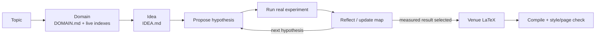

# SequenxAI/PaperClaw：将“领域—想法—假设—真跑—PDF”做成一个自主研究产品

| 字段 | 值 |
|---|---|
| GitHub | https://github.com/SequenxAI/PaperClaw |
| License | MIT |
| Stars | 低（本次快照约十余；不以此夸大成熟度） |
| 最后可读本地 HEAD | 2026-06-26 · `fd87ea2` |
| 拉取状态 | 2026-09-16 直连 GitHub SSH fetch；已与 `origin/main` 一致 |
| 产品类型 | **端到端论文生产**；与 RH 的功能覆盖最接近之一 |
| 分析证据 | README、`pyproject.toml`、`paperclaw/__main__.py`、CLI/agent 目录、LICENSE |

## 1. 它到底是什么

PaperClaw 将“给一句 topic”压缩成一条产品化路径：从在线学术索引生成 `DOMAIN.md`，产生/固定 idea，维护 hypothesis map，跑真实实验，反思结果，使用目标期刊 LaTeX 模板写作、编译并检查篇幅与样式，交付 `paper.pdf`。

它是本次最值得同 RH 对照的**小而完整产品**：相比 RD-Agent，它把论文 PDF 纳入主路径；相比 ARS，它自己拥有实验 job 和 hypothesis loop。

## 2. 运行时堆叠

- 一个 Python 包，同时提供 CLI、FastAPI 后端、React/Vite Web 与 Electron 桌面壳。
- `paperclaw run` 拥有研究控制流；可选 Anthropic/OpenAI-compatible 模型或外部 headless coding agent。
- idea workspace 持有 spec、hypothesis map、实验、图、`ref.bib`、LaTeX 源和 PDF。
- Tectonic 编译 LaTeX；Web UI 的实时流显示每个阶段。
- 状态是工作区/文件式，不是 RH 的 topic/claim/artifact 关系库。

> 📘术语
> **hypothesis map**：把候选假设、已经测试的分支、结果和下一步选择显式连成图的状态对象；它比一段“研究思路”更可恢复、更容易审计。

## 3. 阶段机或 DAG

README 明确将“从测得结果长出 hypothesis map，再写论文”作为停机逻辑：不是先写好一篇故事、再寻找支持它的数字。

## 4. Tool / Skill / Agent 怎么切

PaperClaw 主要是**自己的控制流 + coding agent**，不是 MCP Tool/Skill 平台：

- CLI 命令：`domain`、`brainstorm`、`idea`、`research`、`run`、`hypothesis`、`experiments`、`resume`。
- 内部角色：coding agent、CLI agent、deep chat 等。
- 外部模型/编码 Agent 是可换执行器。
- 没有 RH 式面向宿主的 54 Tool JSON 合同或租户数据库边界。

## 5. 文献怎么来、是否入库、引用约束

`Domain` 阶段从开放学术索引实时取得关键论文、数据集、库与 venue，形成 `DOMAIN.md`；最终 workspace 有 `ref.bib`，README 声称“validated citations”。它没有 RH 那样独立的 paper ingest、claim 与 source 关系表；对“引用是否真的支持某个句子”的可执行约束，公开材料不如 ARS/RH 明确。

## 6. 实验 / 代码执行

**真跑是其主张中心。** 假设循环的 `Propose → Experiment → Reflect` 以测得结果决定下一轮。README 还说可以接 headless coding agent。但仓库资料没有显示 RH/Arena 那样将每次执行的资源、证据边界、复核结果归入一个独立正式数据库。

## 7. 写稿怎么做

以目标 venue LaTeX 模板写作，Tectonic 编译，接着页数/样式检查，输出 PDF。它比 AI-Scientist 的模板级写作更像产品流程；但未见 RH EAG 的“先检索高质量范文形式、再做重叠批评”分层。

## 8. 图怎么做

workspace 包含 figures；README 说明可用 matplotlib/TikZ 或可选 image API。它的 image API 适于示意图，不能替代从实验记录确定性渲染的 result figure。RH 应保留 figure suite 的证据边界。

## 9. 和 RH 的相似点

- 同时覆盖领域定位、文献、方法、实验、写作、图与 PDF。
- 都承认工作流需要可恢复的中间状态。
- 都把真实实验与论文文字联系起来，而不是把写作当独立对话。
- 都有 LaTeX/PDF 产物链。

## 10. 和 RH 的不同点

- PaperClaw 拥有单体自主控制器；RH 使用 Tool < MCP < Skill，并把 Agent runtime 交给 Claude Code/Codex。
- PaperClaw 的核心状态是 idea workspace/hypothesis map；RH 的核心状态是 topic、papers、claims、evidence、artifact 与 provenance。
- RH 区分正式真实实验与 Arena path；PaperClaw 的产品流程没有这种双路径合同。
- RH 的图由四轨分工；PaperClaw 作为单体较易混同示意图和定量结果图。

## 11. 优点 / 缺点

**优点**

- README 首屏把全链路、命令和最终物清晰地压缩到一个产品叙事中。
- `DOMAIN.md` / `IDEA.md` / hypothesis map 是用户看得见、可恢复的中间物。
- 从实验到编译 PDF 的闭环较完整，MIT 许可有利于学习工程结构。

**缺点**

- 社区信号很小，且本地最新可读提交是 2026-06；不能因功能清单完整就当成熟基线。
- 公开证据显示引用/实验完整性门不如 RH/ARS 的形式化。
- 单体同时承担检索、编排、实验、写作和图，扩展到多租户/权限/服务化时边界容易变模糊。

## 12. RH 可学的 1–3 条

1. **在 RH 的正式六阶段上提供一张用户可见的 research workspace 卡**：`domain brief → candidate idea → study spec → measured registry → draft`，只投影现有 artifact，不复制单体引擎。
2. **将 propose–experiment–reflect 的停止理由固化为 artifact**：何时继续、何时选最佳、何时停止，避免只记录最终正结果。
3. **将 Tectonic 的页数/样式循环接到 RH `paper_commit_version` 前**，但保留 EAG、citation 和 final-bundle gate。

## 13. 名字速查表

| 名字 | 先决概念 | 含义 |
|---|---|---|
| `DOMAIN.md` | domain | 从实时学术索引整理出的领域合同 |
| `IDEA.md` | idea | 被固定/继续修订的具体研究方向 |
| hypothesis map | hypothesis | 连接假设、结果、反思和下一步的图 |
| `paperclaw run` | CLI | 驱动完整假设循环到论文输出的命令 |
| `ref.bib` | bibliography | LaTeX 使用的参考文献数据库 |
| Tectonic | LaTeX compiler | 自动拉依赖并编译 TeX 的工具 |

---

> 📌事实边界
> 本页的更新状态来自 2026-09-16 的本地 `git log` 与直连 GitHub SSH `fetch`；该工作树已与 `origin/main` 一致。没有 reset、rebase、强制合并或改写该竞争仓。