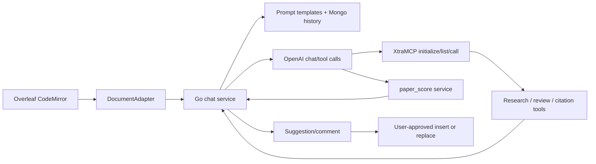

# PaperDebugger/paperdebugger：嵌入 Overleaf 的论文写作与评审助手

| 字段 | 值 |
|---|---|
| GitHub | https://github.com/PaperDebugger/paperdebugger |
| 分析提交 | `527afed307371d213c495e0444f64eb3666c617c` |
| 元数据快照 | 2026-09-17 |
| 代码许可 | AGPL-3.0 |
| 审阅状态 | draft；固定提交静态阅读，未运行 |

## 1. 它到底是什么

PaperDebugger 是一个浏览器扩展加后端服务，用于在 Overleaf 编辑器旁边阅读论文、聊天、提出写作建议、生成评论并把用户选择的内容插回文档。README 将它定位为 AI-powered academic writing assistant，并把 Research → Critique → Revision 作为多步工作流；后端是 Go/Gin + gRPC、MongoDB、JWT/OAuth 和 OpenAI 集成的微服务架构。候选元数据把它放在论文写作、审稿和编辑层。📘README 的 Chrome 用户数、版本和部署描述是项目页面信息，本次没有安装扩展、连接 Overleaf、启动 MongoDB 或调用模型。

公开的 XtraMCP 文档把高级能力分为 Researcher、Reviewer、Enhancer 和 Conference Formatter（WIP）。它列出 local vector DB 论文搜索、deep research、OpenReview/arXiv online search、review_paper、verify_citations、generate_citations 等工具；文档同时明确 XtraMCP 服务当前闭源，PaperDebugger 不连接它也能运行。🔶因此公开仓库能直接核对的是客户端/后端的 MCP 握手、工具注册和论文内容通道；高级工具的内部检索质量、重排结果和 review prompt 不应当按 README 说明视为本地可复现实现。

## 2. 运行时堆叠

运行时栈的前端部分是 TypeScript CodeMirror adapter，后端部分是 Go service、protobuf API、MongoDB 和 toolkit registry。`OverleafAdapter.getFullText`、`getSelection`、`insertText`、`replaceSelection` 把编辑器文档和选区暴露给上层；选区的 rangeId 记录 from/to，替换时可用旧范围或当前选择。`ChatServiceV2` 用嵌入模板生成系统/用户 prompt，并在 conversation 文档中保存 in-app 与 OpenAI history，列表查询最多返回 50 条摘要式会话。

后端 `prepare` 从 ProjectService 读取同步后的项目全文，并在非 debug 模式拒绝 out-of-date 项目；它不是简单把当前 CodeMirror 文档当作完整项目。新会话把项目全文放进 system prompt，续聊则追加用户消息和选区。版本同步和会话内上下文更新仍需运行验证。

## 3. 阶段机或 DAG

典型流程从浏览器 adapter 取得当前打开文档全文、选区和上下文，后端将内容放入 system/user prompt，建立对话并把历史存入 MongoDB；需要高级能力时，XtraMCP loader 先 initialize，再发 `notifications/initialized`，之后通过 `tools/list` 动态获取工具 schema 并注册到 toolkit registry。工具调用结果回到聊天流；`paper_score` 还可调用外部评分服务并记录 tool call。用户可选择插入建议或评论。

## 4. Tool / Skill / Agent 怎么切

**Agent** 主要体现为聊天模型及其工具调用循环；**Tool** 由后端 toolkit registry 管理，XtraMCP 可动态返回 schema。**Skill** 不是仓库中独立的 skill 文件，而是 Researcher/Reviewer/Enhancer 等工作流工具组合。**Environment** 是当前 project、conversation、actor 和 Overleaf 文档。loader 会扫描工具 schema 中的 `user_id`/`project_id`，标记需要安全上下文注入，避免让模型自行伪造这些身份参数。

## 5. 文献怎么来、是否入库、引用约束

XtraMCP 文档声称有约 80 万篇近期 CS 论文的向量库、语义检索和模型重排，并提供 OpenReview/arXiv 在线补充搜索；这些都是闭源服务的文档声明，本次没有查看索引或查询它。公开 loader 证明客户端能拉取工具列表，不能证明向量库规模、更新日期或检索召回率。

`verify_citations` 的文档范围是检查 bibliography、文内引用及题名/作者/venue/URL 等信息，`generate_citations` 则根据 DOI/arXiv/URL/标题生成 BibTeX。这些声明不能提升为“引文支持稿件中的对应主张已经验证”。若接入 RH，需把候选来源、全文证据和 citation-support 状态持久化，不能只保存聊天中的一段 BibTeX。

## 6. 实验 / 代码执行

论文内容处理不是本地科学实验执行器。`paper_score` 从项目取得完整内容和 category，检查同一 actor/project 的五分钟 cooldown，向 `paperdebugger-mcp-server:8000/paper-score` 发 HTTP 请求，再保存 tool call 的成功/失败记录；返回给模型的 JSON 只有 score 和 percentile，并指示下一步调用 comment 工具。XtraMCP 工具会话使用 MCP protocolVersion `2024-11-05` 的 initialize/list 交互。公开固定提交没有显示模型输出经过外部引用事实、实验数字或可复现代码的强制验证。

## 7. 写稿怎么做

README 的写作产物是聊天建议、可插入文本和 comments，而非自动覆盖 project 的静默改写。前端确实实现 `insertText` 和 `replaceSelection`，因此“只读建议”与“用户触发的写回能力”应在权限和交互上区分理解：后端可以不直接修改，但浏览器端可在用户动作后 dispatch CodeMirror changes。文件工具 `CreateFileTool` 的实现仍返回 `[DUMMY]` 信息并带 TODO，不能据此宣称后端已经完成任意文件创建。

评论按钮单独读取 CSRF 信息、连接 Overleaf socket，并带 docVersion、docSha1、quotePosition 和 quoteText 添加评论，然后通知后端哪些 comment 被接受。这里的“添加评论”与“修改论文正文”是两种动作，不应混为一个自动修订状态。

## 8. 图怎么做

README 和 XtraMCP 文档展示了产品预览图、tool overview 表和工作流说明，但没有公开定量实验图生成管线。适合的产品/研究图包括一次对话的工具调用时序、citation verification 的状态分布、建议被接受/拒绝的人工统计，以及延迟与 cooldown；所有统计都必须来自实际日志，并注明 XtraMCP 是否连接、模型、项目类别和用户决策。不能把 Chrome Web Store badge 数字当作写作质量或审稿准确率。

## 9. 和 RH 的相似点

RH 与 PaperDebugger 都关注论文内容、阶段化工具调用、审稿建议和可追踪产物。PaperDebugger 的 conversation、OpenAI history、tool call record 和 project id 可启发 RH 保存“用户看到的上下文—工具请求—工具返回—最终编辑”的链条；MCP loader 的动态 schema 和身份注入也对应工具权限合同。Overleaf adapter 对选区上下文的显式建模，对生成局部 revision 建议尤其有参考价值。

## 10. 和 RH 的不同点

PaperDebugger 是面向编辑器的产品，重点是交互体验和即时建议；RH 的重点是研究证据、实验、版本闸和可审计发布。它的 paper_score 依赖外部 MCP score 服务，工具返回 percentile 不等于独立统计审计；citation tool 的存在也不保证每条引用已被用户确认。更重要的是，公开 XtraMCP 服务闭源，且某些工具仍是 dummy/WIP，所以不能把 README 的完整 workflow 描述成固定提交内可离线复现的端到端能力。

## 11. 优点 / 缺点

**优点**：Overleaf 选区和全文接口明确；会话、项目和用户边界进入后端查询；MCP 动态工具注册保留 schema；paper_score 有 cooldown 与成功/失败记录；前端支持建议插入和选区替换。**局限**：高级 XtraMCP 不在仓库内；外部服务和 MongoDB 是运行前提；工具结果依赖远程模型/数据库；`create_file` 仍是 dummy；用户触发写回的权限、撤销和冲突处理需要真实部署验证；本次没有安装、运行或连接任何服务。

## 12. RH 可学的 1–3 条

💬以下是架构借鉴建议，不是该项目已实现的 RH 集成。

1. **记录上下文而不只记录答案**：保存全文/选区/周边文本、项目版本、工具 schema 和用户确认动作。
2. **动态工具也要有权限合同**：身份字段由宿主注入，工具调用、cooldown、外部服务和失败原因进入可审计记录。
3. **把建议和写回分开**：生成文本先作为候选 diff，只有经过用户确认、编译和证据检查才改变论文 artifact。

## 13. 名字速查表

| 名字 | 含义 |
|---|---|
| `OverleafAdapter` | 读取 CodeMirror 全文/选区并执行用户触发的插入或替换 |
| `ChatServiceV2` | 构造 prompt、保存和读取对话 |
| `XtraMCPLoaderV2` | 完成 MCP 握手、拉取工具 schema 并动态注册 |
| `ToolRegistryV2` | 后端工具名称、描述和调用入口的注册表 |
| `PaperScoreTool` | 取项目全文并请求外部 paper-score 服务 |
| `CreateFileTool` | 文件创建工具声明；当前实现返回 dummy 结果 |
| `tool call record` | 保存工具调用参数、成功结果或错误 |
| `XtraMCP` | 公开文档描述的外部研究/评审编排服务 |

---

> 📌事实边界
> 本页依据上述固定提交的公开 README 与列明源码进行静态分析，没有安装运行项目、调用外部模型/服务、下载完整外部数据或独立重算 README/论文的规模与性能数字。流程图是源码/文档结构概括，不是运行轨迹；比较 RH 的内容属于架构分析，建议属于评述。快照日期来自候选清单，不表示本次运行了该日的服务。
> 核对来源：[README.md](https://github.com/PaperDebugger/paperdebugger/blob/527afed307371d213c495e0444f64eb3666c617c/README.md)、[demo/xtramcp/readme.md](https://github.com/PaperDebugger/paperdebugger/blob/527afed307371d213c495e0444f64eb3666c617c/demo/xtramcp/readme.md)、[internal/services/chat_v2.go](https://github.com/PaperDebugger/paperdebugger/blob/527afed307371d213c495e0444f64eb3666c617c/internal/services/chat_v2.go)、[internal/services/toolkit/tools/xtramcp/loader_v2.go](https://github.com/PaperDebugger/paperdebugger/blob/527afed307371d213c495e0444f64eb3666c617c/internal/services/toolkit/tools/xtramcp/loader_v2.go)、[internal/services/toolkit/tools/paper_score.go](https://github.com/PaperDebugger/paperdebugger/blob/527afed307371d213c495e0444f64eb3666c617c/internal/services/toolkit/tools/paper_score.go)、[internal/services/toolkit/tools/files/file_create.go](https://github.com/PaperDebugger/paperdebugger/blob/527afed307371d213c495e0444f64eb3666c617c/internal/services/toolkit/tools/files/file_create.go)、[webapp/_webapp/src/adapters/document-adapter.ts](https://github.com/PaperDebugger/paperdebugger/blob/527afed307371d213c495e0444f64eb3666c617c/webapp/_webapp/src/adapters/document-adapter.ts)、[internal/api/chat/create_conversation_message_stream_v2.go](https://github.com/PaperDebugger/paperdebugger/blob/527afed307371d213c495e0444f64eb3666c617c/internal/api/chat/create_conversation_message_stream_v2.go)、[webapp/_webapp/src/components/message-entry-container/tools/paper-score-comment/add-comments-button.tsx](https://github.com/PaperDebugger/paperdebugger/blob/527afed307371d213c495e0444f64eb3666c617c/webapp/_webapp/src/components/message-entry-container/tools/paper-score-comment/add-comments-button.tsx)。
