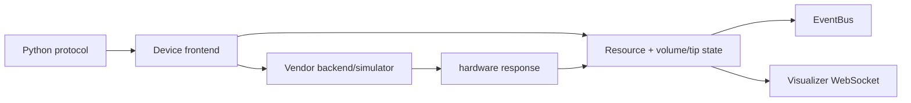

# PyLabRobot：硬件无关的实验室自动化 Python 层

| 字段 | 值 |
|---|---|
| GitHub | https://github.com/PyLabRobot/pylabrobot |
| License | MIT |
| Stars | 533（2026-09-17 冻结快照） |
| 最后 push | 2026-09-16 |
| 分析提交 | `43b7b5913f2aa49eef2f65bd1735cd3165396ade` |
| 快照日期 | 2026-09-17 |
| 产品类型 | 湿实验自动化 SDK |
| 分析证据 | `README.md`、`LICENSE`、`pyproject.toml`、`pylabrobot/resources/volume_tracker.py`、`pylabrobot/events/bus.py`、`pylabrobot/visualizer/visualizer.py`、`docs/user_guide/machines.md` |

本文用 📘 标注文档或源码中可直接定位的事实，🔶 标注由控制流推导的边界，💬 标注评价与借鉴建议。仓库动态元数据沿用候选清单，源码判断只绑定页面中的固定提交。

## 1. 它到底是什么

PyLabRobot 是硬件无关的纯 Python 实验室自动化库，覆盖液体处理机器人、plate reader、泵、秤、加热摇床、离心机、风扇和热循环仪。它是科学执行层，不是研究发现 Agent；protocol 由用户的 Python/Jupyter 脚本或上层编排系统提供。

## 2. 运行时堆叠

核心依赖很小，设备通信通过 optional extras 加入。资源树、deck、plate、well、tip 和 liquid 对象描述布局；VolumeTracker 维护 volume/pending_volume，支持 commit/rollback、容量错误和序列化；Visualizer 用 HTTP+WebSocket 推送资源与状态。

## 3. 阶段机或 DAG

用户 protocol 通常是 setup→pick_up_tips→aspirate→dispense→return_tips；frontend/backend 改变资源与设备状态，EventBus 记录事件，Visualizer 展示。

不表示有 LLM 自动生成 protocol。

## 4. Tool / Skill / Agent 怎么切

主要边界是 device frontend/backend、resources、VolumeTracker、EventBus 和 Visualizer。EventBus 是同步进程内 fan-out，listener 失败只记录日志；event_operation 发 started/failed/completed 并带 operation_id。Visualizer 序列化资源树并按类型提供 method registry。

## 5. 文献怎么来、是否入库、引用约束

README 链接 Device 论文并给出引用，但库本身没有文献检索、证据池或引用自动化；事件和状态不是论文证据。

## 6. 实验 / 代码执行

README 示例覆盖多厂商真实设备；VolumeTracker 对超容量/取液不足抛出错误，commit/rollback 管理 pending 操作；Visualizer 也可用于无硬件协议开发。本次未连接硬件。需要注意 `volume_tracker.py` 中全局 volume_tracking_enabled 默认为 False，用户可以开启或通过上下文临时关闭；因此有体积检查实现，不代表所有默认协议自动获得该检查。

VolumeTracker 的 rollback 恢复的是 Python 中 pending_volume，不会逆转已经发生的吸液、分液或污染。代码还明确不再追踪 individual liquids，旧 get_liquids/set_liquids 接口带弃用提醒；这份状态不能当作完整的化学组分账本。真实实验应把软件状态与液面检测、称量、板读仪数据和人工确认分开核验。

`docs/user_guide/machines.md` 按 WIP、Basic、Mostly、Full 区分设备支持级别，并标注 v0/v1 API 代际；旧驱动在 legacy 中迁移。README 的硬件覆盖列表因此是支持范围入口，而不是每台设备所有能力均完成实现的保证。

## 7. 写稿怎么做

不提供论文写作；protocol、event JSONL 和仪器读数可供下游报告使用。

## 8. 图怎么做

Visualizer 是资源/状态 UI，不是 publication figure generator；实验图需从读数另行生成。`visualizer.py` 默认绑定本地回环地址，分别运行 HTTP 文件服务和 WebSocket；资源新增、移除和状态变化通过 callback 推送，批量体积变化会合并发送。浏览器看到的是软件当前资源树，因此可用于核查 deck 排布和协议意图，却不能单凭界面确认液体真实到位。

EventBus 同样是观察层：有 listener 才发事件，订阅者异常不会改变设备控制流。若上层系统需要不可丢失的实验审计，必须另行配置持久化接收器和失联策略；当前进程内事件不是自动可靠的分布式消息队列。

## 9. 和 RH 的相似点

它提供科学工具执行接口、状态、事件和错误边界，可作为自动科研下层。

## 10. 和 RH 的不同点

几乎没有 LLM、文献或研究规划层，核心抽象是设备、资源和协议，比自驱实验室平台更靠近单机执行。

## 11. 优点 / 缺点

优点：跨厂商 API、资源状态检查、异步动作、事件和 simulator。缺点：硬件/固件复杂，校准和安全需用户，EventBus 不是跨服务审计库。

## 12. RH 可学的 1–3 条

1. 将资源容量和 pending/commit/rollback 作为动作约束。2. 借鉴 event_operation 事件。3. 严格分离 LLM 决策与硬件 protocol 执行。

## 13. 名字速查表

| 名字 | 先决概念 | 含义 |
|---|---|---|
| `LiquidHandler` | frontend | 液体处理接口 |
| `Backend` | driver | 设备实现 |
| `Resource` | labware tree | 实验资源模型 |
| `VolumeTracker` | state invariant | 体积校验 |
| `EventBus` | events | 进程内事件分发 |
| `Visualizer` | WebSocket UI | 资源/状态可视化 |

---

> 📌事实边界
> 本报告依据固定提交中的公开文档与实际查看的代码作静态分析。没有安装或执行被分析仓库，没有连接仪器、GPU 集群或收费模型 API。README/论文的能力和结果声明不等于本次复现；外部数据、模型权重、设备校准、部署稳定性以及科学结论的有效性均需另行验证。
