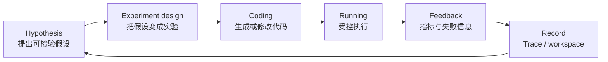

# microsoft/RD-Agent：把真实 ML 实验做成可续跑的 R&D 双环

| 字段 | 值 |
|---|---|
| GitHub | https://github.com/microsoft/RD-Agent |
| License | MIT |
| Stars | 14,648（2026-09-16 快照） |
| GitHub 最后 push | 2026-09-15 |
| 本地 HEAD | `4834df2` · 2026-09-15 |
| 产品类型 | 端到端 **ML/R&D** 系统；不是端到端论文生产器 |
| 分析证据 | README、`docs/project_framework_introduction.rst`、`rdagent/utils/workflow/loop.py`、`rdagent/components/workflow/rd_loop.py`、场景目录 |

## 1. 它到底是什么

RD-Agent 将工业研究开发拆成两个彼此闭合的角色：**R（Research）**提出可以验证的假设；**D（Development）**把假设落实为代码、执行实验、取回真实反馈。它覆盖量化因子、数据科学、Kaggle/MLE-bench 与 LLM 微调等任务。

它的“端到端”止于可度量的 R&D 结果，不包含科研论文的证据组织、期刊写作和投稿图版。因而它是 RH 的 **experiment / 方法发现** 方向竞品，而不是 EAG 写稿方向竞品。

> 📘术语
> **真实反馈**：由程序、数据集或评测器实际运行得到的指标，而不是语言模型在文字中声称“实验有效”。这是 RD-Agent 与纯 Deep Research 报告器的分界。

## 2. 运行时堆叠

- `LoopBase` / `LoopMeta` 持有循环。`LoopMeta.steps` 将公开步骤收集为可推进、可恢复的阶段表。
- `RDLoop` / `DataScienceRDLoop` 是具体场景循环；`Trace` 记录实验及其反馈之间的 DAG。
- 工作区通过 `FBWorkspace.file_dict` 保存代码快照；会话可在 `LOG_PATH/__session__` 恢复。
- `DockerEnv`、`LocalEnv`、`CondaEnv` 是执行环境；Docker 是主要隔离方式。
- 评估器、异常与循环终止条件控制继续/退回；这些是运行时控制，不是 RH 那种“必须出现某类 artifact 才能过闸”的科研证据闸。

## 3. 阶段机或 DAG

`RDLoop` 的典型动作是 `_propose`、`_exp_gen`、`coding`、`running`、`feedback`、`record`。这是一条显式的“实验—反馈—下一轮”闭环，不是一次生成一篇报告。

## 4. Tool / Skill / Agent 怎么切

- **Agent**：Research / Development、Coder、Runner 等职责角色。
- **Tool**：可接 MCP 下游工具，但项目本身并没有 RH 这种面向外部 Agent 的固定公开 Tool 合同。
- **Skill**：不是产品主抽象；场景与配置替代了 Skill 目录。
- **Scenario**：例如 `data_science`、`quant`、`finetune`，决定数据、环境、评估指标与循环组合。

## 5. 文献怎么来、是否入库、引用约束

它有 `document_reader` 等读本地或 URL 文档的能力，也可将研究材料用于模型/因子设计；但没有 topic-scoped paper pool，也没有 claim–citation 双向关系或“引用只能支持何种论断”的硬约束。文献不是其权威状态主线。

## 6. 实验 / 代码执行

**真跑。** 文件注入工作区后，由 Docker、本地 Python 或 Conda 环境执行；场景可给超时、健康检查与环境配置。它比 AI-Scientist 的默认本地运行更系统地提供了环境对象，但不等于所有场景默认绝对安全：实际隔离强度仍取决于选中的环境配置。

## 7. 写稿怎么做

没有期刊导向的正文生产链。数据科学场景可生成开发文档或报告，但没有 exemplar 检索、文段重叠门、章节证据配额或 submission bundle。

## 8. 图怎么做

实验代码可生成常规曲线/表格；没有“方法示意图 → 多模态生成 → 图像批评”的专用图形管线。

## 9. 和 RH 的相似点

- 都把假设、实验与反馈视为连续的状态，而非聊天文本。
- 都允许恢复长任务；RD-Agent 依赖 session/workspace，RH 依赖 topic/artifact/provenance。
- 都将“运行产生的结果”与后续决策连接起来。
- 都可使用多模型：RD-Agent 在 R/D 角色间拆模型，RH 在宿主/审阅/服务边界拆模型。

## 10. 和 RH 的不同点

- RD-Agent 自己实现 Agent runtime；RH 将对话循环与权限交给 Claude Code / Codex。
- RD-Agent 的中心对象是 **代码实验与指标**；RH 的中心对象是 **topic、论文、claim、evidence、artifact**。
- RD-Agent 没有 EAG、写作闸和四轨出图；RH 不应借它再造一个并行运行时。
- RD-Agent 的循环终止主要由任务/异常/指标控制；RH 的阶段推进由可审计产物和 gate 控制。

## 11. 优点 / 缺点

**优点（源码或 README 可定位）**

- `LoopMeta`、trace、workspace 和 session 恢复构成了连贯的可续跑实验模型。
- Docker/本地/Conda 环境对象把“生成代码”和“执行代码”明确分层。
- README 公开 MLE-bench 结果、种子和场景，便于外部评估。
- 2026-09-15 仍有提交，维护活跃。

**缺点（相对 RH 需求）**

- 不解决科研文献证据、论文写作与发表质量。
- 场景、组件和运行配置较多，新用户很难仅靠一个任务入口理解全链路。
- 无公共 Tool schema；接到多席位/权限产品时需另加合同层。

## 12. RH 可学的 1–3 条

1. **仅在 RH 的 experiment 后端增加 `Workspace + Environment` 执行合同**：代码快照、命令、超时、退出状态、指标和日志作为 artifact；不引入 RD-Agent runtime。
2. **让 `experiment_result` 有 trace 父子关系**：失败分支、候选分支与最终选择都可回放，避免只留下成功截图。
3. **研究/实现模型分工显式配置**：proposal 用强模型，coding 用成本更低的模型；选择记录进 provenance。

## 13. 名字速查表

| 名字 | 先决概念 | 含义 |
|---|---|---|
| `LoopMeta` | 循环 | 自动收集循环阶段方法的元类 |
| `LoopBase` | 循环 | 提供步骤推进、dump/load 等基础能力 |
| `RDLoop` | workspace、trace | R&D 双环的场景基类 |
| `Trace` | DAG | 记录实验及反馈依赖关系的有向图 |
| `FBWorkspace.file_dict` | workspace | 代码文件的可复现快照 |
| `DockerEnv` | 执行环境 | 在容器中运行生成代码的环境对象 |
| `CoSTEER` | knowledge base | 从既往编码尝试中检索经验的进化 coder |

---

> 📌事实边界
> 信息截止 2026-09-16；本页只读本地仓与公开元数据。没有运行 RD-Agent、没有使用任何竞品密钥，也没有修改竞品代码。