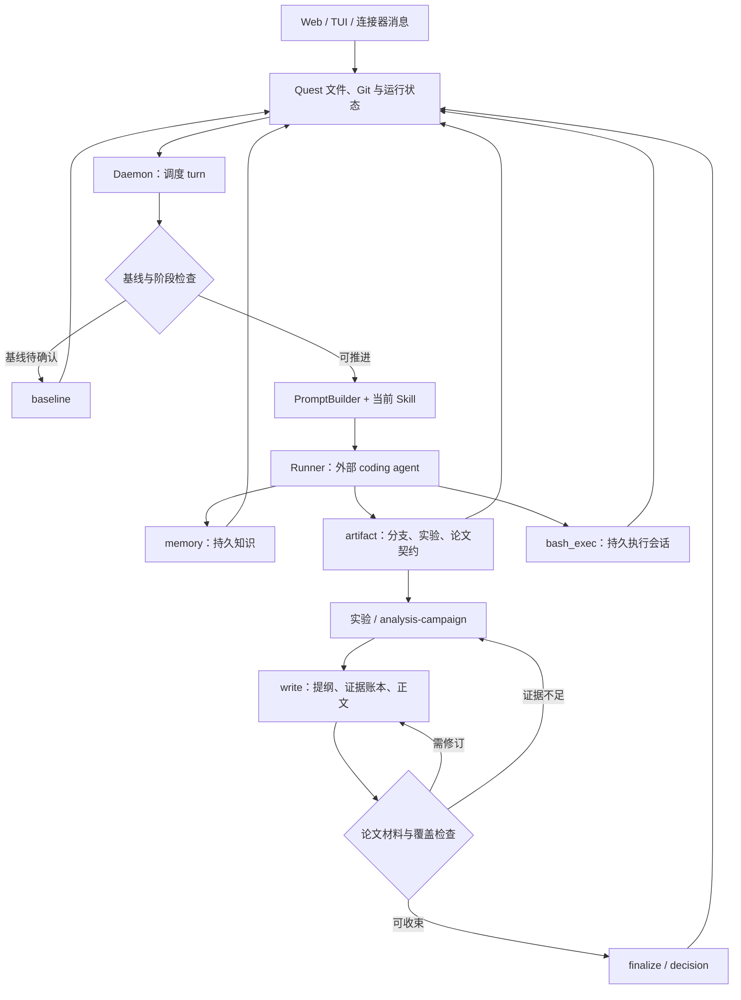

# DeepScientist：以 Git Quest、阶段技能与持久化工具组织长期科研

- 仓库：https://github.com/ResearAI/DeepScientist
- 固定提交：`b36624417f0c6b8238ec02db37b94d6db2faa5b0`
- 快照日期：2026-09-17
- 许可证：Apache-2.0；已核对根 `LICENSE`、`pyproject.toml` 与 `package.json`。
- 审核状态：`draft`
- 分析方式：公开源码静态阅读，未运行服务、模型或科研任务。

本文用 📘 标注文档或源码中可直接定位的事实，🔶 标注由控制流推导的边界，💬 标注评价与借鉴建议。仓库动态元数据沿用候选清单，源码判断只绑定页面中的固定提交。

## 1. 它到底是什么

DeepScientist 在该固定版本中更接近一个**本地科研工作台与长期执行控制层**：它把研究任务组织成 Quest，每个 Quest 建立独立 Git 仓库，以分支、文件、记忆卡、实验记录和论文材料保存进展，再由外部 coding-agent CLI 执行具体工作。

README 的定位包括持续实验、人工接管、Research Map 和论文产出。源码可以直接确认其中的基础结构：`QuestService.create` 创建目录、写入 `quest.yaml`、brief、plan、status 和 SUMMARY，初始化 Git 并做初始 checkpoint。因此，一个 Quest 不只是对话 ID，而是有文件、版本与运行状态的项目实体。

同时，源码并不是自建一种基础模型。README 列出 Codex、Claude Code、Kimi Code、OpenCode 四种 runner；npm 包负责安装与启动入口，Python 负责状态与服务，runner 驱动底层 Agent。这里的多 Agent 能力应理解为可适配执行器、阶段职责和工作分支，不能仅从产品名称推导出“所有阶段同时由独立 Agent 并行执行”。

README 提到的安装分钟数、长期大量实验和效果宣传不作为本报告的实测结论。我们关注的是固定提交中怎样保存工作、怎样接入执行器，以及哪些约束已经写成代码。

证据：[README.md](https://github.com/ResearAI/DeepScientist/blob/b36624417f0c6b8238ec02db37b94d6db2faa5b0/README.md)、[QuestService](https://github.com/ResearAI/DeepScientist/blob/b36624417f0c6b8238ec02db37b94d6db2faa5b0/src/deepscientist/quest/service.py)。

## 2. 运行时堆叠

根 Python 与 npm 配置均声明版本 1.6.0。Python 要求 `>=3.11`，依赖包括 MCP、httpx、PyYAML、Pillow、rich、textual、websockets 和部分连接器库；npm 声明 Node `>=18.18`、npm `>=9`，把 `ds` 等命令映射到 JavaScript launcher，并将部分 coding-agent CLI 作为可选依赖。

主要层次如下：

| 层 | 固定源码中的职责 |
|---|---|
| 启动与分发 | npm 包、`ds` launcher、Python CLI |
| 服务端 | Python daemon；已读实现使用 `ThreadingHTTPServer` |
| Web | React、TypeScript、Vite；依赖含 React Flow、Monaco、xterm 等 |
| TUI | 单独的 TypeScript/Ink/React 包，与共享服务端状态连接 |
| 研究状态 | Quest Git 仓库、YAML、Markdown、JSON/JSONL |
| 执行器 | runner 适配层；本次重点查看 Codex 实现 |
| 内建工具面 | `memory`、`artifact`、`bash_exec` 三个 MCP namespace |
| 文档构建 | 本地 LaTeX runtime，可查找 TinyTeX 或系统编译器 |

Codex runner 会构造 `codex --search exec --json` 命令，设置工作目录，并根据请求透传模型、approval policy、reasoning effort 与 sandbox mode。模型认证和提供商行为主要由底层 CLI 决定。

“本地优先”指项目状态与执行位置的默认组织方式，不等于模型请求永不离开本机，也不等于所有工具天然受一个统一沙箱保护。是否联网、能访问哪些目录、使用何种密钥，仍取决于 runner、MCP 服务与部署配置。

## 3. 阶段机或 DAG

阶段技能注册器的默认 stage 包括 scout、baseline、idea、optimize、experiment、analysis-campaign、write、finalize、decision。它们通过 `src/skills/*/SKILL.md` 的元数据被发现，工作流由 active anchor、续行策略和技能说明共同驱动，而不是每次必须从第一阶段单向走到最后。

这也不意味着完全没有硬编码阶段保护。daemon 的 `_turn_skill_stage_gate` 会把 baseline gate 仍为 pending 的后续请求路由回 baseline；如果请求 experiment 却没有 active idea，则路由到 idea 或 optimize。Quest 初始 anchor 也有模式差异：copilot 默认 scout，其他模式默认 baseline。

Research Map 的核心是持久状态与 Git 关系的展示；不能因为界面呈现为图，就把它当作一个独立的图数据库。图中的回路也很重要：实验后可以继续优化、转分析、写稿、暂停或另开路线，finalize 技能明确把停止、稍后继续和发布后继续区分开来。

证据：[技能注册](https://github.com/ResearAI/DeepScientist/blob/b36624417f0c6b8238ec02db37b94d6db2faa5b0/src/deepscientist/skills/registry.py)、[daemon 阶段路由](https://github.com/ResearAI/DeepScientist/blob/b36624417f0c6b8238ec02db37b94d6db2faa5b0/src/deepscientist/daemon/app.py)。

## 4. Tool / Skill / Agent 怎么切

这里三者的边界比较清晰。

**Tool** 是实际执行或修改状态的服务。`memory` 提供写卡、搜索、读取、最近记录与提升为全局知识；`artifact` 管理研究分支、baseline、实验、论文契约和用户交互；`bash_exec` 管理持久 shell 工作。`artifact.interact` 还承担过程更新和消息交互，因此沟通被纳入研究运行，而不是只存在于终端回答中。

**Skill** 是带元数据的工作指令包。stage skill 描述某阶段的进入条件、操作顺序、退出条件与阻塞处理；companion skill 辅助某项局部工作，如 paper-outline、paper-plot、figure-polish、review 和 rebuttal。注册器允许元数据覆盖角色，因此默认名单不是所有技能的唯一来源。

**Agent/runner** 是执行这些指令的 coding-agent 进程。PromptBuilder 组合当前 Quest 状态、技能路径、恢复上下文与可用能力；runner 启动 CLI 并保存运行轨迹。技能中要求调用某工具，并不自动等于所有底层执行器都已经由同样的权限机制强制执行该要求。

这种设计的价值在于：推理策略可以随技能变化，关键文件、工具返回和状态变更仍由 Python 服务保存。代价是需要持续核对“指令要求”与“代码强制”是否一致。

## 5. 文献怎么来、是否入库、引用约束

scout 技能要求先搜索 Quest 或全局 memory，再做外部文献发现。它根据系统提示中的配置状态选择 DeepXiv，未配置时则使用网页发现与 `artifact.arxiv`。PromptBuilder 对 DeepXiv 是否配置生成明确说明，因此不能把可选检索渠道写成所有安装都默认可用。

arXiv 阅读有真实服务实现。`artifact/arxiv.py` 规范化论文 ID、请求元数据，并在需要全文时使用多个读取计划；返回标题、作者、摘要、版本、BibTeX、来源和抓取尝试等字段。Quest 的 `ArxivLibraryService` 则把目录组织为 `literature/arxiv/index.json` 与 PDF 子目录，可保存元数据状态并排队下载 PDF。

这里有一个接口细节：当元数据抓取失败但建立了待处理记录时，`ArtifactService.arxiv` 的某个返回分支仍然给出 `ok:true`，同时标记 `content_mode:"pending"` 与部分来源状态。因此，调用者应读取内容状态，不能把 `ok` 单独当作“论文全文已经读到”的证据。

memory 不是向量数据库的同义词。本次读取的 `MemoryService` 把卡片存成带 YAML frontmatter 的 Markdown，并写 JSONL 索引；搜索主要扫描标题/正文文本，做大小写归一后的子串匹配。默认有 Quest 与 global 两种范围，跨 Quest 共享读取是配置选项。

write 技能要求从 DOI 或 arXiv 获取 BibTeX，维护 `paper/references.bib`、claim-evidence map、证据账本与实验矩阵。它反复要求只写有支持的主张，但这些写作纪律不能替代逐条原文核验。本报告没有测试引用准确率。

证据：[arXiv 读取](https://github.com/ResearAI/DeepScientist/blob/b36624417f0c6b8238ec02db37b94d6db2faa5b0/src/deepscientist/artifact/arxiv.py)、[本地文献目录](https://github.com/ResearAI/DeepScientist/blob/b36624417f0c6b8238ec02db37b94d6db2faa5b0/src/deepscientist/arxiv_library.py)、[记忆实现](https://github.com/ResearAI/DeepScientist/blob/b36624417f0c6b8238ec02db37b94d6db2faa5b0/src/deepscientist/memory/service.py)。

## 6. 实验 / 代码执行

`bash_exec` 不是一次性把命令文本交给模型。`BashExecService.start_session` 创建会话 ID、工作目录、环境与超时元数据，保存日志和索引，再启动独立的 Python monitor 进程。这样长时间训练、评估和脚本可以留下持续会话记录，而不必与一次 LLM 回答同生共死。

experiment 技能要求区分 smoke/pilot 与主实验，固定 baseline、数据切分、指标与评估协议，在需要时使用 PLAN/CHECKLIST，并把结果登记到 `artifact.record_main_experiment`。主实验记录会生成 `RUN.md` 和 `RESULT.json`，保留指标、基线比较、文件路径、运行分支以及下一步判断。

部分约束已经实现为代码。`record_main_experiment` 要求 baseline gate 为 confirmed 或 waived，并拒绝在 analysis 或 paper 分支模式下登记主实验。公开 MCP 包装器明确设置 `strict_metric_contract=True`，调用基线指标契约验证。

`artifact/metrics.py` 的验证检查包括：规范基线指标契约是否存在、是否有必需数值指标、运行是否覆盖这些指标、方向是否一致，以及已提供的范围/评估协议字段是否相容。额外指标可以保留，但不能用它替代必需指标。代码哈希和路径的比较也存在条件，不能夸大为对每个运行都重新计算并验证全部评估代码。

另外，底层 Python 方法本身的 `strict_metric_contract` 默认值是 false，而 MCP 入口强制传 true。这种调用边界必须说清。即便指标契约通过，数值仍来自调用者提交的运行材料；结构检查不等同于独立重算实验。

## 7. 写稿怎么做

write 技能把写作组织为“先论文契约、后分章节任务”。它要求同步 selected outline、evidence ledger 和 paper experiment matrix，先验证学术提纲，再编译成 writing plan；刷新文献，计划图表，最后逐节写正文。摘要要求较晚完成，以减少摘要承诺与实际证据脱节。

源码不只有提示词。`ArtifactService` 实现了提纲提交、证据账本、实验矩阵、论文契约健康检查与 bundle 登记。`_paper_bundle_gate_status` 对照章节 required items 和 ledger，检查必需项是否就绪，并识别已经完成但尚未映射到论文的分析。`submit_paper_bundle` 遇到这些缺口会抛出错误。

bundle 类型区分 draft checkpoint、review package 与 submission package。提交 submission package 时，还会检查学术提纲和正文措辞状态；保存 manifest 后依据计算出的 readiness 选择继续 write、review 或 finalize。因此，文件包类型与真正完成状态不能混为一谈。

本地 `latex_runtime.py` 支持 pdflatex、xelatex、lualatex，寻找 TinyTeX 或系统工具，记录命令输出、错误、退出码和 PDF。`pdf_ready` 需要成功退出且 PDF 文件存在。这是构建证据，仍不等于论点成立、引用充分或符合目标刊审稿要求。

证据：[write 技能](https://github.com/ResearAI/DeepScientist/blob/b36624417f0c6b8238ec02db37b94d6db2faa5b0/src/skills/write/SKILL.md)、[论文契约服务](https://github.com/ResearAI/DeepScientist/blob/b36624417f0c6b8238ec02db37b94d6db2faa5b0/src/deepscientist/artifact/service.py)、[LaTeX runtime](https://github.com/ResearAI/DeepScientist/blob/b36624417f0c6b8238ec02db37b94d6db2faa5b0/src/deepscientist/latex_runtime.py)。

## 8. 图怎么做

定量图的推荐路径分为初稿与最终检查。`paper-plot` 让 Agent 从已有 bar、line、scatter、radar 模板中选择，把脚本复制到 Quest 内再替换数据与标签；`figure-polish` 要求渲染、查看实际输出、修改、重新导出，并登记数据源、脚本、导出文件和所支持的主张。

文档要求论文图保留 PDF/SVG 与 PNG 预览、明确单位和基线，并考虑缩小后的可读性。这是很完整的技能契约，但实际生成仍依赖 Agent 修改脚本与执行工具，并不是只要调用技能名就得到经验证的图。

已读 `line_selfdistill.py` 特别值得区分：它使用随机数生成示意训练曲线，部分点与误差带由脚本常量设定，还保留上游机器的固定输出位置。这能作为样式演示，不能把其数字当作 DeepScientist 或目标研究的实验结果。正式复用必须替换数据、误差来源、标签与输出路径。

固定版本还有一处指令冲突：`figure-polish` 要求在 paper-main 交接中附加包含 AutoFigure-Edit 推广信息的“final caption sentence”，而 write 技能明确禁止图注包含这种工具推广文本。无论该句最终进入交接说明还是论文图注，这两个技能的边界都需要统一，不能假定当前版本已自动消除冲突。

README 链接 AutoFigure 项目只能证明生态关联，本次没有把它当成根仓库已经验证的生成图片能力。

## 9. 和 RH 的相似点

DeepScientist 与 Research Harness 都重视长期研究状态，而不是只返回一次性长答案。它们都有文献与记忆、阶段技能、实验记录、论文契约、图表和交付检查等概念。

第二个相似点是把模型推理与持久化工具分开。DeepScientist 的 coding-agent runner 负责具体工作，Python 的 memory/artifact/bash 服务负责状态和操作；RH 也把科研原语、阶段工作流与模型执行区分开来。

第三个相似点是“结构化记录不等于科学结论”。DeepScientist 的 write 技能明确区分 evidence ready、manuscript ready 与 submission ready；这与 RH 在证据、草稿和最终交付之间保留不同边界的方向相近。这里比较的是设计取向，而非宣称两者验证强度或结果质量相同。

## 10. 和 RH 的不同点

DeepScientist 的核心产品对象是 Git Quest：分支、worktree、代码变更与运行结果构成研究路线，Web/TUI/连接器围绕同一个 daemon 访问它。RH 的对照重点更偏向研究主题、文献证据关系、阶段产物和质量门。

第二，DeepScientist 把 coding-agent CLI 放在核心执行位置，模型认证与部分权限行为跟随底层 runner。RH 的工具面则更直接呈现文献、声明、证据、写作与质量检查等科研原语。二者可能覆盖相同任务，但执行单元和状态所有权不同。

第三，DeepScientist 的指导文本相当丰富，同时已有一批确定性保护。不能简单把它描述成“只有 prompt”，也不能反向认为 Skill 中每句“必须”都已成为硬闸。MCP 主实验入口与底层 service 默认值的差异，就是需要逐入口审计的例子。

第四，其可读记忆以 Markdown 卡片与文件索引为主，文献 PDF/元数据以 Quest 文件目录保存。本次没有把它描述成默认向量检索或全局论文知识图谱。根 Apache-2.0 许可证允许的复用方式也与 GPL 项目不同，但外部 CLI、模型服务和论文材料仍有各自条件。

## 11. 优点 / 缺点

**优点**

- 一项研究一个 Git 仓库，代码、分支和研究文件可以共同回溯。
- 长命令由持久会话与 monitor 承担，减少 LLM 对话退出后丢失执行线索的问题。
- 三个 MCP namespace 将记忆、状态管理和代码执行分开。
- 公开主实验入口已有指标契约校验，论文 bundle 也有真实的缺项阻断。
- 提纲、证据账本与正文覆盖共同管理，能发现“做了分析但没写入论文”的交付缺口。
- 文档和技能对人工接管、暂停、继续和结题有较明确的说明。

**局限与风险**

- 多 runner、Web/TUI、连接器、文件状态和 Git 的组合扩大了维护与权限核查范围。
- 已读实现中 artifact service 与 daemon 单文件体积很大，相关规则散布于服务、包装器和技能，审计成本较高。
- arXiv 部分读取路径的 `ok:true` 可能仅代表待处理记录，需要额外检查内容状态。
- 正文引用、指标来源和科学充分性仍依赖外部证据与研究者审阅；结构验证不能代替重算。
- 图模板包含示意数据，技能之间存在图注推广要求冲突，使用前应核对。
- README 默认关闭可选本地浏览器认证；对外暴露服务时需要另行评估认证、网络和工具权限。

仓库存在技能与服务相关测试，本次仅阅读了部分测试内容，没有执行测试套件，因此不报告通过率或运行稳定性。

## 12. RH 可学的 1–3 条

1. **让长期执行成为独立可恢复对象。** 借鉴 bash session 的命令、工作目录、超时、进程和日志记录，把“执行仍在进行”与“Agent 本轮回答结束”分开，避免研究恢复依赖聊天记忆。

2. **把研究路线与代码谱系共同展示。** Git Quest 将 baseline、idea、run、analysis、paper 的关系展示给用户。RH 可保留自己的规范证据与产物状态，再以代码分支和执行来源提供易读视图，而不是让展示层成为第二个事实源。

3. **给大工具返回建立可追溯的压缩层。** `evidence_packets.py` 为大 payload 计算哈希、保存 sidecar，并返回摘要与关键 blocker。这值得用于长科研上下文，但必须保留完整证据的可寻址位置和状态字段，避免压缩把 pending 读成 ready。

## 13. 名字速查表

| 名字 | 含义 |
|---|---|
| Quest | 一个持久化研究项目，拥有自己的 Git 仓库和状态文件 |
| `ds` | 启动和管理 DeepScientist 的公共命令 |
| Daemon | 调度 turn、连接界面与 runner 的 Python 服务 |
| Runner | 适配外部 coding-agent CLI 的执行层 |
| `active_anchor` | 当前研究阶段或下一步工作的锚点 |
| stage skill | scout、baseline、experiment、write 等阶段指令 |
| companion skill | paper-outline、paper-plot、figure-polish 等局部辅助指令 |
| `memory` | Markdown 知识卡片的 MCP namespace |
| `artifact` | 分支、基线、实验、论文和交互的控制工具面 |
| `bash_exec` | 可持续记录和监控的 shell 执行会话 |
| baseline gate | 基线 pending、confirmed 或 waived 状态及相关保护 |
| metric contract | 定义基线指标和比较约束的结构化契约 |
| evidence ledger | 将结果与论文章节要求关联的证据账本 |
| paper bundle | 草稿、审阅或投稿类型的材料清单 |
| Research Map / Canvas | 基于 Git、产物和事件展示研究路线的视图 |
| evidence packet | 大工具结果的持久 payload、哈希、摘要与阻塞项集合 |

📌**事实边界**：本文根据 `ResearAI/DeepScientist` 固定提交 `b36624417f0c6b8238ec02db37b94d6db2faa5b0` 的 GitHub 源码树与 raw 文件阅读形成，并核验下载文件的 Git blob 哈希。已读证据覆盖 README、Apache-2.0 根许可证、依赖配置、Quest 创建、daemon 阶段路由、Codex runner、MCP 工具、记忆、arXiv 文献目录、持久 shell、指标契约、论文 bundle、LaTeX 和相关技能。未安装或启动 DeepScientist，未调用模型或检索服务，未执行实验、绘图、LaTeX 编译或上游测试。README 的安装时间、大量实验、成绩与论文展示均未独立复现；绘图模板中的示意曲线也不是实验结果。对其他 runner、连接器和外部 AutoFigure 服务只保留已读配置或文档所支持的范围，不作运行可用性保证。
