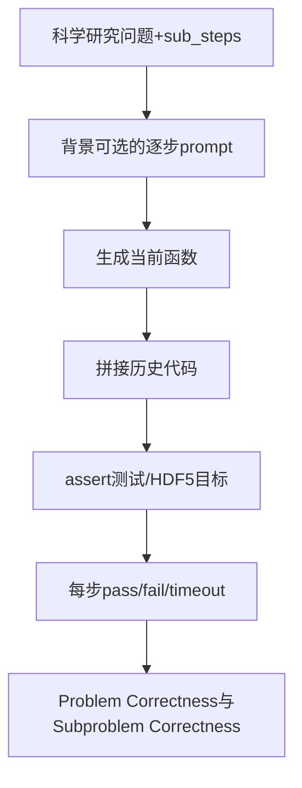

# scicode-bench/SciCode：SciCode 的公开源码合同

| 字段 | 值 |
|---|---|
| GitHub | https://github.com/scicode-bench/SciCode |
| License | Apache-2.0（根 `LICENSE` 已查阅，与 GitHub API 一致） |
| 分析 commit | `e3158ea011d4235245a547460d3688d7ccbf9900` |
| 产品类型 | 科研/机器学习 Agent benchmark 与执行评测 |
| 直接证据 | `README.md`, `LICENSE`, `pyproject.toml`, `src/scicode/parse/parse.py`, `src/scicode/compare/cmp.py`, `eval/inspect_ai/scicode.py` |

本文用 📘 标注文档或源码中可直接定位的事实，🔶 标注由控制流推导的边界，💬 标注评价与借鉴建议。仓库动态元数据沿用候选清单，源码判断只绑定页面中的固定提交。

## 1. 它到底是什么

SciCode 是由科学家策划的科学研究编程 benchmark。README 说明它覆盖物理、数学、材料、生命和化学五个大域、16 个子领域，80 个主问题分解成 338 个子问题，要求模型把研究级科学问题转为代码。它区别于考试式问答，强调数值方法、系统模拟和科学计算，并提供可选背景说明、科学家标注的 gold solutions 和测试用例。

## 2. 运行时堆叠

src/scicode 提供代码解析、模型输出处理和数值/结构比较；eval/inspect_ai/scicode.py 将 Hugging Face 数据集转换为 inspect_ai Sample，solver 按 sub_steps 逐步生成代码，保留之前步骤并可选择 background；ScicodeEvaluator 把生成代码与 HDF5 测试数据组合成断言脚本，再逐步运行。

## 3. 阶段机或 DAG

流程是问题与 sub_steps→逐步 prompt→每步 Python 代码→拼接前序代码→测试用例执行→按主问题和子问题统计。

源码将每个测试脚本的 return code 区分为 pass、fail 和 timeout，并缓存 evaluation logs。

## 4. Tool / Skill / Agent 怎么切

Solver、ScicodePromptingAssistant 和 ScicodeEvaluator 是 Agent/执行/评分核心；inspect_ai 提供 dataset、solver、scorer 和 metric。`with_background` 控制是否加入科学背景，`mode` 可用 normal/dummy/gold 进行评测控制。它没有文献检索或论文写作 skill。

## 5. 文献怎么来、是否入库、引用约束

问题来源和科学背景由 benchmark 数据集及论文说明承载；README 提供 SciCode 论文和科学家策划说明。代码中的 gold code/test case 是评价参照，不构成运行时 citation graph，也没有页码级证据约束。

## 6. 实验 / 代码执行

每个 subproblem 生成代码后，评估器创建临时脚本并以 Python 运行，单步 timeout 为 1800 秒；测试通过数用于 `Problem Correctness` 和 `sub_problem_correctness`。README 的 leaderboard 是已有项目结果；本次没有下载 HDF5、调用模型或运行 inspect_ai。

## 7. 写稿怎么做

核心结果是代码文件、prompt、日志和 correctness metrics；没有论文章节生成或数字—文字一致性检查。

## 8. 图怎么做

README 有 leaderboard 和网站图表，仓库代码负责评测而非 publication 图套件。没有统一 figure plan、图注溯源和视觉 QA。

## 9. 和 RH 的相似点

与 RH 都强调把复杂任务拆为可追踪步骤、保留中间代码和执行测试，并将失败步骤纳入结果。SciCode 的逐步函数与测试日志可启发 RH 的实验子任务 artifact。

## 10. 和 RH 的不同点

SciCode 衡量科学代码是否通过给定测试，不能证明研究问题选择、假设新颖性、统计合理性或文献结论。RH 还需 evidence、实验设计、写作和发布门；gold test 的通过不是现实研究的充分条件。

## 11. 优点 / 缺点

优点：真实研究问题、科学家标注、分步结构、数值测试和 inspect_ai 集成清楚。缺点：测试覆盖有限时可能只衡量实现匹配，执行时间和依赖重，特殊跳过步骤需谨慎解释，榜单数字来自既有运行，缺少文献和稿件证据层。

## 12. RH 可学的 1–3 条

1. 将研究代码拆成子任务并让每步有可执行测试。
2. 保存生成代码、测试日志和超时状态，而不是只存最终分数。
3. 将代码通过与科学结论有效性分开。

## 13. 名字速查表

`ScicodePromptingAssistant`：逐步 prompt/代码历史；`scicode_solver`：inspect_ai solver；`ScicodeEvaluator`：执行测试；`Problem Correctness`：主问题通过率；`Total Correct/Steps`：子问题统计；`with_background`：科学背景开关。

补充核验：评测器把每个子步骤写入临时脚本并运行测试，缓存 pass/fail/timeout 日志；它确实提供了执行层反馈。与此同时，测试通过只表示给定测试用例在给定环境中通过，不能推出生成算法在未覆盖输入上的科学正确性或研究贡献。

> 📌事实边界：本页依据 `e3158ea011d4235245a547460d3688d7ccbf9900` 固定公开源码快照、2026-09-17 `data/candidates-staging.jsonl` 元数据和下列实际查看文件静态撰写（`README.md`、`LICENSE`、`pyproject.toml`、`src/scicode/parse/parse.py`、`src/scicode/compare/cmp.py`、`eval/inspect_ai/scicode.py`、`eval/inspect_ai/README.md`、`eval/scripts/gencode.py`、`eval/scripts/test_generated_code.py`）。没有把 README 的榜单、论文结果或运行说明当作本次实测；未调用未配置的模型/API，未运行完整 benchmark（除非明确另有说明），未据此声称运行效果。
