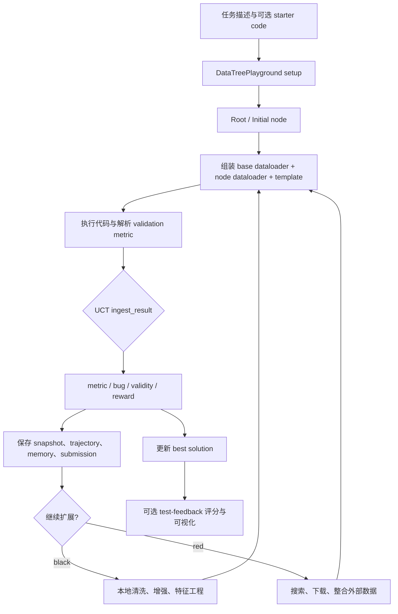

# DataMaster：以 DataTree 和 UCT 搜索驱动数据工程改进

| 字段 | 值 |
|---|---|
| GitHub | https://github.com/sjtu-sai-agents/DataMaster |
| 分析 commit | `bdecba346277bdad43c63e5003d4f9fe13689803` |
| 快照日期 | 2026-09-17 |
| Stars | 49（候选冻结元数据，不代表效果评分） |
| 最后 push | 2026-05-17（候选冻结元数据） |
| 许可 | 根目录 LICENSE 为 Apache License 2.0；仓库内 vendored `mle-bench/LICENSE` 另有 MIT 说明 |
| 产品类型 | 面向 MLE-Bench 的数据工程 Agent 与 DataTree 搜索框架 |
| 审阅状态 | draft；固定提交静态阅读，未运行 |

本文用 📘 标注文档或源码中可直接定位的事实，🔶 标注由控制流推导的边界，💬 标注评价与借鉴建议。仓库动态元数据沿用候选清单，源码判断只绑定页面中的固定提交。

## 1. 它到底是什么

DataMaster 面向机器学习任务中的数据侧改进。它以一个固定建模算法或 starter solution 为背景，让 Agent 搜索数据加载、清洗、特征工程、外部数据引入和可复用数据资产，而不是让 Agent 任意重写整个训练算法。仓库 README 将其定位为 Data-Centric Autonomous AI Research，并明确当前开源发布范围主要是 MLE-Bench workflow；PostTrainBench 在 README 中仍属于路线图项目。

项目建立在 EvoMaster 之上。DataMaster 的专用逻辑集中在 `playground/data_master`，包括 DataTree playground、initial/black/red 节点实验和数据任务提示词；通用的 Agent、工具、session、skill、memory 与环境抽象位于 `evomaster`。因此，DataMaster 不是一个单独的小型数据清洗脚本，而是“通用科研 Agent 运行时 + 数据工程搜索策略 + MLE-Bench 执行/评分接口”的组合。

DataTree 的节点语义很明确：initial 从任务与初始代码生成基线；black 主要在现有本地数据上做清洗、增强、特征工程和 DataLoader 改造；red 通过搜索工具发现、下载并引入外部数据源。每个节点最终仍要产生可执行代码、运行结果和 metric review。系统通过 UCT 管理探索与利用，并把代码、轨迹、输出、submission 和数据链接保存到 workspace。

仓库根 LICENSE 是 Apache 2.0。`mle-bench/LICENSE` 的 MIT 说明同时指出它只适用于仓库中的相关代码，不覆盖运行时下载的外部数据和文件。实际使用时应分别核对主仓库、vendored benchmark 工具和外部数据的许可，不应只根据根目录一个字符串判断全部资产可再分发。

## 2. 运行时堆叠

DataMaster 的运行时可分为六层。

| 层 | 主要组件 | 作用 |
|---|---|---|
| CLI 与配置 | `run.py`、YAML/JSON configs、环境变量 | 选择 agent、任务、初始代码、测试反馈与运行参数 |
| Playground | `DataTreePlayground` | 初始化 workspace、grading server、worker、UCT manager 和并行循环 |
| Exp | `InitialExp`、`BlackExp`、`RedExp` | 为具体节点准备提示词、调用 Agent、组装代码、执行并解析指标 |
| EvoMaster Agent | `BaseAgent`、上下文管理、tool registry、trajectory | 维护对话、执行工具、压缩上下文和记录轨迹 |
| 环境与工具 | local/Docker session、Bash、MCP operate/search/memory 工具 | 读写代码、搜索数据、执行训练与验证、保存数据索引 |
| 搜索状态与产物 | `UCTNode`、UCTSearchManager、snapshots、memory_tree、submission | 记录节点树、metric、reward、代码、stdout、提交文件和共享数据知识 |

配置文件中的 LLM 使用 OpenAI-compatible provider、模型、API key 和 base URL 环境变量；Agent 也可配 max turns、上下文长度和截断策略。示例配置同时描述 local 与 Docker session、CPU/GPU 资源、并行度、grading server、日志和 workspace 路径。配置是可调整模板，不能当作本次已实际分配了四张 GPU 或已启动容器的运行记录。

EvoMaster 的 Skill 有三级语义：YAML frontmatter 的轻量 meta info 常驻上下文；完整 `SKILL.md` 或 `job_submit.md` 按需加载；scripts 作为可执行资产。DataMaster 的 `black-dataops` 进一步规定 black 节点只改 DataLoader 层，保留验证可比性，不搜索或下载新数据。Skill 是 Agent 的行为指导和工具发现层，不是指标结果本身。

## 3. 阶段机或 DAG

DataMaster 的主要控制流如下。它是根据固定源码整理出的架构图，不代表本次运行轨迹。

`run.py` 负责根据参数创建 playground。初始阶段由 worker 0 串行执行 initial；初始节点完成后，playground 批量建立 red 和 black 子节点，再由 worker 线程从 execution heap 取节点。每个节点执行完成后，`_execute_and_process_node()` 将结果写入 UCT 节点，复制 submission，构造 review，调用 `ingest_result()`，写 snapshot 和 trajectory，并按配置保存 memory tree storage。

默认 UCT 配置中 black 子节点上限为 5，red 子节点上限为 1，buggy penalty 为 1000，metric improvement threshold 为 0.0001。buggy 节点并不立即被设成 terminal，而是保留受惩罚的修复/扩展机会；代码还用 `expected_child_count` 防止无限扩展。是否真正走到哪些节点取决于 max_steps、节点状态、资源、模型回复和执行结果。

DataMaster 提供 test-feedback 模式，但 CLI 要求同时明确 `--force-minimize` 或 `--force-maximize`。默认模式先用 validation 输出进行 metric parsing；测试反馈模式则调用 grade code，再由测试 metric Agent 解析测试集分数。两条路径的分数语义不同，不能把 validation metric 和 test score 混写成同一项结果。

## 4. Tool / Skill / Agent 怎么切

**Agent** 是 EvoMaster 的对话执行单元。配置中 initial Agent 负责初始代码，black Agent 负责数据增强和特征工程，red Agent 负责外部数据搜索与引入，metric Agent 负责从代码/stdout 或 grade 输出解析指标。`BaseAgent._step()` 查询 LLM、记录 raw response、执行工具调用、把工具响应加入对话，并把步骤追加到 trajectory；无工具文本不一定立即结束，除非配置允许文本响应直接完成或 Agent 工具被禁用。

**Tool** 包含三组主要能力。operate-submission MCP 允许读取、写入、修补、运行、验证和评分；memory tree 工具维护节点记忆、全局记忆和数据链接；search 工具连接 web、GitHub、Hugging Face、arXiv、Google Scholar 或 DBLP 等外部来源。black/red 的 `for_datanode.py` 明确要求只修改 dataloader 文件，template 从父节点继承并只读。工具返回字符串或 JSON，最终由 Agent 和运行时逻辑决定如何解释。

**Skill** 是分层指导。`black-dataops` 要求 black 专注于本地数据处理，不搜索或下载新数据；`dataset-search-tools`、`memory-tools` 和 `operate-tools` 则提供外部数据搜索、记忆和提交操作规范。Skill 的 meta info、全文和 scripts 分层加载，便于上下文控制，但 Skill 文本本身不能证明 Agent 遵守了每条规则，也不能证明生成数据没有泄漏。

**编排边界** 在 Playground。它创建 worker Agent、按阶段选择实验类、处理并发和共享状态；Exp 类则负责节点级 prompt 与文件合同。这样做的好处是可以在同一个执行框架中换数据任务，但也意味着需要同时审计配置、Agent 对话、MCP server、session 和 playground 的共享文件。

## 5. 文献怎么来、是否入库、引用约束

DataMaster 不是以学术论文写作作为主要产品输出，文献检索是数据和方法发现的辅助工具。`search_scholar.py` 暴露 arXiv 作者/内容搜索、Google Scholar 请求以及 DBLP 论文、作者和 venue 搜索。返回内容包含标题、作者、日期、摘要、URL、PDF 或 venue 等元数据；这些结果主要进入 Agent 上下文，并不自动转换成统一的 paper 对象。

DataMaster 的核心“来源”更多是数据集和数据处理知识。memory tree 中的 `data_link.json` 记录数据集名称、dataset_id、路径、初始描述和节点评论；`add_new_data()` 为新数据生成 ID，`add_data_record()` 记录节点对数据的评论。节点 memory 还保存 `trajectory.json`、`code.py`、`stdout.txt` 和可选 `submission.csv`。这些是可追溯的运行/数据记录，但不是带 DOI、页码、claim、evidence span 和支持强度的学术引用库。

red 节点会加载数据加载、操作工具、memory tree 和搜索工具说明，Agent 可通过外部搜索发现新数据并把处理后的数据放入 `data_links`。配置中搜索 server 通过环境变量传入 token；源码没有把下载数据的许可证、版本、校验和或来源页面自动提升为必须通过的证据对象。README 也明确外部数据、MLE-Bench 数据、模型 checkpoint 和生成 artifact 不包含在仓库中，需要用户另行准备。

因此，若用 DataMaster 产出科研报告，检索到论文或数据源不能直接视为可引用证据。应补充来源 URL/DOI、访问日期、数据版本、许可证、文件 checksum、处理步骤和与最终主张的对应关系。当前固定提交中没有看到论文写作阶段的逐句引用约束，也没有看到将搜索结果纳入发布门禁的主流程。

## 6. 实验 / 代码执行

DataMaster 的实验执行对象是一个节点。InitialExp 可从四种输入模式中选择：初始代码与指令都提供、只提供代码、只提供指令或自由模式。它要求 Agent 生成 template 和 dataloader 文件，再通过 `_assemble_code()` 将 base dataloader、节点 dataloader 和 template 拼接成 `code_<node_id>.py`，之后调用运行工具并让 metric Agent 解析结果。

BlackExp 和 RedExp 都从父节点复制 template，但分别修改 dataloader。Black 的提示词聚焦清洗、预处理、特征工程、增强和本地派生数据；red 的提示词允许外部数据搜索、下载、格式转换和合并。两类实验最终都会组装代码、运行代码并解析 metric。black-dataops skill 要求保留验证划分，避免把外部数据无条件混入验证集；这是提示和工具合同，固定源码并不能证明每个模型回复都执行了它。

运行工具在 separated mode 下先组装代码，再根据显式 `CUDA_VISIBLE_DEVICES` 或自动选择逻辑设置 GPU，尝试选 CPU 核心并用 `taskset` 运行 Python。它创建新的进程组，超时后杀掉进程组，记录 stdout、stderr、退出码和 elapsed time，并将结果写入 workspace cache。若配置使用 Docker，则环境层还可以提供容器资源限制；本次没有启动任何 session 或 grading server。

指标解析分两步：metric Agent 从 validation 执行输出解析 `metric`、`is_bug`、`has_submission` 等字段；若启用 test-feedback，则对 grade code 的输出进行另一次解析。UCT `ingest_result()` 会区分 metric 缺失、代码 bug、submission 缺失、grader 明确 invalid 与 grader server unavailable；后者不会直接把节点标为 buggy。它随后计算 reward、回传到祖先、更新 best node，并保存 snapshot。

提交验证和评分依赖 MLE-Bench 数据、任务配置和 grading server。`validate_submission` 会先探活，再向 `/validate` 提交文件；`grade_code` 可走 HTTP grade server，不可用时有 subprocess fallback。源码能说明这些路径存在，不能说明数据、服务器、评分协议或具体任务在本次可用。本次没有安装依赖、准备 DATA_ROOT、启动 grading server、调用 LLM、运行节点、下载数据、训练模型或复现实验，所以不能把 README 中的任务数、benchmark 结果或路线图状态当作本次验证。

## 7. 写稿怎么做

DataMaster 固定提交没有像 TinyScientist 那样的论文 Writer pipeline。它的主要文本输出是 Agent trajectory、节点 plan、analysis、metric summary、memory manifest、global memory、日志和运行快照。Initial、black、red 的 final-turn prompt 要求 Agent 输出简短方案和一个代码块；这些文本用于辅助提取或记录，并不是经过章节合同和引用检查的论文稿件。

实验完成后，playground 保存 `runs` 目录中的 UCT 节点快照、trajectory、代码、stdout、submission 和最佳解。memory tree 保存节点级历史以及跨节点的 global memory。它们可以成为后续写作的证据输入：例如报告某项清洗操作、外部数据路径、执行输出和 validation score。但源码没有把这些对象自动组装成摘要、方法、实验、讨论和参考文献章节。

因此，DataMaster 能为写作阶段提供“数据工程实验日志”，但不能仅凭 `status=completed` 生成可投稿论文。尤其应区分 `metric`、`test_score`、UCT reward 和自然语言 analysis：它们代表不同层级的对象，不能直接互换为论文中的效果数字。任何下游写作都应从具体 node snapshot 和提交文件读取数据，并保留任务、数据版本、代码提交与评分配置。

## 8. 图怎么做

仓库提供 `scripts/vis_node_by_tree_with_grade.py`，用于把 UCT 节点树和 trajectory 转成 HTML 可视化。脚本读取 `logs/uct_nodes/node.json` 或单节点文件，递归构建树，加载 validation/test grade 结果，向页面注入节点 ID、stage、visits、reward、UCT value、metric、submission、buggy 和 valid 等字段。页面可以切换显示 validation score 和 test score，也有 trajectory、对话和工具调用面板。

这个可视化是运行审计和调试界面，不是论文定量图生成器。它的输入依赖运行目录中已存在的节点快照和 grade JSON；若没有这些文件，脚本不能凭空产生曲线。HTML 中的节点布局和详情面板适合检查搜索树是否展开、哪些节点失败以及分数从何处来，但源码没有定义论文图的统计汇总、置信区间、重复种子或图注证据合同。

DataMaster 的数据链接与 memory tree 也可以被下游绘制成数据资产关系图，但当前实现重点是 JSON/Markdown 读写和文本摘要，没有固定的图形 schema。任何展示“最佳结果”的图都需要明确是 validation、test 还是 reward，注明运行边界，并从固定 node snapshot 读取原始数值；不能把 README 的 DataTree 插图或预设任务数量当成本次实验图。

## 9. 和 RH 的相似点

DataMaster 与 Research Harness（RH）都强调长任务不能只依赖一次模型回复，而需要阶段、工具、状态和产物。DataMaster 的 initial/black/red 节点、UCT 搜索、trajectory、memory tree 和 snapshot，与 RH 对执行记录、失败原因和中间 artifact 的重视方向一致。

两者都试图把外部能力置于工具边界。DataMaster 用 MCP 连接数据搜索、提交、记忆和评分；RH 也需要将检索、实验、写作和质量检查拆成可审计能力。两者都面对外部服务不可用、上下文过长、执行超时、模型输出不完整和结果状态不一致的问题。

DataMaster 对数据工程的专门化也有启发：black/red 的角色差异和固定算法边界，能减少 Agent 把所有问题都转成模型结构改动的倾向。若作为 RH 的局部实验后端，DataMaster 的节点代码、stdout、submission 和 score 可以成为实验 artifact 的候选来源。

## 10. 和 RH 的不同点

第一，DataMaster 的核心搜索对象是 DataTree/UCT 节点与数据处理变体，目标是改善任务评分；RH 的研究对象还包括 topic、paper、claim、evidence、artifact 和 provenance。DataMaster 的 global memory 记录经验文本和数据路径，但不自动表达学术主张与证据支持关系。

第二，DataMaster 的指标由 metric Agent、grader 和 UCT reward 共同形成。validation score、test score、metric direction、bug 状态和 reward 需要明确区分；RH 的证据合同更强调将结果、来源和主张绑定到可定位 artifact。把 DataMaster 的 best metric 直接放进论文摘要会越过这一层。

第三，DataMaster 的 red 节点可以通过搜索工具引入外部数据，black 节点可以生成派生数据并写入 `data_links`；仓库没有把许可证、版本、checksum 和数据泄漏检查统一设为发布前强制门。RH 若接入它，必须在数据摄取和实验归档之间增加来源与版本登记。

第四，DataMaster 的并行 playground 以 worker 和共享 UCT 状态推进，部分文件路径、grading server 和 workspace 由配置决定；RH 的 artifact lineage、阶段 gate 和发布包具有不同的持久化语义。两套系统都能保存 JSON，不代表 JSON 在另一套系统中具有相同权威性。

第五，DataMaster 没有固定论文写作、图表生成和最终审稿发布流程。它适合做数据实验层或搜索层，不应被描述成独立的端到端论文生产系统。

## 11. 优点 / 缺点

**优点**

- 将数据工程改进明确拆成 initial、black 和 red，保留算法模板并聚焦 DataLoader，任务边界清晰。
- UCT 搜索把探索/利用、bug 惩罚、metric direction、reward、best node 和扩展上限显式化，比无状态地反复提示更容易诊断。
- 节点保存 trajectory、代码、stdout、submission、snapshot 和 memory，提供了较丰富的执行回放材料。
- operate-submission、memory tree、dataset search 和 skill 目录形成可扩展工具层；配置支持 local/Docker、并行和 grading server。
- test-feedback 模式允许在 validation 之外单独使用测试集评分，但通过 CLI 参数强制指定优化方向，避免部分方向歧义。

**缺点与边界**

- 许多关键结论依赖 Agent 解析的 `metric`、`is_bug` 和自然语言 summary；模型解析错误会影响 UCT 搜索。
- 外部数据引入、数据路径和派生资产有记录接口，但默认不自动完成许可证、checksum、去重和数据泄漏审计。
- grader unavailable 会被区分为未验证而非 buggy，这是语义上更诚实，但也意味着搜索可能继续而结果仍未经过提交验证。
- 配置包含大量资源、服务器和环境变量假设；依赖清单很大，固定 commit 不等于可立即复现的环境镜像。
- 可视化脚本能展示树和分数，但没有论文级统计图、重复实验汇总或自动证据绑定；DataMaster 本身也不提供完整写作发布链。

## 12. RH 可学的 1–3 条

1. **把搜索节点的每次状态变化做成不可变快照。** DataMaster 在节点创建、完成和 reward 回传时保存 snapshot，并同时记录代码、stdout、submission 与 trajectory。RH 可以把这一模式扩展到 claim/evidence/artifact 的版本变更，避免只保留最后状态。
2. **明确区分“未验证”“无效”和“有 bug”。** `ingest_result()` 对 metric 缺失、代码 bug、grader 明确 invalid 与 server unavailable 作了不同处理。RH 的证据门也应把外部服务失败、证据缺失和实际反驳分开，不能用一个失败布尔值覆盖。
3. **将领域约束放到节点工具合同中。** black/red 的文件权限和数据操作范围降低了 Agent 修改训练算法或污染验证集的机会。RH 对文献、实验和写作工具同样可以声明允许修改的对象、来源范围、验证划分和停止条件。

## 13. 名字速查表

| 名字 | 在本项目中的含义 |
|---|---|
| DataMaster | 面向数据工程改进的主项目 |
| EvoMaster | 提供 Agent、Exp、Playground、工具、Skill 和环境的底座 |
| DataTree | 以节点树组织数据加载和处理变体 |
| Initial node | 从任务或 starter code 生成初始代码 |
| Black node | 本地清洗、特征工程、增强和 DataLoader 改造 |
| Red node | 外部数据搜索、下载、转换和整合 |
| UCTNode / UCTSearchManager | 节点状态、选择、扩展、reward 回传和 best tracking |
| MetricReview | metric、方向、bug、submission 和摘要的标准化结果 |
| memory_tree | 节点 memory、global memory 和 data link 的目录/JSON结构 |
| operate-submission | 读写、运行、验证和评分提交代码的 MCP 工具 |
| validation metric | 通常从节点执行输出解析的验证指标 |
| test-feedback | 通过 grade code 和测试 metric Agent 选择结果的可选模式 |
| trajectory / snapshot | 对话、工具、节点与评分的运行记录 |

> 📌事实边界
> 本页绑定 `sjtu-sai-agents/DataMaster` 的固定提交 `bdecba346277bdad43c63e5003d4f9fe13689803`。目录来自该提交 Git tree，证据文件按其 blob SHA 获取；实际阅读路径列于同目录 `evidence.json`。这是静态源码与文档分析，未安装项目依赖、准备 MLE-Bench 数据、设置 DATA_ROOT 或 API key、启动 LLM/MCP/grading server、运行 Agent、执行训练、下载外部数据或生成可视化页面。README 中的 DataTree、MLE-Bench、PostTrainBench、任务数量和路线图信息属于上游文档，未被当成本次复现。validation metric、test score、UCT reward、资源配置和任何 benchmark 数字均未获得本次独立运行验证。
