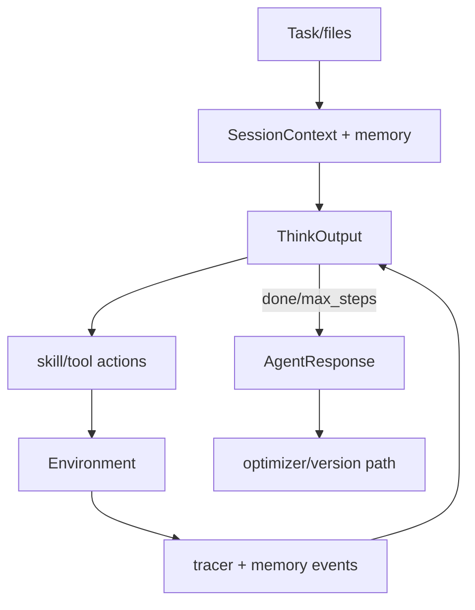

# SkyworkAI/DeepResearchAgent：带自演化协议的 Agent 运行时

| 字段 | 值 |
|---|---|
| GitHub | https://github.com/SkyworkAI/DeepResearchAgent |
| License | MIT |
| Stars | 3542（2026-09-17 快照） |
| GitHub 最后 push | 2026-05-04 |
| 分析 commit | `5e3c95d14266f8c4aa6a5deae1fe165c7cd1b87b` |
| 生命周期 | GitHub 候选冻结记录为未归档；固定提交用于本页源码分析 |
| 产品类型 | 可组合 Agent 基础设施 |
| 分析证据 | 固定提交中的 README、许可证、配置与核心实现 |

本文用 📘 标注文档或源码中可直接定位的事实，🔶 标注由控制流推导的边界，💬 标注评价与借鉴建议。仓库动态元数据沿用候选清单，源码判断只绑定页面中的固定提交。

## 1. 它到底是什么

DeepResearchAgent不是单一深度研究网页应用，而是试图把 prompt、agent、tool、environment、memory 作为可注册、可版本化资源，并提供 self-evolution 的 propose/assess/commit 思路。仓库还包含 deep researcher、浏览器、交易和 benchmark 等多类运行组件。 本文把仓库作为一个公开源码快照来分析：README 的产品定位、命令和 benchmark 数字属于项目文档；代码路径用于确认控制流、数据结构和边界。没有把 stars、README 宣称的准确率、SOTA 或部署体验转换成独立结论。

源码中最值得关注的是：tool-calling agent 接收任务和文件，建立 SessionContext、task_id、tracer 和可选 memory session。每一步调用结构化 ThinkOutput，得到 thinking、previous-goal evaluation、memory、next_goal 和 actions；再按 skill/tool 路由执行，遇到 done 结束，达到 max_steps 则返回未完成，并保存 JSON trace 与 memory event。workflow deep_researcher 另以多轮搜索、完整性判断和 markdown 报告为工作流工具。 这决定了它应在 RH 产品地图中被看作“可组合 Agent 基础设施”，而不是泛化地称为自动科研系统。

## 2. 运行时堆叠

运行时可拆成以下层：

- **入口与配置**：由仓库提供的 CLI、脚本、Next.js/API 或配置文件接收任务和参数。
- **Agent/编排**：src/agent 负责 planning/tool-calling 等 Agent；src/tool 含 workflow/default tools；src/environment 提供 filesystem、browser、database、交易等状态接口；src/memory 管理 session/event；src/optimizer 含 reflection、GRPO、Reinforce++、TextGrad；src/tracer 与 src/version 负责轨迹/版本；配置采用 MMEngine 风格组合。
- **工具与环境**：工具调用连接搜索、文件、浏览器、向量库、解释器或沙箱；工具是否真的隔离取决于配置和外部服务。
- **状态与产物**：本项目保存的状态形式包括缓存、队列、日志、数据库、PaperNode、retrieval result、文件或 grade；它们不自动等同于 RH artifact。

这种分层让替换模型和工具变得容易，但也将“接口存在”和“证据可信”分开。源码可以证明一个函数会生成/保存某种对象，不能单凭存在证明对象内容正确。

## 3. 阶段机或 DAG

核心控制流如下。

tool-calling agent 接收任务和文件，建立 SessionContext、task_id、tracer 和可选 memory session。每一步调用结构化 ThinkOutput，得到 thinking、previous-goal evaluation、memory、next_goal 和 actions；再按 skill/tool 路由执行，遇到 done 结束，达到 max_steps 则返回未完成，并保存 JSON trace 与 memory event。workflow deep_researcher 另以多轮搜索、完整性判断和 markdown 报告为工作流工具。 阶段之间通常由消息、列表、队列、结构化对象或日志连接；是否能跨进程恢复，取决于具体实现，而不是 Mermaid 图本身。需要特别区分循环的两种含义：一种是有限的 max_depth/max_rounds/max_iter/max_steps 或 expand_layers；另一种是模型自主决定继续。源码中的上限能限制预算，但不能保证每次运行都走完所有阶段，也不能保证模型输出符合提示。

## 4. Tool / Skill / Agent 怎么切

该仓库的 Agent 边界是：主 Agent 接收任务并决定下一步；子 Agent/worker（若有）承担局部任务；tool 是可调用的搜索、抓取、文件、浏览器、代码或数据接口；skill（若有）主要是提示/能力包，不等于可审计的执行 artifact。具体来说，src/agent 负责 planning/tool-calling 等 Agent；src/tool 含 workflow/default tools；src/environment 提供 filesystem、browser、database、交易等状态接口；src/memory 管理 session/event；src/optimizer 含 reflection、GRPO、Reinforce++、TextGrad；src/tracer 与 src/version 负责轨迹/版本；配置采用 MMEngine 风格组合。

工具调用的返回通常被转成文本、结构化响应或日志，再回到模型上下文。优点是扩展快，缺点是不同工具的来源、版本、错误和副作用可能没有统一合同。对于 RH，接入时不应只映射函数名，还要记录输入、输出、外部资源、权限、失败原因和可复核句柄。

## 5. 文献怎么来、是否入库、引用约束

文献/来源链是：默认搜索器、WebSearcher、Bing/Brave/Google/DDGS/Firecrawl 等工具以及领域环境；学术来源并非统一摄取层。

这条链路能支持“找到或读取来源”，但通常不能直接支持 claim-level evidence。源码未显示统一的 DOI/版本/页码/span/主张/支持强度对象，也没有在最终文字生成前做逐句 entailment gate。若项目有 URL、reference、arxiv_id、PaperNode 或 RetrievalResult，它们仍主要是检索和展示元数据。

因此，报告中的来源约束应写成：系统会按提示或数据结构保留来源；不能写成“每条结论都已验证”。在 RH 中，建议将这些中间来源摄取为 paper/source，再显式链接 claim 和 evidence span。

## 6. 实验 / 代码执行

工程上，仓库含 AIME、GPQA、GSM8K、HLE、LeetCode 等 benchmark/数据代码和可执行环境，但不同组件的运行依赖和结果需分别配置。本次只审阅源码和固定快照，没有运行模型、交易回测或 benchmark。

**事实边界**：本次只读了公开仓库固定提交，没有安装依赖、配置 API key、下载模型/数据、启动外部服务或运行 benchmark。因而不能确认运行时性能、成本、并发稳定性、沙箱隔离、模型质量、检索召回或 README 中的结果。源码里的测试/评估函数可以说明“如何评”，不能说明“本次已评”。

若将它用于科研执行，还需要补齐数据版本、代码提交、环境镜像、资源上限、随机种子、指标定义、原始输出和失败记录，并把每次执行绑定到不可变 artifact。

## 7. 写稿怎么做

写作输出取决于项目类型：可组合 Agent 基础设施 的最终产物通常是 Markdown、报告字符串、聊天消息、结构化 Report、检索回答或 grade JSON。tool-calling agent 接收任务和文件，建立 SessionContext、task_id、tracer 和可选 memory session。每一步调用结构化 ThinkOutput，得到 thinking、previous-goal evaluation、memory、next_goal 和 actions；再按 skill/tool 路由执行，遇到 done 结束，达到 max_steps 则返回未完成，并保存 JSON trace 与 memory event。workflow deep_researcher 另以多轮搜索、完整性判断和 markdown 报告为工作流工具。

若有报告器，它往往把多个阶段的摘要合并为可读文本；引用可能是 URL、reference id、source 字段或 rubric 记录。这里没有看到 RH 意义上的章节草稿、参考文献数据库、claim/evidence 互证、LaTeX/PDF 编译和提交版本闸门。因此“能生成报告”不应被扩写成“能生成可投稿论文”。

## 8. 图怎么做

固定提交中的图能力应按数据来源区分。项目可能包含 README 架构图、UI 进度事件、流程 Mermaid、benchmark 绘图脚本或报告 Markdown，但这与从实验记录生成可发表定量图不同。DeepResearchAgent不是单一深度研究网页应用，而是试图把 prompt、agent、tool、environment、memory 作为可注册、可版本化资源，并提供 self-evolution 的 propose/assess/commit 思路。仓库还包含 deep researcher、浏览器、交易和 benchmark 等多类运行组件。

本报告不把仓库 README 的截图、曲线或分数表重绘成独立实验结果。若下游要出图，必须先声明数据源、统计单位、误差定义、样本量、面板与图注主张；对于架构图，则需把实际节点、权限边界和失败路径与源码对齐。

## 9. 和 RH 的相似点

1. 都把 prompt、agent、tool、environment、memory 当成可注册资源，而不是写死在一个脚本里。
2. 都保存 JSON trace 与 memory event，便于事后复盘。
3. 都用 max_steps / done 作为显式停止，而不是只靠模型说“完成”。

## 10. 和 RH 的不同点

RH 的版本对象是研究工件。DeepResearchAgent 的 version/optimizer 面向 agent 资源自演化（reflection、GRPO、TextGrad）。deep_researcher 工作流产出 Markdown 报告，搜索器是 Bing/Brave/Google/DDGS/Firecrawl，不是统一论文库。仓库还夹着交易环境和 AIME/GPQA 等题，品类比科研生产宽。

## 11. 优点 / 缺点

**优点**

- ThinkOutput 把 previous-goal evaluation、next_goal 和 actions 结构化。
- environment 层把 filesystem/browser/database 与 agent 分开。
- tracer + version 给自演化留下轨迹接口。

**缺点**

- 组件多，真实行为取决于 MMEngine 风格配置。
- 搜索工具不等于文献闸。
- 本次未跑模型、交易或 benchmark。

💬 对照点是“把思考输出做成可路由结构”，不是 self-evolution 是否已在生产中生效。

## 12. RH 可学的 1–3 条

1. **每一步同时写下一步目标和对上一步的评价。** ThinkOutput 比只留 chain-of-thought 更可审计。
2. **skill 与 tool 分路由。** 避免把提示包和可执行接口混成一个函数名。
3. **达到 max_steps 时返回未完成，而不是假装 done。**

## 13. 名字速查表

| 名字 | 先决概念 | 含义 |
|---|---|---|
| ThinkOutput | 结构化思考 | thinking / next_goal / actions |
| SessionContext | 会话 | task_id、tracer、memory |
| deep_researcher | workflow 工具 | 多轮搜索与 markdown |
| optimizer | 自演化 | reflection / GRPO / TextGrad |
| Collection of environments | 环境层 | filesystem、browser、database |

> 📌事实边界：本页绑定固定提交 `5e3c95d14266f8c4aa6a5deae1fe165c7cd1b87b`，快照日期 2026-09-17。未运行 AIME/GPQA/HLE 或交易回测，未调用搜索 API，未验证 self-evolution 提交是否实际落地。
