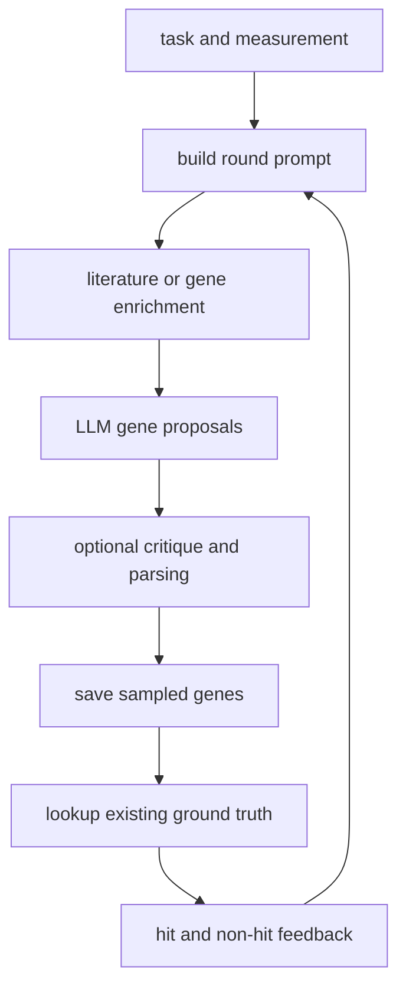

# snap-stanford/BioDiscoveryAgent：BioDiscoveryAgent——遗传扰动实验设计 Agent

| 字段 | 值 |
|---|---|
| GitHub | https://github.com/snap-stanford/BioDiscoveryAgent |
| License | MIT |
| Stars | 127（2026-09-17 快照） |
| GitHub 仓库 pushed_at | 2025-07-06（仓库级动态元数据，不等于分析 commit 新增内容） |
| 分析 commit | `19673c7371c542cfa155ffaa9047c53525f9fe2e` |
| 产品类型 | **遗传扰动实验设计 Agent** |
| 分析证据 | README.md, research_assistant.py, tools.py, get_lit_review.py, analyze.py, LLM.py, data/screen.py |

本文用 📘 标注文档或源码中可直接定位的事实，🔶 标注由控制流推导的边界，💬 标注评价与借鉴建议。仓库动态元数据沿用候选清单，源码判断只绑定页面中的固定提交。

## 1. 它到底是什么

BioDiscoveryAgent 将遗传扰动筛选写成逐轮选择下一批基因的问题。输入是生物研究目标、待测基因空间和已有 readout，输出是下一轮基因名单、解释与研究计划。README 的 closed loop 指设计会吸收反馈；在当前公开评测路径中，反馈通过读取已有筛选数据实现。它适合分析主动实验设计策略，不应仅因名称中的 Discovery 就归类为自动湿实验机器人。

## 2. 运行时堆叠

入口 `research_assistant.py` 用 argparse 接收 data_name、steps、num_genes、model 和 lit_review/critique/gene_search/reactome 等开关，从 datasets/task_prompts 读取 Task 与 Measurement。`tools.py::agent_loop` 调用模型、解析基因名单并保存日志和 sampled_genes NPY。pandas/NumPy 负责现有数据回读；文献路径使用 pymed；基因特征检索的 README 提到按需从 Figshare 下载 achilles.csv。默认资源主要是模型 API 和表格数据，不是本仓训练新 LLM。

## 3. 阶段机或 DAG

`steps` 决定外层轮数；prompt_tries 限制一轮中修正数量、重复或不可识别基因的尝试。这里将“提议”和“观测回读”分开标出，避免把 CSV 查询误读成做了一次新实验。

## 4. Tool / Skill / Agent 怎么切

Agent 是 agent_loop 的轮次控制和 LLM 调用；工具包括文献查询、基因相似性/差异性搜索、Reactome/KEGG 富集以及 critique。`research_assistant.py` 的 prompt 明确 Reflection、Research Plan、Solution 等段落要求。文件中也有通用读写脚本/执行助手，但本报告的主路径是扰动基因批次选择，不把所有工具定义都算成默认启用。没有看到独立 Skill 包协议；启用哪些辅助过程主要由命令行布尔开关控制。

## 5. 文献怎么来、是否入库、引用约束

实际 `get_lit_review` 路径先让 LLM 生成聚焦 query，再用 PubMed 查询，把 title、abstract、methods、conclusions、results 交给摘要函数，摘要逐轮追加。文件虽定义 arXiv、bioRxiv 等辅助函数，但不能因此断言它们在默认文献回路都被使用。返回值主要是标题和摘要文本；不构成规范论文池，也没有逐条将基因假设绑定到原文 span 的证据合同。远端查询和论文摘要会随时间变化。

## 6. 实验 / 代码执行

`agent_loop` 读取 ground_truth_<dataset>.csv 和 topmovers_<dataset>.npy；后续轮次取 sampled_genes，使用 `ground_truth.loc[gene_sampled]` 获取 readout，再把命中与非命中信息放回 prompt。这是基于已观测数据的回放式评估，不是连接培养设备或 CRISPR 实验台。`analyze.py` 将预测集合与 topmovers 求交，多数数据集除以全部 topmovers 数量，含义更接近命中召回，而不能无条件称为 precision。脚本 trials 循环访问同一个结果路径；仅增大 trials 参数不等于独立随机重复。

## 7. 写稿怎么做

主要文本产物是每轮 Reflection、最多若干句 Research Plan、Solution 基因列表，以及 critique 修订意见。它们帮助研究者理解候选选择，不是完整研究论文。没有在这些入口看到章节草拟、引用键集合、LaTeX 编译或期刊格式；实验设计建议进入正式论文之前还需要实际方法、readout 与统计分析。

## 8. 图怎么做

所读 analyze.py 打印命中统计、均值和标准差；`data/screen.py::ScreenData.identify_hits` 的 castle 分支可画筛选值直方图和阈值线，属于数据预处理诊断。README 有项目图示，不能当作 agent 会根据本轮数据自动画论文图的证据。如要绘制命中曲线，应从每轮 sampled_genes 与冻结 ground_truth 计算，并说明累计命中及候选总数的分母；本报告没有创建或补造这样的曲线。

## 9. 和 RH 的相似点

它与 RH 的共同点是明确区分研究目标、方案、结果反馈和后续方案，能用领域知识工具改善下一轮决策。每轮基因名单单独保存，使“模型建议了什么”和“之后看到哪些结果”有机会对应。可选 critique 为后续质疑提供一个结构化插槽，但仍是模型文本而非独立实验验证。

## 10. 和 RH 的不同点

RH 的阶段推进依赖 topic、paper、claim 和 artifact 状态；这里的主要状态是 CSV/NPY、字符串 prompt 与日志目录。该系统的读回式实验环境在启动时持有全量 ground truth，由程序控制显示给模型的部分；对未来前瞻性实验的外推需要另做评估。它没有对应 RH 的写作与交付闭环，benchmark 分数也不能替代新实验的有效性证据。

## 11. 优点 / 缺点

**优点**：问题空间具体、批次大小和反馈路径清楚；文献、基因搜索、富集与 critique 可拆开观察；基因名单按轮保存便于检查重复选择。

**局限**：模型名称与 API 版本有历史依赖；结果和候选由文本解析，依赖格式服从；文献摘要不是逐字证据；部分大样本摘要路径硬编码旧模型。`analyze.py` 的重复路径值得在复现前核对，不能把打印 std 自动解释为多种子稳定性。未运行任何真实遗传扰动实验。

## 12. RH 可学的 1–3 条

1. 将“候选批次—所显示 readout—后续名单”记录为三个相关 artifact，保证回放时不提前泄露未选基因的结果。
2. 每个建议附基因标识、批次预算、去重规则和证据来源，避免只保存自然语言解释。
3. 分别评价累计命中召回、每批 precision、成本和随机重复；readout 回放与前瞻性湿实验采用不同证据标签。

## 13. 名字速查表

| 名字 | 先决概念 | 含义 |
|---|---|---|
| `agent_loop` | round budget | 扰动设计主循环 |
| `ground_truth` | screen table | 已有筛选 readout |
| `topmovers` | hit definition | 预先定义的命中集合 |
| `sampled_genes` | batch selection | 累计已选择基因的 NPY 文件 |
| `get_lit_review` | PubMed | 查询并摘要文献的辅助路径 |
| `critique` | model feedback | 对基因方案的可选模型修订 |

---

> 📌事实边界
> 本页只使用上方冻结 commit 的公开 GitHub 文档和源码。未运行模型、检索服务、领域计算或湿实验；README 的效果、规模及论文实验结论仅按作者声明处理。流程图解释源码机制，既不是运行日志，也不是结果验证。所读代码以外的线上平台、权重、数据许可和真实部署状态无法在本次确认。
