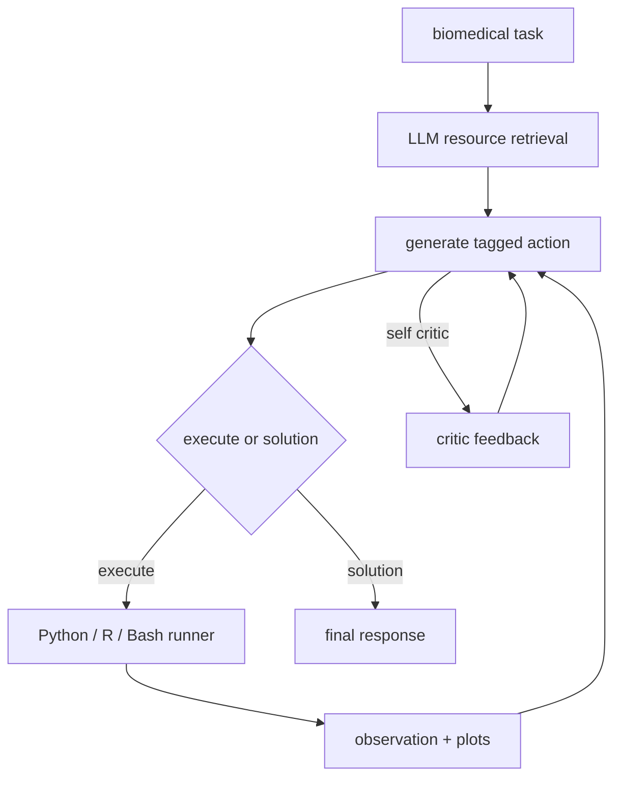

# snap-stanford/Biomni：Biomni——通用生物医学科研 Agent

| 字段 | 值 |
|---|---|
| GitHub | https://github.com/snap-stanford/Biomni |
| License | Apache-2.0 |
| Stars | 3,883（2026-09-17 快照） |
| GitHub 仓库 pushed_at | 2026-09-14（仓库级动态元数据，不等于分析 commit 新增内容） |
| 分析 commit | `400c1f366b96a35ca253e13c9b06c5076af41d65` |
| 产品类型 | **通用生物医学科研 Agent** |
| 分析证据 | README.md, biomni/agent/a1.py, biomni/model/retriever.py, biomni/tool/tool_registry.py, biomni/tool/literature.py, biomni/know_how/loader.py, biomni_env/README.md |

本文用 📘 标注文档或源码中可直接定位的事实，🔶 标注由控制流推导的边界，💬 标注评价与借鉴建议。仓库动态元数据沿用候选清单，源码判断只绑定页面中的固定提交。

## 1. 它到底是什么

Biomni 是面向广泛生物医学任务的通用 Agent。README 示例覆盖 CRISPR screen 规划、scRNA-seq 注释、ADMET 查询和文献/数据库问题；系统把 LLM 推理、资源检索、代码执行、data lake、工具库和 know-how 文档放进同一个 A1 运行时。它可以组织研究任务，但“能生成假设”不等于已经完成湿实验验证。

## 2. 运行时堆叠

A1 初始化工具模块、data lake 描述、软件库和 know-how loader，可选 ToolRetriever 通过 LLM 从工具、数据、库和文档中选择资源。配置从环境变量或 default_config 进入 agent 和数据库查询；README 说首次创建 agent 可能下载约 11GB data lake。LangGraph 将消息循环在 generate 和 execute 节点之间，执行结果、截断后的文本和捕获图像回到会话。

## 3. 阶段机或 DAG

源码用 StateGraph 注册 generate、execute 和可选 self_critic；解析不到 XML tag 时会要求模型重试。

## 4. Tool / Skill / Agent 怎么切

ToolRegistry 以 name、description、required_parameters 等字段注册工具。ToolRetriever 并非独立向量检索器，而是将资源列表格式化进 prompt，让 LLM 返回每类相关索引。A1 的 XML `<execute>` 支持 Python、R、Bash；还可 add_mcp。Skill 的近似物是 know-how 文档和外部 MCP，它们随资源选择进入 system prompt；执行 observation 是运行合同的一部分。

## 5. 文献怎么来、是否入库、引用约束

材料由 data lake、外部生物医学工具/数据库和 know-how 文档组成。literature.py 提供文献相关工具；README 还给出 Biomni-Eval1 数据集和任务。know-how loader 保留作者、机构、license 与 commercial-use 元数据，commercial mode 会排除标记为非商业的文档。源码没有显示 RH 式 paper ingest、claim 抽取、证据链接或引用完整性闸。

## 6. 实验 / 代码执行

代码执行是系统核心：execute 节点将代码交给 Python REPL、R 或 Bash runner，timeout_seconds 控制时限，超过 10000 字符的结果会截断，图像会进入 execution record。README 明确安全警告：当前 LLM 生成代码有完整系统权限，可访问文件、网络和命令；所以没有额外沙箱时不能把它当多租户实验服务。

## 7. 写稿怎么做

README 支持保存执行轨迹为 PDF、启动 Gradio UI，也能通过 know-how 提供实验协议和设计建议。这些是记录/展示能力，不是固定论文写作管线；没有看到章节、citation contract、venue 风格或终稿编译闸。

## 8. 图怎么做

执行中捕获的 plots 可以随 execution entry 保存，PDF history 可包含图像。它没有独立的论文图生成和 source-to-figure fidelity 审计；图是否支持正文结论取决于具体任务。

## 9. 和 RH 的相似点

与 RH 相似的是资源检索、工具执行、know-how 元数据和会话记录均显式建模；observation 让动作结果可回放。商业许可过滤也体现了证据/资产边界意识。

## 10. 和 RH 的不同点

Biomni 是开放式生物医学执行桌面，允许模型运行任意 Python/R/Bash；RH 需要服务端工具 contract、阶段 gate 和 artifact lineage。其 prompt-based 资源选择不能替代 RH 的 paper/claim evidence 集合，完整权限执行也使部署假设不同。

## 11. 优点 / 缺点

优点：任务面广，工具、data lake、know-how、MCP 和自定义资源都有扩展点；LangGraph 循环明确；执行结果、图像和时间戳可留痕；商业模式会过滤文档。缺点：完整权限是重大安全边界；约 11GB 数据和复杂依赖提高复现门槛；retriever 依赖模型返回合法索引；README 的生产力表述不是本次实测。

## 12. RH 可学的 1–3 条

1. 借鉴 data/tool/know-how 描述，但执行器应接入受限 tool contract，不开放任意 Bash。
2. 将商业许可、作者、机构等元数据传播到 evidence object。
3. 把 execution record 与数据快照、run/artifact ID 绑定，增加结果来源检查。

## 13. 名字速查表

| 名字 | 先决概念 | 含义 |
|---|---|---|
| `A1` | agent state | 主 Agent 类 |
| data lake | biomedical data | 数据资源集合 |
| know-how | protocol | 实践、协议和排障文档 |
| `ToolRetriever` | resource descriptions | LLM 选择可用资源 |
| `<execute>` | runner | 触发 Python/R/Bash |
| Biomni-Eval1 | benchmark | README 所述生物医学评测资源 |

---

> 📌事实边界
> 分析绑定上方完整 commit，只读取公开 GitHub 文档、配置和源码；未运行模型、训练、工具或评测，未访问外部 demo、论文全文、权重和数据集。源码行为、作者宣称和本报告建议分别表述。商业许可兼容、当前供应商可用性及性能指标均未独立验证。
