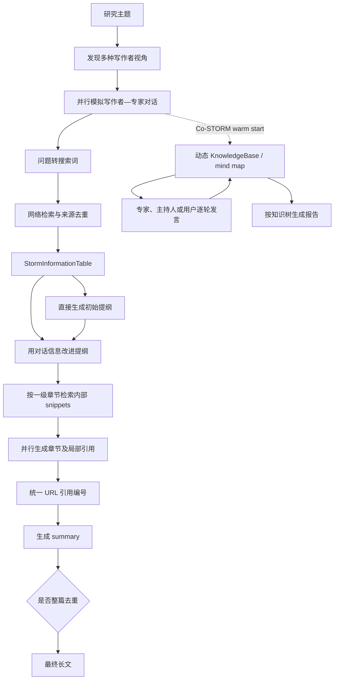

# stanford-oval/storm：从多视角检索到带引用长文与协作式知识整理

| 字段 | 值 |
|---|---|
| GitHub | https://github.com/stanford-oval/storm |
| License | MIT |
| 固定分析 commit | `fb951af7744dab086e34962e9bc6fe878e145f83` |
| 元数据快照 | 2026-09-17 |
| 产品类型 | 网络检索、知识整理与带引用长篇文章生成 |
| 事实来源 | README、运行引擎、四阶段模块、信息与引用数据结构、Co-STORM 引擎、依赖与许可证 |

## 1. 它到底是什么

STORM 的全名是 Synthesis of Topic Outlines through Retrieval and Multi-perspective Question Asking。它面向一个自然语言主题，先用不同视角模拟提问和检索，再把收集到的信息组织成提纲，逐节写成带引用的 Wikipedia 风格长文。项目还包含 Co-STORM：在人与系统的多轮对话中，由专家 Agent、主持人和动态知识树共同维护一个共享概念空间，最后从该知识库生成报告。

固定 commit 中存在两条相关但不同的产品路径。`STORMWikiRunner` 是确定的四阶段 pipeline：knowledge curation、outline generation、article generation、article polishing。`CoStormRunner` 则先 warm start，建立专家、对话历史和 `KnowledgeBase`，随后按 turn policy 在用户、专家和 moderator 之间选择下一位发言者，并持续向 mind map 插入新信息。

README 明确将最终产物描述为 Wikipedia-like article，并提醒系统产物通常还需要大量编辑，不能直接视作 publication-ready article。源码边界也支持这一定位：它管理网络来源、提纲、章节、引用和文章润色，但没有研究假设、科学实验、统计分析、期刊模板或投稿流程。

README 中关于论文录用、用户数量、数据集和实验结果复现分支的内容属于上游项目说明。本页将固定 commit 可检查的类、接口、数据结构和输出文件视为实现事实，不把宣传数字或论文实验结论当作本页独立验证结果。

## 2. 运行时堆叠

STORM 是 Python 3.10 以上的 `knowledge-storm` 包。`setup.py` 在固定 commit 中标记版本 1.1.1；依赖包括 DSPy 2.4.9、sentence-transformers、LiteLLM、Trafilatura、Wikipedia、LangChain text splitters、Qdrant client、NumPy 和 diskcache。

模型层采用多 LM 配置，而不是所有步骤共用一个固定模型。`STORMWikiLMConfigs` 分别保存：

- `conv_simulator_lm`：专家回答和对话模拟；
- `question_asker_lm`：多视角提问；
- `outline_gen_lm`：提纲生成；
- `article_gen_lm`：章节和摘要生成；
- `article_polish_lm`：全篇去重与润色。

调用者可以用 setter 注入不同 DSPy/HF 模型。源码还提供一组旧版默认配置，但主结构允许按步骤权衡成本和质量。

检索层通过 `Retriever` 适配 `dspy.Retrieve`。README 列出 You、Bing、VectorRM、Serper、Brave、SearXNG、DuckDuckGo、Tavily、Google 和 Azure AI Search 等实现；统一返回 `Information` 对象，字段包括 URL、标题、description、snippets、meta 和 citation id。

状态主要在内存对象和输出文件中。STORM 会保存 `conversation_log.json`、`raw_search_results.json`、两版 outline、draft article、URL—引用映射、polished article、运行配置和 LLM 调用历史。阶段被关闭时，runner 从这些文件恢复前置结果。Co-STORM 则能把 runner arguments、对话、专家列表和 knowledge base 序列化为字典。

## 3. 阶段机或 DAG

STORM 的 `run` 接受四个阶段开关：`do_research`、`do_generate_outline`、`do_generate_article` 和 `do_polish_article`。至少要开启一项。关闭前置阶段时，引擎从已保存的 conversation log、outline、draft article 和引用文件中恢复，因此各阶段可分开运行。

研究阶段先产生多个 persona，然后用线程池并行执行每个 persona 的模拟对话。每轮由 `WikiWriter` 提问，`TopicExpert` 把问题拆成搜索词、调用 retriever、拼接结果 snippet 并生成回答。所有对话汇总为 `StormInformationTable`。

提纲阶段先仅根据主题产生 draft outline，再用去掉引用的对话历史改进提纲。文章阶段把一级章节并行分发，每章根据自己的章节树从 information table 检索 top-k snippet，然后生成带局部编号引用的文本。`StormArticle` 把各章的局部引用重新映射为全文统一 URL 编号。润色阶段生成最多四段的 summary，并可选择让模型删除全文重复内容。

Co-STORM 的阶段机更动态：warm start 建立知识树和专家池；之后 `DiscourseManager.get_next_turn_policy` 根据对话历史选择模拟用户、纯 RAG、moderator、通用知识提供者或轮转专家，并决定是否重组知识库、更新专家和润色发言。

## 4. Tool / Skill / Agent 怎么切

STORM 的模块切分比一般 prompt script 更明确，但它没有 MCP Skill 注册表。

- **Tool / Retriever**：`Retriever` 把查询交给具体搜索实现，并返回统一 `Information`。它会清理来源 snippet 中原有的数字引用，避免污染当前文章编号。
- **Stage module**：`StormKnowledgeCurationModule`、`StormOutlineGenerationModule`、`StormArticleGenerationModule` 和 `StormArticlePolishingModule` 分别实现四个稳定阶段接口。
- **DSPy 模块**：`WikiWriter`、`TopicExpert`、`WriteOutline`、`ConvToSection` 和 `PolishPageModule` 包装具体 signature 与模型调用。
- **STORM 中的角色**：Wikipedia writer 和 topic expert 是模拟对话里的功能角色，本质上仍是一个固定 pipeline 中的 DSPy module。
- **Co-STORM Agent**：`CoStormExpert`、`Moderator`、`SimulatedUser` 和 `PureRAGAgent` 具有更明确的 agent 行为；`TurnPolicySpec` 指定每一轮使用哪个 Agent 以及附加状态变更。
- **Engine**：`STORMWikiRunner` 管四阶段运行与恢复；`CoStormRunner` 管 warm start、逐轮协作、知识库更新和报告生成。

因此，STORM 是模块化 pipeline，Co-STORM 才更接近多 Agent 协作系统。二者共享检索、知识整理和带引用写作的底层思想，但状态机和交互方式不同。

## 5. 文献怎么来、是否入库、引用约束

STORM 默认从互联网搜索结果取材，而不是只搜索学术数据库。`TopicExpert` 先通过 `QuestionToQuery` 把每个问题拆为若干搜索词，再调用统一 retriever；固定 commit 的 `Retriever` 可以并行执行多个查询，并把返回记录转换成 `Information`。URL 在这里承担来源唯一标识，snippet 是实际进入模型的证据片段。

研究阶段并不把网页或论文变成完整文献数据库。`StormInformationTable` 从所有 persona 对话中构建 `url_to_info`：同一 URL 的 snippets 被合并并去重；`conversation_log.json` 保存每个视角、问题、查询、回答和搜索结果，`raw_search_results.json` 保存 URL 到信息对象的映射。这是一次文章运行的可恢复信息表，不含 DOI 规范化、论文版本、作者消歧、撤稿状态或 topic 级 ingest 生命周期。

写章节前，information table 使用 `paraphrase-MiniLM-L6-v2` 编码全部 snippets。每个章节标题和子标题作为查询，与 snippets 做余弦相似度检索，再按 URL 汇总返回。由此，网络检索结果先进入运行期信息表，章节生成阶段不会重新直接访问网络。

引用约束比只靠 prompt 更具体：

1. `WriteSection` 要求正文使用 `[1]`、`[2]` 等局部编号；
2. `StormArticle.update_section` 解析实际出现的编号；
3. 超出该章节来源数量的编号会被删除；
4. 没被正文引用的来源不会并入全文 reference；
5. 每个 URL 获得统一的全文编号；
6. 各章节局部编号被改写为统一编号；
7. 后处理按文章首次出现顺序重新整理编号。

这保证编号能映射到实际检索记录，但仍主要是句法与 URL 对齐。系统没有逐句 entailment 判定，也没有验证网页内容是否可靠、是否为论文原文或是否支持模型写出的完整断言。源码还明确写明不处理 multi-hop citations。

## 6. 实验 / 代码执行

STORM 不执行用户生成的科研代码。固定 pipeline 的“执行”是网络检索、embedding、语言模型调用、文本处理、线程并发和结果文件写入。没有 shell runner、Notebook、容器、数据分析脚本生成—运行循环，也没有统计检验和实验指标登记。

README 提供 FreshWiki、WildSeek 及论文实验复现说明，但同时要求切换到专门的备份分支。当前固定 commit 的主分支代码面向知识整理产品和示例运行，不能由此推断论文实验已经在本页环境中重跑。

可观察的运行数据包括原始搜索结果、对话轨迹、各阶段输出、模型调用历史和配置。`post_run` 会写 `run_config.json` 与 `llm_call_history.jsonl`，这对调试和成本分析有用；它仍不是可复现科学实验记录，因为没有数据版本、随机种子、环境摘要、指标协议和结果 artifact 的统一契约。

## 7. 写稿怎么做

STORM 的写作核心是“先问出足够好的问题，再形成提纲，最后分节填充”，而不是一次 prompt 直接生成长文。

多视角阶段先为主题生成不同 Wikipedia writer persona。每个 writer 在多轮对话里一次只问一个问题，并看到有限的最近对话历史。Topic expert 把问题转成搜索词，用检索结果回答，prompt 要求每句话由收集到的信息支撑；没有结果时返回无法找到信息的固定回答。

提纲阶段有两版输出：`direct_gen_outline.txt` 是只根据主题生成的草案，`storm_gen_outline.txt` 是结合对话历史后的改进版本。提纲使用 `#`、`##`、`###` 表示层级。

文章阶段取所有一级章节，跳过独立的 Introduction、Conclusion 或 Summary，并在线程池中并行生成正文。每章从 information table 中重新检索与该章节及其子标题最相关的来源。模型被要求从当前章节标题开始，只写该章节并添加内联引用。生成后，章节树、正文和引用映射进入 `StormArticle`。

润色阶段首先生成 summary；如果 `remove_duplicate=True`，再调用模型删除重复内容，同时要求保留结构和引用。它没有期刊章节契约、方法与实验一致性检查、写作 exemplar、字数预算或 LaTeX/PDF 终检，因此其“长文”更适合作为知识文章或前期材料。

Co-STORM 的写作从动态 mind map 出发。`generate_report` 调用 `KnowledgeBase.to_report()`，把知识节点视为章节名并逐节生成报告，使用户对话中强调的方向可以进入最终结构。

## 8. 图怎么做

固定 commit 没有面向最终文章的图表生成管线。STORM 产物是文本、提纲、JSON 来源表和调用日志；Co-STORM 的 mind map 是一种层级知识结构，但主引擎没有把它渲染为论文图，也没有将实验记录转为统计图。

仓库中的图片和幻灯片属于项目文档资产，不代表 `STORMWikiRunner` 会生成 figure。系统也没有 figure contract、数据来源到 panel 的绑定、图注证据检查、坐标轴审计或图片质量门。若接入 RH，它可以为综述图的概念节点提供文本材料，但不能替代科学绘图和结果图的确定性渲染。

## 9. 和 RH 的相似点

- 都把研究型写作拆成多个可恢复阶段，而不是把所有工作塞进一次模型调用。
- 都保存中间产物。STORM 的 conversation log、raw search results、outline、article 和 references，与 RH artifact 思路有明显对应关系。
- 都重视来源绑定和引用清理。STORM 会把章节局部引用映射为统一 URL 编号，并删除越界引用。
- 都允许不同阶段使用不同模型，以平衡成本和质量。
- Co-STORM 的动态 knowledge base 与 RH 的 topic knowledge 都试图把分散材料组织为可继续查询的结构。
- 回调接口和模型调用历史提供了运行过程可观察性，可与 RH 的 provenance 思路衔接。

## 10. 和 RH 的不同点

STORM 的最终目标是 Wikipedia 风格主题文章；RH 的目标包括文献综述、研究设计、实验、论文各章节、图、质量闸和最终交付。STORM 没有科学 claim、研究 gap、实验 protocol、结果记录或 publication bundle。

STORM 把 URL 作为来源标识，适合一般网页检索；RH 需要更严格的论文实体、DOI/arXiv 标识、版本、来源层级和 claim-evidence 支持关系。STORM 的编号检查能保证引用指向已检索 URL，却不能判断该来源是否真的支持句子。

STORM 阶段开关和本地文件提供恢复能力，但不存在 orchestrator stage、依赖 artifact lineage 或 gate check。某一阶段输出格式正确后即可进入下一步，没有文献覆盖、方法完备性、统计有效性和最终 bundle 的阻塞条件。

Co-STORM 的中心是对话与动态专家轮转；RH 的中心是工具合同和持久研究状态。Co-STORM 序列化虽能保存知识库和专家，但 `from_dict` 在固定 commit 中明确带有 FIXME：恢复时没有真正使用保存的 LM 配置，而是重新初始化默认设置，说明恢复并非完全等价重放。

## 11. 优点 / 缺点

**优点**

- 四阶段接口清晰，既能端到端运行，也能从保存的前置产物继续。
- 多视角提问不是表面角色装饰：persona 会驱动独立对话和查询，最终共同进入 information table。
- 章节写作前进行一次内部语义检索，避免把全部搜索结果无差别塞给每个章节。
- 引用合并有明确的数据结构和确定性后处理，能够删除越界编号、裁掉未使用来源并统一全文编号。
- 各章节与多 persona 对话可并发，线程数、搜索词数、top-k 和轮数均可配置。
- Co-STORM 把专家选择、moderator 介入、知识树重组和用户输入变成显式 turn policy。

**缺点**

- 搜索结果以 URL 和 snippet 为中心，来源质量高度依赖外部 retriever；没有学术来源分级、论文版本和撤稿检查。
- “引用编号存在”不等于“断言得到支持”，代码没有 claim-level entailment 或矛盾检测。
- 提纲草案先使用模型参数知识生成，再由对话改进；若检索覆盖不足，结构仍可能受模型先验影响。
- 全篇去重由模型完成，缺少删除前后的引用覆盖和事实保持验证。
- 运行状态散落在多个文本/JSON 文件，没有统一 artifact schema、原子版本提交和依赖失效机制。
- `run_knowledge_curation_module` 在固定 commit 中把 `disable_perspective` 固定为 `False`，没有使用 runner argument 中同名配置，参数行为与声明不完全一致。
- Co-STORM 的恢复路径不会忠实恢复保存的 LM 配置，重放一致性有限。
- 系统不执行科学实验，也不产生 publication-ready 稿件；上游 README 本身也把它定位为前期写作辅助。

## 12. RH 可学的 1–3 条

1. **采用“局部引用—全文引用”两级映射。** 让每个章节只看到自己的紧凑证据编号，合并时再确定性映射到全稿 citation key，并自动删除越界和未使用来源。
2. **把检索、提纲、章节和润色的中间产物设计成可恢复阶段。** RH 可继续使用现有 artifact lineage，但在 UI 中直接展示每阶段可复用输入和缺失前置条件。
3. **借鉴 Co-STORM 的 turn policy，而不是复制角色名。** 当连续回答缺少新问题、用户改变关注点或知识节点过载时，显式触发追问、专家切换或知识重组，并把决策和证据写入 provenance。

## 13. 名字速查表

| 名字 | 含义 |
|---|---|
| `STORMWikiRunner` | 串联知识整理、提纲、文章和润色四阶段的主引擎 |
| `STORMWikiLMConfigs` | 为提问、对话、提纲、章节和润色分别配置模型 |
| `StormKnowledgeCurationModule` | 生成 persona、运行模拟对话并汇总来源 |
| `WikiWriter` | 在特定视角下逐轮提出问题的 DSPy 模块 |
| `TopicExpert` | 把问题转成查询、检索来源并生成带依据回答的模块 |
| `Information` | URL、标题、description、snippets、meta 和引用 id 的统一来源对象 |
| `StormInformationTable` | 合并对话中来源，并为章节执行内部语义检索的运行期信息表 |
| `StormOutlineGenerationModule` | 先生成草案，再用对话信息改进提纲 |
| `StormArticle` | 保存章节树与全文引用映射的文章对象 |
| `url_to_unified_index` | URL 到全文统一引用编号的映射 |
| `CoStormRunner` | 管理 warm start、逐轮协作、知识树更新和报告生成 |
| `DiscourseManager` | 根据对话历史选择下一位 Agent 及状态更新动作 |
| `TurnPolicySpec` | 一轮所用 Agent、是否重组知识库及是否更新专家的决定 |
| `KnowledgeBase` / mind map | Co-STORM 动态维护的层级共享概念空间 |

---

> 📌事实边界：本页依据固定 commit `fb951af7744dab086e34962e9bc6fe878e145f83` 中的源码、README 与许可证分析机制；没有调用需要外部凭据的模型或搜索服务，也没有运行论文复现实验。上游关于论文录用、用户规模、数据集效果和文章质量的内容均视为项目声明；引用编号映射的代码存在不等于来源可靠、逐句蕴含或文章达到发表标准。
