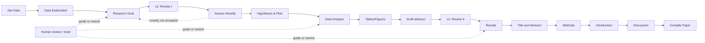

# data-to-paper：从数据到可回溯论文的研究自动化框架

> 观察对象：`Technion-Kishony-lab/data-to-paper`。本文依据固定快照 `81df14c4b9600466e645c3b2b336cc54daa3df3a` 的仓库树、README、`pyproject.toml`、许可证及源码进行静态核验；描述的是代码中可见的机制与公开示例，不把一次源码阅读写成运行结果。

本文用 📘 标注文档或源码中可直接定位的事实，🔶 标注由控制流推导的边界，💬 标注评价与借鉴建议。仓库动态元数据沿用候选清单，源码判断只绑定页面中的固定提交。

## 1. 它到底是什么

`data-to-paper` 是一个以数据文件为起点、由多个相互协作的 LLM 与规则型角色推进科研流程的 Python 框架。README 将目标概括为：从原始数据开始，经数据探索、研究问题与假设、文献搜索、分析代码、结果解释和分段写作，最后形成可以人工核验的论文。它不是单纯的聊天式写作器，而是把研究过程拆成产品（product）、阶段（stage）、对话（conversation）和可保存的运行产物。

公开配置把支持范围落在相对简单的假设检验任务，并另附一个两步 toy example。示例项目覆盖 BRFSS 糖尿病健康指标、国会成员社交网络、NICU 治疗政策以及气管插管深度预测；项目参数可以提供固定研究目标，也可以让系统从数据描述出发形成开放目标。`pyproject.toml` 暴露 `data-to-paper` 图形入口、控制台运行入口和资源检查入口，版本字段为 `1.1.22`。

其核心价值不是承诺“自动得出正确科学结论”，而是把中间数据、代码、输出、数值与文本保持可定位关系，同时保留人类检查和引导的接口。README 明确要求最终内容由用户和领域专家负责核验；因此更准确的定位是可审计的研究过程自动化，而不是无人监督的发表机器。

## 2. 运行时堆叠

运行时从 Python 包和本地项目目录组成。依赖包括 pandas、numpy、scipy、statsmodels、scikit-learn、networkx、matplotlib、PyMuPDF、Jinja2、PySide6、pytest 以及 OpenAI 客户端等。`src/data_to_paper/env.py` 集中定义运行参数：编码、结构化输出和写作默认使用 `ModelEngine.GPT4o`，代码可用包集合为 numpy、pandas、scipy、sklearn，统计分析还通过分析步骤声明 statsmodels、sklearn 与 pickle。代码执行默认有 600 秒上限，并限制结果规模和浮点显示位数。

模型层在 `src/data_to_paper/servers/model_engine.py` 中以枚举表达，包含 GPT-3.5、GPT-4、GPT-4 Turbo、GPT-4o 系列以及 DeepInfra 上的 Llama/CodeLlama 选项。不同模型映射到 OpenAI 或 DeepInfra 的 API key、服务名和 base URL；是否有 Semantic Scholar key 决定学术检索优先使用 Semantic Scholar，否则切换到 Crossref。API key 来源是环境变量，仓库快照本身没有把凭证写进项目。

交互层既有 console，也有默认的 PySide6 应用。环境配置允许关闭人类审阅、先 AI 审阅后人工审阅，或按需触发 AI 审阅；默认选择按需的人类审阅。`BaseStepsRunner` 为每次运行创建项目输出目录和临时执行目录，并提供异常、重置、日志以及阶段成本回调。服务调用具备 record/replay 包装：可保存模型响应、学术检索响应、嵌入响应和代码运行缓存，使一次运行能够重播而不必重复所有远程请求。

## 3. 阶段机或 DAG

假设检验类型的阶段定义在 `src/data_to_paper/research_types/hypothesis_testing/scientific_stage.py`。主线依次包括：Get Data、Data Exploration、Research Goal、Lit. Review I、Assess Novelty、Hypothesis & Plan、Data Analysis、Tables/Figures、Draft abstract、Lit. Review II、Results、Title and Abstract、Methods、Introduction、Discussion 和 Compile Paper。每个阶段带有是否需要交互的标志；阶段运行器把阶段映射到具体方法，而不是依靠隐含的自然语言顺序。

`HypothesisTestingStepsRunner` 在预运行阶段建立 `ProduceScientificPaperPDFWithAppendix`，随后按阶段调用数据文件描述、探索、目标生成、目标文献搜索、相似论文/新颖性评估、假设计划、代码分析、表图生成、解释、写作与编译方法。目标由用户提供时会跳过目标文献搜索与新颖性评估并进入计划阶段；自动生成目标若未通过新颖性评估，则在参数允许的次数内回到 Research Goal，形成一个有条件回边的阶段机。运行器遇到重置异常时也能回到用户指定阶段。

## 4. Tool / Skill / Agent 怎么切

这里的“agent”主要是角色化对话参与者，而不是外部插件目录。`ScientificAgent` 定义 Performer、Director、DataExplorer、GoalReviewer、PlanReviewer、Debugger、InterpretationReviewer、Writer 和 CitationExpert。Director 负责接收或确认数据与研究目标，Performer 执行研究步骤，DataExplorer 辅助探索，GoalReviewer/PlanReviewer 审阅目标和计划，Debugger 处理代码问题，InterpretationReviewer 检查解释，Writer 生成论文，CitationExpert 参与检索。

“Tool”是阶段内部的确定性能力：文件描述器读取文本、Excel 和压缩数据；文献服务器访问学术服务；代码运行器执行分析；`df_to_latex` 与 `df_to_figure` 生成论文展示项；LaTeX 模块编译论文。每个阶段把上游 product 字段注入对话背景。例如分析代码同时看到文件描述、探索输出、预处理代码、研究目标和假设计划；写作类对话读取数据描述、分析代码、LaTeX 展示项和额外结果。

“Skill”在该仓库中更像可组合的步骤类和提示模板。`RequestCodeProducts` 负责请求完整代码、执行代码、取得输出和解释，并在需要时交给 debugger；双向对话类让执行者与审阅者循环，直到达到终止短语或审阅轮数上限。该切分把自由生成限制在提示驱动的窄任务中，把格式、文件名、允许包和检查交给代码。

## 5. 文献怎么来、是否入库、引用约束

文献搜索先由 LLM 生成短查询，而不是让模型直接编造参考文献。`BaseLiteratureSearchReviewGPT` 按 dataset、questions、background、methods、results 等 scope 组织查询，要求每条查询为约 5–10 个词，并对返回结构做检查。目标阶段默认请求 dataset 与 questions；写作阶段请求 background、dataset、methods、results。每个查询最多向学术服务器请求 100 条记录，结果以 scope→query→citations 保存。

`SemanticScholarPaperServerCaller` 请求标题、URL、摘要、TLDR、期刊、年份、BibTeX、嵌入及影响力字段，清理无效 BibTeX id，并对暂时性 504/429 做有限重试。若 Semantic Scholar 没有结果，代码会逐步去掉若干常见停用词再重试，最后返回空列表。嵌入服务使用 SPECTER 向量；写作检索可用论文标题与摘要形成目标向量，再按相似度排序。没有 Semantic Scholar key 时，运行配置转用 Crossref。

检索结果被作为 `LiteratureSearch` product 保存并带有查询、排名、影响力和 API 来源信息；运行器还可把服务响应录制到运行目录，因而能重播检索过程。它不是一个独立的长期文献数据库：从源码可确认的是运行级产品和缓存，而非跨项目的统一文献仓库。

引用约束由 LaTeX 写作检查器执行。引言和讨论允许使用 writing scope 的 citation ids，生成后提取 `\cite{}`，拒绝不在允许集合中的 id；若只有一个允许 id 与错误 id 前缀相似，会自动纠正，否则返回错误要求重写。检查器还检测裸露 citation id、额外 section、重复 section、禁用 LaTeX 命令和编译错误。普通生成阶段可先移除误插入的引用，再由允许列表重新控制引用；这样引用集合来自检索 product，而不是由写作模型自由扩展。

## 6. 实验 / 代码执行

数据入口由 `DataFileDescription` 和 `DataFileDescriptions` 管理。项目参数以相对项目目录的文件名列表声明数据；文件可以是原始文件或同名 `.zip`，运行准备阶段复制或解压到临时数据目录，并保留文件描述、来源关系、二进制标志和总体描述。示例 diabetes 项目声明 BRFSS CSV，描述文件记录 253,680 行、22 个特征、缺失值处理状态以及变量编码；这类描述会进入后续目标、分析和方法写作的背景。

分析代码不是直接在主进程中无约束执行。`CodeRunner` 将代码写入专用模块，在运行上下文中设置工作目录、跟踪创建文件、拦截警告、限制文件读写、禁止 `print`/`input`/`eval`/`exit` 等调用并替换部分危险导入；`CodeRunnerWrapper` 默认使用独立进程，超过 600 秒就终止并返回超时错误。运行结束后会报告异常、创建文件和上下文，并检查上下文是否可序列化。运行器还用缓存保存可重播结果。

统计分析步骤强制代码采用明确的 `# IMPORT`、`# LOAD DATA`、`# DATASET PREPARATIONS`、`# DESCRIPTIVE STATISTICS`、`# PREPROCESSING`、`# ANALYSIS` 和 `# SAVE ADDITIONAL RESULTS` 标题。可用输出包括 `df_*.pkl` 表图数据和 `additional_results.pkl`；静态检查偏好 statsmodels 的公式函数，动态检查要求统计型分析至少产生可识别的 p-value，并检查输出文件、数据框和必要的注释。p 值、回归、机器学习和 dataframe 的上下文替换器用于把统计输出转成可检查的产品，而非只把终端文本交给写作者。

仓库内还包含针对 pandas、scipy、statsmodels、sklearn 和随机数的覆盖层。其意图是保留统计调用的结构、收集 p-value、报告问题并阻止代码越过允许的文件边界。源码支持执行和测试这些路径；本次工作只核验固定快照，没有运行示例研究或声称任何数据分析数值已经重新产生。

## 7. 写稿怎么做

写作是分阶段的 LaTeX 产品生成。第一次解释阶段先生成题目和摘要，随后依次重写 Results、Title and Abstract、Methods、Introduction 和 Discussion。`SectionWriterReviewBackgroundProductsConverser` 把数据描述、研究目标、分析代码、展示项、额外结果及已有章节注入写作者，并以科学作者与科学审阅者的双向对话方式检查输出。

Methods 明确要求 Data Source、Data Preprocessing 和 Data Analysis 三个小节，并将描述限定在实际代码做过的步骤；还会拒绝软件版本、文件名、列名、函数名、URL 与参考文献等不适合方法叙述的细节。Results 以每个表/图为核心组织段落，先交代问题和方法，再描述观测结果；禁止把限制、未来工作或推论提前写进结果段。题目和摘要有单段摘要、无冒号标题和主结果概括等格式检查。

数值写作是该项目的关键机制。`ResultsSectionWriterReviewGPT` 被要求从带唯一 hypertarget 的展示项、额外结果和数据描述中取得数字；直接引用的数字写为 `\hyperlink{label}{value}`，派生数字用 `\num` 命令在编译时计算。`CheckReferencedNumericReviewBackgroundProductsConverser` 会检查这些引用，降低手工复制数字造成漂移的概率。写作检查还扫描未完成占位符、禁用短语、非法小节、未允许 citation、浮动 citation 与 LaTeX 编译错误。

## 8. 图怎么做

图表由 LLM 生成分析代码，但真正的绘图入口是仓库提供的 `df_to_figure`，表格入口是 `df_to_latex`。代码提示要求每个展示项先有带标签的数据框和 caption，再明确 `kind`、y 列、置信区间列和 p-value 列；禁止直接调用 matplotlib 绘图。执行器把图表数据作为 pickle 内容输出，内容记录函数调用、文件名、来源文件和展示用途。

展示项的输出要求会将 dataframe 结果转为 HTML、产品文本和 LaTeX；图像文件写入当前运行输出目录，并在论文中通过标签引用。`BaseDataFramePickleContentOutputFileRequirement` 能根据函数调用区分 Table 与 Figure，附加函数名和源文件链接信息；图表描述使用经过格式化的数值与统计注释。最终论文编译器把正文展示项和附录代码/输出组合起来，图的“怎么画”与“数据怎样产生”因此处在同一运行产物链中。

该仓库快照提供示例论文图 PDF、GUI 素材和绘图测试资源，但源码证据支持的是图表生成和链接机制，不代表本次静态检查已验证每张图片的视觉质量或重新编译成功。

## 9. 和 RH 的相似点

第一，两者都把科研生产拆成可检查的阶段，而不是只请求一篇长文；目标、检索、分析、结果解释、写作与编译之间存在明确的中间产物。第二，两者都重视证据边界：data-to-paper 将输入数据描述、运行代码、输出文件、引用和数值链接在一起，便于回到来源；这与以证据、溯源和质量闸门组织研究的思路相近。第三，两者都支持人类在循环中查看、修改、重置或审阅，并能保存响应与成本信息。

在工程实现上，阶段枚举、product 字段和 `record_or_replay` 装饰器提供了可恢复性；源码级静态检查、运行时 guardrail、LaTeX 编译检查和数值 hypertarget 则分别对应过程、执行和稿件质量的约束。它还把“代码输出是论文证据”作为一等对象，而不是把代码当作不可见的提示副作用。

## 10. 和 RH 的不同点

data-to-paper 的研究对象和默认任务更窄：核心 runner 是假设检验研究，示例围绕表格数据、简单统计分析和论文 LaTeX；它没有在该快照中呈现面向多主题的统一证据图谱、跨项目知识快照、期刊级发布包或外部评审编排。它的文献管理以一次研究运行的搜索 product、服务器响应和缓存为中心，而非一个持久化的论文池与声明—证据关系数据库。

它的角色系统嵌入 Python dataclass、提示词和对话类，阶段流主要由枚举的 `get_next()` 与少量回边控制；这与更通用的工作流编排和门控系统不同。其模型配置也明显偏向固定的 OpenAI/DeepInfra 枚举，模型路由、成本和服务切换在运行环境中处理，缺少面向任意提供方的统一适配层。最后，它生成的是单次运行论文及其附录，审阅责任仍落在人类；代码的 guardrail 能降低常见错误，却不能替代领域判断、数据伦理审查或独立复现。

## 11. 优点 / 缺点

**优点**

- 从原始数据文件描述开始，输入、查询、代码、输出、论文章节和 PDF 之间有显式产品边界。
- 代码执行有超时、独立进程、文件读写约束、禁止调用和创建文件跟踪，执行失败可返回给 debugger。
- 统计结果被要求进入结构化 dataframe/额外结果文件；p-value 和数值引用检查把“数字看起来合理”提升为可定位核验。
- 文献查询按 scope 组织，BibTeX id 白名单和 LaTeX 编译检查能挡住一部分引用与格式错误。
- 有人类 Copilot、阶段重置、响应录制/回放和 API 成本记录，适合观察与调试研究流程。

**缺点**

- 主要流程围绕单一假设检验类型设计，复杂因果识别、长程实验、跨数据集复现和多作者协作并非公开主路径。
- LLM 仍负责目标、代码、解释与 prose 的许多高层判断；规则可以发现缺 p-value 或格式问题，却不能证明假设、统计模型和因果结论正确。
- Semantic Scholar/Crossref 与模型 API 是外部依赖；无 key、限流、元数据缺失或检索偏差会影响检索覆盖。
- 运行缓存和响应录制增强可重播性，但从源码可见的是文件级运行记录，不是不可变的全局内容寻址证据图。
- 输出论文虽然带数据链和附录，最终科学责任仍归用户；README 的免责、AI 水印和人工领域专家核验要求不能被自动流程取代。

## 12. RH 可学的 1–3 条

1. **把数值引用设计成数据结构。** `LabeledNumericReferenceableText`、hypertarget/hyperlink 和 `\num` 让结果段中的直接数字与派生数字都能回到生成它的展示项或计算表达式。这比在成稿后用字符串搜索核对数字更稳，适合作为任何证据绑定写作的底层类型。
2. **将代码输出契约前置到生成提示。** 分析代码必须有固定阶段标题、允许的库、展示项命名和 `additional_results.pkl`，输出要求再由静态检查、运行上下文和 debugger 共同验证。先定义可交付产物，再请求模型填充内容，可以减少自由格式代码和不可审计终端输出。
3. **让重播和人工回退成为运行器能力。** 运行器同时保存模型响应、检索响应、嵌入响应、代码缓存、日志和 API 成本，并在阶段边界提供 reset。将这些能力放在共享 runner，而不是散落到每个工具调用，能降低恢复路径的复杂度并使审计记录更完整。

## 13. 名字速查表

| 名称 | 作用 |
|---|---|
| `ScientificStage` | 假设检验研究的阶段枚举，包括目标、检索、分析、写作和编译 |
| `HypothesisTestingStepsRunner` | 将阶段映射到实际步骤并处理目标回退、产物发送与 PDF 组装 |
| `ScientificAgent` | Performer、Director、Debugger、Writer、CitationExpert 等角色集合 |
| `ScientificProducts` | 研究目标、计划、检索、代码输出、展示项、章节和额外结果的容器 |
| `BaseLiteratureSearchReviewGPT` | 生成按 scope 分类的短查询并调用学术检索服务 |
| `LiteratureSearch` | 保存 scope、query、citation、排序参数和 API 来源的文献产品 |
| `SemanticScholarPaperServerCaller` | 查询论文元数据、摘要、BibTeX、影响力和嵌入字段 |
| `CodeRunner` / `CodeRunnerWrapper` | 在受控上下文和独立进程中执行生成的 Python 分析代码 |
| `DataFileDescription` | 保存数据文件路径、描述、原始来源和二进制属性 |
| `DataAnalysisCodeProductsGPT` | 生成、执行、检查并调试数据分析代码与输出文件 |
| `df_to_latex` / `df_to_figure` | 将分析 dataframe 转换为论文表格或图形展示项 |
| `CodeAndOutput` | 把源代码、运行输出、创建文件和文件要求组合为可引用产品 |
| `LabeledNumericReferenceableText` | 为数值建立可追踪标签，服务于正文链接与附录核验 |
| `SectionWriterReviewBackgroundProductsConverser` | 依据已有研究产品生成并审阅 LaTeX 论文小节 |
| `ProduceScientificPaperPDFWithAppendix` | 组合章节、参考文献、代码输出、数据描述和计算注释并编译 PDF |
| `record_or_replay` | 保存或重放模型、检索、嵌入和代码运行交互 |

📌事实边界：以上判断来自固定 commit `81df14c4b9600466e645c3b2b336cc54daa3df3a` 的 `README.md`、`pyproject.toml`、`LICENSE`、`tree.json` 及所列源码的实际查看与 SHA 核验。此次工作没有安装依赖、配置 API key、启动 GUI、调用远程模型/文献服务、运行示例数据分析或重新编译论文；因此不报告运行耗时、生成论文质量、检索命中率、统计正确率或图形视觉验收结果。