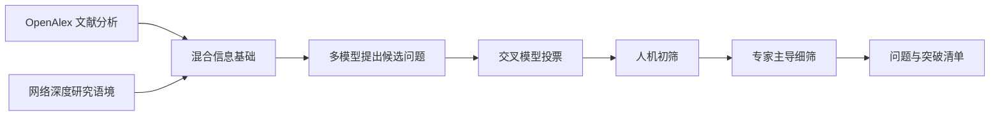

# OmniScientist（FIB LAB）：AI Scientist 研究生态与人机选题

> 固定快照：[tsinghua-fib-lab/OmniScientist](https://github.com/tsinghua-fib-lab/OmniScientist/tree/216277d31c0e5aaf55dde8e4baddc600d148fe94)；commit `216277d31c0e5aaf55dde8e4baddc600d148fe94`；snapshot `2026-09-17`；候选许可证元数据 `MIT`；审阅状态 `draft`。

## 1. 它到底是什么

📘 `tsinghua-fib-lab/OmniScientist` 在固定提交中的实际形态，是由清华 FIB LAB 与中关村学院发起的 AI Scientist 研究成果集合。README 用 OmniScientist 命名整体愿景，覆盖构思、文献综述、实验设计与写作，并明确本仓库收集围绕该愿景的论文和研究结果。其公开树主要由 README、许可证、标识图片及 `papers/HybridQuestion.pdf` 组成，没有与愿景对应的完整可执行应用源码。

因此，收录它的价值是研究议程和能力分解，而不是把它标为已经可安装运行的全流程代理。它与 `Omni-Scientist/OmniScientist` 是不同仓库；同名产品的桌面软件、执行器、测试或数字结果不能移植为本仓库证据。本文区分仓库交付物、README 对论文的概述，以及实际阅读 HybridQuestion 前四页所得的有限方法信息。

## 2. 运行时堆叠

该快照没有提供 requirements、pyproject、可执行入口、服务配置或容器部署合同，所以不能指定其采用某个 Web 框架、模型 SDK、数据库和工作队列。MIT 许可证确认软件与文档的许可说明，不说明研究生态系统已经具有某种运行架构，也不代替外部论文、数据和第三方服务的各自许可。

能确认的“堆叠”是知识层的：宏观生态蓝图、专家视角与集体知识、科研概念网络上的构思、基于资源检索的实验设计、以及关系感知文献检索评测。HybridQuestion PDF 第 3–4 页另外描述 OpenAlex 文献分析、关键词嵌入、网络深度研究、多模型提议和专家筛选。这些是论文所述研究方案，不是仓库内已经启动的服务。

## 3. 阶段机或 DAG

下面只画已阅读 PDF 的概念流程，不能称为源码状态机。HybridQuestion 把高影响问题识别分为三个阶段：AI 加速信息搜集；候选问题提出；人机混合筛选。第一个阶段结合文献定量分析和外部语境，第二阶段由多个模型提出与交叉投票，第三阶段提高人工判断权重以收敛候选。

🔶 PDF 的候选数量、投票比例与最终清单规模描述了一项作者研究设置。图中箭头是对前四页方法概述的归纳，本次没有取得或执行其投票数据、模型轨迹和统计脚本，更没有重现论文对“已发生突破”与“未来问题”判断差异的结果。

## 4. Tool / Skill / Agent 怎么切

README 中 AgentExpt 被描述为资源检索代理，把目标连接到代码库、数据集和工具，再形成可执行实验计划；Deep Ideation 使用科学概念网络形成新连接；MirrorMind 着眼人类专家隐性知识与集体视角。这些名称对应论文或研究方向，不是本仓库可枚举调用的 MCP 工具名。

HybridQuestion 中可以辨识几种职责：机器负责广覆盖的信息加工和初始提议，人机共同筛选，专家提供前瞻性价值判断。它是一种职责分配方案，但当前代码树没有 Skill 注册表、工具 JSON schema、Agent 类或角色调度实现。设计分析可以比较职责，工程接入则需要另行取得每篇论文对应实现和运行条件。

## 5. 文献怎么来、是否入库、引用约束

仓库本身提供论文链接、简述和少量 BibTeX。Deep Ideation 与 AgentExpt 在 README 有明确 arXiv 入口，HybridQuestion PDF 被直接纳入仓库；综述与 Scinetbench 的链接仍标为 Coming Soon。七项“Paper Collection”应理解为目录项目数，其中含待发布条目，不能写成七个可复现开源模块。

HybridQuestion 前四页提及利用 OpenAlex 文献与关键词嵌入识别热点，再补充网络深度研究语境。这能支持其信息源和方法方向，却不能确认是否建立长期论文池、是否全文入库、如何去重、每条候选问题能否绑定原文段落。README 的部分徽章显示相同 arXiv 数字但链接目标不同；准确识别时应使用实际超链接目标，不能抄徽章图片上的标签当论文标识。

若用于后续研究，目录应作为种子入口：逐篇固定版本、核对作者与标题、读取方法，再建立声明和证据关系。这个建议是读者的核验步骤，不是对该仓库已实现引用闸门的描述。

## 6. 实验 / 代码执行

当前公开树没有实验执行脚本，因此既不能声称它会自动运行 GPU，也不能指定其支持本地或集群调度。AgentExpt 摘要写的是把资源转成实验计划；“实验设计自动化”和“在某个环境成功执行该实验”是两类证据，应分别要求计划合同和运行日志。

HybridQuestion 是一个可阅读的研究实例：作者用人机协作方式分析科学突破与未来重大问题，并在摘要中报告二者的人机一致性有差异。这里可确认的是 PDF 含此研究陈述。本文仅看前四页，没有审阅完整结果表、专家招募、评分原始数据、模型版本和消融实验，因此不从摘要推导任何独立验证的优越性，也不写出本次不存在的耗时、成本或准确率。

## 7. 写稿怎么做

README 将论文写作列为 OmniScientist 全流程愿景的一部分，但固定树没有论文写作程序、模板目录、引用渲染器或生成后检查脚本。`HybridQuestion.pdf` 是作者放入仓库的成品论文文件，不是“系统本次生成论文”的证据，也没有可见的自动装配谱系供本报告验证。

从研究议程看，把问题价值判断放在写作之前是有意义的：若题目本身缺乏重要性，扩大写作自动化并不能弥补。这个洞见来自研究设计，不意味着仓库已经对正文设置新颖性门槛。对于希望部署自动写作的读者，本仓库更适合作为选题与组织人机协作的参考，而不是直接运行的写稿工具。

## 8. 图怎么做

已阅读的 PDF 第 4 页有 HybridQuestion 方法总览图，展示文献、关键词、搜索、候选提出和投票的概念联系；README 同时有品牌图片和演示视频链接。它们属于说明材料。固定树没有该图的绘制代码、原始表格或可重生成的图资产合同。

因此，本报告可以讨论图表达了什么，不能证明系统具备“自动规划论文图、重画定量图、检查碰撞或导出矢量图”的能力。本文 Mermaid 是为理解论文方法而新写的简化关系图，既不复制论文图，也不作为新研究结果。若后续拿到实验材料，图表仍应按数据来源和统计口径独立核验。

## 9. 和 RH 的相似点

两者在研究分层上有共同点：信息搜集、构思、设计和写作不是同一类任务；研究问题的重要性不能仅靠格式漂亮的输出衡量；人类判断需要出现在关键决策位置，而不只是最后签名。MirrorMind 与 HybridQuestion 对专家视角的重视，可与 RH 工作流中的人机决策和证据约束进行概念对照。

这类对照的单位是方法目标与职责，不是代码性能。对某条研究声明，应先问它来自论文叙述还是已执行数据；对某种系统能力，应先问有无实现和运行证据。此标准同样适用于 RH，不能因为接口名称类似便假定功能已等价。

## 10. 和 RH 的不同点

最重要区别在公开交付物：该快照是研究成果入口，RH 的相关公开工具表则提供主题管理、论文入池、声明抽取、证据链接和阶段状态的可调用接口。前者帮助理解为何需要某种科学家能力，后者把若干研究资产与操作组织成运行合同。

领域上，HybridQuestion 讨论跨学科、面向战略层的重大问题筛选；一般单论文生产工作流更关注一个特定题目的证据和交付。前瞻性价值没有现成标准答案，不能以模型多数票替代专家判断，也不能把短期基准得分直接当成长期科学影响。这个差异使它有独特研究价值，但也限制了自动验收的范围。

## 11. 优点 / 缺点

优点是把研究生态、专家知识、概念网络、实验资源和检索基准放在同一议程下，避免把 AI Scientist 缩成单个写作提示；实际纳入的 HybridQuestion PDF 让读者能越过 README 口号看方法。MIT 许可和清晰论文入口有利于学术追踪。

局限是工程实现与运行合同缺失，部署成本、权限、持久化和失败处理均无法在该快照核验；目录中部分条目仍待发布；链接徽章与目标存在识别细节；人机投票研究的结论需要查看完整实验材料才能评估。它值得作为研究生态候选保留，却不宜与可直接运行系统按同一完成度评分。

## 12. RH 可学的 1–3 条

1. 💬 **选题价值单独建模。** 新颖性、可执行性和“是否值得研究”不是同一维度，应允许专家对后者提出独立判断。
2. **把专家输入安放在决策位置。** 先利用机器扩大覆盖，再在收敛阶段引入人类价值判断，比让专家只审最终成稿更有针对性。
3. **资料目录标明交付成熟度。** 论文、计划中的基准、已发布数据和可运行软件应分开标注，防止一个生态愿景被读成所有组件已经落地。

## 13. 名字速查表

| 名称 | 当前证据支持的角色 |
|---|---|
| OmniScientist | FIB LAB 的 AI Scientist 生态愿景和论文集合 |
| MirrorMind | 专家视角与集体知识方向的论文 |
| HybridQuestion | 人机共同识别高影响研究问题的论文 |
| Deep Ideation | 科学概念网络驱动的构思方向 |
| AgentExpt | 基于资源检索的实验设计方向 |
| Scinetbench | README 中仍待发布的关系感知检索基准条目 |
| OpenAlex | 已读 HybridQuestion 方法概述中的文献来源 |
| Keyword embedding | 用于关键词语义分析的研究方法 |
| Hybrid selection | 人机初筛与专家细筛的概念过程 |
| LICENSE | MIT 文本；不构成能力或效果验证 |

**固定提交证据入口**

- [README.md](https://github.com/tsinghua-fib-lab/OmniScientist/blob/216277d31c0e5aaf55dde8e4baddc600d148fe94/README.md)
- [LICENSE](https://github.com/tsinghua-fib-lab/OmniScientist/blob/216277d31c0e5aaf55dde8e4baddc600d148fe94/LICENSE)
- [papers/HybridQuestion.pdf](https://github.com/tsinghua-fib-lab/OmniScientist/blob/216277d31c0e5aaf55dde8e4baddc600d148fe94/papers/HybridQuestion.pdf)

📌事实边界：本报告基于上述固定提交的公开材料静态阅读，缓存文件已与该提交 Git blob 哈希核对，README 已与公开固定 URL 字节对照。HybridQuestion 仅阅读第 1–4 页，其余论文链接未作为全文阅读证据。未安装或运行项目依赖、服务、模型、实验、GPU 任务、基准或论文编译；README 与论文中的数字均为作者报告，未做独立复现。RH 对比仅限公开接口职责，不代表运行效果或科学质量排名。
