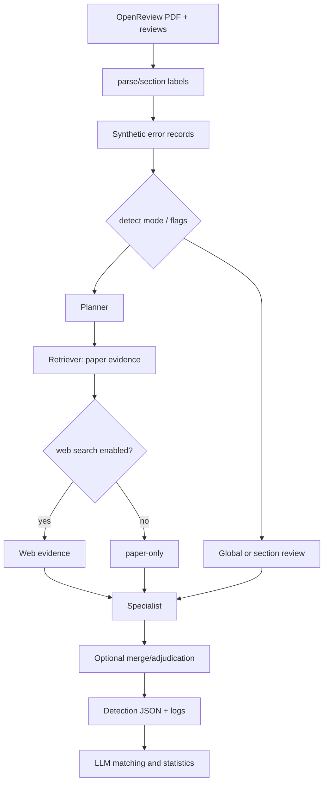

# TU2021/PaperAudit：论文错误检测、审阅与训练流水线

| 字段 | 值 |
|---|---|
| GitHub | https://github.com/TU2021/PaperAudit |
| 分析提交 | `de7582b188ca2d867298de978386ec1f5085806f` |
| 元数据快照 | 2026-09-17 |
| 代码许可 | NOASSERTION（根目录无 LICENSE；GitHub API 未识别） |
| 审阅状态 | draft；固定提交静态阅读，未运行 |

## 1. 它到底是什么

PaperAudit 是一个面向学术论文质量评估的公开工程，README 把数据预处理、错误检测、论文审阅和模型训练放在同一仓库中。它既能从 OpenReview 下载论文和评审、解析 PDF、合成错误，也能运行多 Agent 检测和多阶段 review，再用 SFT/RL 训练相关模型。候选元数据将它定位为 evidence-aware scientific error detection 与多 Agent peer review 的基准。📘README 的“8 类错误”“支持模型”和流程描述是上游项目说明；本页没有下载数据、调用模型、跑检测或核对论文中的指标。

从架构上看，它不是一个单一 reviewer prompt，而是一组可开关阶段。`detect/README.md` 把 fast、standard、deep 三种模式区分为不同功能组合；深模式可以打开全局审阅、section review、per-task、retriever、web search、memory 和 merge。`review/agents/PaperAudit/audit.py` 的 `AuditAgent` 则对一篇已结构化的论文先做 baseline，再生成 paper memory，调用 cheating detector 和 motivation evaluator，最后把这些作为注意线索交给 refined review。🔶这类流水线的输出是模型辅助判断，不是自动编辑部裁决。

许可元数据保持 `NOASSERTION`：冻结 tree 中未找到 LICENSE/COPYING/NOTICE 文件，已读 README 也没有明确的仓库许可授予。公开可读不等于允许任意代码再分发，采用时应向上游核清。

## 2. 运行时堆叠

运行时主要是 Python、异步 LLM 调用、PDF/JSON 预处理和并行 batch。检测脚本的 feature flags 默认需要显式打开；`enable_web_search` 还会在 `process_one_job` 中与 `enable_retriever` 相与，避免没有检索器时独立联网。每个 task 保存 doc slice、memory slice、retriever evidence、web answers 和 error 文件，最终 output 还含 flags、失败步骤、上下文上限和任务统计。review Agent 的缓存可以复用 baseline、memory、cheat 和 motivation，但 final review 明确每次重算。

源码中的 detect_mode 主要参与输出目录命名，具体行为由单独布尔 flags 决定，不能只传 deep 就假设全部功能开启。global、section 和 task 的失败会记录在 `step_failures` 中，而流水线仍可能保存 findings 并返回 `ok=True`；这意味着文件成功生成与审查覆盖完整必须分开判断。

## 3. 阶段机或 DAG

检测 DAG 可概括为：预处理生成带 section 的 paper JSON 与 synthetic corruption；outline/memory（可选）建立上下文；global/section review（可选）生成候选；planner 把风险拆成 task；retriever 从当前 section 取 paper evidence，必要时生成 web query；specialist 逐任务给 findings；merge 可再合并和 adjudicate；最后写 detection JSON 与 debug metadata。评估脚本再把 finding 和 ground truth 匹配，输出 recall/precision/F1 及按 corruption type、difficulty、location 的统计。

## 4. Tool / Skill / Agent 怎么切

**Agent** 包括 planner、retriever、specialist、cheating detector、motivation evaluator、summarizer 等角色；**Tool** 是解析器、文件处理、引用/网页检索和模型调用；**Skill** 没有独立插件协议，能力由 detect mode 和 feature flags 组合；**Environment** 是论文 blocks、section、debug_dir、缓存和外部检索服务。审阅系统用 section 标题聚合 blocks，重复标题会合并，说明它把文档结构作为模型上下文的一部分，而非只传一篇未经分段的长字符串。

## 5. 文献怎么来、是否入库、引用约束

README 的预处理入口从 OpenReview 下载 PDF、评审和元数据，经 LlamaParse/LLM 解析成结构化 blocks，再加 section 标签。检测器的 Retriever 用 `span`、`content_index`、`block_type` 保存论文内证据；其 web evidence 路径会把查询和回答保存到日志，但 `perform_web_search_for_queries` 明确不强制包含 URL。因此“支持联网”不等于每条 finding 都有可打开的外部来源。

另一个 review 检索器 `PaperRetrieval` 的实际 append 顺序是先 arXiv，失败或无结果再尝试 Semantic Scholar，返回 title/authors/summary/url；这是 fallback，而不是合并两源的检索覆盖保证。所读代码没有建立统一文献池及引用真实性的硬 gate。README 中 Paper 按钮与 Dataset 按钮指向同一个 Hugging Face 数据集，不能只凭按钮标签当作论文全文已经核实。

## 6. 实验 / 代码执行

实验/代码执行在这个项目中有两层含义。第一层是预处理、检测、评估脚本本身的程序运行；第二层是对论文中“实验是否充分、是否有错误”的模型审阅。检测器可以读取 local paper evidence，并可选执行 web search，但源码没有把被审论文的实验代码自动沙箱复现作为默认步骤。评估用 finding 与 ground truth 的匹配来计算 detection rate、precision、F1；它衡量的是检测和匹配，不等于错误已被真实实验确认。

## 7. 写稿怎么做

PaperAudit 的主要文本产物是 finding 描述、review、cheating report、motivation report、refined final assessment 和训练样本。README 所述 SFT 与 VERL/GRPO 训练路径说明它还可将检测/审阅数据用于模型改进；但训练和审稿输出是两条路径，不应将训练 checkpoint 当作证据 artifact。AuditAgent 的缓存写入逻辑采用“不覆盖已有文件”，可避免误覆盖，但复用 cache 会改变后续 prompt 上下文，比较实验时必须把 reuse_cache、model_tag 和开关记录下来。 阶段异常也可能被转成带 ERROR 标记的文本继续流向 refined review，故辅助报告存在不能代替其有效性检查。

## 8. 图怎么做

项目 README 提到 benchmark construction、detect workflow 和 review workflow 图；源码更重视 JSON findings、debug logs 和 `eval_log_detail` 的分解统计。适合的结果图是按 corruption type/difficulty/location 的 recall、precision、F1，以及 fast/standard/deep 的资源—质量对照；必须把 evaluator model、matching prompt、空输出重试次数和是否联网写进图注。不能根据目录名或 README 的“deep”标签宣称深模式一定更准确。

## 9. 和 RH 的相似点

RH 与 PaperAudit 都把文档任务拆为预处理、分析、审查和结果记录，并且重视 findings、evidence、debug log 和可复核配置。PaperAudit 的 section slice、retriever evidence 和 merge meta 可启发 RH 为每条 claim 保留局部文本、检索来源和合并前后版本；其显式 flags 也适合映射到运行合同。两者都需要把模型意见和真实证据分层，避免最终 prose 覆盖原始 finding。

## 10. 和 RH 的不同点

PaperAudit 偏向论文错误检测和 review 模型/数据集工程，RH 的证据闸门还要求来源、实验 artifact、稿件声明和交付状态相互一致。这里的 synthetic corruption 是可控的 benchmark 信号，不能代替现实论文中的全部错误分布；LLM matching 的 F1 也不代表科学审查的真实召回。web search 只在 flags 允许且 retriever 产生 query 时发生，检索结果没有因此自动成为经核验引用。

## 11. 优点 / 缺点

**优点**：模式和开关清楚；检测、评估、统计输出分层；per-task 目录利于追溯；论文 section、memory、retriever 和 merge 能组合实验；AuditAgent 对 baseline 与 refined review 的缓存规则较明确。**局限**：多模型、多温度、多开关使比较容易失控；synthetic error 的构造分布会影响指标；web evidence 和 LLM judge 有服务依赖；复杂阶段失败时可能只留下 step_failures 或错误文本；README 描述的训练与评测规模未在固定快照上独立重跑。

## 12. RH 可学的 1–3 条

💬以下是架构借鉴建议，不是该项目已实现的 RH 集成。

1. **为每条 finding 保留证据跨度**：记录来自哪一节、哪一段、哪次检索和哪一轮 specialist。
2. **把 feature flags 纳入实验主键**：mode、retriever、web、memory、merge 与模型版本缺一不可。
3. **把检测意见与修订完成分开**：finding 只能产生待办；真实修改仍需文档 diff、实验回执和引用核验。

## 13. 名字速查表

| 名字 | 含义 |
|---|---|
| `mas_error_detection.py` | 运行全局/section/per-task 检测并写 findings |
| `Planner` | 将论文风险拆成聚焦任务 |
| `Retriever` | 从论文切片抽取 evidence 并可生成 web query |
| `Specialist` | 对单个 task 形成候选 finding |
| `AuditAgent` | baseline、辅助审阅和 refined review 的编排器 |
| `PaperRetrieval` | arXiv 优先、Semantic Scholar fallback 的检索器 |
| `eval_detection.py` | finding 与 ground truth 的匹配评估 |
| `eval_log_detail.py` | 按错误类型等维度汇总统计 |

---

> 📌事实边界
> 本页依据上述固定提交的公开 README 与列明源码进行静态分析，没有安装运行项目、调用外部模型/服务、下载完整外部数据或独立重算 README/论文的规模与性能数字。流程图是源码/文档结构概括，不是运行轨迹；比较 RH 的内容属于架构分析，建议属于评述。快照日期来自候选清单，不表示本次运行了该日的服务。
> 核对来源：[README.md](https://github.com/TU2021/PaperAudit/blob/de7582b188ca2d867298de978386ec1f5085806f/README.md)、[detect/README.md](https://github.com/TU2021/PaperAudit/blob/de7582b188ca2d867298de978386ec1f5085806f/detect/README.md)、[detect/mas_error_detection.py](https://github.com/TU2021/PaperAudit/blob/de7582b188ca2d867298de978386ec1f5085806f/detect/mas_error_detection.py)、[detect/agents.py](https://github.com/TU2021/PaperAudit/blob/de7582b188ca2d867298de978386ec1f5085806f/detect/agents.py)、[review/agents/PaperAudit/audit.py](https://github.com/TU2021/PaperAudit/blob/de7582b188ca2d867298de978386ec1f5085806f/review/agents/PaperAudit/audit.py)、[review/agents/PaperAudit/paper_retrieval.py](https://github.com/TU2021/PaperAudit/blob/de7582b188ca2d867298de978386ec1f5085806f/review/agents/PaperAudit/paper_retrieval.py)、[detect/eval_detection.py](https://github.com/TU2021/PaperAudit/blob/de7582b188ca2d867298de978386ec1f5085806f/detect/eval_detection.py)。
