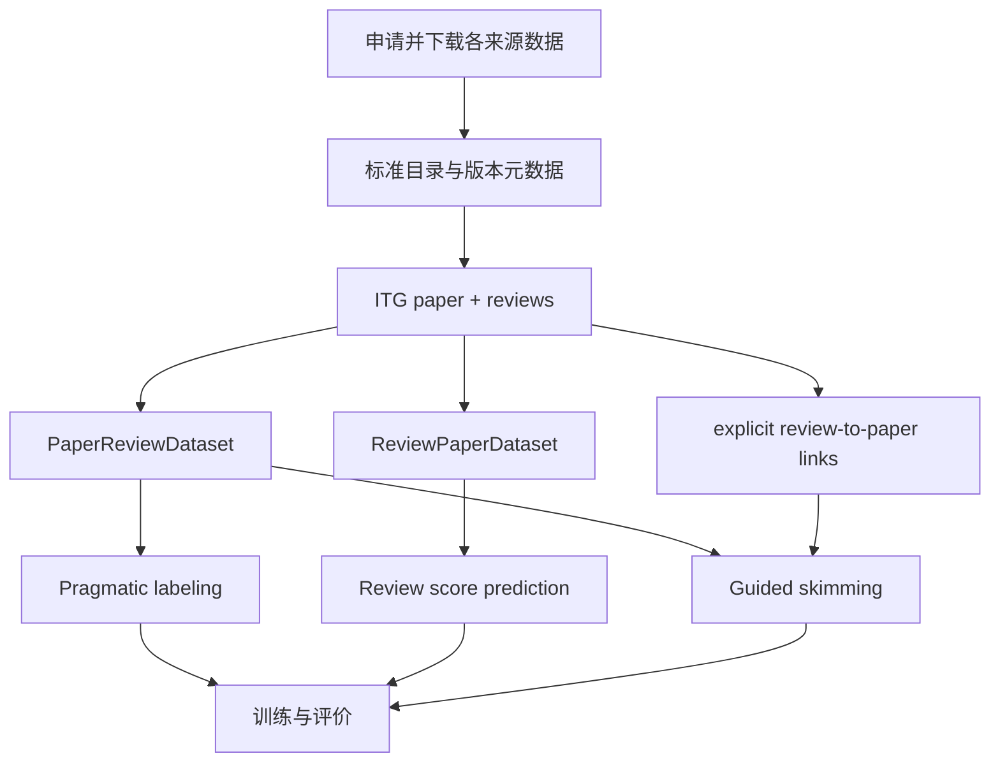

# UKPLab/nlpeer：统一论文结构、评审文本与版本标注的数据接口

| 字段 | 值 |
|---|---|
| GitHub | https://github.com/UKPLab/nlpeer |
| License | Apache-2.0（代码）；数据集按各自许可与申请条件使用 |
| Stars | 35（2026-09-17 快照） |
| GitHub 最后 push | 2025-02-17 |
| 分析 commit | `832352c33f874b4fd207792313ac4916a6137b52` |
| 产品类型 | 同行评审统一数据资源、文档图接口与辅助任务基线 |
| 分析方式 | 固定提交 README、加载器、任务与评价源码静态阅读 |

本文用 📘 标注文档或源码中可直接定位的事实，🔶 标注由控制流推导的边界，💬 标注评价与借鉴建议。仓库动态元数据沿用候选清单，源码判断只绑定页面中的固定提交。

## 1. 它到底是什么

NLPeer 是为计算研究同行评审而设计的统一资源与代码接口。其目标是把不同会议和期刊的论文、review、分数、文档结构和跨版本标注放进一致目录与对象模型，让研究者不用为每个来源重复实现数据读取。README 明确将用途定位为同行评审研究和 NLP 辅助，并指出 reviewer author profiling 违反预期用途。

固定快照 README 介绍 NLPeer v2 新增 ARR-EMNLP-2024、EMNLP-2023、PLOS 和 ELIFE 数据，并指向外部数据仓库申请下载。代码仓库本身不等于完整数据集已随 clone 获得。它不是自动审稿 agent，而是审稿辅助研究的底层材料和实验实现，尤其关注 review score prediction、pragmatic labeling 与 guided skimming。

## 2. 运行时堆叠

`src/nlpeer/__init__.py` 定义数据集、格式、节点类型、评分尺度以及 `PaperReviewDataset`、`ReviewPaperDataset` 等加载视图。目录按 dataset/data/paper-id/version 保存 metadata、论文结构和 reviews；annotations 单独保存版本内链接、语用标注与跨版本 diff。

论文的主要程序化表示是 `IntertextDocument`，也就是 ITG 文档图。节点类型包括 title、heading、paragraph、abstract、figure、table、formula、caption 相关结构和 bibliography item。`pyproject.toml` 声明 Python 3.10+，依赖 PyTorch、transformers、datasets、PyTorch Lightning、scikit-learn、spaCy、intertext-graph、GROBID client 等。它是数据与实验库，不是部署型 SaaS。

## 3. 阶段机或 DAG

该 DAG 表示离线数据准备、标注与模型实验。每个任务有自己的 train/evaluate 入口，数据视图负责统一读取，而不是在一个长会话中推动研究阶段。`PaperReviewDataset` 可以按论文 ID 或索引访问，支持缓存和 preload；strict_loading 控制缺失论文/评审是否直接报错。默认非严格模式允许缺失内容，因此分析时必须保留样本可用性统计。

## 4. Tool / Skill / Agent 怎么切

NLPeer 的主要组件是 Dataset、Document graph、Task dataset 和模型。它没有在线 agent 角色。`PaperReviewDataset` 以论文为中心返回 paper_id、meta、paper、reviews；`ReviewPaperDataset` 以 review 为中心提供视图；任务包装器进一步生成评分预测、语用标签或段落排序样本。

`explicit_links.py` 用静态及动态模式找 review 中的章节名、图表编号、行号和引用指针，再定位到论文图节点。此类函数是数据标注工具，不是 LLM function calling。固定提交没有面向宿主发布的 Skill/MCP 合同，接口是 Python import 与 CLI。

## 5. 文献怎么来、是否入库、引用约束

完整论文和 review 数据由 README 指向的外部数据仓库提供，来源包含不同会议、期刊和历史 PeerRead 子集。元数据中保留 title、authors、abstract 和 license，review 对象保留 rid、report、scores 与附加 metadata；数据可以包含多个稿件版本。

代码定义 PDF、ITG、GROBID、XML、TEX 等格式枚举，但已查看的 `PaperReviewDataset.load` 实际只加载 ITG，其他格式会抛出不支持错误。格式声明不能写成全部格式的通用读取能力。文档图中的 bibliography/reference 节点和 review-to-paper 链接帮助定位文本，却不是引用真实性或主张支持验证；需要外部文献核验时仍需另一套工具。

## 6. 实验 / 代码执行

项目提供三个代表性辅助任务。Review score prediction 将论文/评审内容映射到数值评分；pragmatic labeling 将 review 句子标成 strength、weakness、request、neutral；guided skimming 根据 review 对论文的指向，预测值得 reviewer 关注的段落。数据模块与 Lightning 模型分别负责训练和预测。

skimming 评价包含分类 F1、precision、recall、accuracy，以及排序 precision@k、recall@k、AUROC、AUPR 和 MRR，并提供随机排序基线。源码还会汇总多个 checkpoint/seed 的统计。它们是针对明确任务的指标，不等于完整审稿质量或专家正确性。本次没有申请数据、训练模型或运行评价，不能确认公开代码在当前依赖组合下的运行效果。

## 7. 写稿怎么做

NLPeer 不生成论文正文或修改建议。它提供 review 文本、文档结构、评分和标注作为研究数据，辅助模型的输出是标签、分数或段落排名。README 的目标是帮助经验较少的 reviewer，但这种目标不应被写成已经验证的生产能力；具体改善仍需用户研究或外部实验。

如果把输出接到写作流程，pragmatic request 可以帮助提取行动项，显式链接可以定位被评论段落，跨版本 diff 可用于追踪修订。真正的修订文本、补实验和稿件编译仍由外层完成。数据标注与写作生成之间的责任边界应保持清楚。

## 8. 图怎么做

README 以目录结构和节点映射表说明资源，评价代码依赖 plotly、wandb 等可视化或记录工具，但本次没有运行图形输出。图表最自然的用途是数据覆盖、不同 review 标签分布、模型分类/排序指标与版本链接示意，而不是生成新的科学机制图。

用于论文时，应区分来源尺度。例如 ARR overall score、F1000 approve/approve-with-reservations/reject 和其他会议分数通过不同转换映射，不能不经说明混画成一个原始分值。图中的样本单位也要明确是论文、review、句子还是段落，避免把数据层级混在一起。

## 9. 和 RH 的相似点

两者都需要把文献和审查材料组织成可定位的结构。NLPeer 的 paper/version/review/annotation 层级，以及 ITG 的段落、图表、公式和引文节点，对 RH 的 evidence span 与修订跟踪具有参考价值。一个意见能指向具体文档节点，比只有一段泛泛评论更容易进入后续工作流。

数据许可、来源差异、版本和缺失状态同样重要。NLPeer 提醒平台把数据准备与模型推理分开：很多所谓 reviewer 能力差异，可能来自可见文档结构、输入截断或标注覆盖，而不只是模型本身。

## 10. 和 RH 的不同点

NLPeer 是离线资源与任务基线，RH 的比较对象是有研究状态、artifact lineage 和阶段 gate 的工作流。NLPeer 可以加载或预测 review 标签，却不会决定某条研究主张的证据是否足够、是否应该补实验或是否能发布稿件。

其 ITG 与 annotations 有助于文本定位，但不自动构成主张支持关系；review score 也不是 scientific soundness 真值。外部数据下载和各来源许可使其更适合作为可选研究数据适配层，而不是所有 RH 用户默认可用的通用语料库。

## 11. 优点 / 缺点

**优点**：统一多来源数据接口，降低研究者重复预处理成本；版本、review 和 annotation 分层清楚；ITG 节点能保留论文结构；三个辅助任务范围明确，指标和随机基线公开；README 明确伦理用途和 reviewer profiling 限制。

**局限**：完整数据需另行申请/下载；格式枚举与实际 loader 支持存在差别；默认非严格加载允许缺失内容；不同来源评分尺度和标注任务不完全一致；复杂 NLP 依赖与外部库增加复现成本；本次未验证数据许可全文、训练效果或部署可用性。

## 12. RH 可学的 1–3 条

1. **把论文版本、review、文档节点和 annotation 分层保存**，为意见定位与修订回放提供稳定 ID。
2. **显式记录缺失输入与尺度转换**，让评价结果知道分母和标签含义。
3. **将辅助任务与整体审稿分开**：句子分类、段落排序、评分预测各自验证，不以其中一项成功推断全流程有效。

## 13. 名字速查表

| 名字 | 先决概念 | 含义 |
|---|---|---|
| ITG | 文档图 | 保留论文节点及关系的结构化表示 |
| `PaperReviewDataset` | 论文视图 | 返回论文、元数据与全部 reviews |
| `ReviewPaperDataset` | 评审视图 | 以单条 review 为单位读取关联论文 |
| `PragmaticLabelingDataset` | 句子分类 | strength/weakness/request/neutral 标签任务 |
| `ReviewScorePredictionDataset` | 分数预测 | 将输入映射到评审评分 |
| `SkimmingDataset` | 段落排序 | 构造 reviewer 关注段落的正负样本 |
| `strict_loading` | 缺失控制 | 是否要求论文和 review 文件齐全 |
| explicit links | 文本定位 | 将评审指针链接到论文结构节点 |

---

> 📌事实边界
> 本页只读固定提交 GitHub 文件，未申请外部数据、未训练或评价模型。NLPeer v2 覆盖范围来自 README；代码 Apache-2.0 不自动覆盖所有数据来源。格式枚举不等于 loader 全部实现，所读 PaperReviewDataset.load 只支持 ITG。核对入口为 [README](https://github.com/UKPLab/nlpeer/blob/832352c33f874b4fd207792313ac4916a6137b52/README.md)、[加载器](https://github.com/UKPLab/nlpeer/blob/832352c33f874b4fd207792313ac4916a6137b52/src/nlpeer/__init__.py)、[任务定义](https://github.com/UKPLab/nlpeer/blob/832352c33f874b4fd207792313ac4916a6137b52/src/nlpeer/tasks/__init__.py)。
