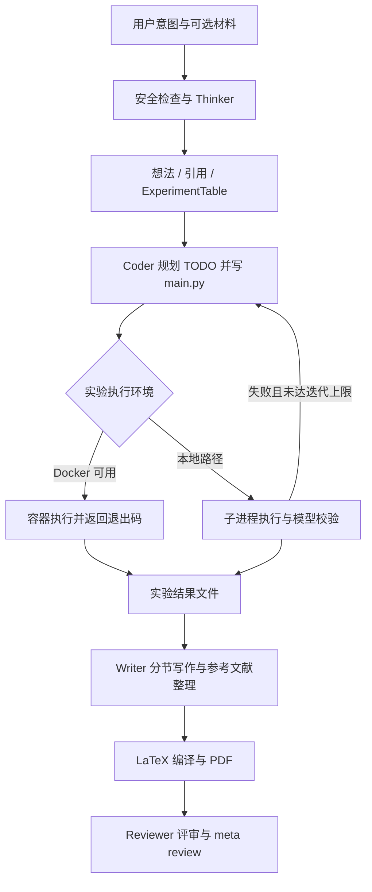

# TinyScientist：以实验蓝图串联构思、执行、写作与评审

| 字段 | 值 |
|---|---|
| GitHub | https://github.com/ulab-uiuc/tiny-scientist |
| 分析 commit | `888c5e3f825392f494891df956f12edfa5a3709a` |
| 快照日期 | 2026-09-17 |
| Stars | 136（候选冻结元数据，不代表质量评分） |
| 最后 push | 2026-03-04（候选冻结元数据） |
| 许可 | 根目录 LICENSE 为 MIT；包元数据存在不同标注，见下文 |
| 产品类型 | 轻量科研 Agent 框架，附 Web 演示界面 |
| 审阅状态 | draft；固定提交静态阅读，未运行 |

本文用 📘 标注文档或源码中可直接定位的事实，🔶 标注由控制流推导的边界，💬 标注评价与借鉴建议。仓库动态元数据沿用候选清单，源码判断只绑定页面中的固定提交。

## 1. 它到底是什么

TinyScientist 的核心产品形态是一组可独立调用的 Python 科研阶段：`think()` 生成想法，`code()` 实现并执行实验，`write()` 生成论文，`review()` 对 PDF 或 TeX 给出结构化评审。用户可以按 README 示例串起来，也能只调用其中一段。它覆盖的链条比单纯论文搜索或 Markdown 写作更长，但顶层 `TinyScientist` 主要承担对象初始化、参数转交和结果展示，并不是带持久化关卡的全流程调度器。

这个固定提交的重要特征是，实际导出的 Thinker、Writer、Reviewer 类继承了各自 legacy 基类，再以 SDK 后端替换关键生成方法。只阅读文件前半部分的旧实现，会把当前运行时认错。`utils/agent_sdk.py` 将默认运行时设为 Claude Agent SDK，OpenAI Agents SDK 是显式可选项，SDK 与模型组合也有部分前缀校验。README 所说的旧 `smolagents` 兼容路径不能代替当前默认路径。

许可需要分层记录：根 `LICENSE` 写的是 MIT，而同一提交的 `pyproject.toml` 中 `license` 写成 Apache 2.0 License。本页按根许可登记 MIT，同时保留这一冲突；准备再分发时应向维护者确认，不能把两个字段解释为已确认的双许可证。本文也没有独立核验 README 的会议接收信息或外链论文结论。

## 2. 运行时堆叠

实际运行栈可以分为五层。

| 层 | 固定提交中的实现 | 架构含义 |
|---|---|---|
| 交互入口 | `TinyScientist` Python API；`backend/app.py` 的 Flask、Flask-SocketIO；React 18 前端 | 脚本与浏览器演示共用科研阶段，但不能据此推断生产级多租户能力 |
| 阶段对象 | Thinker、Coder、Writer、Reviewer、SafetyChecker | 按研究职责切分，返回字典、状态和文件路径 |
| Agent 运行时 | ClaudeAgentRunner 或 OpenAI Agent/Runner | SDK 负责模型与工具循环；高层阶段仍由 Python 方法组织 |
| 工具 | 搜索、代码文件、实验执行、绘图、MCP research server | 工具调用连接外部服务与本地副作用 |
| 持久化产物 | 想法 JSON、TODO、Python 文件、实验结果、BibTeX、图清单、TeX/PDF | 以输出目录组织，不等同于带依赖图的研究对象数据库 |

依赖文件要求 Python `>=3.10,<3.12`，比 README 徽章的“≥3.10”更具体。Poetry 依赖包括 Pydantic、Flask、Docker SDK、PyMuPDF、CairoSVG、两个 Agent SDK 等；大量依赖版本未严格锁定，固定源码提交本身不能冻结全部运行环境。LaTeX 编译还需要系统级工具。

`BudgetChecker` 有阶段账本和父级总账，支持按任务计费及预算超限异常。它的 `add_cost()` 是收到 token 用量后追加成本，因此不是对远端实际账单的预付式硬限额。反思轮数会参考剩余预算，但完整成本覆盖、SDK usage 格式兼容性和异常后的实际花费，本次未测试。

## 3. 阶段机或 DAG

下图表示 Python API 被调用方串联时的主要控制流，并标出实验执行分支。它是源码关系图，不是本次执行轨迹。

Thinker 当前 TODO 包括想法生成、检索补强、可选实验规划、可选 novelty check 和安全检查。`TinyScientist.think()` 的 `check_novelty` 默认是 `False`，所以不能把“有新颖性检查函数”写成“每个想法必经新颖性认证”。Coder 不仅要求 `Experiment` 字段，还会要求 `ExperimentTable`，把它当作执行蓝图，再生成步骤清单，逐步实现代码，执行并尝试修复。

顶层 API 不强制 `write()` 必须消费一次成功的 `code()` 回执：README 中先检查 `status` 是调用方示例逻辑，`write()` 自己仍接收普通想法字典和实验目录。review 同样是独立调用，评审结果没有在顶层自动连接到阻塞发布或返工循环。因此，这是一组可以拼装的科研阶段，而不是已实现“从输入到审稿通过”的不可跳过状态机。主要依据为 `tiny_scientist/scientist.py` 与各阶段实际导出类。

## 4. Tool / Skill / Agent 怎么切

**Agent** 是带不同指令和工具集合的角色。Thinker 下有 IdeaGenerator、EvidenceScout、SpecRefiner、新颖性与想法评估角色；Coder 下有 planner、coder、validator；Writer 下有正文、相关工作、引用补强、图表规划、表格、参考文献管理和 LaTeX 修复角色。角色多并不等于它们并行运行：已读主要路径大多由阶段方法依次调用。

**Tool** 是可执行函数边界。OpenAI 后端通过工具包装器暴露研究工具；Claude 后端由 `utils/sdk_mcp.py` 生成 `.tiny_scientist.generated.mcp.json`，指向 Python MCP research server，并生成对应允许工具名。工具包括 paper/web/code/dataset/benchmark search、表格提取、claim verifier 等。Coder 的 Claude 路径另外允许 Bash、Read、Write、Edit、Glob、Grep。

**Skill** 是运行时的能力指导。README 说明 Claude 后端通过原生 Skill 流程使用用户与项目设置，OpenAI 路径可向指令注入本地技能内容，也可配置 shell-mounted skills。两者不具有完全相同的装载语义。

有一个部署前应检查的接线边界：`ClaudeAgentRunner` 根据已安装 SDK 的构造参数选择 `mcp_config` 或 `mcp_config_path`；若只看到 `mcp_servers` 参数，它会忽略生成文件并依赖项目设置发现 MCP。生成配置文件存在，不代表该 SDK 版本一定把它挂载成功。此外 runner 默认设置 `permission_mode="bypassPermissions"`，不能把允许工具列表或工作目录描述为安全沙箱。

## 5. 文献怎么来、是否入库、引用约束

`tool_impls.py` 的 `PaperSearchTool` 支持 Semantic Scholar、OpenAlex、Crossref 和 arXiv。每次根据 engine 选一个提供者，而非默认四源同时扇出；有 S2 key 时默认偏向 Semantic Scholar，否则默认 OpenAlex。该实现不在提供者失败时自动换引擎，但可能补充 arXiv 摘要。返回值以论文标题为键，包含摘要、作者、年份、venue、URL、source_type 和 BibTeX；这适合写作上下文，标题键也意味着同名结果可能覆盖。

Thinker 的 EvidenceScout 要求引用具有真实 URL，代码还会整理引用链接。Writer 将已有 references 与 idea 的 Citations 合并，交给 bibliography agent 去重、补字段，再保存 `bibliography_manifest.json`。规范化阶段拒绝没有标题或 BibTeX 的条目，也拒绝非 HTTP(S) 的非空 URL，但允许 URL 为空，且没有逐条向 DOI 注册机构核验返回文献。

引用约束主要是格式和提示层面的约束。输出 formatter 读取 `custom.bib` 中的键，删除正文中不存在于该文件的 citation key；这可以减少未定义引用，却不能保证被引论文支持句子，删除引用本身也不会修正正文主张。

尤其要准确理解 `claim_verifier`：它把输入主张分别送入 web search 和 paper search，返回 `web_evidence`、`paper_evidence` 候选。已读实现没有输出支持、反驳、未知的判定，也没有证据 span 或页码绑定。工具名不构成事实核验已经完成的证明。当前这条链更接近带来源链接的检索与写作辅助，未见统一的持久化 paper–claim–evidence 数据库。

## 6. 实验 / 代码执行

Coder 将实验表转成 TODO，写入 `main.py` 和辅助文件，使用 `run/final_info.json` 收集结果，再汇总为 `experiment_results.txt`。初始化参数虽然保留 `max_runs`，构造函数实际把 `self.max_runs` 设为 1；当前外层循环是对单次实验的修复重试，不能据参数名推导出多随机种子重复实验。默认最大修复迭代由顶层设为 4。

执行有两条不同可信边界。Docker 路径使用 Python 基础镜像，推断依赖、构建镜像，把输出目录读写挂载进容器，并设置内存与 CPU 配额；本地路径使用 `subprocess.run()`，缺包时可能自动调用 pip 安装。Docker 不可用时会落到本地执行，所以 `use_docker=True` 不是“拒绝任何宿主执行”的保证。生成代码阶段的 Bash 工具也不由这个 Docker 执行函数包住。

更重要的是，Coder 的 `_run_single_experiment()` 在 Docker 返回非空结果时直接返回退出码和日志；后面的 `final_info.json` 读取与 `_validate_run_results()` 位于本地分支。因而“容器退出码为零”与“通过该模型校验器”并不等价。模型校验器会检查结果与实验表是否匹配、是否疑似常量或占位值，并写 `validation_report.json`，但这些检查依赖模型输出，仍不是独立统计复核。

本次没有安装项目依赖、运行生成代码、启动 Docker、训练模型或复现实验。`tests/test_sdk_smoke.py` 已读部分使用 fake Agent/Runner 和模块替身，说明仓库有接口烟雾测试设计，但本次未执行这些测试，也不能把接口测试解释为科学结果已经得到验证。

## 7. 写稿怎么做

Writer 的实验型路径读取实验目录下的 Python 源码、`experiment_results.txt` 和可选 `baseline_results.txt`。非实验型想法则跳过这组输入。WriterPlanner 生成带 action 的 TODO；代码只接纳相关工作、分节正文、视觉素材、摘要、修订和格式导出等动作。最低结构校验要求 TODO 含相关工作、摘要和导出，未强制每个必需正文小节都被逐一覆盖。

随后，Writer 按 TODO 调各角色生成内容，补充引用，整理 bibliography，再交给 ACL 或 ICLR formatter。formatter 下载相应模板、写 BibTeX 与 TeX、清理引用键并编译 PDF；编译失败时，Writer 还会将日志与完整 TeX 交给修复角色，最多尝试两次额外恢复。模板下载 URL 未固定到模板仓库 commit，因此即便 TinyScientist 源码不变，模板内容也可能漂移。

Reviewer 接收 PDF 或 TeX，通过初评、可选工具处理、反思和 meta-review 返回结构化结果。它是独立的模型评审环节；论文能够编译、评审 JSON 能够解析和研究结论可信，是三个不同条件。已读主流程没有把评审意见变成不可绕过的最终发布批准。

## 8. 图怎么做

Writer 有 VisualPlanner 与 TableComposer，而实际图资产由 `DrawerTool` 生成。规划阶段输入想法、当前章节和实验结果摘要，产出 figures/tables 计划；落地时最多处理两张图，将章节文本传给 drawer，保存 SVG 和 `assets/figure_manifest.json`。表格角色根据结果文本生成一张 LaTeX 表，源码只做基本 table 环境检查，不逐单元格回查原始数值。

drawer 默认 `llm_svg` 后端，让文本模型输出 SVG；名为 `nano-banana` 的可选后端在这份代码中实际使用 OpenAI `images.generate`，默认模型名是 `gpt-image-1`，再把 PNG 编码包进 SVG。因此不能仅依据配置名称推断它调用了其他图像模型服务，也不能把带 SVG 外壳的位图称为全矢量图。

这些图由章节语义驱动，适合视为论文示意图草稿。虽然 Results 文本可能来自实验汇总，源码没有实现逐面板的数据记录绑定、重复试验误差定义、数值守恒检查或确定性重绘合同；不能将其等同于从原始实验表绘制的可信定量图。本页 Mermaid 只解释架构，也不复用上游评测图来表现独立结果。

## 9. 和 RH 的相似点

TinyScientist 与 Research Harness（RH）都把科研任务拆成可调用阶段，并将检索、执行、写作和评审视为不同职责。它的实验表先行、实现清单跟进、结果再供写作消费，与 RH 将研究规划和实验产物显式连接的目标相近。

两者也都面对来源与生成文本之间的绑定问题：TinyScientist 保存引用链接、bibliography manifest、实验文件和图清单；RH 的公开接口则围绕 topic、paper、claim、evidence、artifact 和 provenance 组织研究状态。这里比较的是对象与接口设计，不是两套系统在论文质量、成本或自动化成功率上的实测优劣。

另一个可借鉴的共同点是可组合性：用户可只调用 review，或把已有实验目录交给 write，不必每次从想法生成开始。阶段的输入输出足够简单，有利于把局部能力作为更大科研流程中的一个部件。

## 10. 和 RH 的不同点

第一，TinyScientist 的主要权威载体是字典和文件目录；RH 的工作流接口提供显式阶段、artifact 依赖和 gate 检查。`write(idea, experiment_dir)` 本身没有验证上游实验回执和审核状态，故文件可读与证据被接纳仍是分离的概念。

第二，TinyScientist 用搜索结果、标题键和 BibTeX 管理学术来源；RH 的 evidence-link 接口另外表达 claim、来源片段与支持状态。这里的 claim verifier 只返回候选来源，不能视为同一语义合同。

第三，TinyScientist 将大部分生成与校验交给 SDK 角色，同时保留 Docker/宿主两种执行路径。部署时要审计角色权限、SDK 配置装载和执行环境，而不是只看一个 `use_docker` 开关。RH 若接入这些阶段，同样必须明确隔离与失败状态，不能因有外层编排就假定底层代码安全。

第四，这个 Writer 的图表与正文组织紧密耦合，图像来自语义生成；RH 的确定性结果图接口强调记录驱动渲染。这是出图合同差异，不是对视觉美观或期刊接受率的结论。

## 11. 优点 / 缺点

**优点**

- 四个顶层动作清楚，能把构思、实验、写作与评审拆开集成，也有 Web 演示入口。
- 实验表作为 Coder 的必需输入，优于只让代码角色面对宽泛研究题目；TODO 与工作目录利于定位中间状态。
- 参考文献和图资产都有额外 manifest，便于后续外部审计；模型与 SDK 选择也有显式入口。
- 有预算统计、修复次数、编译恢复和结构化评审等工程支撑，不仅提供提示词样例。

**缺点与边界**

- Docker 提前返回造成校验路径不一致；宿主执行降级及自动装包增加环境与权限复杂度。
- 引用键清理和文献搜索不等于主张验证；检索式 claim verifier 的能力边界容易被名称掩盖。
- Writer 的 TODO 覆盖校验、结果真实性与最终发布批准之间仍有缺口；编译成功不是科研完成证明。
- 运行时有模板漂移、未严格锁定依赖、许可证元数据冲突；固定源码快照不足以复现完整环境。

以上缺点是静态控制流与数据合同分析，不是本次运行失败统计。没有观察到的运行指标，不在这里作成功率或性能排序。

## 12. RH 可学的 1–3 条

1. **把实验表做成阶段间的强接口。** 借鉴 `ExperimentTable → TODO → 结果校验` 的可读连接，将每行升级为带数据版本、方法、指标、重复次数和结果 artifact 的结构化记录；同一校验逻辑应覆盖所有执行后端。
2. **保留独立阶段 API，同时显式登记输入资格。** 用户可以带已有代码、结果或稿件进入局部环节，但应把来源状态与缺失证据记录下来，而不是把“允许单独调用”变成“默认上游已经通过”。
3. **清单化书目与图资产，校验内容而非只校验容器。** bibliography 和 figure manifest 是轻量且易读的交接形式；进一步增加来源 ID、版本、数值映射、支持状态和审核回执，避免仅凭 BibTeX 可写或 SVG 可保存就宣布通过。

## 13. 名字速查表

| 名字 | 在本项目中的含义 |
|---|---|
| TinyScientist | 组织 think/code/write/review 的 Python 门面 |
| Thinker / EvidenceScout | 形成想法、检索候选模型/数据/基准及引用 |
| ExperimentTable | Coder 要求的实验执行蓝图 |
| Coder / validator | 生成实验代码，执行并在部分路径检查结果 |
| ClaudeAgentRunner | 把 Claude Agent SDK 包成同步调用接口 |
| MCP research server | 对外暴露搜索、表格与证据候选工具的进程 |
| claim_verifier | 收集主张对应网页及论文候选的工具 |
| Writer / BibManager | 分节写稿、规范化参考文献及组织格式导出 |
| DrawerTool | 从章节内容生成 SVG 或位图封装 SVG |
| Reviewer / meta review | 多次模型评审与汇总，不自动代表最终批准 |
| BudgetChecker | 以 token 用量估算成本并检查预算的账本 |

> 📌事实边界
> 本页绑定 `ulab-uiuc/tiny-scientist` 的固定提交 `888c5e3f825392f494891df956f12edfa5a3709a`。目录来自该提交 Git tree，证据文件按其 blob SHA 获取；实际阅读路径列于同目录 `evidence.json`。这是静态源码与文档分析，未安装项目、调用模型或搜索提供者、执行测试与生成代码、启动 Web/Docker、编译论文或生成图像。README 的能力描述、演示、论文与评测信息均属于上游材料，没有被当成本次复现；stars 与 push 日期仅沿用 2026-09-17 候选快照。图表质量、预算准确性、SDK 兼容性、安全隔离与研究结论正确性均未获得运行验证。
