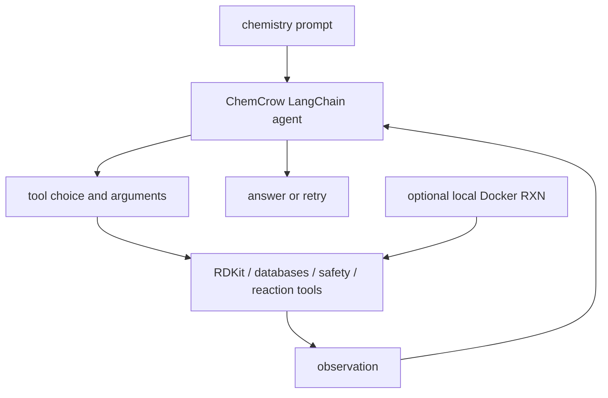

# ur-whitelab/chemcrow-public：ChemCrow——化学任务工具编排 Agent

| 字段 | 值 |
|---|---|
| GitHub | https://github.com/ur-whitelab/chemcrow-public |
| License | MIT |
| Stars | 957（2026-09-17 快照） |
| GitHub 仓库 pushed_at | 2024-12-19（仓库级动态元数据，不等于分析 commit 新增内容） |
| 分析 commit | `e7ebd5193334ac1d8dea137b635721c7cb470d33` |
| 产品类型 | **化学任务工具编排 Agent** |
| 分析证据 | README.md, chemcrow/agents/chemcrow.py, chemcrow/agents/tools.py, chemcrow/tools/search.py, chemcrow/tools/safety.py, chemcrow/tools/rdkit.py, chemcrow/agents/prompts.py |

本文用 📘 标注文档或源码中可直接定位的事实，🔶 标注由控制流推导的边界，💬 标注评价与借鉴建议。仓库动态元数据沿用候选清单，源码判断只绑定页面中的固定提交。

## 1. 它到底是什么

ChemCrow 是把化学计算、检索、反应预测和安全检查接到 LangChain Agent 的公开包。它可以回答分子量问题、查询分子信息、做相似性/官能团分析，并按配置使用 RXN4Chem 远端服务或本地 Docker 工具。README 明确说明公开包不含论文中的全部工具且不会给出相同结果，因此应把它视为可扩展化学工具原型。

## 2. 运行时堆叠

`ChemCrow` 先用主 LLM，再用 tools_model 构建 `make_tools` 工具集合，最后通过 ChatZeroShotAgent/RetryAgentExecutor 调度。make_tools 加载 python_repl、wikipedia、Query2SMILES、CAS、Patent、MolSimilarity、SMILES2Weight、官能团、爆炸性/控制化学品、安全摘要和文献工具；Serp、ChemSpace、RXN4Chem 根据 API key 或 local_rxn 开关追加。

## 3. 阶段机或 DAG

工具选择是模型决定的；RetryAgentExecutor 处理解析/执行错误的重试，不能把 retry 当作化学验证。

## 4. Tool / Skill / Agent 怎么切

Agent 是 ChemCrow 与 LangChain executor；Tool 是 BaseTool 子类或 LangChain loaded tool；安全、反应、检索、RDKit 等为领域工具。`Scholar2ResultLLM` 是一个 LiteratureSearch tool，将论文抓取、paper-qa Docs 和回答封在一次调用里。没有独立 skill contract；环境变量控制可用工具，缺 key 时工具集合减少或返回提示。`QUESTION_PROMPT` 要求涉及特定分子设计/合成请求时先查控制化学品、爆炸性并在需要时征求许可；这是模型指令，不是所读 executor 中不可绕过的程序授权闸。

## 5. 文献怎么来、是否入库、引用约束

`paper_search` 先让小模型把问题压成不超过十词的检索式，再用 paperscraper/可选 Semantic Scholar 下载论文，Scholar2ResultLLM 将 PDF 加入 paperqa.Docs 并用 top-k/max_sources 回答。它保存到 `query/` 路径，但不是持久化 RH paper pool；答案有 paperqa 引用能力，仍需检查 PDF 读取成功和原文是否支持答案。WebSearch 另需 SerpAPI。

## 6. 实验 / 代码执行

部分工具执行真实 RDKit 计算、PubChem/ChemSpace/专利查询、RXN4Chem 反应预测或本地 Docker 服务；SafetySummary/ExplosiveCheck 从 PubChem GHS 页面取安全数据，异常时返回错误文本。README 的“accurate solution”是项目定位，且主动声明工具不全；本次没有执行化学预测、合成或安全判断，不能把模型答案当实验/安全许可。

## 7. 写稿怎么做

输出主要是 LangChain agent answer 和可选 paper-qa formatted answer；没有论文章节、实验记录、化学操作 SOP 或引用闭集写稿。自然语言建议尤其不能替代实验室风险评估、专利法律意见或化合物身份确认。

## 8. 图怎么做

所读主工具有 RDKit/反应结果，README 有 HuggingFace demo 图；没有独立学术图谱/反应路线图的生成和证据审计。生成的分子式、结构或预测图需要从具体工具结果复核，不能由 agent 文本自动升级。

## 9. 和 RH 的相似点

与 RH 相似的是将专业能力拆成可调用工具，并为文献工具保留下载/解析/回答边界；安全工具和异常返回体现了领域风险提示。工具 API key 由环境读取，便于服务端集中管理的设计参照。

## 10. 和 RH 的不同点

RH 的证据边界会把论文原文、化合物数据库、计算预测和实际实验区分；ChemCrow 的 final answer 可混合多工具文本。公开工具缺失、远端 API、模型解析和化学结构歧义使其不适合作为自动实验授权系统；Retry 不是独立验证。

## 11. 优点 / 缺点

**优点**：工具集合覆盖分子信息、结构计算、文献、反应和安全；local_rxn 给出减少远端依赖的路径；README 主动披露与论文版本差异。

**局限**：LangChain/旧模型接口和 API key 依赖重；异常处理多返回宽泛文本；论文包与代码包能力不一致；没有运行测试能证明某一具体分子答案的正确性或安全性。

## 12. RH 可学的 1–3 条

1. 为每个化学答案记录 canonical SMILES/CAS、数据库 URL、检索时间和工具版本。
2. 将安全、专利、预测和实验结论分为不同证据类型，禁止合并成无条件建议。
3. 对远端反应工具和本地容器保存请求/响应和结构校验，失败则阻止写入实验结论。

## 13. 名字速查表

| 名字 | 先决概念 | 含义 |
|---|---|---|
| `ChemCrow` | executor | 化学 Agent 外壳 |
| `make_tools` | tool factory | 按 key 和开关组装工具 |
| `Scholar2ResultLLM` | paper evidence | 搜索 PDF 并用 paper-qa 回答 |
| `SafetySummary` | GHS | PubChem 安全数据摘要 |
| `RXNPredict` | reaction API | 远端反应产物预测 |
| `local_rxn` | self-hosting | 使用本地 Docker 反应服务 |

---

> 📌事实边界
> 本页只使用冻结 commit 的公开 GitHub 文档和源码；未运行模型、训练、工具、远程 API 或领域实验。README 数字和论文结果仅作为作者声明，未升级为独立复现。性能、临床/化学/物理有效性、商业许可、数据新鲜度和完整部署状态均需额外核验。
