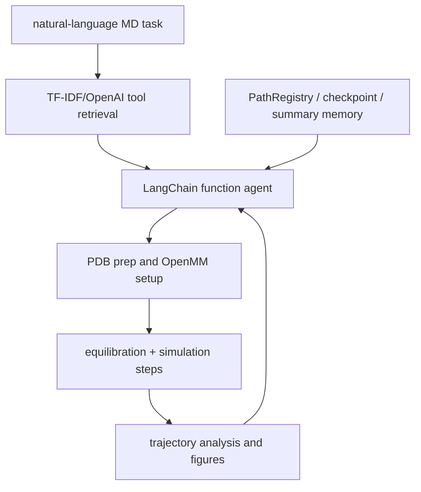

# ur-whitelab/MDCrow：MDCrow——分子动力学模拟与分析 Agent

| 字段 | 值 |
|---|---|
| GitHub | https://github.com/ur-whitelab/MDCrow |
| License | MIT |
| Stars | 247（2026-09-17 快照） |
| GitHub 仓库 pushed_at | 2026-01-09（仓库级动态元数据，不等于分析 commit 新增内容） |
| 分析 commit | `b3b0b57a804d97c0d01c810a381313a2bc2114d6` |
| 产品类型 | **分子动力学模拟与分析 Agent** |
| 分析证据 | README.md, mdcrow/agent/agent.py, mdcrow/agent/memory.py, mdcrow/tools/maketools.py, mdcrow/tools/base_tools/simulation_tools/setup_and_run.py, mdcrow/tools/base_tools/analysis_tools/plot_tools.py, environment.yaml |

本文用 📘 标注文档或源码中可直接定位的事实，🔶 标注由控制流推导的边界，💬 标注评价与借鉴建议。仓库动态元数据沿用候选清单，源码判断只绑定页面中的固定提交。

## 1. 它到底是什么

MDCrow 是把自然语言分子动力学任务交给 LangChain agent 的工具集。它覆盖 PDB/UniProt 获取与清理、OpenMM 系统设置/运行、RMSD/RMSF/半径/氢键等轨迹分析、结构可视化和结果绘图。它可以自动生成并执行 simulation script，但示例用法和脚本能力不能当成某蛋白模拟已完成或物理结论已验证。

## 2. 运行时堆叠

`MDCrow` 创建主 LLM、tools LLM、PathRegistry、MemoryManager，并按用户输入用 TF-IDF 或 OpenAI embedding 选择 top-k 工具，或加载全部工具。`make_all_tools` 将预处理、模拟、分析、PDB/UniProt、论文和图工具组装为 LangChain tools。PathRegistry 映射上传文件、checkpoint、图和描述；memory 可把一次完整 agent trace 摘要成 JSON。

## 3. 阶段机或 DAG

OpenMM 源码明确写入 checkpoint reporter、equilibration steps、number of steps、temperature、timestep 和 ensemble；这些是模拟参数，不是运行结果。

## 4. Tool / Skill / Agent 怎么切

Agent/工具选择在 mdcrow.agent，具体模拟由 SetUpandRunFunction/OpenMMSimulation，分析由多个 BaseTool，文件追踪由 PathRegistry，记忆由 MemoryManager。`top_k_tools` 默认 20，设为 all 才全量；`use_human_tool` 和 `modifysim_no_run` 改变可用行为。skill 不是独立目录，领域流程由工具 description 和 prompt 组织。

## 5. 文献怎么来、是否入库、引用约束

文献能力是可选 Scholar2ResultLLM，前提是 PathRegistry 有论文目录；主要输入仍为用户 PDB、上传文件、PDB/UniProt 查询和数据库响应。没有发现默认的 paper ingest/claim-evidence 链或引用检查。MDCrow 的 MD 输出是计算轨迹，不能仅以论文检索结果支持其物理解释。

## 6. 实验 / 代码执行

`OpenMMSimulation.run` 设置系统/积分器、执行平衡和生产步，并写 checkpoint；`SetUpandRunFunction` 对温度、压力、friction、timestep、ensemble 等参数解析和校验。工具可生成独立 reproduce_simulation.py。分析工具读取轨迹/CSV；`SimulationOutputFigures` 按 step/time 列逐列绘图并通过 PathRegistry 写入 Figure 文件。实际 GPU/CPU 运行、力场、结构质量、收敛和物理合理性均未在本任务验证。

## 7. 写稿怎么做

写作不是主要目标。memory 的 summary prompt 会把输入、每步和最终解概括到 agent_run_summaries.json；Scholar2ResultLLM 可提供文献回答。没有主论文章节、方法/结果事实核对、引用闭集或编译流程。

## 8. 图怎么做

源码可生成 trajectory analysis plots：plot_tools 找 step/time 列，将数值列逐列画线，写文件名和 figure ID。它没有多面板出版布局、统计不确定性、颜色/可访问性或 source-to-caption gate；图形表示计算 CSV 是否存在，不证明数据合理。

## 9. 和 RH 的相似点

与 RH 相似的是 PathRegistry、checkpoint、memory、工具日志和可重现脚本都提供中间状态；参数解析会拒绝部分缺失/非法 MD 参数。simulation output 和 figure ID 也为把结果绑定 artifact 提供了局部模式。

## 10. 和 RH 的不同点

RH 的证据边界需要冻结输入结构、力场、软件/硬件、参数、轨迹、分析脚本和图；MDCrow 的 agent 可能按模型选工具并修改脚本，且 memory 只是 LLM 摘要。完成 OpenMM step 不等同于实验/临床事实，RMSD 图也不自动证明稳定性或机制。

## 11. 优点 / 缺点

**优点**：工具覆盖从 PDB 获取到模拟、分析和图；参数有单位解析与 ensemble 分支；checkpoint/reproduce script/PathRegistry 便于复查；可选工具检索降低上下文。

**局限**：环境复杂且依赖 conda/OpenMM；自然语言到参数的转换有模型风险；默认示例很短，不能外推长时间尺度；模拟物理有效性、力场选择和结果统计没有由 Agent 自动保证。

## 12. RH 可学的 1–3 条

1. 把 PDB/配体、力场、软件版本、平台、随机种子和 MD 参数冻结到 execution artifact。
2. 将轨迹、分析 CSV、图和解释按同一 run ID 关联，区分模型摘要和实际数值。
3. 对长模拟、重启 checkpoint 和异常终止采用 fail-closed 状态，未完成不得进入论文结果。

## 13. 名字速查表

| 名字 | 先决概念 | 含义 |
|---|---|---|
| `MDCrow` | agent facade | 分子动力学 Agent 外壳 |
| `PathRegistry` | file lineage | 映射输入、checkpoint、图和描述 |
| `OpenMMSimulation` | MD runtime | OpenMM 系统、积分器和步进 |
| `SetUpandRunFunction` | parameter contract | 解析和校验模拟参数 |
| `MemoryManager` | run summary | 将轨迹和答案摘要持久化 |
| `PostSimulationFigures` | analysis plot | 从 CSV 生成参数-时间图 |

---

> 📌事实边界
> 本页只使用冻结 commit 的公开 GitHub 文档和源码；未运行模型、训练、工具、远程 API 或领域实验。README 数字和论文结果仅作为作者声明，未升级为独立复现。性能、临床/化学/物理有效性、商业许可、数据新鲜度和完整部署状态均需额外核验。
