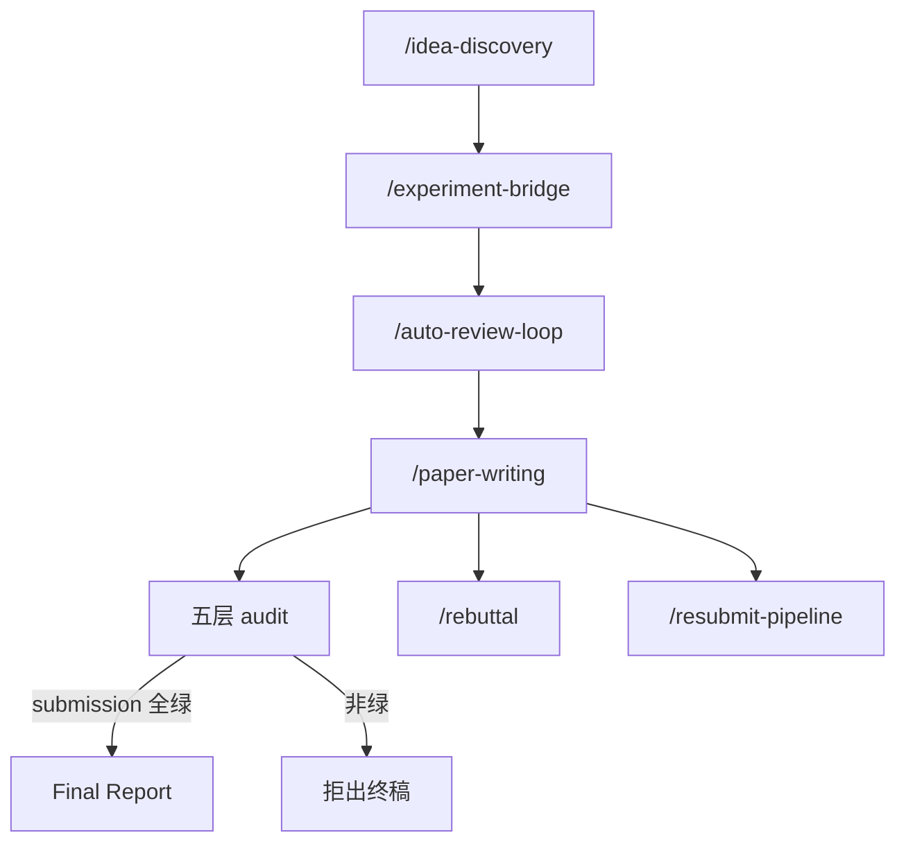

# ARIS：跨模型对抗协作的 Markdown 科研技能束

| 项目 | 固定快照 |
|---|---|
| 候选编号 | 98 |
| 仓库 | [wanshuiyin/Auto-claude-code-research-in-sleep](https://github.com/wanshuiyin/Auto-claude-code-research-in-sleep) |
| 分类 / 层次 | 自主科研技能；技能、方法、实验、写作 |
| 分析提交 | `b98fc5d6c76e0cf42a6a867f66252e8d7347f4f7` |
| 元数据快照 | 2026-09-17；Stars 16212，非近似值；最近推送 2026-09-16 |
| 默认分支 / 状态 | main；非 fork、未归档；候选 pending，分析 draft |
| 许可 | MIT；固定提交根目录 `LICENSE` 已查阅 |
| 阅读方式 | 公开 AGENT_GUIDE、SETUP_GUIDE、技能目录与若干 SKILL.md；静态分析 |

本文用 📘 标注文档或源码中可直接定位的事实，🔶 标注由控制流推导的边界，💬 标注评价与借鉴建议。仓库动态元数据沿用候选清单，源码判断只绑定上面的固定提交。

## 1. 它到底是什么

📘 [`AGENT_GUIDE.md`](https://github.com/wanshuiyin/Auto-claude-code-research-in-sleep/blob/b98fc5d6c76e0cf42a6a867f66252e8d7347f4f7/AGENT_GUIDE.md) 把 ARIS 定义为研究 harness：用可组合 Markdown skills 编排机器学习研究生命周期，执行者写代码与论文，审查者独立批评。执行者可以是 Claude / Codex / Cursor / Antigravity / Copilot CLI；审查者走 Codex MCP、claude-review、gemini-review 或 Copilot 的 evidence-gated 审查。目录宣称 **83** 个技能。冲突时 **SKILL.md 优先于本指南**。

🔶 这是宿主上的技能与合同，不是带自己训练循环的科研运行时。Stars 高反映传播，不证明某条流水线已在本快照跑通。

## 2. 运行时堆叠

📘 技能根按平台分：主树 `skills/<name>/SKILL.md`，Codex 镜像 `skills/skills-codex/`，以及 Claude/Gemini overlay。`codex` MCP 由仓库自己的 `mcp-servers/codex-exec/server.py` 桥接 `codex exec`，因为上游 CLI 去掉了 `codex mcp-server`。SETUP_GUIDE 以 macOS 本地 + 远程 Linux GPU、Claude Code 执行 / Codex 审查为推荐组合，LaTeX 只在写稿工作流需要。

| 层 | 固定快照中的承载方式 | 边界 |
|---|---|---|
| 执行者 | 各 IDE/CLI 读 SKILL.md | 行为在技能文件，不在 Python 编排器 |
| 审查者 | 独立 MCP / spawn_agent | 同族自审记 provisional |
| 参数轴 | `effort` 与 `assurance` 正交 | lite 也可开 conference-ready |
| 审计 | 五层技能 + 6 态 verdict | submission 时脚本拒出 Final Report |

## 3. 阶段机或 DAG

📘 主链 `/research-pipeline` = W1 idea-discovery → W1.5 experiment-bridge → W2 auto-review-loop → W3 paper-writing。其后 W4 回复审稿、W5 改投（禁新实验与改 bib）、W6 报告。提交级 assurance 要求五层审计：experiment-audit、result-to-claim、paper-claim-audit、citation-audit、kill-argument，verdict 为 `PASS|WARN|FAIL|BLOCKED|ERROR|NOT_APPLICABLE`。

🔶 这是技能调用约定，不是编译出来的状态机。执行质量取决于宿主是否遵守 SKILL.md 与 `verify_paper_audits.sh`。

## 4. Tool / Skill / Agent 怎么切

📘 Skill 是一等对象；Agent 是执行者/审查者角色。工具通过 MCP 与各技能 Requires 栏接入（Zotero、arXiv、GPU、LaTeX）。`/meta-optimize` 只提补丁，`/meta-apply` 才允许改技能语料，且要人类批准。🔶 没有单一 Python tool registry。同族 Codex 自审不得写成跨模型验收。

## 5. 文献怎么来、是否入库、引用约束

📘 `/research-lit` 多源检索（Zotero、本地 PDF、web、arXiv、S2、DeepXiv、Exa、OpenAlex 等）。`/citation-audit` 检查 `\cite{}` 存在性、元数据与语境；`--soft-only` 冻结 bib 只改正文。🔶 文献是否入库取决于用户配置的源，仓库本身不是 DOI 数据库。审计产物是 `CITATION_AUDIT.{md,json}`，不是 RH 的 evidence span。

## 6. 实验 / 代码执行

📘 `/experiment-bridge` 把计划变成代码与 `EXPERIMENT_LOG.md`；`/run-experiment` 可指向 local / remote / Vast / Modal。GPU 参数是技能标志，不是本仓库内置调度器。🔶 本次未注册 MCP、未跑 pipeline、未提交 GPU 作业，不能把目录里的技能合同当成一次实测。

## 7. 写稿怎么做

📘 W3 `/paper-writing`：plan → figure → illustration → write → compile → improvement-loop，目标 `paper/main.pdf`。assurance=submission 时 Phase 6 跑 `tools/verify_paper_audits.sh`。执行者被禁止评判自己的诚实性；审查者只拿文件路径冷读。🔶 写稿质量取决于宿主模型与审计是否真的执行。

## 8. 图怎么做

📘 目录把 `/paper-figure` 和 illustration 放进 W3。另有 `--review` 的 `/render-html`。🔶 固定快照未把出图实现读成独立 figure contract；图是写稿技能链上的一步。

## 9. 和 RH 的相似点

1. 都把研究拆成可单独调用、带产物文件的阶段。
2. 都把引用审计、主张与结果对齐写成闸门。
3. 都区分执行与审查，并拒绝执行者自评过关。

## 10. 和 RH 的不同点

RH 是带 topic/claim/artifact 的服务端工作流。ARIS 是给编码 Agent 用的技能包与 MCP 桥，权威对象是 SKILL.md 与各次 run 目录下的 Markdown/JSON 产物。它不托管文献库，也不在本仓库内实现编排内核。

## 11. 优点 / 缺点

**优点**

- effort 与 assurance 正交，避免“写得深”和“审得严”绑死。
- 五层审计与 6 态 verdict 把失败模式写进合同。
- 技能文件优先，指南只做路由，减少文档漂移。

**缺点**

- 正确性几乎完全依赖宿主遵守长 SKILL。
- 跨模型审查需要额外 MCP 与账号。
- 83 个技能的重叠与冲突要靠人工选用。

💬 对图谱读者，ARIS 是“技能合同怎么写闸门”的对照，不是又一个可复现的论文工厂分数。

## 12. RH 可学的 1–3 条

1. **把预算轴与审计轴拆开。** 短跑也可以要求 submission 级引用闸。
2. **审查必须冷读路径，不读执行者摘要。** 这是跨模型对抗能成立的前提。
3. **改技能语料要特权门。** 优化建议与落地补丁分开，避免自我改规则。

## 13. 名字速查表

| 名字 | 先决概念 | 含义 |
|---|---|---|
| ARIS | 本仓库产品名 | Auto Research In Sleep 技能束 |
| effort / assurance | 正交参数 | 深度预算 vs 审计严格度 |
| W1–W6 | 工作流编号 | 从 idea 到 talk/改投 |
| codex-exec | MCP 桥 | 用 `codex exec` 冒充旧 mcp-server |
| kill-argument | 第五层审计 | 最强拒稿备忘录 |

> 📌事实边界：本页依据 `b98fc5d6c76e0cf42a6a867f66252e8d7347f4f7` 固定公开源码快照、2026-09-17 `data/candidates-staging.jsonl` 元数据和下列实际查看文件静态撰写（`README.md`、`LICENSE`、`AGENT_GUIDE.md`、`SETUP_GUIDE.md`、`docs/SKILLS_CATALOG.md`、`skills/auto-review-loop/SKILL.md`、`skills/citation-audit/SKILL.md`、`skills/experiment-plan/SKILL.md`、`skills/idea-discovery/SKILL.md`）。没有把 83 个技能全部展开，也没有把 Stars 或文档中的工作流演示当作本次实测；未调用未配置的模型/API，未注册 MCP 或编译论文，未据此声称运行效果。
