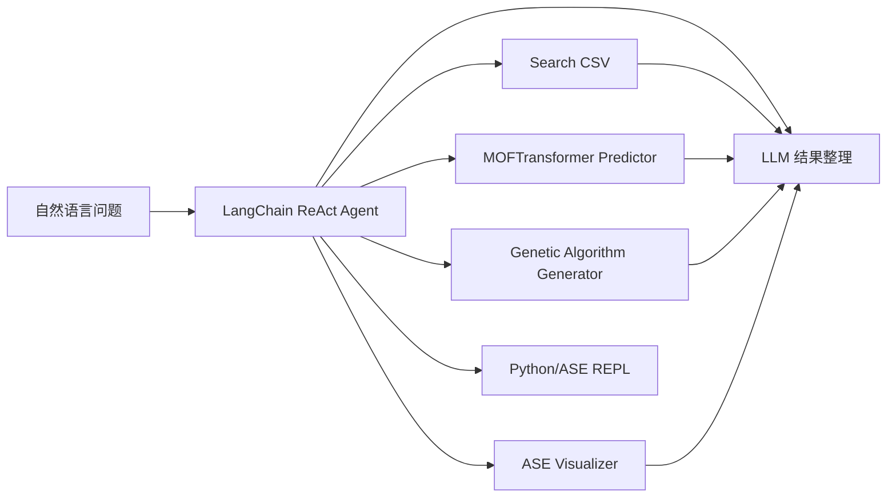

# Yeonghun1675/ChatMOF：用 ReAct 工具链查询、预测并生成 MOF

| 字段 | 值 |
|---|---|
| GitHub | https://github.com/Yeonghun1675/ChatMOF |
| License | MIT |
| Stars | 121（2026-09-17 冻结快照） |
| 最后 push | 2025-05-15 |
| 分析提交 | `886056fc0b96be6081ba1cd8e17166ced520ccd5` |
| 快照日期 | 2026-09-17 |
| 产品类型 | 材料与晶体设计 Agent |
| 分析证据 | `README.md`、`chatmof/agents/agent.py`、`chatmof/tools/tool_utils.py`、`chatmof/tools/predictor/base.py`、`chatmof/tools/search_csv/base.py`、`chatmof/tools/genetic_algorithm/genetic_algorithm.py`、`chatmof/tools/visualizer/base.py` |

本文用 📘 标注文档或源码中可直接定位的事实，🔶 标注由控制流推导的边界，💬 标注评价与借鉴建议。仓库动态元数据沿用候选清单，源码判断只绑定页面中的固定提交。

## 1. 它到底是什么

ChatMOF 是面向金属有机框架（MOF）的 LangChain 应用。README 将系统拆成 agent、toolkit 和 evaluator，任务覆盖数据检索、性质预测和结构生成。顶层 ChatMOF 类接收语言模型，调用 initialize_agent 创建 ZERO_SHOT_REACT_DESCRIPTION agent，再把查询交给 agent.run。它是材料信息学对话入口，不是实验室硬件控制平台。README 中的搜索、预测和生成准确率属于仓库/论文声明，未在本次检查中重新评测。

## 2. 运行时堆叠

基础包通过 pip 安装，prediction/generation 需要额外 setup，MOFTransformer、PyTorch Lightning、GRIDAY 和本地数据目录构成外部依赖。配置文件保存 lookup、structure、model 等路径，API key 走环境变量。运行状态主要存在 LangChain Chain、LLMChain 和本地文件中，没有看到数据库式 checkpoint、artifact lineage 或多租户执行记录。

## 3. 阶段机或 DAG

README 描述 human query→agent 制定计划→toolkit 产生输出→evaluator 整理回答。load_chatmof_tools 注册 search_csv、predictor、generator、visualizer、python_repl、ase_repl、unit_converter，并可选加入 Google search/Wikipedia。

图表示代码暴露的调用关系，不表示每个额外模块在此快照中已配置成功。

## 4. Tool / Skill / Agent 怎么切

Predictor 解析 Thought、Property、Material、Final Thought，再检查属性白名单并调用 MOFTransformerRunner；多属性结果合并为 DataFrame，过长时转交 TableSearcher。TableSearcher 让 LLM 生成 pandas 表达式，经 PythonAstREPLTool 执行。Generator 解析 LLM 输出的 N/E 数字编码；Visualizer 查找 CIF 并调用 ASE view。工具边界是可组合 Python/LLM chain，不是默认隔离沙箱。

## 5. 文献怎么来、是否入库、引用约束

search_internet=True 时尝试加载 Google search 和 Wikipedia，但失败只打印 warning。主要检索还依赖本地 CSV/DataFrame；README 明确线上 demo 主要开放 Search。公开代码没有 claim-level citation、来源快照、论文入库或 DOI 核验，因此“可搜索”不等于“有结构化文献证据”。

## 6. 实验 / 代码执行

预测调用 MOFTransformerRunner，生成依赖 GRIDAY，结构操作可走 ASE REPL。TableSearcher 在当前进程执行 PythonAstREPLTool，输入表达式来自 LLM；应放入受控环境。README 还提醒 torch 与 moftransformer 版本冲突。没有证据显示仓库在此提交完成通用硬件合成或闭环实验；论文数字不等于本次运行结果。

## 7. 写稿怎么做

最终回答由 LLM chain 根据表格、模型信息和问题整理成 markdown，返回 output 字段。没有专门论文写作、引用管理、review 或 revision workflow；HTML/PDF 投稿产物不是其公开目标。

## 8. 图怎么做

Visualizer 读取 CIF 并打开结构视图，README 还展示 demo 与架构图。没有独立 figure plan、定量绘图数据表或图表 fidelity 审计；发表级图形需要另行保存数据、模型版本、单位和原始结构。

## 9. 和 RH 的相似点

它和 RH 一样使用自然语言→工具选择→结果整理模式，也把领域工具拆为可组合组件。Predictor 对属性白名单、材料数量和结果格式的检查对科学工具层有直接借鉴价值。

## 10. 和 RH 的不同点

ChatMOF 的中心是一次 LangChain 调用与本地模型/表格路径；RH 更强调跨项目 evidence artifact、gate 和 provenance。它的 evaluator 更接近结果整理链，不是独立科学审计。Python REPL、外部模型和 GRIDAY 的权限与依赖需要部署者承担。

## 11. 优点 / 缺点

优点：领域聚焦；搜索/预测/生成/可视化入口直观；属性白名单与结果格式有基础校验；MIT 许可证和示例降低试用门槛。缺点：老式字符串正则对模型格式敏感；依赖链长；Python/ASE REPL 无默认隔离；线上 demo 功能受限；README 准确率不能作为本次复现结果。

## 12. RH 可学的 1–3 条

1. 保留工具名、输入、输出和失败格式的小合同。2. 借鉴 Predictor 的属性白名单与数量一致性检查。3. 将原始表、查询条件、模型版本和证据链接与摘要一并保存，避免只保留自然语言回答。

## 13. 名字速查表

| 名字 | 先决概念 | 含义 |
|---|---|---|
| `ChatMOF` | LangChain Chain | MOF 查询顶层链 |
| `Predictor` | MOFTransformer | 预测支持的性质 |
| `TableSearcher` | pandas REPL | 查询材料表格 |
| `GeneticAlgorithmChain` | generation | 生成候选 MOF 编码 |
| `Visualizer` | ASE/CIF | 查找并可视化结构 |

---

> 📌事实边界
> 本报告依据固定提交中的公开文档与实际查看的代码作静态分析。没有安装或执行被分析仓库，没有连接仪器、GPU 集群或收费模型 API。README/论文的能力和结果声明不等于本次复现；外部数据、模型权重、设备校准、部署稳定性以及科学结论的有效性均需另行验证。
