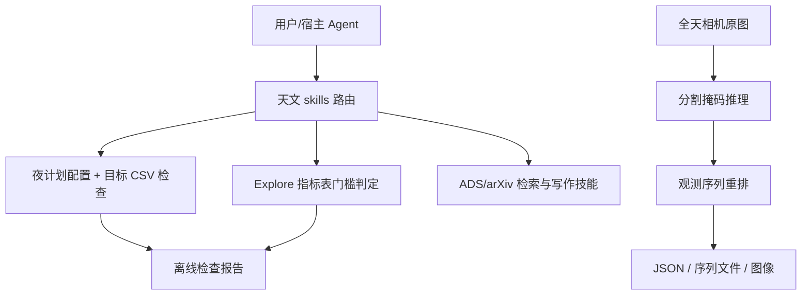

# StarWhisper：天文科研技能、观测前检查与领域模型的组合仓库

| 字段 | 值 |
|---|---|
| GitHub | https://github.com/Yu-Yang-Li/StarWhisper |
| License | Apache-2.0（部分 skills 按 MIT） |
| Stars | 327（2026-09-17 冻结快照） |
| 最后 push | 2026-08-19 |
| 分析提交 | `3466edf3a68a4362b03ebd007ba3e550ac9c9578` |
| 快照日期 | 2026-09-17 |
| 产品类型 | 天文观测与科研 skills |
| 分析证据 | `README.md`、`skills/README.md`、`skills/NOTICE.md`、`skills/starwhisper-night-plan/SKILL.md`、`skills/starwhisper-night-plan/scripts/plan_night.py`、`skills/starwhisper-explore/scripts/eval_gate.py`、`skills/giiisp-paper-search-apis/SKILL.md`、`skills/academic-writing/SKILL.md`、`AllSky-Camera-XL/run_pipeline.py` |

本文用 📘 标注文档或源码中可直接定位的事实，🔶 标注由控制流推导的边界，💬 标注评价与借鉴建议。仓库动态元数据沿用候选清单，源码判断只绑定页面中的固定提交。

## 1. 它到底是什么

冻结快照中的 StarWhisper 已不只是早期天文语言模型项目，而是由天文模型、光变分类、观测自动化、数据表和技能包构成的组合仓库。README 明确以 17 个可安装科研技能作为当前交付形式，其中四个本线技能处理 SN Clock 表、Explore 指标、夜计划配置和稀疏光变成绩单，另外十三个从他山科研技能改编为天文领域版本。理解它时应区分公开数据、离线校验脚本、依赖外部服务的 NGSS 观测栈和其他仓库中的系统；这些部分没有一个共同的全自动主循环。

## 2. 运行时堆叠

技能由 SKILL.md、astronomy.md、references、scripts 和部分 tests 构成，可安装到宿主技能目录；四个本线脚本使用 Python 标准库，按 STARWHISPER_ROOT、仓库相对目录或内置样例定位数据。夜计划脚本明确不打开 socket，只读配置和 CSV；Explore 脚本只读取指标表，不启动模拟器。另一条 AllSky-Camera-XL/run_pipeline.py 用 subprocess 调 conda 环境中的分割推理与重排脚本，生成输入副本、mask、replan 文件和 pipeline_report.json。两种运行形态的依赖与权限不能混为一谈。

## 3. 阶段机或 DAG

当前仓库应画成几条并行的能力线，而不是一个“问问题就观测”的总 DAG。夜计划按照 check-config、budget、lint-targets、endpoints 逐步检查；Explore 对照表走预注册门槛；全天相机的入口明确有两段命令链。

公开流程图中的“序列文件”不是已执行夜次；是否交给设备、怎样安全执行，需要独立的真实观测栈。

## 4. Tool / Skill / Agent 怎么切

本线 skills 采用小而明确的子命令。plan_night.py 校验 time_windows、月距、滤镜和曝光字段，计算含转向开销的时间容量，并检查目标 CSV 名称、重复和 RA/Dec 范围；endpoints 只打印路由合同。eval_gate.py 对安全尝试、无效动作率、巡天完整度下降和跟进/效用增益逐项判定，输出 positive/negative/inconclusive。改编技能负责文献、构思、设计、统计、写作和审稿，其约束多由宿主遵循；这不等于每个文字规则都有一个不可绕过的后台 gate。

## 5. 文献怎么来、是否入库、引用约束

giiisp-paper-search-apis 技能指定天文文献先走 NASA ADS，再走 arXiv astro-ph，Giiisp OA 作为补充；要求报告真实 query、来源、链接、状态并把未知字段保留为 null/待核验。技能还给出 claim—引用—候选论文—证据字段的审计表。可以确认它具有清晰的文献使用规范和脚本入口；本次没有调用 ADS、arXiv 或 Giiisp，也不能证明所有引用已被远端核验。公开材料更像文件化的检索工作台，而非统一持久化论文池。

## 6. 实验 / 代码执行

运行边界相当细。夜计划的 capacity 只考虑曝光、间隔、滤镜和转向开销，代码注明未建模 airmass、月亮、天气和路径；通过字段检查不能推断计划实际可观测。Explore 的评估只根据已有指标表判阈值，源码明确不复现夜次或哈希。全天相机入口真实调用分割和重排脚本，并写一组产物路径，但没有设备控制调用。README 的 NGSS 依赖 NINA 等外部服务；论文中观测能力、公开 Explore 合成结果与本次静态读代码应分开。

## 7. 写稿怎么做

academic-writing SKILL.md 提供写作、同行评审、回复、基金和投稿五类工作流，并要求 Claim/Evidence/Status 映射；天文 overlay 优先 AAS/MNRAS/A&A/PASP 等语境。它把发现和引用真实性委托给其他技能，保持表达与证据职责分开。该目录是宿主可读的技能合同，不是独立论文编译服务；本次未生成稿件，也未检验多角色审稿对论文错误的实际检出率。

## 8. 图怎么做

技能清单中科研图像工具面向流程/系统示意图，明确真实光变/光谱坐标应回到数据重绘。全天相机流水线还记录 mask、overlay 和 sky_replan_plot 路径，属于算法产物与计划展示。图片是否忠实、坐标是否正确、观测是否发生，都需要按所属数据线核验，不能从图像存在倒推出发现成立。

## 9. 和 RH 的相似点

它与科研技能型系统的相似点是把领域方法写成可安装、可组合的 skill，给每个脚本设置明确输入、输出和失败语义。尤其是离线检查与硬件执行分离、负结果照报、未知来源不补写，使科学事实与工具能力之间的边界易于理解。

## 10. 和 RH 的不同点

StarWhisper 的组织中心是具体天文研究线与 skills，不是统一 topic/run/artifact 状态机。多个数据线的完整程度不同：README 明说 Explore 环境代码未入库、SN Clock 输入快照不齐、完整虚拟司天系统在另一仓库。调用者必须知道当前技能是在检查已有表、运行模型、生成建议还是操作真实观测系统。混合许可证也需逐目录处理：本线 Apache-2.0，改编技能 MIT。

## 11. 优点 / 缺点

优点：领域适配具体，涉及时间/坐标/巡天约束而非泛化提示词；小脚本用退出码表示失败，便于 CI；表、样例、真实系统之间有明确说明；门槛先于结果，允许负结论。

不足：仓库形态分散，完整工作流跨多个项目；指标复算不等于原实验复现；夜计划容量模型较简化；写作/审稿技能的约束依赖宿主执行；外部服务、模型权重和设备环境无法从公开入口保证就绪。

## 12. RH 可学的 1–3 条

1. 将领域规则做成可执行的小检查，而不是只留在提示词里。2. 为每条科学数据线单独说明覆盖范围、输入留存和执行模式，特别是观测、模拟、已发布成绩与候选预测的区别。3. 对硬件接口先提供只读合同和计划审查，再由独立授权层执行，避免把技能安装等同于设备控制授权。

## 13. 名字速查表

| 名字 | 先决概念 | 含义 |
|---|---|---|
| `NGSS` | observing system | 依赖外部观测服务的近邻星系巡天栈 |
| `starwhisper-night-plan` | offline checks | 夜计划配置、容量和目标表检查技能 |
| `eval_gate.py` | predefined bar | 根据指标表判定策略是否过线 |
| `SN Clock` | candidate estimation | 已公开超新星爆发年龄预测数据线 |
| `astronomy.md` | domain overlay | 给改编科研技能补充天文约束 |
| `pipeline_report.json` | output inventory | 全天相机流水线产物路径清单 |

---

> 📌事实边界
> 本报告依据固定提交中的公开文档与实际查看的代码作静态分析。没有安装或执行被分析仓库，没有连接仪器、GPU 集群或收费模型 API。README/论文的能力和结果声明不等于本次复现；外部数据、模型权重、设备校准、部署稳定性以及科学结论的有效性均需另行验证。
