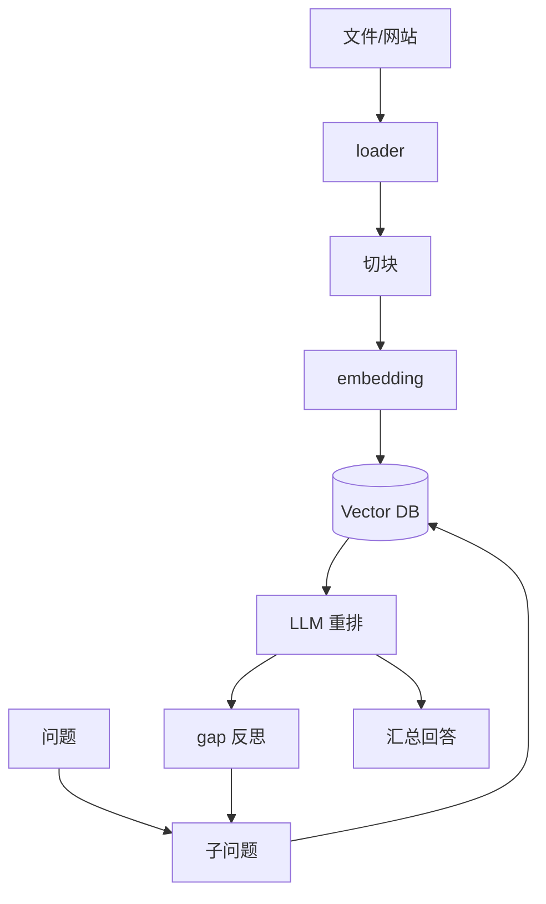

# zilliztech/deep-searcher：私有语料库上的迭代式 Deep RAG

| 字段 | 值 |
|---|---|
| GitHub | https://github.com/zilliztech/deep-searcher |
| License | Apache-2.0 |
| Stars | 8269（2026-09-17 快照） |
| GitHub 最后 push | 2025-11-19 |
| 分析 commit | `d89e37cdfbbef5e44ae6162ce9cc2c627a69b7e1` |
| 生命周期 | GitHub 候选冻结记录为未归档；固定提交用于本页源码分析 |
| 产品类型 | 私有语料深度检索与问答 |
| 分析证据 | 固定提交中的 README、许可证、配置与核心实现 |

本文用 📘 标注文档或源码中可直接定位的事实，🔶 标注由控制流推导的边界，💬 标注评价与借鉴建议。仓库动态元数据沿用候选清单，源码判断只绑定页面中的固定提交。

## 1. 它到底是什么

DeepSearcher把文件/网站加载、切块、embedding、向量数据库、集合路由、子问题生成、相关性重排、缺口反思和回答汇总串起来。它更适合私有知识库问答与报告，不是自动论文实验系统。 本文把仓库作为一个公开源码快照来分析：README 的产品定位、命令和 benchmark 数字属于项目文档；代码路径用于确认控制流、数据结构和边界。没有把 stars、README 宣称的准确率、SOTA 或部署体验转换成独立结论。

源码中最值得关注的是：offline_loading 将文件或网站加载为 docs，按 chunk_size/overlap 切分，批量 embedding 后写 collection。DeepSearch 先将问题拆成最多四个 sub-queries，向量检索后让 LLM 对每块 YES/NO 重排，去重；每轮反思生成 gap queries，最多 max_iter，最后把 chunk 或 wider_text 汇总成回答。 这决定了它应在 RH 产品地图中被看作“私有语料深度检索与问答”，而不是泛化地称为自动科研系统。

## 2. 运行时堆叠

运行时可拆成以下层：

- **入口与配置**：由仓库提供的 CLI、脚本、Next.js/API 或配置文件接收任务和参数。
- **Agent/编排**：loader 支持文本/PDF/JSON/Docling/Unstructured 和多种 web crawler；splitter 产生 Chunk；embedding 与 LLM 都有 provider 抽象；vector_db 支持 Milvus、Qdrant、Azure Search、Oracle 等；DeepSearch 使用 CollectionRouter、BaseVectorDB、RAGAgent 和 RetrievalResult；configuration 暴露默认 searcher/naive_rag。
- **工具与环境**：工具调用连接搜索、文件、浏览器、向量库、解释器或沙箱；工具是否真的隔离取决于配置和外部服务。
- **状态与产物**：本项目保存的状态形式包括缓存、队列、日志、数据库、PaperNode、retrieval result、文件或 grade；它们不自动等同于 RH artifact。

这种分层让替换模型和工具变得容易，但也将“接口存在”和“证据可信”分开。源码可以证明一个函数会生成/保存某种对象，不能单凭存在证明对象内容正确。

## 3. 阶段机或 DAG

核心控制流如下。

offline_loading 将文件或网站加载为 docs，按 chunk_size/overlap 切分，批量 embedding 后写 collection。DeepSearch 先将问题拆成最多四个 sub-queries，向量检索后让 LLM 对每块 YES/NO 重排，去重；每轮反思生成 gap queries，最多 max_iter，最后把 chunk 或 wider_text 汇总成回答。 阶段之间通常由消息、列表、队列、结构化对象或日志连接；是否能跨进程恢复，取决于具体实现，而不是 Mermaid 图本身。需要特别区分循环的两种含义：一种是有限的 max_depth/max_rounds/max_iter/max_steps 或 expand_layers；另一种是模型自主决定继续。源码中的上限能限制预算，但不能保证每次运行都走完所有阶段，也不能保证模型输出符合提示。

## 4. Tool / Skill / Agent 怎么切

该仓库的 Agent 边界是：主 Agent 接收任务并决定下一步；子 Agent/worker（若有）承担局部任务；tool 是可调用的搜索、抓取、文件、浏览器、代码或数据接口；skill（若有）主要是提示/能力包，不等于可审计的执行 artifact。具体来说，loader 支持文本/PDF/JSON/Docling/Unstructured 和多种 web crawler；splitter 产生 Chunk；embedding 与 LLM 都有 provider 抽象；vector_db 支持 Milvus、Qdrant、Azure Search、Oracle 等；DeepSearch 使用 CollectionRouter、BaseVectorDB、RAGAgent 和 RetrievalResult；configuration 暴露默认 searcher/naive_rag。

工具调用的返回通常被转成文本、结构化响应或日志，再回到模型上下文。优点是扩展快，缺点是不同工具的来源、版本、错误和副作用可能没有统一合同。对于 RH，接入时不应只映射函数名，还要记录输入、输出、外部资源、权限、失败原因和可复核句柄。

## 5. 文献怎么来、是否入库、引用约束

文献/来源链是：私有文件、网站抓取和向量库中的 reference/metadata。RetrievalResult 保留 text、reference、metadata、score，但默认 deduplicate 以 text 去重，未定义论文 DOI、页码、claim 或 support status 的长期证据对象。

这条链路能支持“找到或读取来源”，但通常不能直接支持 claim-level evidence。源码未显示统一的 DOI/版本/页码/span/主张/支持强度对象，也没有在最终文字生成前做逐句 entailment gate。若项目有 URL、reference、arxiv_id、PaperNode 或 RetrievalResult，它们仍主要是检索和展示元数据。

因此，报告中的来源约束应写成：系统会按提示或数据结构保留来源；不能写成“每条结论都已验证”。在 RH 中，建议将这些中间来源摄取为 paper/source，再显式链接 claim 和 evidence span。

## 6. 实验 / 代码执行

工程上，evaluation README 使用 2WikiMultiHopQA 的 Recall，对比 naive RAG 并观察迭代/ token 使用；文档说明只测前 50 个样本可能波动。源码和 README 是项目报告，不是本次独立复现；本次未装向量库、embedding 或 LLM。

**事实边界**：本次只读了公开仓库固定提交，没有安装依赖、配置 API key、下载模型/数据、启动外部服务或运行 benchmark。因而不能确认运行时性能、成本、并发稳定性、沙箱隔离、模型质量、检索召回或 README 中的结果。源码里的测试/评估函数可以说明“如何评”，不能说明“本次已评”。

若将它用于科研执行，还需要补齐数据版本、代码提交、环境镜像、资源上限、随机种子、指标定义、原始输出和失败记录，并把每次执行绑定到不可变 artifact。

## 7. 写稿怎么做

写作输出取决于项目类型：私有语料深度检索与问答 的最终产物通常是 Markdown、报告字符串、聊天消息、结构化 Report、检索回答或 grade JSON。offline_loading 将文件或网站加载为 docs，按 chunk_size/overlap 切分，批量 embedding 后写 collection。DeepSearch 先将问题拆成最多四个 sub-queries，向量检索后让 LLM 对每块 YES/NO 重排，去重；每轮反思生成 gap queries，最多 max_iter，最后把 chunk 或 wider_text 汇总成回答。

若有报告器，它往往把多个阶段的摘要合并为可读文本；引用可能是 URL、reference id、source 字段或 rubric 记录。这里没有看到 RH 意义上的章节草稿、参考文献数据库、claim/evidence 互证、LaTeX/PDF 编译和提交版本闸门。因此“能生成报告”不应被扩写成“能生成可投稿论文”。

## 8. 图怎么做

固定提交中的图能力应按数据来源区分。项目可能包含 README 架构图、UI 进度事件、流程 Mermaid、benchmark 绘图脚本或报告 Markdown，但这与从实验记录生成可发表定量图不同。DeepSearcher把文件/网站加载、切块、embedding、向量数据库、集合路由、子问题生成、相关性重排、缺口反思和回答汇总串起来。它更适合私有知识库问答与报告，不是自动论文实验系统。

本报告不把仓库 README 的截图、曲线或分数表重绘成独立实验结果。若下游要出图，必须先声明数据源、统计单位、误差定义、样本量、面板与图注主张；对于架构图，则需把实际节点、权限边界和失败路径与源码对齐。

## 9. 和 RH 的相似点

1. 都把“先入库、再查询”分成 offline_loading 与在线 DeepSearch。
2. 都用迭代补缺口：最多 4 个子查询 + max_iter 反思，而不是单次向量检索。
3. 都把检索命中做成带 metadata 的对象（RetrievalResult），而不是只回一段字符串。

## 10. 和 RH 的不同点

RH 的对象是 paper/claim。DeepSearcher 的对象是 Chunk 与 RetrievalResult（text、reference、metadata、score）。默认按 text 去重，没有 DOI/页码/support status。评价脚本用 2WikiMultiHopQA Recall，对比 naive RAG；文档写明只测前 50 样本可能波动。这是 RAG 评测，不是科研实验 registry。

## 11. 优点 / 缺点

**优点**

- loader / splitter / embedding / vector_db 都有 provider 抽象。
- CollectionRouter + YES/NO 重排让集合选择可检查。
- gap 反思有 max_iter，避免无限追问。

**缺点**

- 私有语料问答不是论文生产。
- text 去重可能丢掉同文不同 span。
- 向量库与 embedding 未在本次安装。

💬 可学的是 RetrievalResult 字段，不是 2Wiki 分数。

## 12. RH 可学的 1–3 条

1. **检索命中至少保留 text / reference / metadata / score 四件套。**
2. **子查询数量和反思轮次分开设上限。** 4 个子问题 ≠ 无限 gap query。
3. **offline_loading 与在线搜索分入口。** 避免查询路径偷偷改写索引。

## 13. 名字速查表

| 名字 | 先决概念 | 含义 |
|---|---|---|
| offline_loading | 入库 | 切块、embedding、写 collection |
| DeepSearch | 在线查询 | 子问题 + 重排 + 反思 |
| RetrievalResult | 命中对象 | text/reference/metadata/score |
| CollectionRouter | 路由 | 选择向量集合 |
| max_iter | 预算 | gap 反思上限 |

> 📌事实边界：本页绑定固定提交 `d89e37cdfbbef5e44ae6162ce9cc2c627a69b7e1`，快照日期 2026-09-17。未装向量库或 embedding，未跑 2WikiMultiHopQA，未调用 LLM。
