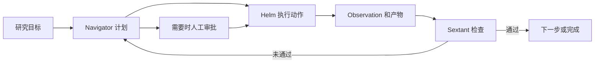

# Polaris：带持久状态与人类闸门的科研工作台

> 固定快照：[ZJU-REAL/Polaris](https://github.com/ZJU-REAL/Polaris/tree/6db273982ab75c9455799e3686579fdcce18f2fd)；commit `6db273982ab75c9455799e3686579fdcce18f2fd`；snapshot `2026-09-17`；许可证 `Apache-2.0`；审阅状态 `draft`。

## 1. 它到底是什么

📘 `ZJU-REAL/Polaris` 把文献、构思、想法评审、实验、写作和论文评审组织为一个科研工作台。它不仅提供长回答，而是有论文池、实验运行、稿件、审批和长任务对象。README 的中心概念是 Voyage，即能够保存计划、执行观察和验收结果的长程任务。本文据固定提交的 README、架构文档及关键后端源码分析，不把在线演示、截图或项目自述当作实测结果。

它面向实验室协作，也发展桌面形态。固定提交内部有值得记录的文档差异：根 README 仍把桌面说成远程服务器外壳，`docs/architecture.md` 和 `docs/desktop.md` 已描述带本地 Python 后端的桌面模式。这不是本次运行发现，而是同一快照的资料不一致，选部署方案时必须核对具体发行包。

## 2. 运行时堆叠

服务器路径是 React、TypeScript、Vite 前端，加 FastAPI、SQLAlchemy、Alembic 后端；PostgreSQL/pgvector 存业务对象，Redis 和 ARQ 承接长任务，SSE 与 WebSocket 承接进度和协作。远程实验由 asyncssh 连接执行机器，LaTeX 使用 tectonic；模型调用通过统一适配层和数据库路由表。

桌面文档描述 Electron 主进程中的 cordis 插件内核，由 legacy-engine 启动本地 FastAPI，使用 SQLite、进程内队列与本地会话，必要时回退远端。首次启动仍需下载 Python 与依赖，“本地桌面”并不等于所有模型与文献操作离线。本次只读取这两份文档，未对桌面启动代码或打包产物做完整交叉验收，因此以“文档描述”而非“安装验证通过”表述。

## 3. 阶段机或 DAG

科研阶段是 Literature→Idea→Idea Review→Experiment→Paper Writing→Paper Review；Voyage 则是跨这些业务使用的运行时。Navigator 产出计划或增量修改，Helm 执行单步并返回 observation，Sextant 检查验收条件。固定模板适合可预见任务，开放实验使用更完整的计划—执行—检查回路。

`helm.py` 将未知动作与执行异常转成错误 observation，方便验收器处理。`checks.py` 支持 exit_code、artifact_exists、schema_valid、metric、min_count 和 no_error，确定性失败先返回，之后才处理 llm_rubric。图是代码关系概括，持久化恢复是否覆盖每种崩溃场景尚未运行验证。

## 4. Tool / Skill / Agent 怎么切

Tool 是带明确输入输出的动作；Helm 使用动作注册表调度。Agent 是计划与判断角色；Navigator 的计划必须使用已知动作，结构错误会触发有限重试。Skill 在 README 中有两层：Voyage 的 guidance/rubric/persona/workflow 包，以及按需加载的 SKILL.md。它们主要注入知识与行为约定，而非取代状态机。

外部 MCP 按 README 暴露项目隔离、只读工具，与内部可执行实验动作要区分。只读文献工具不是远端 shell 权限，安装某个知识包也不应天然赋予执行权限。这样的分层有助于让科研知识复用和写入授权分别管理，但本次没有对所有路由实施安全审计。

## 5. 文献怎么来、是否入库、引用约束

README 描述 OpenAlex、Semantic Scholar 和 arXiv 获取论文，全文经 PyMuPDF 提取，编译成有交叉链接的 Research Wiki；同篇论文共享底层记录，不同方向库、个人库和课题书架只是成员关系。方向库拥有纳入规则，日更论文从公共入口同步，pgvector 提供语义检索。这个模式是预先沉淀知识页，而非每次问答临时检索后丢弃。

已读 `manuscripts.py` 的 `_citations_pack` 具体从课题关联库与书架汇合论文，并生成稳定 bibkey、标题、年份和 paper_id。它能说明稿件引用背景的来源，不足以单独证明每句主张获得正确支持。README 还描述引用存在性与支持度两条检查，但本次没有逐行审完相关 verifier，不能将其当成已经对本文运行过的鉴伪服务。

## 6. 实验 / 代码执行

实验路径按 README 包含 intake、规划、预算检查、写代码、smoke test、启动运行、解析指标和反思；远端连接由用户凭证控制，实验记录和图形可回到工作台。`manuscripts.py` 的 `_metrics_pack` 从 ExperimentRun 的指标序列取末值，按主指标最大化或最小化方向选 best，而不是让写作者自由填数字。

🔶 验收实现存在分层差别。`sextant.py` 首先拒绝 observation.error，再直接接受动作自带 self_check；只有后续路径才运行声明的 checks。旧路径没有验收标准但存在 content 时会默认通过。因此“所有步骤都被强验收”不是该文件无条件成立的不变量。并且 artifact_exists 检查的是 checkpoint 对应字段非空，并非直接验证文件哈希；schema_valid 主要检查字典和必要键，不是通用完整 schema 验证。

## 7. 写稿怎么做

写作输入由 `build_fact_pack` 汇集 idea、hypotheses、metrics、figures、citations 和生成时间。稿件结构与模板展开分离，支持多文件 LaTeX；README 描述 CodeMirror 与 Yjs 协同编辑、服务端编译和 PDF 预览。这里最具体的优点，是把实验事实与文献目录先组织成写作包，再交给生成步骤。

`manuscript_versions.py` 在 AI 写入前、编译时和恢复前建立文件快照，相邻内容相同不重复保存，每个文件最多保留 50 份。这是便于回退的产品功能，不是无限保留、不可更改的出版谱系。真正交付仍需核查引用支持、数值语义和期刊要求；生成 fact pack 不能自动补足错误实验设计。

## 8. 图怎么做

README 说明实验图可以自动生成并接受视觉模型检查；`_figures_pack` 将实验图的 index、caption 与 source 整理成稿件事实包。由此能确认图在实验与写稿之间有明确映射位置，而不是仅作为任意附件。已读源码没有覆盖完整绘图器和 VLM 判定流程，所以不声称每种图都有逐点日志绑定或自动碰撞检测。

工作台中的实时指标曲线、研究示意图和正式结果图应分别理解：实时曲线服务于监控，示意图服务于解释，论文结果图还需要冻结数据和统计口径。本文 Mermaid 只解释 Voyage 协作，不表示它生成的图已经通过出版验收。

## 9. 和 RH 的相似点

两者都把论文、实验、证据、稿件和人工决策视为持续存在的对象，并把长任务从一次聊天中拆开。Voyage 的计划—观察—验收过程，与 RH 的阶段门控、持久化产物和恢复接口在职责上接近；写作前构建 fact pack，也符合先有受约束资料再写正文的思路。

另一个相似点是确定性操作和模型判断分开：抓取、去重、取指标和编译不需要由模型自由发挥；评分、综合、写作和审阅需要模型，但不应接管已知事实的权威来源。这个比较不代表两套实现的可靠性已经相同。

## 10. 和 RH 的不同点

Polaris 明显偏完整交互工作台：方向库、Wiki、在线稿件编辑、多用户协作与实验控制台是产品主线。RH 的公开工具接口更围绕主题、文献池、声明证据链接、研究产物、质量检查和版本提交。前者对日常实验室使用体验投入较多，后者以可组合研究原语表达工作流。

Polaris 当前已读代码的通用验收同时容纳严格 checks、自带 self_check 和旧式 content 路径；这意味着质量治理要按具体任务检查，而不能只依据 Voyage 名称。文档内桌面部署描述的差异，也提醒集成者将源码、文档和发行产物分别固定。

## 11. 优点 / 缺点

优点是业务对象完整，长任务、人工闸门、实时界面与事实包相互连接；文献共享池减少重复编译；计划与执行职责清楚；文件快照便于协同写作中的恢复；Apache-2.0 许可支持工程学习。

局限是服务端栈较重，远端计算和在线模型引入操作负担；文档版本存在不一致；部分验收条件只是字段存在或模型判断；self_check 与旧路径需要额外审计；图形与引用语义的质量不能由文件存在替代。静态阅读也不能确定多用户权限、并发、预算和崩溃恢复均已无缺陷。

## 12. RH 可学的 1–3 条

1. 💬 **把事实包做成写稿输入。** 实验指标、图编号和稳定引用键一起冻结，避免写作阶段重新拼接不同时间的资料。
2. **确定性验收优先。** exit code、schema、计数与阈值先检查，模型只判断不可机械化部分；同时应明确哪些任务仍走宽松旧路径。
3. **运行时与任务策略分离。** 所有长任务共用状态、预算和取消能力，可预测步骤用固定模板，开放探索才使用动态规划，减少无意义编排。

## 13. 名字速查表

| 名称 | 角色 |
|---|---|
| Voyage | 持久化长任务及其阶段状态 |
| Navigator | 计划生成、模板分派和计划修改 |
| Helm | 单步执行与异常转 observation |
| Sextant | 验收条件执行和模型判断 |
| Research Wiki | 根据论文预先编译的知识页面 |
| fact pack | 稿件使用的实验、图和引用事实包 |
| ExperimentRun | 写作数值读取的实验运行对象 |
| ARQ | 服务器路径的后台任务队列 |
| Yjs | 文档协同编辑所用 CRDT 工具 |
| legacy-engine | 桌面文档中的本地后端启动插件 |

**固定提交证据入口**

- [README.md](https://github.com/ZJU-REAL/Polaris/blob/6db273982ab75c9455799e3686579fdcce18f2fd/README.md)
- [LICENSE](https://github.com/ZJU-REAL/Polaris/blob/6db273982ab75c9455799e3686579fdcce18f2fd/LICENSE)
- [docs/architecture.md](https://github.com/ZJU-REAL/Polaris/blob/6db273982ab75c9455799e3686579fdcce18f2fd/docs/architecture.md)
- [docs/desktop.md](https://github.com/ZJU-REAL/Polaris/blob/6db273982ab75c9455799e3686579fdcce18f2fd/docs/desktop.md)
- [src/backend/app/agents/voyage/navigator.py](https://github.com/ZJU-REAL/Polaris/blob/6db273982ab75c9455799e3686579fdcce18f2fd/src/backend/app/agents/voyage/navigator.py)
- [src/backend/app/agents/voyage/helm.py](https://github.com/ZJU-REAL/Polaris/blob/6db273982ab75c9455799e3686579fdcce18f2fd/src/backend/app/agents/voyage/helm.py)
- [src/backend/app/agents/voyage/sextant.py](https://github.com/ZJU-REAL/Polaris/blob/6db273982ab75c9455799e3686579fdcce18f2fd/src/backend/app/agents/voyage/sextant.py)
- [src/backend/app/agents/voyage/checks.py](https://github.com/ZJU-REAL/Polaris/blob/6db273982ab75c9455799e3686579fdcce18f2fd/src/backend/app/agents/voyage/checks.py)
- [src/backend/app/services/manuscripts.py](https://github.com/ZJU-REAL/Polaris/blob/6db273982ab75c9455799e3686579fdcce18f2fd/src/backend/app/services/manuscripts.py)
- [src/backend/app/services/manuscript_versions.py](https://github.com/ZJU-REAL/Polaris/blob/6db273982ab75c9455799e3686579fdcce18f2fd/src/backend/app/services/manuscript_versions.py)

📌事实边界：本报告依据固定提交的 README、文档及列出的关键源码实际阅读；源码为抽样核验，缓存文件按 Git blob 哈希对照，README 与公开固定 URL 字节一致。未安装依赖、启动应用、注册 MCP、连接远端实验机器、调用模型、运行实验或基准、绘图或编译论文。文档数字、示例和产品承诺仅代表作者报告，未独立复现；RH 比较只限公开接口职责，不构成质量或性能排名。
