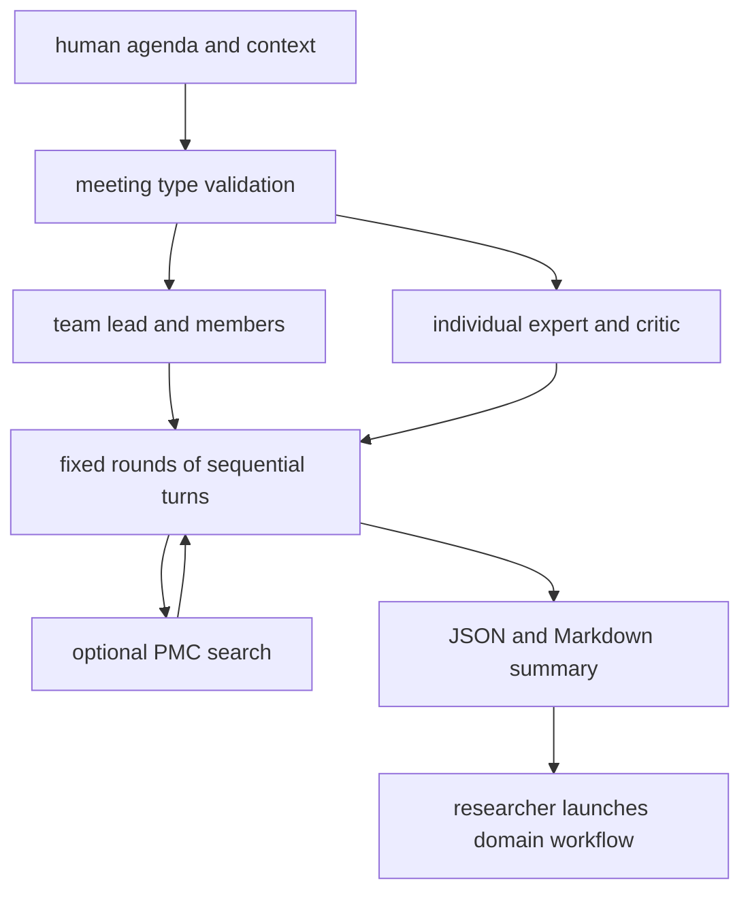

# zou-group/virtual-lab：Virtual Lab——多 Agent 科学协作与纳米抗体设计

| 字段 | 值 |
|---|---|
| GitHub | https://github.com/zou-group/virtual-lab |
| License | MIT |
| Stars | 734（2026-09-17 快照） |
| GitHub 仓库 pushed_at | 2025-12-31（仓库级动态元数据，不等于分析 commit 新增内容） |
| 分析 commit | `8a3a4fd9ccc0cd297bd523751e03bc9527c91832` |
| 产品类型 | **多 Agent 科学协作与纳米抗体设计** |
| 分析证据 | README.md, src/virtual_lab/run_meeting.py, src/virtual_lab/agent.py, src/virtual_lab/utils.py, nanobody_design/README.md, nanobody_design/scripts/models/improved/esm.py |

本文用 📘 标注文档或源码中可直接定位的事实，🔶 标注由控制流推导的边界，💬 标注评价与借鉴建议。仓库动态元数据沿用候选清单，源码判断只绑定页面中的固定提交。

## 1. 它到底是什么

Virtual Lab 把人与多个 LLM 角色的合作组织为会议。研究者设置议题，team meeting 中负责人和专家轮流讨论，individual meeting 中一个专家与 Scientific Critic 对话。纳米抗体设计是仓库给出的具体应用：由讨论提出计算流程，再用 ESM、AlphaFold-Multimer 和 Rosetta 等外部软件执行。它的核心抽象是会议和角色，而不是一个自行决定所有科研阶段的无人值守实验操作系统。

## 2. 运行时堆叠

`Agent` 仅携带 title、expertise、goal、role、model，并由这些字段生成 system message。`run_meeting` 创建 OpenAI 客户端，用同一 messages 历史顺序调用不同角色模型；议题、规则、问题、此前 summaries 和 contexts 都由调用方传入。它保存 JSON/Markdown 讨论并计算 token/cost。通用会议包与 nanobody_design 环境分开，后者要求额外依赖和独立 LocalColabFold 环境；安装通用包不意味着已具备全部蛋白设计计算环境。

## 3. 阶段机或 DAG

`num_rounds + 1` 包含最终回合，最后只由负责人或个人专家作总结。顺序调用和固定轮数不等同于自由协商的自治 agent 网络。

## 4. Tool / Skill / Agent 怎么切

角色层由 Agent 对象和 prompts 定义；编排层由 run_meeting 实现；直接注册到 chat API 的工具是可选 PubMed 搜索。`run_tools` 只分派已知工具名，未知名称抛错。一次模型调用如请求工具，会得到工具结果后再次生成文本；这个后续请求不再次附 tools，不能描述成无限工具调用环。没有独立 Skill 注册表，领域工作流主要由 notebook、议题和单独脚本承载。

## 5. 文献怎么来、是否入库、引用约束

工具名字叫 PubMed，但所读 `run_pubmed_search` 请求的是 E-utilities 的 `db=pmc`，再按 PMCID 通过 BioC JSON 获取标题和段落。正文过滤只保留 abstract/introduction/results/discussion/conclusion/methods，源码明确排除图表和参考文献。返回文本带 PMCID/title，有基本来源定位；它不把论文写进持久 paper pool，也没有主张级引用审核。调用方还可以通过 contexts 直接提供阅读材料。

## 6. 实验 / 代码执行

会议生成文本本身不运行 ESM/Rosetta。`nanobody_design/README.md` 说明相关脚本从讨论内容复制到 scripts，另外由 workflow 命令运行；初始序列 Ty1、H11-D4、Nb21、VHH-72 经多轮突变和评分优化。所读 esm.py 是领域模型计算脚本，说明仓库超出纯讨论演示，但不能把“脚本存在”当作已自动执行全部设计。README 声称 92 个纳米抗体经过实验验证，这是作者对项目应用的陈述，本次没有查验湿实验数据或运行设计管线。

## 7. 写稿怎么做

写作主要表现为会前议题、专家讨论和最终摘要。save_meeting 持久化便于人工重读和下一会议传 summaries；研究者可以将这些作为方法思考记录。没有在会议主循环中看到整篇论文的章节合同、参考文献集合、编译检查或期刊终稿器。生成代码片段也必须经过研究者或外层流程的保存与执行才成为计算产物。

## 8. 图怎么做

README 展示 Virtual Lab 架构图，纳米抗体目录含设计资料；会议引擎本身保存文本，不具备论文图渲染函数。外部蛋白结构模型可产生结构结果，但结构文件不等于完成出版级图版。所读会议路径没有把数值表、结构视图、图注和正文断言绑定为独立审计对象。

## 9. 和 RH 的相似点

与 RH 相似的是研究议题、专家角色、批评反馈和摘要被显式分开；contexts 与 summaries 为跨阶段信息移交提供接口。保存原始讨论使后续能追问建议由谁、在什么材料下提出。Scientific Critic 的角色设计可作为独立质疑环节的形式参照。

## 10. 和 RH 的不同点

RH 的 gate 判断是否拥有足够证据进入下一研究阶段；Virtual Lab 的会议轮数只决定何时总结，并不验证科学任务完成。角色头衔来自 prompt，不能当作多位独立领域专家。模型讨论和领域脚本执行之间还保留人为桥接；这与端到端工作流的 durable artifact 依赖不同。

## 11. 优点 / 缺点

**优点**：实现紧凑，团队/个人模式和参数校验清楚；会议记录可保存；PMC 工具有真实检索接口；应用脚本与通用会议库分层。

**局限**：共享上下文、同类模型和顺序发言可能产生观点相关性；cost 统计对混合模型有源码 TODO，不能当精确账单；会议形成一致结论不等于达到实验质量阈值。外部模型版本、计算依赖和论文湿实验结果均需独立核验。

## 12. RH 可学的 1–3 条

1. 将 agenda、待解问题、约束和背景材料作为独立会议 artifact，而不只塞进临时 prompt。
2. 让批评角色提出可验证的缺口，再由 RH evidence gate 检查，不以讨论轮数代替完成判据。
3. 对会议生成代码保留明确的人审、保存、执行与结果登记步骤。

## 13. 名字速查表

| 名字 | 先决概念 | 含义 |
|---|---|---|
| `Agent` | role prompt | 头衔、专长、目标、角色和模型配置 |
| `run_meeting` | meeting type | 顺序执行团队或个人讨论 |
| `SCIENTIFIC_CRITIC` | independent critique | 个人会议中的批评角色 |
| `contexts` | supplied evidence | 人工提供的背景文本 |
| `summaries` | prior meetings | 前序会议摘要 |
| PMCID | PMC full text | 检索文本的定位标识 |
| `nanobody_design` | domain workflow | 纳米抗体应用脚本和资料 |

---

> 📌事实边界
> 本页只使用上方冻结 commit 的公开 GitHub 文档和源码。未运行模型、检索服务、领域计算或湿实验；README 的效果、规模及论文实验结论仅按作者声明处理。流程图解释源码机制，既不是运行日志，也不是结果验证。所读代码以外的线上平台、权重、数据许可和真实部署状态无法在本次确认。
